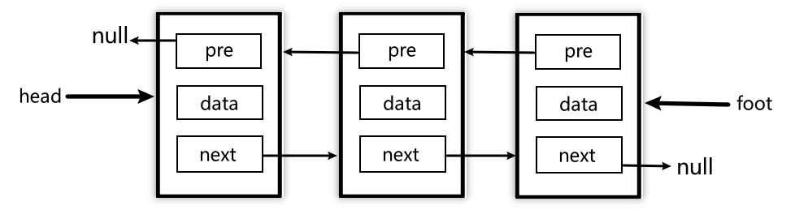

# 认识双向链表

### 单向链表的问题

​	在上一节中，我们不仅对链表有了一定的了解，还手动封装了链表及其常用方法。但之前我们接触到的实际上是`单向链表`，顾名思义：由于每个元素除了包含存储的数据之外，只包含一个指向下一个数据的引用，整个链表是单向的，我们在封装常用方法时就能体会到，涉及到查询某个元素，我们都要从`head`开始查找，很不方便。

​	在实际开发中，我们有很多操作都要获取目标节点的`前一个结点`，如果此时应用的是`单向链表`，我们就需要从头部重新查找，很消耗性能。因此我们可以使用**双向链表**。

### 双项链表结构

1. `head`头部
2. `item`各个元素
   * `pre`指向上一个引用
   * `data`数据部分
   * `next`指向下一个引用
3. `foot`尾部




# 双向链表的封装

### 结构的封装

​	同样地，我们首先要搭建出双向链表的基本结构，根据上文描述的结构，转化为代码如下：

```
//双向链表类
function DoublyLinkedList() {
  this.head = null;
  this.foot = null;
  this.length = 0;
}
//各个节点元素类
function Node(data) {
  this.prev = null;
  this.data = data;
  this.next = null;
}
```

### 常用方法的封装

​	双向链表中的`常见的方法`，在单向链表的基础上新增了四个：

| Name             | description                    |
| ---------------- | ------------------------------ |
| forwardString()  | 返回`正向遍历`节点的字符串形式 |
| backwordString() | 返回`反向遍历`节点的字符串形式 |
| getHead()        | 返回第一个节点                 |
| getFoot()        | 返回末尾节点                   |

其他常见操作与单向链表相同：

1. 增

   | Name                 | description            |
   | -------------------- | ---------------------- |
   | append(ele)          | 在链表尾部追加一个元素 |
   | insert(position,ele) | 在指定位置插入一个元素 |

2. 删

   | Name               | description        |
   | ------------------ | ------------------ |
   | remove(ele)        | 移除某个元素       |
   | removeAt(position) | 移除特定位置的元素 |

3. 改

   | Name                    | description        |
   | ----------------------- | ------------------ |
   | update(position,newEle) | 修改某个位置的元素 |

4. 查

   | Name          | description        |
   | ------------- | ------------------ |
   | get(position) | 移除某个元素       |
   | indexOf(ele)  | 移除特定位置的元素 |

5. 其它

   | Name       | description        |
   | ---------- | ------------------ |
   | size()     | 返回链表的元素个数 |
   | isEmpty()  | 是否为空表         |
   | toString() | 转化成字符串输出   |

#### append

`appent(ele)`实现过程：

* 实例化Node类，创建节点
* 若链表为空，将`head`、`foot`指向该节点
* 否则，衔接到`foot`后面

```
DoublyLinkedList.prototype.append = function (ele) {
  let newNode = new Node(ele);
  if (this.length === 0) {
    this.head = this.foot = newNode;
  } else {
    this.foot.next = newNode;
    newNode.prev = this.foot;
    this.foot = newNode;
  }
  return ++this.length;
};
```

#### insert

`insert(position,ele)`实现过程：

* 边界处理

* 实例化Node类，创建节点
* 若链表为空，或在末尾新增，直接复用append相同逻辑
* 链表不为空
  * 在开头插入
  * 在之后插入

```
DoublyLinkedList.prototype.insert = function (position, ele) {
	//边界处理
  if (position < 0 || position > this.length) {
    return false;
  }
	//实例化Node类，创建节点
  let newNode = new Node(ele);
  //若链表为空，或在末尾新增，直接复用append相同逻辑
  if (this.length === 0 || position == this.length) {
    return this.append(ele);
  } else {
  	//链表不为空
    let current = this.head;
    let index = 0;
		//在开头插入
    if (position === 0) {
      this.head.prev = newNode;
      newNode.next = this.head;
      this.head = newNode;
    } else {
    	//在之后插入
      while (index++ < position) {
        current = current.next;
      }
      let prevNode = current.prev;
      prevNode.next = newNode;
      newNode.prev = prevNode;
      current.prev = newNode;
      newNode.next = current;
    }
  }
  return ++this.length;
};
```

#### removeAt

`removeAt(position)`实现过程：

* 边界处理
* 根据位置，查找对应的`prevNode`、`current`、`nextNode`信息
* 删除操作
  * 删除开头
    * 链长是否为1
  * 删除结尾
  * 删除中间位置数据

>​	这里为了能够展示核心思想代码，并没有为性能考虑，我们可以判断`position > this.length / 2`来决定遍历的方向。
>
>​	下例代码只是自前向后查找。

```
DoublyLinkedList.prototype.removeAt = function (position) {
  //边界处理
  if (position < 0 || position >= this.length) {
    return false;
  }
  //根据位置，查找对应的 prevNode、current、nextNode 信息
  let current = this.head;
  let index = 0;
  while (index < position) {
    current = current.next;
    index++;
  }
  let prevNode = current.prev;
  let nextNode = current.next;
  //删除开头
  if (index === 0) {
    //链长是否为1
    if (this.length === 1) {
      this.head = this.foot = null;
    } else {
      nextNode.prev = null;
      current.next = null;
      this.head = nextNode;
    }
    //删除结尾
  } else if (index === this.length - 1) {
    prevNode.next = null;
    current.prev = null;
    this.foot = prevNode;
  } else {
    //删除中间位置数据
    prevNode.next = nextNode;
    nextNode.prev = prevNode;
    current.prev = current.next = null;
  }
  this.length--;
  return current.data;
};
```

#### remove

`remove(ele)` 与 `removeAt(position)` 的实现过程非常类似，只不过现在需要根据ele寻找对应位置的元素。

独立实现：

```
DoublyLinkedList.prototype.remove = function (ele) {
  let current = this.head;
  let index = 0;
  while (current && current.data !== ele) {
    current = current.next;
    index++;
  }
  /*
    !current 有两种含义：
    1. 链表为空，压根没走while
    2. 走完了while，直到最后还是没找到对应的节点
  */
  if (!current) {
    return false;
  } else {
    let prevNode = current.prev;
    let nextNode = current.next;
    //删除开头
    if (index === 0) {
      //链长是否为1
      if (this.length === 1) {
        this.head = this.foot = null;
      } else {
        nextNode.prev = null;
        current.next = null;
        this.head = nextNode;
      }
    } else if (index === this.length - 1) {
      //删除结尾
      prevNode.next = null;
      current.prev = null;
      this.foot = prevNode;
    } else {
      //删除中间数据
      prevNode.next = nextNode;
      nextNode.prev = prevNode;
      current.prev = current.next = null;
    }
    this.length--;
    return current.data;
  }
};
```

后期根据其他方法进行实现：

* `indexOf`查找对应元素的索引
* `removeAt`根据索引进行删除

```
DoublyLinkedList.prototype.remove = function (ele) {
  let index = this.indexOf(ele);
  return index === -1 ? false : this.removeAt(index);
};
```

#### update

`update(position,newEle)`实现过程：

* 边界处理
* 根据`position`查找目标元素
  * 性能考虑，判断查找的方向
* 将`newEle`赋予给目标元素的数据部分

```
DoublyLinkedList.prototype.update = function (position, newEle) {
  if (position < 0 || position >= this.length) {
    return false;
  }
  let isGreater = position > this.length / 2;
  //自后向前找
  if (isGreater) {
    let current = this.foot;
    let index = this.length - 1;
    while (index-- < position) {
      current = current.prev;
    }
    current.data = newEle;
  } else {
    //自前向后找
    let current = this.head;
    let index = 0;
    while (index++ < position) {
      current = current.next;
    }
    current.data = newEle;
  }
  return true;
};
```

#### get

`get(position)`实现过程与`update`几乎一样，最后一步只需将对应数据返回即可

细节：

* 这里的边界处理返回`null`，代表此时获取不到。
* `update`边界处理、整个函数返回为`boolean`，代表是否更新成功

```
DoublyLinkedList.prototype.get = function (position) {
  if (position < 0 || position >= this.length) {
    return null;
  }
  let isGreater = position > this.length / 2;
  //自后向前找
  if (isGreater) {
    let current = this.foot;
    let index = this.length - 1;
    while (index-- < position) {
      current = current.prev;
    }
    return current.data;
  } else {
    //自前向后找
    let current = this.head;
    let index = 0;
    while (index++ < position) {
      current = current.next;
    }
    return current.data;
  }
};
```

#### indexOf

`indexOf(ele)`实现过程：

* 根据`ele`查找对应的元素，并用`index`记录当前的索引

```
DoublyLinkedList.prototype.indexOf = function (ele) {
  let current = this.head;
  let index = 0;
  while (current && current.data !== ele) {
    current = current.next;
    index++;
  }
  /*
    !current 有两种含义：
    1. 链表为空，压根没走while
    2. 走完了while，直到最后还是没找到对应的节点
  */
  if (!current) {
    return -1;
  } else {
    return index;
  }
};
```

#### getHead

```
DoublyLinkedList.prototype.getHead = function () {
  return this.head.data;
};
```

#### getFoot

```
DoublyLinkedList.prototype.getFoot = function () {
  return this.foot.data;
};
```

#### size

```
DoublyLinkedList.prototype.size = function () {
  return this.length;
};
```

#### isEmpty

```
DoublyLinkedList.prototype.isEmpty = function () {
  return this.length === 0;
};
```

#### toString

```
DoublyLinkedList.prototype.toString = function () {
  return this.forwardString();
};
```

#### forwardString

```
DoublyLinkedList.prototype.forwardString = function () {
  let result = "";
  let current = this.head;
  while (current) {
    let next = current.next;
    result += next ? `${current.data} ` : `${current.data}`;
    current = next;
  }
  return result;
};
```

#### backwordString

```
DoublyLinkedList.prototype.backwordString = function () {
  let result = "";
  let current = this.foot;
  while (current) {
    let prev = current.prev;
    result += prev ? `${current.data} ` : `${current.data}`;
    current = prev;
  }
  return result;
};
```

