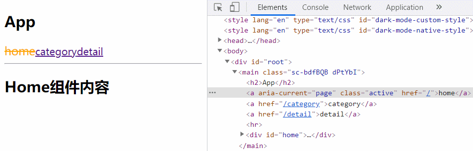
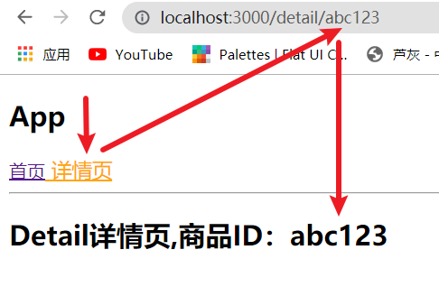
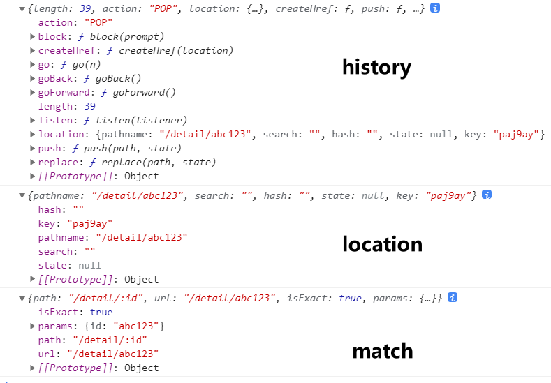
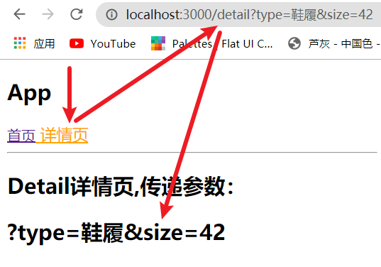
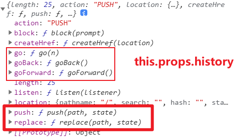

# 前言了解

前端流行的三大框架, 都有自己的路由实现:

- Angular的ngRouter
- React的ReactRouter
- Vue的vue-router

React Router的版本4开始，路由不再集中在一个包中进行管理了：

- react-router是router的核心部分代码；
- react-router-dom是用于浏览器的；
- react-router-native是用于原生应用的；

目前我们使用最新的React Router v5 版本：

安装react-router：

- 由于我们不涉及原生应用的开发，所以这里安装用于浏览器的react-router-dom
- 只安装react-router-dom即可：因为react-router-dom自身就依赖于react-router

```yarn
yarn add react-router-dom
```

# 基本使用

## 了解API

react-router最主要的API是提供的一些**组件**：

- BrowserRouter 和 HashRouter
  - 用于设置路由模式
  - BrowserRouter使用history模式；
  - HashRouter使用location.hash模式；
- Link 和 NavLink：
  - 用于完成路由跳转
  - 通常路径的跳转是使用Link组件，最终会被渲染成`a`元素
  - to 属性：Link 和 NavLink中最重要的属性，用于设置跳转的目标路径
  - NavLink可以自定义一些样式
- Route：
  - 用于匹配活跃路由，并展示映射的组件；
  - path属性：用于设置匹配到的路径；
  - component属性：设置匹配路径所映射的目标组件；
  - exact：准确的匹配，只有精准匹配到完全一致的路径，才会渲染对应的组件；
- Switch：
  - 用于排除其他匹配到的组件
  - Switch将各个Route组件包裹，只要匹配到了第一个path对应的Route，后面将不再匹配。
- Redirect
  - 用于路由重定向，当这个组件出现时，就会立刻跳转到配置的to属性path中。

## 初步体验

在App中进行如下演练：

* `BrowserRouter`/`HashRouter`在最外层，内部包裹`Link`/`NavLink`、`Route`
* 一个Route组件，只能设置一对儿：路径与组件的映射关系
* Route组件默认情况下是**模糊匹配路径**，只要浏览器当前的URL包含设置的path，就会展示对应的组件。
  * 因为所有的路径都包含 root path（`"/"`） ，为了不让根路径映射的组件一直展示，可以设置exact属性准确的匹配。

```
import { PureComponent } from "react";
import { BrowserRouter, Link, Route } from "react-router-dom";
import Home from "./pages/Home.js";
import Category from "./pages/Category.js";
import Detail from "./pages/Detail.js";

export default class App extends PureComponent {
  render() {
    return (
      <main>
        <h2>App</h2>
        <BrowserRouter>
          <Link to="/">home </Link>
          <Link to="/category">category </Link>
          <Link to="/detail">detail</Link>
          {/* 根路径,exact准确匹配 */}
          <Route exact path="/" component={Home} />
          <Route path="/category" component={Category} />
          <Route path="/detail" component={Detail} />
        </BrowserRouter>
      </main>
    );
  }
}
```


## NavLink

现在我们对上文案例提一个需求：为当前活跃路由所对应的链接(`a`元素)添加样式。

### 原生实现

* 将跳转的path和链接内容，抽离到组件的constructor中，然后循环遍历展示。
  * 判断组件state中的`currenIndex`，是否等于index，决定是否添加样式类名。
* 侦听click事件，改变`currenIndex`，从而实现活跃样式。

```
import { PureComponent } from "react";
import { BrowserRouter, Link, Route } from "react-router-dom";
import Home from "./pages/Home.js";
import Category from "./pages/Category.js";
import Detail from "./pages/Detail.js";
import styled from "styled-components";

const StyledWrapper = styled.main`
  .link-active {
    & a {
      color: red;
      font-size: 18px;
    }
  }
`;
export default class App extends PureComponent {
  constructor() {
    super();
    this.links = [
      {
        path: "/",
        title: "home",
      },
      {
        path: "/category",
        title: "category",
      },
      {
        path: "/detail",
        title: "detail",
      },
    ];
    this.state = {
      currenIndex: 0,
    };
  }
  render() {
    const { currenIndex } = this.state;
    return (
      <StyledWrapper>
        <h2>App</h2>
        <BrowserRouter>
          {this.links.map((item, index) => (
            <div
              key={item.path}
              onClick={() => this.changeCurrenIndex(index)}
              className={currenIndex === index ? "link-active" : ""}
            >
              <Link to={item.path}>{item.title}</Link>
            </div>
          ))}
          <hr />
          <Route exact path="/" component={Home} />
          <Route path="/category" component={Category} />
          <Route path="/detail" component={Detail} />
        </BrowserRouter>
      </StyledWrapper>
    );
  }
  changeCurrenIndex(index) {
    this.setState({
      currenIndex: index,
    });
  }
}
```


### 使用NavLink

NavLink 相当于 Link 的增强版，可以通过一些属性，配置活跃状态下链接的样式：

- activeStyle：活跃时（匹配时）的样式；
- activeClassName：活跃时添加的class名，默认值为`active`；
- exact：是否精准匹配

#### activeStyle

* 通过`activeStyle`属性，设置活跃时的样式
* 但实际开发时，大多会使用`activeClassName`，因为如果活跃样式比较复杂，依然使用`activeStyle`，会让JSX代码非常臃肿

```
import { PureComponent } from "react";
import { BrowserRouter, NavLink, Route } from "react-router-dom";
import Home from "./pages/Home.js";
import Category from "./pages/Category.js";
import Detail from "./pages/Detail.js";

export default class App extends PureComponent {
  render() {
    return (
      <StyledWrapper>
        <h2>App</h2>
        <BrowserRouter>
          <NavLink to="/" activeStyle={{ color: "red" }}>
            home
          </NavLink>
          <NavLink to="/category" activeStyle={{ color: "red" }}>
            category
          </NavLink>
          <NavLink to="/detail" activeStyle={{ color: "red" }}>
            detail
          </NavLink>
          <hr />
          <Route exact path="/" component={Home} />
          <Route path="/category" component={Category} />
          <Route path="/detail" component={Detail} />
        </BrowserRouter>
      </StyledWrapper>
    );
  }
}
```

小问题：


​	可以发现，home链接的样式一直处于活跃状态，原因很简单：NavLink 默认也是**模糊匹配路径**，由于home链接绑定根路径`"/"`,因此才会一直具有活跃样式。

解决这个问题也很简单，绑定`exact`属性，精准匹配👇

#### exact

为根路径链接绑定exact，即可解决问题。


```
<NavLink to="/" exact activeStyle={{ color: "red" }}>home</NavLink>
```

#### activeClassName

实际开发时，我们通常会使用`activeClassName`，当path对应的路由活跃时，会自动添加配置的class名，在css中自定义样式即可。

**默认值 active**

值得注意的是：activeClassName 的默认值为`active`，也就是说：当path对应的路由活跃时，默认会自动添加`active`类名：

```
const StyledWrapper = styled.main`
  .active {
    color: orange;
    font-size: 18px;
    text-decoration: line-through;
  }
`;
```

```
<NavLink to="/" exact>home</NavLink>
<NavLink to="/category">category</NavLink>
<NavLink to="/detail">detail</NavLink>
```



当然了，`active`这个class名称，很容易被我们占用，因此我们可以自定义`activeClassName`

```
<NavLink to="/" exact activeClassName="link_active" >home</NavLink>
<NavLink to="/category" activeClassName="link_active">category</NavLink>
<NavLink to="/detail" activeClassName="link_active">detail</NavLink>
```


## Switch

- 用于排除其他匹配到的组件
- Switch将各个Route组件包裹，只要匹配到了第一个path对应的Route，后面将不再匹配。

### 注意事项

* 虽然使用 Switch 组件能够让路由匹配具有 **排他性**，但其对 path 的默认匹配规则，依然是 **模糊匹配** 模式。

* 因此，对于父级路由来说，依然要手动配置 exact 实现严格匹配

* 否则按照 Switch 的排他性，将只展示父级路由组件

  因为子路由 path 包含了父级 path，若使用 Switch ，则优先匹配到父级路由 path 后，将不再继续向后匹配。造成只展示父级路由组件的状况。

### 实现noMatch路由

在实际开发中我们会配置**动态路由**，并且还会配置一个**noMatch**页面专门处理URL匹配不到的情况。

但这两种状况，在实现时会有一些问题出现：**重复匹配到多个路由**

案例代码：

* 不为Route绑定path属性，意为任何path都匹配，因此默认情况下`noMatch`组件一直都会展示。
* 由于`/category`、`/Ashun`，都能够与动态路由`/:id`匹配，因此点击对应链接，Profile组件都会展示。

```
<BrowserRouter>
  <NavLink to="/" exact>首页</NavLink>
  <NavLink to="/category"> 分类</NavLink>
  <NavLink to="/Ashun"> 我的</NavLink>
  <hr />
  <Route exact path="/" component={Home} />
  <Route path="/category" component={Category} />
  <Route path="/:id" component={Profile} />
  <Route component={NoMatch} />
</BrowserRouter>
```


* 但我们希望，这些组件是**排他性**的，当匹配到一个Route时，后续的Route将不再被匹配。
* 因此我们可以使用`Switch`组件。

```
 <Switch>
  <Route exact path="/" component={Home} />
  <Route path="/category" component={Category} />
  <Route path="/:id" component={Profile} />
  <Route component={NoMatch} />
</Switch>
```

效果：实现了排他性


## Redirect

Redirect用于路由的重定向，**当这个组件出现时，就会立刻跳转到配置的to属性path中**。

案例体验：

- 用户跳转到Profile界面；
- 但是在Profile界面有一个isLogin用于记录用户是否登录：
  - true：那么显示用户的名称；
  - false：直接重定向到登录界面；

编写Login组件

```
import { PureComponent } from "react";

export default class Login extends PureComponent {
  render() {
    return (
      <div id="login">
        <h2>LOGIN-请登录</h2>
      </div>
    );
  }
}
```

App.js中提前定义好Login页面对应的Route：

```
<Switch>
  ...其他Route
  <Route path="/login" component={Login} />
  <Route path="/:id" component={Profile} />
  <Route component={NoMatch} />
</Switch>
```

在Profile.js中写上对应的逻辑代码：

```
import { PureComponent } from "react";
import { Redirect } from "react-router";

export default class Profile extends PureComponent {
  constructor() {
    super();
    this.state = {
      isLogin: false,
    };
  }
  render() {
    return (
      <div id="profile">
        {this.state.isLogin ? (
          <h2>user信息: Ashun</h2>
        ) : (
          <Redirect to="/login" />
        )}
      </div>
    );
  }
}
```

# 高级使用

## 路由嵌套

在实际开发中，路由之间的嵌套关系是很常见的，这里我们依旧通过实际案例进行体验。

* category页面中有两个子页面：商品列表和消息列表

- 进入category页面后，点击不同的链接可以再次完成嵌套路由的跳转，显示对应的内容；

**App.js**

注意：要对父级路由绑定 exact 进行严格匹配

* 因为父子路由 path 具有公共部分，此时再结合 `Switch` 的排他性，将会一直展示父级路由组件（详见[Switch](##Switch)）

```
import { PureComponent } from "react";
import { BrowserRouter, NavLink, Route, Switch } from "react-router-dom";
import Home from "./pages/Home.js";
import Category from "./pages/Category.js";
import styled from "styled-components";

const StyledWrapper = styled.main`
  .active {
    color: orange;
    font-size: 18px;
  }
`;
export default class App extends PureComponent {
  render() {
    return (
      <StyledWrapper>
        <h2>App</h2>
        <BrowserRouter>
          <NavLink to="/" exact> 首页</NavLink>
          <NavLink to="/category"> 分类</NavLink>
          <hr />
          <Switch>
            <Route exact path="/" component={Home} />
            <Route path="/category" component={Category} />
          </Switch>
        </BrowserRouter>
      </StyledWrapper>
    );
  }
}
```

**Category.js**

* 若希望默认展示某个子路由组件，则该子路由的 path 需要和父级路由保持一致。
* 这样跳转到父级路由后，才能默认展示对应的子路由组件。

```
import { PureComponent } from "react";
import { BrowserRouter, NavLink, Route, Switch } from "react-router-dom";

function CategoryProduct(props) {
  return (
    <ul>
      <li>商品列表1</li>
      <li>商品列表2</li>
      <li>商品列表3</li>
    </ul>
  );
}
function CategoryMessage(props) {
  return (
    <ul>
      <li>消息列表1</li>
      <li>消息列表2</li>
      <li>消息列表3</li>
    </ul>
  );
}

export default class Category extends PureComponent {
  render() {
    return (
      <div id="csategory">
        <h2>Category组件</h2>
        <BrowserRouter>
          <NavLink exact to="/category">商品列表</NavLink>
          <NavLink to="/category/message">消息列表</NavLink>
          <Switch>
            <Route exact path="/category" component={CategoryProduct} />
            <Route path="/category/message" component={CategoryMessage} />
          </Switch>
        </BrowserRouter>
      </div>
    );
  }
}
```

**最终效果**：


## 手动跳转

目前我们实现的跳转主要是通过Link或者NavLink进行跳转的，实际上我们也可以通过`JavaScript代码`进行手动跳转。

但是通过`JavaScript代码`进行跳转有一个前提：**必须获取到history对象**。

* 这里说的`history`对象，**不是**浏览器默认的`window.history`，而是react-router内部创建的history对象。

因此，默认情况下：

* 若某组件是通过react-router跳转所展示的，才能够通过`props`访问 **history** 对象。
  * 此外还能够通过`props`访问react-router传入的 **location**、**match** 对象。
* 若只是一个普通的组件，则不能通过props访问history，因为props是需要通过外部传入的，实际上react-router就是对Route组件中的path所映射的component进行了拦截，扩充了props。

下文我们就来详细介绍，上面两种情景下的手动跳转如何实现。

### 路由组件

**若是路由中映射的组件**，手动跳转很简单，只需通过`props`访问router内部的history对象，调用方法跳转即可。

* 给button绑定click事件，通过`history.push()`手动跳转

**App.js**

```
export default class App extends PureComponent {
  render() {
    return (
      <StyledWrapper>
        <h2>App</h2>
        <BrowserRouter>
          <NavLink to="/" exact>
            首页
          </NavLink>
          <NavLink to="/category"> 分类</NavLink>
          <hr />
          <Switch>
            <Route exact path="/" component={Home} />
            <Route path="/category" component={Category} />
          </Switch>
        </BrowserRouter>
      </StyledWrapper>
    );
  }
}
```

**Category.js**

```
import { PureComponent } from "react";

export default class Category extends PureComponent {
  render() {
    return (
      <div id="csategory">
        <h2>Category组件</h2>
        <button onClick={this.jumpRouter.bind(this)}>
          点我跳转首页
        </button>
      </div>
    );
  }
  jumpRouter() {
    this.props.history.push("/");
  }
}
```

效果展示：


### 普通组件

上文已经说明了：默认情况下，若是普通组件，则不能通过props访问react-router内部的history对象。

如果我们希望在普通组件中，获取到react-router内部的history对象，该如何实现？

必须满足以下两个条件：

* `普通组件`需要通过react-router提供的`withRouter`高阶组件处理。
* 且外部使用该`普通组件`标签时，需要被`BrowserRouter/HashRouter`包裹
  * 若该`普通组件`内部，原来已经使用了`BrowserRouter/HashRouter`，则直接删掉即可，因为外部使用该组件时，已在最外层包裹了。

**案例体验**

这里以App组件为例：

* 通过自定义按钮与JS事件，完成手动跳转，最主要的是如何通过prpos访问react-router内部的history👆

**index.js**

* 外部使用`BrowserRouter`包裹

```
import App from "./App.js";
import { BrowserRouter } from "react-router-dom";

ReactDOM.render(
  <BrowserRouter>
    <App />
  </BrowserRouter>,
  document.getElementById("root")
);
```

**App.js**

* 需删除内部的`BrowserRouter`
* 需经过`withRouter`高阶函数的处理

即可通过`this.props.history`访问react-router内部的history对象。

```
……省略其他import
import { NavLink, Route, Switch, withRouter } from "react-router-dom";

class App extends PureComponent {
  render() {
    return (
      <StyledWrapper>
        <h2>App</h2>
        
        <button onClick={this.jumpCtegory.bind(this)}>jumpRouter</button>
        
        <NavLink to="/" exact>首页</NavLink>
        <NavLink to="/category"> 分类</NavLink>
        <hr />
        <Switch>
          <Route exact path="/" component={Home} />
          <Route path="/category" component={Category} />
        </Switch>
      </StyledWrapper>
    );
  }
  jumpCtegory() {
    this.props.history.push("/category");
  }
}
//通过withRouter高阶函数处理
export default withRouter(App);
```

效果展示：


## 路由传参

在路由跳转的过程中传递参数，主要有两类情况：

1. 获取动态路由
2. 手动传递其它参数
   * url 形式传参
   * to 属性传参

### 动态路由传参

​	获取动态路由参数很简单，上文实现[手动跳转](##手动跳转)路由时，我们说过：若某组件是通过react-router跳转所展示的，才能够通过`props`访问： **history**、 **location**、**match** 对象。

**而**`match`**对象中，保留了动态路由参数。**

- 比如`/detail`的path对应一个组件Detail；
- 如果我们将Route匹配的path属性设为`/detail/:id`，那么 `/detail/abc`、`/detail/123`都可以匹配到该Route，并且进行显示；
- 这个匹配规则，我们就称之为动态路由；

**App.js**

```
<div>
	<h2>App</h2>
  <NavLink to="/" exact>首页</NavLink>
  <NavLink to="/detail/abc123"> 详情页</NavLink>
  <hr />
  <Switch>
    <Route exact path="/" component={Home} />
    <Route path="/detail/:id" component={Detail} />	{/* 匹配动态路由 */}
  </Switch>
</div>
```

**Detail.js**

```
import { PureComponent } from "react";

export default class Detail extends PureComponent {
  render() {
    return (
      <div id="detail">
        <h2>Detail详情页,商品ID：{this.props.match.params["id"]}</h2>
      </div>
    );
  }
}
```

**效果展示**：



我们还可以在Detail组件中打印一下react-router中的`history`、`location`、`match`对象，进行观察：



* history为我们提供了很多API操作路由
* location可以获取当前的路径，手动传递的参数信息（下文讲解）
* match主要包含当前路由的一些匹配信息

```
export default class Detail extends PureComponent {
  render() {
  	console.log(this.props.history);
  	console.log(this.props.location);
  	console.log(this.props.match);
    return (……);
  }
}
```

### 手动传参

在react-router中，手动传参的方式有两种：

1. 通过 url 传参
2. ⭐为`Link/NavLink`配置 to 属性为 Object 进行传参

#### url传参

通过 url 传参，我们已经非常熟悉了，也就是url的query部分：

* `?`开头，`key=value`，多个键值对之间使用`&`隔开：`?key1=value1&key2=value2…`

通过**location.search**获取url的query部分参数。

**App.js**

```
<div>
	……
  <NavLink to="/detail?type=鞋履&size=42"> 详情页</NavLink>
  <hr />
  <Switch>
    ……
    <Route path="/detail" component={Detail} />
  </Switch>
</div>
```

**Detail.js**

```
import { PureComponent } from "react";

export default class Detail extends PureComponent {
  render() {
    return (
      <div id="detail">
        <h2>Detail详情页,传递参数：{this.props.location.search}</h2>
      </div>
    );
  }
}
```

效果展示：



* 但通常情况下我们不会使用该形式传参，因为我们还要手动解析为Object
* 我们可以为`Link/NavLink`配置 to 属性为Object进行传参👇

#### to属性传参

在上文中，我们已经观察过react-router内部**location**对象的结构：

* key：由react-router自动生成，保证唯一性
* pathname：跳转的路径
* search：记录URL的query部分
* state：用于保存手动传递的参数

之前我们在配置to属性时，都是直接传入一个String来指明跳转的path，其实我们还可以将to属性配置为Object，其中的各个option与location结构相对应。

* key属性不用设置，由react-router自动生成
* 通过配置search、state，我们既可以通过url的query部分传递参数，也可以手动传入其他参数。

**App.js**

```
<div>
	……
  <NavLink
    to={{
      pathname: "/detail",
      search: "?name=Ashun",
      state: {
        type: "鞋履",
        size: 42,
      },
    }}
  >
    详情页
  </NavLink>
  <hr />
  <Switch>
    ……
    <Route path="/detail" component={Detail} />
  </Switch>
</div>
```

**Detail.js**

```
import { PureComponent } from "react";

export default class Detail extends PureComponent {
  render() {
    const { search, state } = this.props.location;
    console.log(this.props.location);
    return (
      <div id="detail">
        <h2>Detail详情页</h2>
        <p> query：{search}</p>
        <p> state:</p>
        <ul>
          {Object.entries(state).map(([key, val]) => (
            <li key={key}>
              {key}:{val}
            </li>
          ))}
        </ul>
      </div>
    );
  }
}
```

效果展示：


#### 手动跳转传参

前面我们还讲解了如何[手动跳转](##手动跳转)，分为两种情况：

1. 通过react-router跳转的组件
2. 普通组件

但无论是哪种组件，最终都是通过`this.props.history`提供的API操作路由。



* 通过打印结果可以发现，能够实现路由跳转的`push`、`replace`方法，都可接收第二个参数，就是跳转过程中传递的数据。

* 在跳转后的目标组件中，就可以通过`this.props.location.state`获取传递的数据。

## 小总结

其实不难发现，react-router的高级使用就是围绕其内部提供的三个对象展开的：

1. history：操作路由（手动路由跳转）
2. location：保留当前路由的一些状态信息（手动传参获取）
3. match：保留当前路由的一些匹配信息（动态路由参数等）
