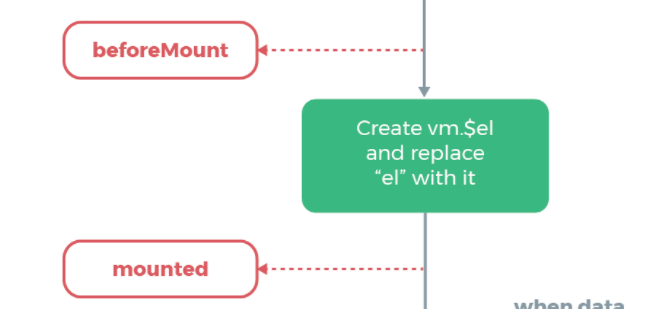

# Vue生命周期的四阶段

---

## 基础知识

### 什么是生命周期：

从Vue实例 创建到销毁 期间，总是伴随着各种各样的事件，这些事件，统称为生命周期！

**生命周期钩子：**就是生命周期事件的别名而已；

生命周期钩子 = 生命周期函数 = 生命周期事件

**意义:**

给了用户在不同阶段添加自己的代码的机会。

**初始化 (create)--- 组件挂载(mount)-----组件更新 (update)--- 销毁(destroy)**

 

| **生命周期**  | **发生了什么**                                               |
| :-----------: | ------------------------------------------------------------ |
| beforeCreate  | vue实例还未被创建: 在当前阶段data、methods、computed以及watch上的数据和方法都不能被访问，此阶段常用于初始化 `非响应式` 变量。 |
|    created    | vue实例创建后 : 在实例创建完成后发生，当前阶段已经完成了数据观测，也就是可以使用数据，更改数据，在这里更改数据不会触发updated函数,也就是不会更新视图。 |
|  beforeMount  | 挂载前 ：完成模板编译，VirtualDom已经创建完成，即将开始渲染。在此时可以访问数据，也可访问`$el`，但不能通过`$refs`访问vue实例($el)的子节点，更改数据时不会触发updated。 |
|    mounted    | 挂载完成 ： 将编译好的模板(虚拟DOM)挂载到页面 ，可以使用`$refs`访问vue实例($el)的子节点，此时更改数据，会触发update。 |
| beforeUpdate  | 更新数据前 ： 组件数据更新之前调用，在此处改变数据，会重新触发update。 |
|    updated    | 组件更新后 ： render重新渲染 , 此时数据和界面都是新的 ,要注意的是避免在此期间更改数据，因为这可能会导致无限循环的更新 |
| beforeDestroy | 组件卸载前 : 实例销毁之前，在当前阶段实例完全可以被使用，我们可以在这时进行善后收尾工作，比如清除计时器 |
|   destroyed   | 组件卸载后（切换页面，路由跳转时触发） ： 组件已被拆解，数据绑定被卸除，监听被移出，子实例也统统被销毁。 |
|   activited   | （切换页面，路由跳转时触发）keep-alive 专属 , 组件被激活时调用 |
|  deactivated  | （切换页面，路由跳转时触发）keep-alive 专属 , 组件失活时调用 |


 

 

### 初次渲染就会触发的生命周期

- beforeCreate() , created()
- beforeMount() , mounted()


### 代码测试


```
<!DOCTYPE html>
<html lang="en">
  <head>
    <meta charset="UTF-8" />
    <meta name="viewport" content="width=device-width, initial-scale=1.0" />
    <meta http-equiv="X-UA-Compatible" content="ie=edge" />
    <title>vue生命周期</title>
    <script src="https://cdn.bootcss.com/vue/2.4.2/vue.js"></script>
  </head>
  <body>
    <div id="app">
      <h1>{{message}}</h1>
      <button ref="button" type="button" @click="changeData">changeData</button>
    </div>
  </body>
  <script>
    function topTag(msg) {
      console.log(`——————${msg}——————`);
    }
    function endTag(msg, end) {
      console.log(`——————${msg}End—————${end ? end : ""}\n\n`);
    }
    let vm = new Vue({
      el: "#app",
      data: {
        message: "Vue.data数据",
      },
      methods: {
        method() {
          return "Vue.methods中方法";
        },
        changeData() {
          this.message = "changed message";
        },
      },
      computed: {
        calc() {
          return "Vue.computed中方法";
        },
      },
      beforeCreate() {
        topTag("beforeCreate");

        console.log(" 访问$el:", this.$el);
        console.log(" 访问$data:", this.$data);

        endTag("beforeCreate");
      },
      created() {
        topTag("created");

        console.log(" 访问$el:", this.$el);
        console.log(" 访问data:", Object.keys(this.$data));
        console.log(" 访问data中数据:", this.$data.message);
        console.log(" 访问methods:", this.method());
        console.log(" 访问computed:", this.calc);

        endTag("created");
      },
      beforeMount() {
        topTag("beforeMount");
        //挂载前改变数据，不会触发uptate
        console.log("访问$el:", this.$el);
        console.log("访问$refs:", this.$refs["button"]);
        console.log(" 访问data:", Object.keys(this.$data));

        endTag("beforeMount");
      },
      mounted() {
        //由于virtualDom已经挂载到页面，在此改变数据，会触发update
        topTag("mounted");

        console.log("访问$el:", this.$el);
        console.log("访问$refs:", this.$refs["button"]);
        console.log(" 访问data:", Object.keys(this.$data));

        endTag("mounted");
      },
      beforeUpdate() {
        topTag("beforeUpdate");

        //在此改变数据，会再次触发update钩子
        // let message = "beforeUpdate 改变了 this.message";
        // this.message = "beforeUpdate 改变了 this.message";
        // console.log(message);

        endTag("beforeUpdate");
      },
      updated() {
        topTag("updated");
        endTag("updated");
      },
      beforeDestroy() {
        topTag("beforeDestroy");
        endTag("beforeDestroy");
      },
      destroyed() {
        topTag("destroyed");
        endTag("destroyed");
      },
    });
  </script>
</html>
```


## 深层探究

[详解vue生命周期 - SegmentFault 思否](https://segmentfault.com/a/1190000011381906)


#### created=>beforeMount

如官方文档图片所示，在created=>beforeMount的过程中，对vue挂载dom的形式进行了判断。

* 先判断是否存在`el`选项
* 若不存在，则不会执行后续的钩子函数，直到使用`$mount`手动挂载后，后续hook才会执行
* 若存在，则判断是否有`template`选项
  * 若有`template`选项，会将其作为模板，进行编译，将编译结果传入render函数并执行，最后vm挂载的就是`template`中的rootDom
  * 如果没有`template`选项，则将外部已经存在的HTML（`el`选项对应的dom）作为模板编译。

由以上过程可以看到，template中的模板优先级要高于el的优先级。


**代码测试**

没有`el`选项时，create之后的hookMethod不会执行。则vm没有挂载到实际dom上，所以也不会将数据绑定到dom上，只是在vm内部完成了数据的初始化


```
  <body>
    <div id="app">
      <h1>{{message}}</h1>
      <button ref="button" type="button" @click="changeData">changeData</button>
    </div>
  </body>
  <script src="https://cdn.bootcss.com/vue/2.4.2/vue.js"></script>
  <script>
    function topTag(msg) {
      console.log(`——————${msg}——————`);
    }
    function endTag(msg, end) {
      console.log(`——————${msg}End—————${end ? end : ""}\n\n`);
    }
    let vm = new Vue({
      //el: "#app",
      data: {
        message: "Vue.data数据",
      },
      methods: {
        method() {
          return "Vue.methods中方法";
        },
        changeData() {
          this.message = "changed message";
        },
      },
      computed: {
        calc() {
          return "Vue.computed中方法";
        },
      },
      beforeCreate() {
        topTag("beforeCreate");

        console.log(" 访问$el:", this.$el);
        console.log(" 访问$data:", this.$data);

        endTag("beforeCreate");
      },
      created() {
        topTag("created");

        console.log(" 访问$el:", this.$el);
        console.log(" 访问data:", Object.keys(this.$data));
        console.log(" 访问data中数据:", this.$data.message);
        console.log(" 访问methods:", this.method());
        console.log(" 访问computed:", this.calc);
        
        endTag("created");
      },
      beforeMount() {
        topTag("beforeMount");
        endTag("beforeMount");
      },
      mounted() {
        topTag("mounted");

        console.log("访问$el:", this.$el);
        console.log("访问$refs:", this.$refs["button"]);
        console.log(" 访问data:", Object.keys(this.$data));

        endTag("mounted");
      },
      beforeUpdate() {
        topTag("beforeUpdate");
        endTag("beforeUpdate");
      },
      updated() {
        topTag("updated");
        endTag("updated");
      },
      beforeDestroy() {
        topTag("beforeDestroy");
        endTag("beforeDestroy");
      },
      destroyed() {
        topTag("destroyed");
        endTag("destroyed");
      },
    });
  </script>
```

直到手动挂载`vm.$mount(elem)`,后续的hookMethod才会执行，且由于已经将vm挂载到了实际dom上，所以能够实现数据的绑定。


```
……
    let vm = new Vue({
      //el: "#app",
   		……
    });
    vm.$mount(document.querySelector("#app"));
```


若存在`template`选项，则会编译template，将结果传入render并执行，则会将vm挂载到`template`中的rootDom上 **(template中只允许有一个rootDom)**


```
……
    let vm = new Vue({
      el: "#app",
      template: `
      		<div id="newApp">
          	<h1>ASHUN</h1>  
     		 </div>
      `,   		
    });
```


我们知道，template解析后，是要执行render函数的，如果我们手动执行了render函数呢？

* 也就相当于跳过了template部分
* 所以综合下来 render>template>el

`render(create=>create("tag","content"))`

以下代码，最终得到的结果是，vm挂载到了render函数创建的Dom上，并将其渲染到界面。

```
……
    let vm = new Vue({
      el: "#app",
      render: function(createElement) {
        return createElement("h1", "this is createElement");
      },
      template: `
      		<div id="newApp">
          	<h1>ASHUN</h1>  
     		 </div>
      `,   		
    });
```


#### beforMount问题

在以下两种情况，分别在`beforeMount`hook中获取`$el`，得到的结果不相同。

##### cdn引入vue情景

​	如上述代码，一开始已经在html中写好了vue对应的实例，在vue脚本执行前，就已经存在该dom了

##### vue实际开发情景

​	.vue文件中都是template模板，挂载前，不能访问到实际的dom。

​	经过实际测试，`beforeMount`访问的是`render`函数产生的**virtualDom**，虽然能打印出`rootDom`的标签，但内容为空，这也印证了上述结论：`beforeMount`中不能通过`this.$refs`访问子节点/组件。因为此时访问的是**virtualDom**。


>其实在官方文档生命周期图解中，已经说明了$el赋值的时间，是在`beforeMount`之后，实际(源码中)也就是在`mounted`中赋予`vm.$el`,并且替换掉`el`
>
>

​	

---

#### update的触发

​	只有在virtualDom挂载到界面以后，改变数据，才能够触发更新机制，也就是说在mouted前 改变数据 是不会触发Vue的更新机制的。

##### 注意点:

* 在beforeUpdate中，改变数据，会再次触发更新机制

* 要避免在updated钩子中改变数据，可能会造成update死循环

  >改变数据，触发更新机制,执行beforeUpdate、updated钩子函数，若在updated中又改变了相同的数据源，则又会触发更新机制，以此往复，造成死循环。