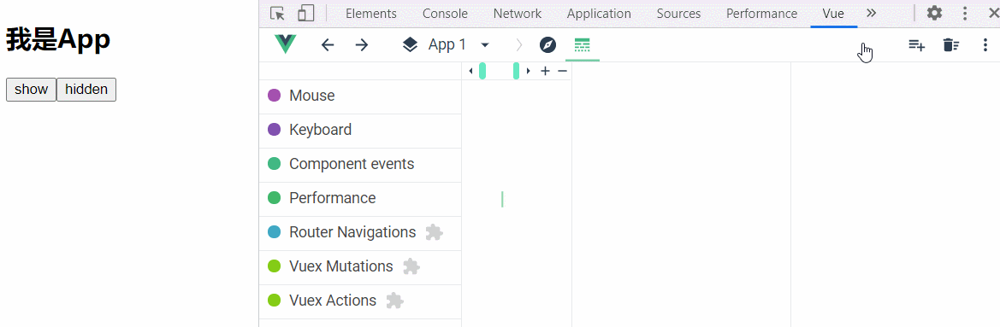

本文只说明了一些常用到的语法变化，其余请查阅[官方文档](https://router.vuejs.org/zh/guide/#html)

## 基本使用

在Vue3中vuex（vuex4）的基本使用过程不变，依旧要：

* 下载
* 编写相应的 js 文件，配置对应的option
* 入口文件引入，并挂载到 vue 实例上

只不过在具体的使用细节上发生了变化，这主要体现在两个方面：

1. Vue3 的函数式编程特点
2. CompositionAPI 中访问 store

下面让我们来梳理一下使用的过程吧👇

### 配置store

下载 vuex 后，我们需要编写相应的 js 文件，配置对应的 option。

**Vue2.x写法**

```
import Vue from "vue";
import Vuex from "vuex";

Vue.use(Vuex);
export default new Vuex.Store({
	state:{……},
	mutations:{……},
	actions:{……},
	getters:{……},
	modules:{……},
});
```

**Vue3写法**

```
import { createStore } from "vuex";

export default createStore({
  state:{},
	mutations:{},
	actions:{},
	getters:{},
	modules:{},
})
```

* Vue3将各个功能模块都单独封装成了函数。
  * 使用 `createStore` 创建 Store
* Vue3 中将全局的 API 进行了迁移，也不会默认导出 `Vue` 构造函数，不用像 Vue2.x 中使用 `Vue.use` 进行下载，而需要在入口文件通过 `app.use` 完成下载、配置的过程。👇

### 挂载到vue实例

在入口文件引入，并挂载到vue实例上。

**Vue2.x写法**

```
import Vue from "vue";
import App from "./App";

import store from "./store"; 

new Vue({
  el: "#app",
  store, //在Vue实例中挂载, 配置对应Option
  render: h => h(App)
});
```

Vue3写法

```
import { createApp } from "vue";
import store from "./store";
import App from './App.vue'

let app = createApp(App);
app.use(store);
app.mount("#app");
```

也可以

```
createApp(App).use(store).mount("#app");
```

### 组件访问Store

​	前面我们已经完成了对 vuex4 的配置和挂载，之后我们要在组件中进行访问，在 Vue2.x 中，我们只需要使用神奇的 `this` 通过 `$store` 就能够完成对 vuex 的访问。

​	我们知道：Vue3 中新增了 CompositionAPI，而 `setup` 是其展示的舞台，但 setup 中不能通过 this 访问组件实例，因此也就不能向 Vue2.x 一样使用 this 访问了。

​	Vue3 的一大特性就是：函数式编程。可以通过调用 `useStore` 函数，来在 `setup` 钩子函数中访问 `store`。这与在组件中使用options API 访问 `this.$store` 是等效的。

```
import { useStore } from 'vuex'

export default {
  setup () {
    const store = useStore()
  }
}
```

## 小案例

这里通过一个很小的案例，来加深 vuex4 的基本使用，并通过该案例引出下文要讲的注意事项。

* 点击 App 组件中的按钮，分别变更 Store 中的 state，从而影响 Brother 组件的展示



**store/index.js**

```
import { createStore } from "vuex";

export default createStore({
  state: {
    isShow: false,
  },
  mutations: {
    show(state, payload) {
      state.isShow = true;
    },
    hidden(state, payload) {
      state.isShow = false;
    },
  },
  actions: {},
  getters: {},
  modules: {},
});
```

**App.vue**

```
<template>
  <main id="main">
    <h2>{{ title }}</h2>
    <button @click="show()">show</button>
    <button @click="hidden()">hidden</button>
  </main>
  <Brother />
</template>
<script>
  import { defineComponent, reactive, toRefs } from "vue";
  import { useStore } from "vuex";

  import Brother from "./Brother.vue";
  export default defineComponent({
    components: {
      Brother,
    },
    setup() {
      const state = reactive({
        title: "我是App",
      });
      const $store = useStore();
      const show = () => {
        $store.commit("show");
      };
      const hidden = () => {
        $store.commit("hidden");
      };
      return {
        ...toRefs(state),
        show,
        hidden,
      };
    },
  });
</script>
```

**Brother.vue**

```
<template>
  <div id="brother" v-show="$store.state.isShow">
    <h3>{{ title }}</h3>
  </div>
</template>
<script>
  import { defineComponent } from "vue";

  export default defineComponent({
    setup() {
      const title = "我是Brother组件";
      return { title };
    },
  });
</script>
```

## 访问 State 和 Getter

> Vue3 语法向下兼容，可以直接在模板中使用 $store 访问 vuex 中的各个选项，上文的 **Brother.vue** 就是通过 $store 进行访问的。

   那如果我想纯粹使用 CompositionAPI，完成 vuex 的状态访问，我们就需要使用 `useStore` 功能函数，这一点上文已经讲解过了。

但值得注意的是：在 CompositionAP I中访问 State 和 Getter **需要手动保证其响应式**，**需要手动保证其响应式**，**需要手动保证其响应式**：

* 为了能让 template 在 vuex 状态变更时也触发更新(响应式)，需要将访问 State 和 Getter 时所定义的的变量设为`computed`

这里我们依旧以上文案例为基础，更改 **Brother.vue** 的代码，纯粹使用 CompositionAPI 在视图中访问 Store。👇

### 直接访问

若直接访问，并绑定到视图上，`isShow` 并不具有响应式，即使 `store` 中的状态发生了变更，由于 setup 返回的  isShow 并不具有响应式，所以不会触发页面的更新。


```
<template>
  <div id="brother" v-show="isShow">
    <h3>{{ title }}</h3>
  </div>
</template>
<script>
  import { defineComponent, computed } from "vue";
  import { useStore } from "vuex";

  export default defineComponent({
    setup() {
      const title = "我是Brother组件";
      //若直接访问，并绑定到视图上，isShow并不具有响应式。
      let isShow = useStore().state.isShow;
      return {
        title,
        isShow
      };
    },
  });
</script>
```

### 设置为Computed

将访问 State 和 Getter 时所定义的的变量设为 `computed`，保证了该变量为响应式，因此在 state 改变时，computed 重新执行，更新变量，视图也会更新。


```
<script>
  import { defineComponent, computed } from "vue";
  import { useStore } from "vuex";

  export default defineComponent({
    setup() {
      const title = "我是Brother组件";
      let isShow = computed(() => useStore().state.isShow);
      return {
        title,
        isShow,
      };
    },
  });
</script>
```

