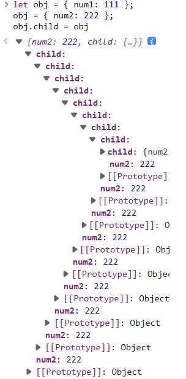
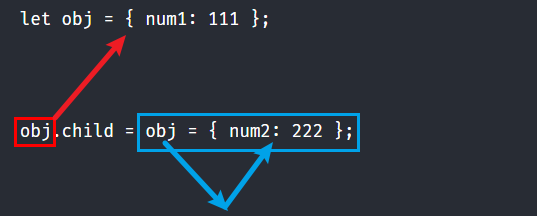

### 例题

```
let obj = { num1: 111 };

obj.child = obj = { num2: 222 };

console.log(obj.child); // 输出？
```

### 心中的错误答案

第一次看到这题，心里就知道考察的是第二行代码：

```
obj.child = obj = { num2: 222 };
```

我想当然的在脑中构建了以下思考过程：

1. 不就是代码自右向左依次执行吗
2. 第一步，obj 的引用地址被更新到新的字面量对象 `{num2: 222}` 身上。
3. 第二步，obj.child = 第一步 `obj = {num2: 222}` 的返回值 `{num2: 222}`，而 obj 已经指向了 `{num2: 222}`，所以会产生一个循环引用：obj.child = obj

将思路转化为代码：

```
let obj = { num1: 111 };
obj = { num2: 222 };
obj.child = obj
```

打开控制台你会发现，obj 的层级会无限嵌套（因为存在循环引用）



### 正确答案

先公布正确答案：obj.child 的打印结果为 **undefined**

what？ 我傻眼了。

第一步的分析没问题，代码自右向左依次执行。其实思考的错误点在于第二步：我自然而然的将一行代码指令拆分成了独立的两行进行执行

```
obj.child = obj = { num2: 222 };
```

转化为了

```
obj = { num2: 222 };
obj.child = obj
```

但不能这么想，它本质上还是一条指令，在预解析执行这一行代码的时候，obj 最开始还是指向初始化的字面量对象 `{ num1: 111 }` 的，因此 obj.child 其实是 `undefined`。

然后代码自右向左依次执行，更新了 obj 指向最新的字面量对象 `{num2: 222}`，虽然将其赋值给了这行代码最左侧的 obj.child，但是做左侧的这个 obj 是指向初始化字面量对象 `{ num1: 111 }` 的，因此相当于是把 `{num2: 222}` 作为 child 属性赋值到了最初的字面量对象  `{ num1: 111 }`  中了。



在之后，独立一行运行打印 obj.child 的代码，此时 obj 已经指向最新的引用 `{num2: 222}` 了，因此没有 child 属性，值为 undefined。

当然了，如果 log 的指令没有独立一行去运行，那么最后的打印结果就是第二行表达式的返回值：`{num2: 222}`

```
let obj = { num1: 111 };
console.log(obj.child = obj = { num2: 222 });
```

如果想更加直观一些，我们可以初始化另一个变量来指向 obj 的初始化字面量对象。

```
let obj = { num1: 111 };
let foo = obj

obj.child = obj = { num2: 222 };

console.log(obj);
// { num2: 222 }
console.log(obj.child);
// undefined
console.log(foo);
// { num1: 111, child: { num2: 222}}
```

