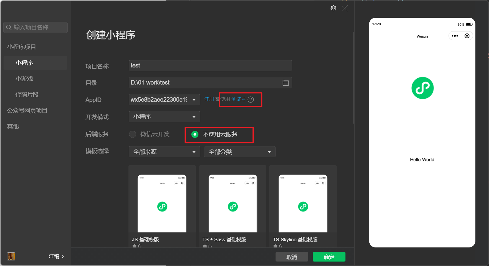
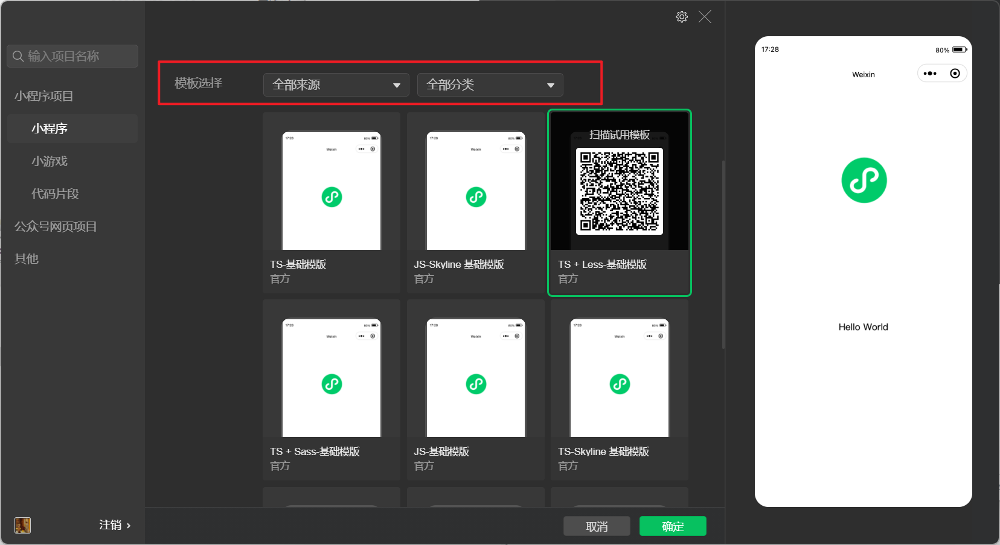
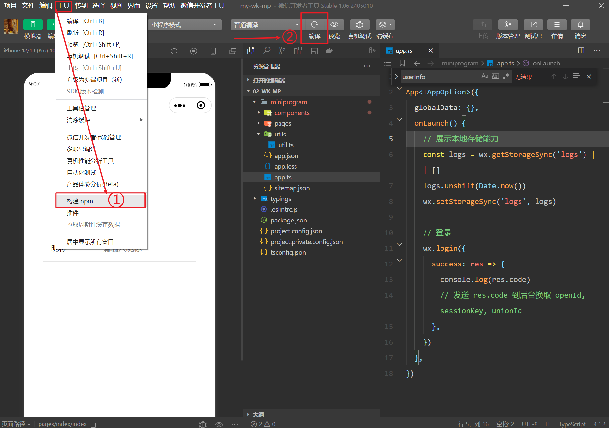
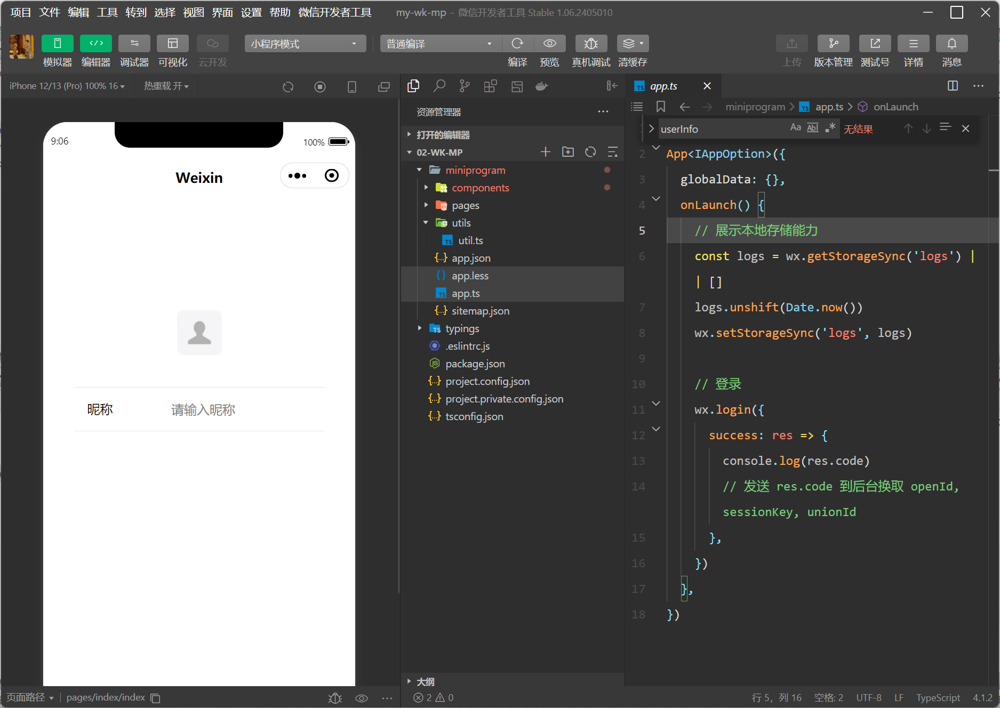

更多详细内容请参照官网 [开始创建一个小程序项目](https://developers.weixin.qq.com/miniprogram/dev/framework/quickstart/getstart.html)

>第一步申请小程序我们可以先跳过，着重了解如何进行开发。

# 安装开发者工具

[先安装官方的开发者工具 ](https://developers.weixin.qq.com/miniprogram/dev/framework/quickstart/getstart.html#%E5%AE%89%E8%A3%85%E5%BC%80%E5%8F%91%E5%B7%A5%E5%85%B7)，这是开发小程序的必要条件，我们后续可以通过开发者工具进行：

1. 小程序的开发(也可以用其他 ide)、项目基础模板的创建、项目的编译。
2. 代码效果预览、调试
3. 真机扫码调试

# run 起来一个基础项目模板

到开发者工具新建一个小程序项目



由于我们不关注小程序的申请，着重于如何开发。所以这里我们选择使用测试号 AppId, 不使用云服务。

**模板选择**

官方提供了很多基础模板，这里我们选择 TS + Less



成功创建后，一开始你可能看不到项目的实际运行效果，这时候你只需要：

1. 工具 -> 构建 npm
2. 点击编译



之后，你会看到项目运行的效果

# 项目目录结构

## miniprogram

小程序的开发目录，也是我们最着重关注的目录

### components 目录

用于存放组件的目录，我们可以在 page 的 wxml 中引入组件。

### pages 目录

### utils 目录

### app.json 文件

顾名思义，是一个全局的 json 配置文件，用于做小程序的全局类配置，决定各页面文件的路径、窗口表现、设置网络超时时间、设置多 tab 等

完整配置项说明请参考[小程序全局配置](https://developers.weixin.qq.com/miniprogram/dev/reference/configuration/app.html)

### app.ts 文件

主要做三件事情：

1. 小程序应用的注册
2. 全局逻辑（生命周期钩子）的拦截
3. 全局数据的维护

详情参考 [App 文档](https://developers.weixin.qq.com/miniprogram/dev/reference/api/App.html)

```
App({
  onLaunch (options) {
    // Do something initial when launch.
  },
  onShow (options) {
    // Do something when show.
  },
  onHide () {
    // Do something when hide.
  },
  onError (msg) {
    console.log(msg)
  },
  globalData: 'I am global data'
})
```

整个小程序只有一个 App 实例，是全部页面共享的。开发者可以通过 `getApp` 方法获取到全局唯一的 App 实例，获取App上的数据或调用开发者注册在 `App` 上的函数。

```
// xxx.js
const appInstance = getApp()
console.log(appInstance.globalData) // I am global data
```


### app.less 文件

### sitemap.json 文件

## typings

见字知其意，为项目做类型声明的目录

## 其它项目基础配置文件

* .eslintrc.js
* package.json
* tsconfig.json

这些文件在前端项目中已经很常见了，不再赘述。

但是有两个文件我们没见过：project.config.json、project.private.config.json

### project.config

[自定义 node_modules 和 miniprogram_npm 位置的构建 npm 方式](https://developers.weixin.qq.com/miniprogram/dev/devtools/npm.html#%E8%87%AA%E5%AE%9A%E4%B9%89-node-modules-%E5%92%8C-miniprogram-npm-%E4%BD%8D%E7%BD%AE%E7%9A%84%E6%9E%84%E5%BB%BA-npm-%E6%96%B9%E5%BC%8F)

```
{
……
  "setting": {
  ……
    "packNpmManually": true,
    "packNpmRelationList": [
      {
        "packageJsonPath": "./package.json",
        "miniprogramNpmDistDir": "./miniprogram/"
      }
    ],
  },
}
```

.gitignore

```
/node_modules
/miniprogram/miniprogram_npm
```

>as-enum 在小程序开发者工具中点击‘构建 npm’后，miniprogram_npm 下并没有出现，怀疑是因为不认识 as-enum 的 package.json 中标识的入口文件后缀名 .cjs / .mjs
>
>因为对比 dayjs 的入口文件标识为 `dayjs.min.js`
>
>

# Tips

