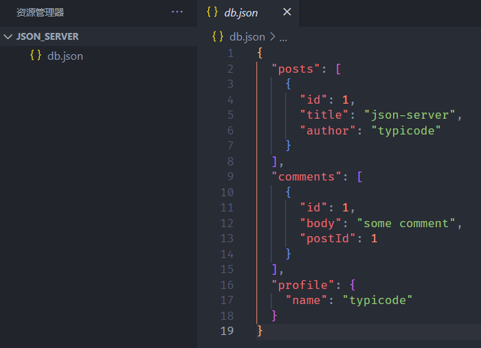

## 前期准备

​	前端开发生成假数据，通常使用 `Mock.js` 实现。但我们还想要模拟接口调用的过程，这样等后端开发人员写好接口后，前端只需要替换对应的接口路径和所传参数即可。

​	我们可以使用 `json-server`  工具，模拟一个服务，供给前端开发人员调用。

1.首先我们要 **全局** 安装该工具：

```
npm i json-server -g
```

2.创建一个目录（ json-server 项目 ），例如叫 `json_server`。

3.运行指令，启动服务：

* `--watch`：侦听数据的变化，并更新到对应的文件中
* `dataFilePath`：存放数据的文件路径（`json-server` 的数据源）
* `--port xxxx`：设置服务运行的端口

```
json-server --watch ./db.json --port 5222
```

运行指令后发现，已经自动帮我们创建好了数据源文件（`./db.json`），并初始化了一些假数据：



控制台消息：

```
  \{^_^}/ hi!

  Loading ./db.json
  Oops, ./db.json doesn't seem to exist
  Creating ./db.json with some default data

  Done

  Resources
  http://localhost:5222/posts
  http://localhost:5222/comments
  http://localhost:5222/profile

  Home
  http://localhost:5222
```

我们先向 `./db.json` 中再追加一个数据 `users`：

```
{
 	……
    "users": [
      {
        "id": "1",
        "name": "Ashun1",
        "desc": "Ashuntefannao1",
        "detail": {
          "age": 20,
          "hobby": "music"
        }
      },
      {
        "id": "2",
        "name": "Ashun2",
        "desc": "Ashuntefannao2",
        "detail": {
          "age": 21,
          "hobby": "parkour"
        }
      }
    ]
}
```

后续示例将编辑 `users` 数据，并使用 `Postman` 模拟请求的发送

## 基本规则

如果我们想要读写某条数据，直接在 url 后面拼接对应 propName 的路径即可。

```
http://localhost:5222/posts		//访问posts
http://localhost:5222/comments	//访问comments
http://localhost:5222/profile	//访问profile
http://localhost:5222/users		//访问users
```

后文将以 `users` 数据操作进行示例。

### 查找数据

请求方式 GET

* 访问整个 users 数组

```
http://localhost:5222/users
```

* 根据 id 查找某条数据

>直接在 users 后面拼接对应的 id 值即可。
>
>也就是说 `json-server` 默认配置了一个动态参数 `propName/:id`

```
http://localhost:5222/users/1
```

返回的数据就是对应 id 的 **一条数据**

* 根据其他属性查找（直接使用url传参即可）

```
http://localhost:5222/users?name=Ashun1
```

* 支持 `.` 语法查询深层属性

```
http://localhost:5222/users?detail.age=20
```

### 增加数据

请求方式 POST

```
http://localhost:5222/users
```

在请求体中放入对应的数据即可

```
{
  "id": "3",
  "name": "Ashun3",
  "desc": "Ashuntefannao3",
  "detail": {
    "age": 22,
    "hobby": "coding"
  }
}
```

### 删除数据

请求方式 DELETE

```
http://localhost:5222/users/1
```

* 传入对应 id

### 修改数据

#### 更新

请求方式 PUT

```
http://localhost:5222/users/2
```

* 拼接对应数据的 id
* 在请求体中放入更新的数据

```
{
  "id": "2",
  "name": "Ashun2",
  "desc": "Ashuntefannao2",
  "detail": {
    "age": 21,
    "hobby": "dance"
  }
}
```

>相对于原来的数据，我们只是改变了 `detail.hobby` ,如果我们只希望改变某些数据，并且只想传入需要改变的字段数据，而不是全部数据，可以发送 PATCH 请求。

如果我们在请求体中放入的是

```
"detail": {
  "age": 21,
  "hobby": "dance"
}
```

则 id 为 2 的数据就会变为

```
{
  "id": "2",
  "detail": {
    "age": 21,
    "hobby": "dance"
  }
}
```

#### 补丁

请求方式 PATCH 

* url 后拼接对应数据的 id
* 请求体中只需要放入需要补丁的数据即可

```
http://localhost:5222/users/3
```

body

```
{
  "detail": {
    "age": 22,
    "hobby": "life"
  }
}
```

结果

```
{
  "id": "3",
  "name": "Ashun3",
  "desc": "Ashuntefannao3",
  "detail": {
    "age": 22,
    "hobby": "life"
  }
}
```

