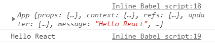

	上篇文章通过介绍react的基本使用，让我们对react有了一个简单的了解，但那个案例并不能够体现react的优势，就是因为代码操作太频繁，结构也不清晰，其实我们可以使用**组件**的形式进行组织。

​	react封装组件的方式**有很多**，这里我们先接触最基础的形式：ES6中的class进行组件的封装。

# render方法

首先我们要完成组件的渲染，要将jsx渲染到目标DOM上。

1. 定义组件类，设置render方法
2. 使用`ReactDOM.render(<cpnName/>,DOM)`，这里第一个参数不再传入`jsx`，而是`组件类名标签`，会自动根据组件类中的render方法返回的jsx结构进行渲染。

**代码部分**

```
<body>
<!-- DOM结构 -->
  <div id="app"></div>
<!-- 相关依赖 -->
  <script src="https://unpkg.com/react@16/umd/react.development.js" crossorigin></script>
  <script src="https://unpkg.com/react-dom@16/umd/react-dom.development.js" crossorigin></script>
  <script src="https://unpkg.com/babel-standalone@6/babel.min.js"></script>
<!-- 使用 -->
  <script type="text/babel">
     class App extends React.Component {
       render(){
         return (
           <div>
             <h2>Hello World</h2>
             <button>click</button>
           </div>
         );
       }
     }

     let app=document.querySelector("#app");
     ReactDOM.render(<App/>,app);
  </script>
</body>
```

**注意点**

为了结构更加清晰，最好在组件类的render方法，所返回的jsx代码外部包裹`()`,这里没什么特别的含义，只为了结构更加清晰。

因为在js中使用()包裹，只会将其中的内容当作表达式来看待。

# state属性

​	上面我们完成了基本的渲染，但jsx中的数据还是死的，我们应该让其绑定组件类中的属性。

基本注意点：

* 在constructor中使用this，为实例分配对应属性
* 若该类继承了某个父类，又配置了constructor，则**一定要调用super()**,来继承父类的属性、方法。

```
class App extends React.Component {
  constructor(){
    super();
    this.message='Hello World';
  }
  render(){
    return (
     <div>
      <h2>Hello World</h2>
      <button onClick={()=>{this.changeMessage()}>click</button>
     </div>
    );
  }
  changeMessage(){
    this.message='Hello React';
  	console.log(this)
  	console.log(this.message)
  }
}

let app=document.querySelector("#app");
ReactDOM.render(<App/>,app);
```

点击按钮时，能够打印出message。



通过打印结果可以发现，message的确发生了改变，但是**视图却没有更新**，内容还是Hello World。


为什么会这样呢？如果直接定义的这些属性，不能够实现响应式，这时就轮到`state`登场了👇

**当我们希望jsx中的数据能够实现响应式，需要满足两点：**

1. **将对应的变量定义在`this.state`中**
2. **使用`this.setState({…})`变更数据**

setState()接收新的obj，react就会根据这个新的obj进行数据的变更和视图的更新。之所以能供使用`this.`访问到setState()，是因为该方法实际上存在于父类中。

> 当然setState还有其它用法，后期会进行详解。

```
class App extends React.Component {
  constructor(){
    super();
    this.state={
    message:'Hello World'
    }
  }
  render(){
    return (
      <div>
        <h2>{this.state.message}</h2>
        <button onClick={this.changeMessage.bind(this)}>click</button>
      </div>
    );
  }
  changeMessage(){
    this.setState({
      message:'Hello React'
    });
  }
}
```


# 总结

这里总结一下上文的过程

1. 定义class，并继承`React.Component`父类
2. 定义指定的属性、方法。
   * 定义`render`方法，返回渲染的jsx结构，为了让结构更清晰，jsx部分推荐使用`()`包裹
   * 若要实现响应式，需要将对应的变量定义在`state`属性中，并且使用`setState`方法进行数据的变更。
3. 事件绑定时，要注意this的指向问题。

