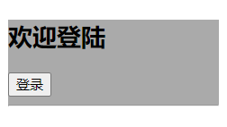
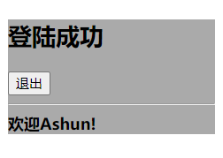

​	在Vue中，我们通过简单的`v-show`与`v-if/v-else-if/v-else`指令，就能够完成`条件展示`与`条件渲染`，但是在React中，由于我们应用的是jsx，所以完全**通过JavaScript代码来控制**，虽然对于简单的功能来说，可能要比vue的实现过程更加繁琐，但这也体现了React的灵活性。

* 如果元素是否显示状态，切换的比较频繁，推荐使用`条件展示`，因为DOM一直存在，每次只需要更改内容，若使用条件渲染，则会频繁创建、移除DOM，消耗大量性能。
* 反之，可以使用`条件渲染`

---

我们通过一个案例来说明React中实现的`条件展示`与`条件渲染`。

点击按钮，切换登录状态，并且不同状态下，展示内容有所不同：

1. 标题内容
2. button按钮的内容
3. 提示消息

未登录状态：



登陆状态：



## 条件展示

### 方案一

先获取state中的各个状态，然后根据`isLogin`的值，改变各个变量的值。

适用场景：

​	在不同登录状态下，变更的操作比较复杂时，此方法更加有优势，

1. 能够处理一些复杂的情况。
2. 让JavaScript部分与jsx部分进行了分隔，能够使得结构更加清晰，可读性更好。

```
<script type="text/babel">
  class App extends React.Component {
    constructor() {
      super();
      this.state = {
        message: "欢迎登陆",
        isLogin: false,
        maxBoxSty: { backgroundColor: "#aaa" },
      };
    }
    render() {
      // 方案1;
      let { message, isLogin, maxBoxSty } = this.state;
      let btnContent = "登录",
        hello = "欢迎Ashun!";
      if (isLogin) {
        message = "登陆成功";
        btnContent = "退出";
      } else {
        hello = false;
      }
      return (
        <div id="maxBox" style={maxBoxSty}>
          <h2>{message}</h2>
          <button
            onClick={() => {
              this.changeLogin();
            }}
          >
            {btnContent}
          </button>
          <hr />
          <strong>{hello}</strong>
        </div>
      );
    }
    changeLogin() {
      this.setState({
        isLogin: !this.state.isLogin,
      });
    }
  }
  let app = document.getElementById("app");
  ReactDOM.render(<App />, app);
</script>
```

### 方案2

但该案例是比较简单的，对于登录、非登录状态，所影响的其他变量，都是实现来回两个值的切换，没有什么复杂的逻辑，所以直接使用表达式完成即可。

适用场景：

功能实现过程非常简单，不涉及复杂操作，该方式的实现过程会更加的简便。

```
<script type="text/babel">
  class App extends React.Component {
    constructor() {
      super();
      this.state = {
        message: "欢迎登陆",
        isLogin: false,
        maxBoxSty: { backgroundColor: "#aaa" },
      };
    }
    render() {
      // 方案2;
      let { message, isLogin, maxBoxSty} = this.state;
      return (
        <div id="maxBox" style={maxBoxSty}>
          <h2>{(message = isLogin ? "登陆成功" : message)}</h2>
          <button
            onClick={() => {
              this.changeLogin();
            }}
          >
            {!isLogin ? "登录" : "退出"}
          </button>
          <hr />
          <strong>{isLogin && "欢迎Ashun!"}</strong>
        </div>
      );
    }
    changeLogin() {
      this.setState({
        isLogin: !this.state.isLogin,
      });
    }
  }
  let app = document.getElementById("app");
  ReactDOM.render(<App />, app);
</script>
```

## 条件渲染

​	我们知道：在Vue中能够通过简单的指令来实现条件渲染和条件展示，但React完全使用JavaScript代码来控制。

​	上文讲到的`条件展示`，是通过某个状态(`isLogin`)的变更，从而影响展示的内容，但那些标签元素是依旧存在的，所以称为条件展示。

​	而条件渲染，是根据某个或某些状态的变更，直接决定**元素是否存在**。

那我们只需要判断是不是符合某些条件，来决定是否渲染某些元素即可。

### 方案一

若在上文中条件展示(方案一)的提示消息部分，改为条件渲染，可有两种方法。

1. 若符合条件，直接赋值给对应变量为jsx

```
render() {
  if (isLogin) {
    hello = <strong>"欢迎Ashun!"</strong>;
  }
  return (
    <div id="maxBox" style={maxBoxSty}>
     ……
      { hello }
    </div>
  );
 }
}
```

2. 如果条件渲染的结构比较复杂，我们可以单独封装一个方法，在对应部分调用即可。

```
render() {
  //条件渲染的方法  
  function showHello() {
    if (isLogin) {
      return <strong>{hello}</strong>;
    }
  }
  return (
    <div id="maxBox" style={maxBoxSty}>
      {/* 调用条件渲染的方法  */}
      { showHello() }
    </div>
  );
 }
}
```

### 方案二

若把上文中条件展示(方案二)中的提示消息部分，改为下述代码，则就变成了条件渲染。

```
//原代码
<strong>{isLogin && "欢迎Ashun!"}</strong>
//修改后
{ isLogin && <strong>"欢迎Ashun!"</strong> }
```

## 实现v-show效果

​	在Vue中，我们通过简单的`v-show`，实现条件展示，而实现的原理为：是否为目标元素添加样式：`display:none`

​	前面我们实现的条件展示，是不论哪种情况，都有内容进行展示，如果我们希望根据某个状态的变更，实现v-show呢？

​	其实很简单，我们直接动态的绑定元素的style属性即可

```
<script type="text/babel">
  class App extends React.Component {
    constructor() {
      super();
      this.state = {
        isLogin: false,
      };
    }
    render() {
      let { isLogin } = this.state;
      /* 根据状态绑定样式 */
      function vShow() {
        return { display: !isLogin && "none" };
      }
      return (
        <div id="maxBox">
          <button
            onClick={() => {
              this.changeLogin();
            }}
          >
            Login
          </button>
          <hr />
          {/* 调用vShow() */}
          <strong style={ vShow() }>"欢迎Ashun!"</strong>
        </div>
      );
    }
    changeLogin() {
      this.setState({
        isLogin: !this.state.isLogin,
      });
    }
  }
  let app = document.getElementById("app");
  ReactDOM.render(<App />, app);
</script>
```

