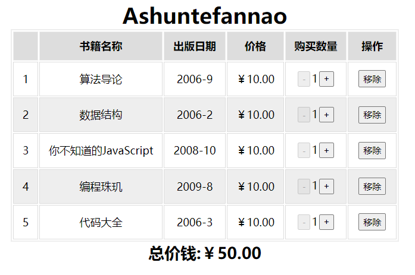
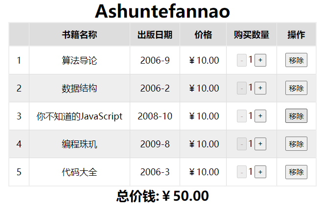

在观看课程讲解前，我先试着自己完成了一下，然后再对比课程代码，发现自己的代码与课程代码各有优点，所以总结一下。

关于样式来说，是统一的，这里贴一下样式表：

```
* {
  margin: 0;
  padding: 0;
  box-sizing: border-box;
}
body {
  width: 100vw;
  height: 100vh;
  display: flex;
  flex-direction: column;
  justify-content: center;
  align-items: center;
  text-align: center;
}
table {
  border: 2px solid #eee;
  border-collapse: collapse;
}
tr,
td {
  border: 1px solid #ddd;
}
td,
th {
  padding: 10px 13px;
}
th {
  border: 1px solid #eee;
  background-color: #ddd;
}
tr:nth-of-type(2n) {
  background-color: #eee;
}
button {
  padding: 2px 5px;
  margin: 2px;
}
```

## border-collapse

在表格布局中要注意一个样式：`border-collapse: collapse`，为表格设置合并边框模型：

| 值       | 描述                                                         |
| :------- | :----------------------------------------------------------- |
| separate | 默认值。边框会被分开。不会忽略 border-spacing 和 empty-cells 属性。 |
| collapse | 边框会合并为一个单一的边框。会忽略 border-spacing 和 empty-cells 属性。 |
| inherit  | 规定应该从父元素继承 border-collapse 属性的值。              |

未设置该属性：



设置后：




## 结合课程代码后

1. `createBody`部分更加清晰。

   没有遍历Array中的Object，而是直接通过`row.prop`依次手动进行配置。

2. 将格式化的工具函数进行了抽离

3. 合理组织代码结构

   * 将一些展示性的函数封装，放置在render前
   * 将一些操作性的函数封装，放置在render后

并且还要注意一下React的设计理念：

**state的不变性：**不要直接改变state，如果操作的数据比较复杂，可以先拷贝一份，然后操作，最后通过setState进行状态变更。

例如我在该案例中操作Array时，都是通过map,filter,reduce……这些能够返回新Array的方法进行操作的。

```
<body>
  <!-- RootDOM -->
  <div id="app"></div>
  <!-- 相关依赖 -->
  ……
  <!-- React编写 -->
  <script src="./format-utils.js"></script>		//封装的格式化函数
  <script type="text/babel">
    class App extends React.Component {
      constructor() {
        super();
        this.state = {
          test: "Ashuntefannao",
          headers: ["书籍名称", "出版日期", "价格", "购买数量", "操作"],
          course: [
            {
              id: "001",
              name: "算法导论",
              date: "2006-9",
              price: 10,
              num: 1,
            },
            {
              id: "002",
              name: "数据结构",
              date: "2006-2",
              price: 10,
              num: 1,
            },
            {
              id: "003",
              name: "你不知道的JavaScript",
              date: "2008-10",
              price: 10,
              num: 1,
            },
            {
              id: "004",
              name: "编程珠玑",
              date: "2009-8",
              price: 10,
              num: 1,
            },
            {
              id: "005",
              name: "代码大全",
              date: "2006-3",
              price: 10,
              num: 1,
            },
          ],
        };
      }
      
      /* 视图相关函数	*/
      createHeader() {
        let { headers } = this.state;
        return (
          <thead>
            <tr>
              <th></th>
              {headers.map((v, i) => (
                <th key={i}>{v}</th>
              ))}
            </tr>
          </thead>
        );
      }
      createBody() {
        let { course } = this.state;
        return (
          <tbody>
            {course.map((row, index) => {
              return (
                <tr key={row.id}>
                  <td>{index + 1}</td>
                  <td>{row.name}</td>
                  <td>{row.date}</td>
                  <td>{showPrice(formatPrice(row.price))}</td>
                  <td>
                    <button
                      onClick={() => {
                        this.changeCount(row.id, "sub");
                      }}
                      disabled={this.isDisable(row.num)}
                    >
                      -
                    </button>
                    {row.num}
                    <button
                      onClick={() => {
                        this.changeCount(row.id, "add");
                      }}
                    >
                      +
                    </button>
                  </td>
                  <td>
                    <button
                      onClick={() => {
                        this.delete(row.id);
                      }}
                    >
                      移除
                    </button>
                  </td>
                </tr>
              );
            })}
          </tbody>
        );
      }

      Null() {
        let { course, headers } = this.state;
        let colspan = headers.length + 1;
        if (course.length == 0) {
          return (
            <tbody>
              <tr>
                <td colSpan={colspan}>
                  <h1>购物车为空~</h1>
                </td>
              </tr>
            </tbody>
          );
        }
      }
      render() {
        return (
          <main>
            <h1>{this.state.test}</h1>
            <table>
              {this.createHeader.call(this)}
              {this.createBody.call(this)}
              {this.Null()}
            </table>
            <h2>总价钱:{this.getSum()}</h2>
          </main>
        );
      }
      
      /*与操作相关函数*/
      changeCount(id, operation) {
        let { course } = this.state;
        let newCourse = course.map((v) => {
          if (v.id == id) {
            operation == "add" && v.num++;
            operation == "sub" && v.num--;
          }
          return v;
        });
        this.setState({
          course: newCourse,
        });
      }
      isDisable(num) {
        return num > 1 ? false : true;
      }
      delete(id) {
        let { course } = this.state;
        let newCourse = course.filter((v) => v.id != id);
        this.setState({
          course: newCourse,
        });
      }
      getSum() {
        let { course } = this.state;
        let sum = course.reduce(
          (pre, val) => (pre += val.num * val.price),
          0
        );
        return showPrice(formatPrice(sum));
      }
    }
    let app = document.getElementById("app");
    ReactDOM.render(<App />, app);
  </script>
</body>
```

## 自身代码

自身代码与课程代码相比较，差距最大的部分就是`createBody()`部分。

自身代码`createBody`思路：

在`state`中，整个`corse`是一个Array，每个元素为Object，首先遍历Array，然后再遍历各个Object。

但是在该场景下就会显得比较复杂，因为在遍历各个Object时（也就是展示表格中的每一列），由于展示的数据不同，对于一些特定选项，需要个性化配置，这就需要大量`if/else if`进行判断。

**适用场景**

因此，自己写的这部分代码，更适合单纯的展示一些比较统一的数据，由于使用的是遍历，会大大减少代码量。

**不适用场景**

需要大量个性化展示的数据，由于使用遍历，就需要在其中添加大量的判断，代码结构反而会变得复杂，当然，个性化数据占比总数据量如果非常小，也可以使用遍历。

比如该案例，本身展示的数据(列数)就不多，如果再遍历Object，并在其中添加大量判断，反而得不偿失。

```
createBody() {
  let { course } = this.state;
  return (
    <tbody>
      {
        course.map((row, rowKey) => (
          <tr key={rowKey}>
            <td>{rowKey + 1}</td>
            {/* 遍历列 */}
            {Object.entries(row).map(([clmKey, column]) => {
              if (clmKey == "num") {
                return (
                  <td key={clmKey}>
                    <button
                      onClick={() => {
                        this.changeCount(row.id, "add");
                      }}
                    >
                      +
                    </button>
                    {column}
                    <button
                      onClick={() => {
                        this.changeCount(row.id, "sub");
                      }}
                      disabled={this.isDisable(row.num)}
                    >
                      -
                    </button>
                  </td>
                );
              } else if (clmKey == "id") {
                return null;
              } else if (clmKey == "price") {
                return (
                  <td key={clmKey}>{ showPrice(formatPrice(column)) }</td>
                );
              } else {
                return <td key={clmKey}>{column}</td>;
              }
            })
          }

          <td>
            <button
              onClick={() => {
                this.delete(row.id);
              }}
            >
              移除
            </button>
          </td>
        </tr>
      ))}
    </tbody>
  );
}
```

## 总结：

自身代码与课程代码相比较，有以下缺点：

1. `createBody()`部分，相对复杂--(适用场景不同)
2. 没有将格式化的工具函数进行抽离
3. 没有更好的组织代码结构
   * 应该将一些**展示性**的函数封装，放置在render前
   * 应该将一些**操作性**的函数封装，放置在render后

值得注意的知识点：

1. border-collapse

2. **保持state的不变性**

   不要直接改变state，如果操作的数据比较复杂，可以先拷贝一份，然后操作，最后通过setState进行状态变更。
