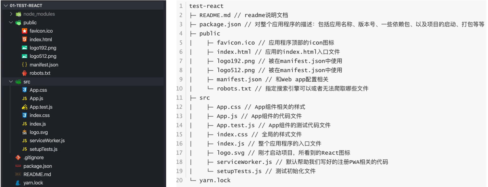

## 介绍

这里先介绍以下为什么使用脚手架：

​	在真正搭建一个项目之前，我们都要提前做一些操作，从而让项目开发能够更加符合开发规范和要求。例如：

1. 规范的目录结构
2. 合理的管理文件之间的依赖、第三方模块依赖
3. 一些文件的预解析
4. 项目发布前如何压缩，打包

而这些操作是比较繁琐，且具有重复性的，所以我们需要一个工具，能够帮助我们快速生成项目的基本框架，那么这个工具就是**脚手架**。

## 安装

**前提**：需要安装`node`环境

**安装**：可使用`npm`、`cnpm`、`yarn`等包管理工具进行安装。

```
npm install -g create-react-app
```

**检查**：查看脚手架版本，检测是否安装成功

```
create-react-app --version
```

## 创建React项目

**步骤**

1. 进入项目目录

2. 终端运行指令：

   ```
   create-react-app projectName
   ```

   值得注意的是：

   * 项目名称**不能**包含大写字母
   * 还有更多创建项目的方式，可参考GitHub中react的README.md

3. 项目创建完毕后，进入项目目录，就可以运行项目了

   ```
   yarn start
   ```


## 目录结构

通过：`create-react-app projectName`创建后，进入到项目目录，就可看到项目的具体结构，这里通过一张图片进行解释：



```
test-react
├─ README.md // readme说明文档
├─ package.json // 对整个应用程序的描述：包括应用名称、版本号、一些依赖包、以及项目的启动、打包等等（node管理项目必备文件）
├─ public
│    ├─ favicon.ico // 应用程序顶部的icon图标
│    ├─ index.html // 应用的index.html入口文件
│    ├─ logo192.png // 被在manifest.json中使用
│    ├─ logo512.png // 被在manifest.json中使用
│    ├─ manifest.json // 和Web app配置相关
│    └─ robots.txt // 指定搜索引擎可以或者无法爬取哪些文件
├─ src
│    ├─ App.css // App组件相关的样式
│    ├─ App.js // App组件的代码文件
│    ├─ App.test.js // App组件的测试代码文件
│    ├─ index.css // 全局的样式文件
│    ├─ index.js // 整个应用程序的入口文件
│    ├─ logo.svg // 刚才启动项目，所看到的React图标
│    ├─ serviceWorker.js // 默认帮助我们写好的注册PWA相关的代码
│    └─ setupTests.js // 测试初始化文件
└─ yarn.lock
```

整体分为

1. node_modules：项目依赖模块
2. public：静态资源目录
3. src：项目源代码编写的目录
4. .gitignore：git提交时忽略的一些文件/目录。
5. package.json：记录项目中依赖的模块，以及各种配置信息
6. README.md：项目介绍文档
7. yarn.lok：包含依赖模块的具体版本信息

## 了解PWA

**介绍：**

- PWA（Progressive Web App），即渐进式WEB应用；
- 一个 PWA 应用首先是一个网页, 可以通过 Web 技术编写出一个网页应用. 随后添加上 App Manifest 和 Service Worker 来实现 PWA 的安装和离线等功能；
- 这种Web存在的形式，我们也称之为是 Web App；

**PWA解决了哪些问题呢？**

- 可以添加至主屏幕，点击主屏幕图标可以实现启动动画以及隐藏地址栏；
- 实现离线缓存功能，即使用户手机没有网络，依然可以使用一些离线功能；
- 实现了消息推送；
- 等等一系列类似于Native App相关的功能；

**React项目中的相关文件**

我们可以在项目目录中观察到以下文件：

* public
  * `manifest.json`
  * logo192.png
  * logo512.png
* src
  * `serviceWorker.js`

如果不实现PWA功能，可以将相关文件删除。

## webpack配置

我们知道：webpack是一个模块化打包工具，在打包时，能够自动帮我们处理各个模块(文件)之间的依赖关系。

但为什么我们没有在项目目中看到任何关乎webpack的内容？

- 原因是React脚手架，将webpack相关的配置隐藏起来了（在vue脚手架中，从Vue CLI3开始，也进行了隐藏）；

如果我们希望看到webpack的配置信息，应该怎么来做呢？

- 我们可以执行一个package.json文件中的一个脚本：`"eject": "react-scripts eject"`
- 这个操作是**不可逆的**，所以在执行过程中会给与我们提示；

```shell
yarn eject
```

当然，一般我们不会将默认的webpack配置暴露出来，如果要进行webpack的配置，我们可以在外部设置相应的文件进行配置。例如在vue-cli中，可以通过webpack.config.js进行配置。

