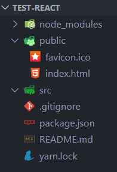
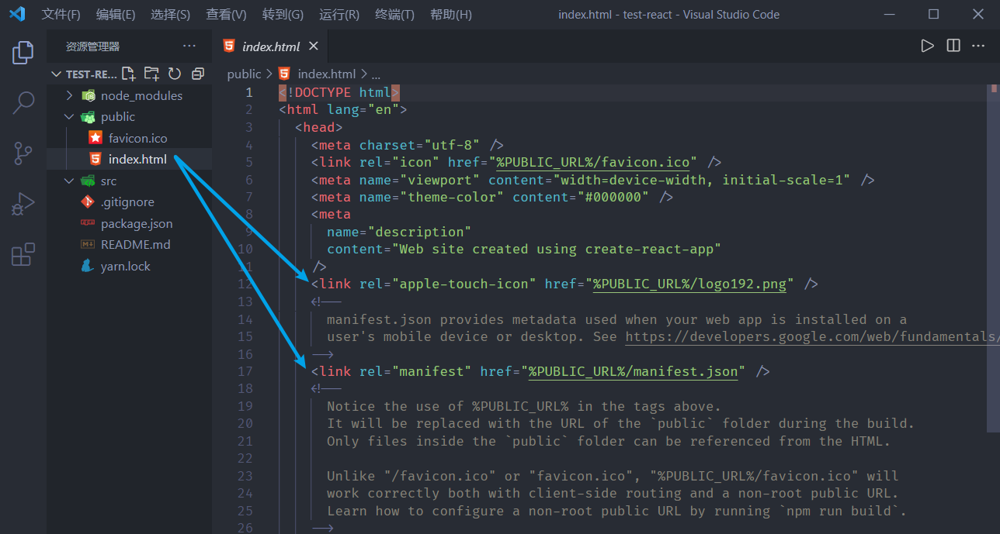
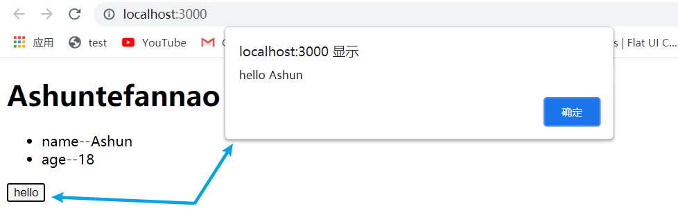
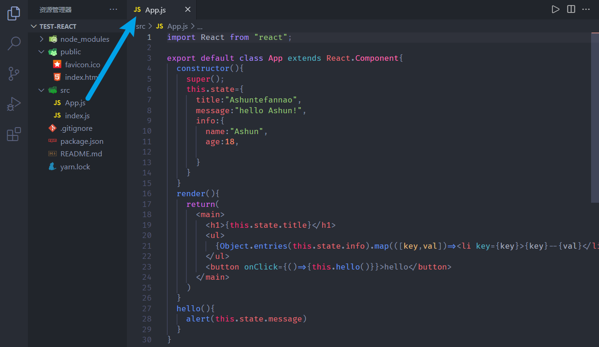
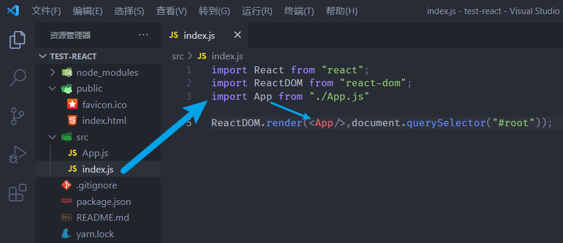

通过脚手架创建完项目，我们也对目录结构和文件功能进行了初步了解，现在我们来学习下，怎么从零开始编写项目，此时我们要删除项目中的一些文件从头编写。

# 文件的删减、修改

我们先将不需要的文件统统删掉：

1. 将src下的所有文件都删除，

   因为该目录就是编写源代码的地方，我们不需要默认的页面组件。

2. 将public文件下出列favicon.ico和index.html之外的文件都删除掉，一般项目不需要做PWA，和爬虫相关的配置。



修改index.html文件：

- 由于删除了一些默认文件，我们需要对入口html文件进行编辑（里面存在对之前删除文件的依赖）
- 图片中标注的两行内容：是我们之前引入的一个图标和manifest文件



# 开始编写

这里首先要说明一点：

​	如果经过上述操作，直接运行项目`npm run start`肯定时会报错的，因为我们的工作区`src目录`没有任何代码。

​	而 webpack会寻找src目录下的`index.js`入口文件，所以如果要让页面显示内容，我们首先要编写`index.js`项目入口文件。

## 初步运行

值得注意的是：一定要引入相关依赖，不然也就不能够访问相关对象。

* `import React from "react"`
* `import ReactDOM from "react-dom"`

在编写时，我们好像只需要ReactDOM，我们只引入ReactDOM，看看是否能够正常运行

```
import ReactDOM from "react-dom";
//	由于index.html（入口html文件）已经存在了id为root的div,这里直接挂载上去即可。
ReactDOM.render(<h2>Ashuntefannao</h2>,document.querySelector("#root"));
```

执行：`npm run start`启动项目，发现会报错：

```
'React' must be in scope when using JSX
(使用JSX时，“React”必须在范围内)
```

也就是说我们需要React对象，为什么呢？其实之前我们已经学习过了，因为这里使用了`JSX`，而`JSX`语法最终也会被转化为`React.createElement`的形式，所以也就应用了`React`对象。

引入React即可解决：

```
import React from "react";
import ReactDOM from "react-dom";
ReactDOM.render(<h2>Ashuntefannao</h2>,document.querySelector("#root"));
```

## 组织代码

经过上文介绍，想必我们也有了一定的了解，其实对于目前来说，除了依赖的引入形式不同，其它形式都与之前我们写Demo时是相同的。

因此我们依然可以将挂载的部分定义为一个`App类`，继承`React.Component`,形成一个根组件。

```
import React from "react";
import ReactDOM from "react-dom";

class App extends React.Component{
  constructor(){
    super();
    this.state={
      title:"Ashuntefannao",
      message:"hello Ashun!",
      info:{
        name:"Ashun",
        age:18,

      }
    }
  }
  render(){
    return(
      <main>
        <h1>{this.state.title}</h1>
        <ul>
          {Object.entries(this.state.info).map(([key,val])=><li key={key}>{key}--{val}</li>)}
        </ul>
        <button onClick={()=>{this.hello()}}>hello</button>
      </main>
    )
  }
  hello(){
    alert(this.state.message)
  }
}
ReactDOM.render(<App/>,document.querySelector("#root"));
```

效果：



## 抽离

我们知道，在项目入口文件中，我们是不想包含太多逻辑的，所以，我们可以将App组件抽离到单独的文件App.js中，再将其引入即可。

**App.js👇：**

注意点：

1. 由于把App类抽离到了外部，且需要依赖React，所以我们依旧要在抽离文件内引入React。
2. 将App类导出



其实为了让引入的结构更加清晰，我们可以利用`对象的解构`进行引入。

* 前面将React整体导入后（导入默认导出项），之后再使用对象结构导入Component。

* 这里之所以还要导入React，是因为组件中也使用了JSX语法，所以也要将其导入。

```
import React,{Component} from "react";

export default class App extends Component{ …… }
```

**index.js入口文件引入👇**


