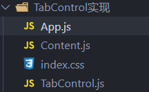
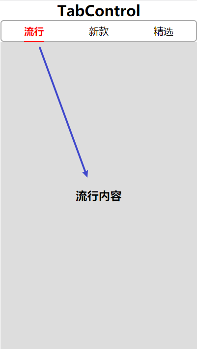

前面我们已经讲解了：在React中，父子组件如何进行通讯（props）。

现在我们通过一个案例来加深对父子组件通讯的了解

# 实现TabControl组件

目录结构：



## App.js

注意点：

* 一些不用实现响应式的数据，尽量不要放到state中，这样结构更加清晰，也会减少不必要的监听，例如下面的`tabs`展示信息。
* 虽然`contents`这里也没有改变，但在实际开发中，是要不断的请求数据的，所以这里依然放到了state中。

```
import React, { Component } from "react";
import TabControl from "./TabControl.js";
import Content from "./Content.js";

require("./index.css");

export default class App extends Component {
  constructor() {
    super();
    this.tabs = ["流行", "新款", "精选"];	//非响应式数据，定义到外部
    this.state = {
      title: "TabControl",
      currentIndex: 0,
      contents: ["流行内容", "新款内容", "精选内容"],
    };
  }
  render() {
    let { currentIndex, contents } = this.state;
    return (
      <div id="max">
        <h2>TabControl</h2>
        <TabControl
          tabs={this.tabs}
          changeIndex={this.changeIndex.bind(this)}
        />
        <Content content={contents[currentIndex]} />
      </div>
    );
  }

  changeIndex(index) {
    this.setState({
      currentIndex: index,
    });
  }
}
```

## TabControl.js

* 自身监听各个tab的切换，并在切换的过程中，执行父组件传入的props事件

```
import React, { Component } from "react";
//子组件
export default class TabControl extends Component {
  constructor(props) {
    super(props);
    this.state = {
      currentIndex: 0,
    };
  }
  render() {
    let { tabs, changeIndex } = this.props;
    let { currentIndex } = this.state;
    return (
      <div className="TabControl">
        {tabs.map((tab, index) => (
          <div
            className="tabs"
            onClick={() => {
              this.changeIndex(index);
              changeIndex(index);
            }}
            key={index}
          >
            <span className={currentIndex === index ? "active" : ""}>
              {tab}
            </span>
          </div>
        ))}
      </div>
    );
  }
  changeIndex(index) {
    this.setState({
      currentIndex: index,
    });
    //改变后，异步打印才能得到正确结果,因为setState是异步更新的。
    setTimeout(() => {
      console.log(this.state.currentIndex);
    });
  }
}
```

这里在使用setState进行状态变更时，我们发现，若直接打印，则不能得到变更后的数据，必须异步打印才能得到正确结果，这是因为：**setState是异步更新的**

## Content.js

* 接收并展示父组件传入的数据

```
import React, { Component } from "react";
export default class Content extends Component {
  render() {
    return (
      <div className="content">
        <h3>{this.props.content}</h3>
      </div>
    );
  }
}
```

## index.css

* 设置样式

```
* {
  margin: 0px;
  padding: 0px;
  box-sizing: border-box;
}
body {
  width: 100vw;
  height: 100vh;
}
#root,
#max {
  width: 100%;
  height: 100%;
}
#max {
  display: flex;
  flex-direction: column;
  text-align: center;
}
.TabControl {
  width: 100%;
  display: flex;
  flex-direction: row;
  align-items: center;

  height: 35px;
  border: 2px solid #aaa;
  border-radius: 5px;
}
.tabs {
  flex: 1;
}
.active {
  color: red;
  font-weight: bold;
  padding: 5px 0px;
  border-bottom: 2px solid red;
}
.content {
  flex: 1;
  display: flex;
  justify-content: center;
  align-items: center;
  background-color: #ddd;
}
```


## 最终效果

* 如图所示



