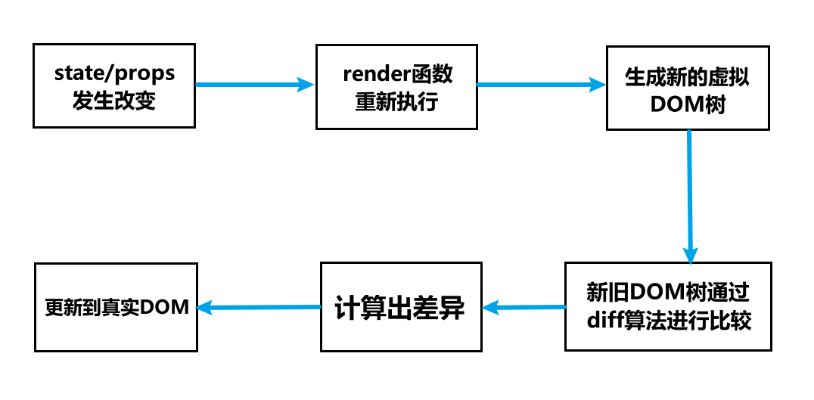
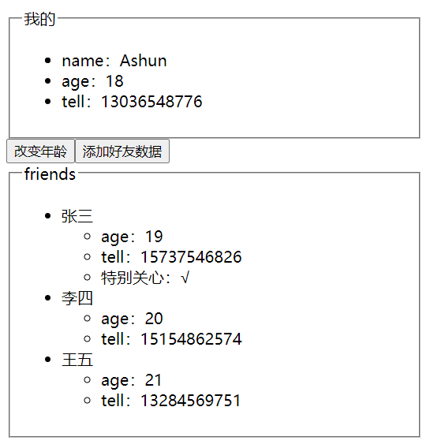

# React更新机制

之前我们已经学习了React的渲染流程：


那么更新流程是什么样的呢？

其实过程很容易梳理，之前我们已经学习了常用的生命周期钩子函数，其中就有触发更新的步骤，只不过没有涉及到具体的细节，现在我来梳理一下。

* props/state发生改变
* render函数重新执行
* 产生新的虚拟DOM树
* 新旧DOM树通过diff算法对比，并计算出差异
* 将差异部分更新到真实的DOM结构上



# Diff算法

通过上面的梳理过程，我们可得知：

​	React需要同时维护`两棵虚拟DOM树`：一棵用于映射当前的DOM结构，另一棵在React发生状态变更时，调用render函数生成。

​	然后React内部通过 `diff`算法，比较这两棵树的差异，决定是否需要修改DOM结构。但是在进行 diff算法比较时就会涉及到性能问题：

- 如果一棵树中的每个节点，都要参考另外一棵树进行**完全比较**，那么即使是最先进的算法，该算法的复杂程度为 O(n 3 )，其中 n 是树中元素的数量；
- 如果在 React 中使用了该算法，那么展示 1000 个元素所需要执行的计算量将在十亿的量级范围，很显然，**完全比较**策略很消耗性能。

于是，React对这个算法进行了优化，`只让同层节点进行比较`，不会跨层级比较。让时间复杂度大大降低为O(n)。

下文将通过实际情况，来理解Diff算法的工作机制👇

## 元素种类改变

在新旧DOM树的对比过程中，若发现一个元素的种类发生了改变，则React会：卸载原有元素及其子树(后代节点)，再按照更改后的数据构建一棵新的树。

例如：

* 当`<input/>`变成了`<button>`、`<article>`变成了`<div>`，或组件`<Detail>`变为了组件`<Comment>`等等类似情况，都会触发卸载、重新构建的过程。
* 由于会对这些节点进行卸载、重新构建，所以也会触发相应的生命周期钩子函数
  * 当元素卸载时，会触发：`componentWillUnmount`钩子函数
  * 当元素被重新构建时，就会挂载到页面，会依次触发：`componentWillMount`、`componentDidMount`钩子函数

例如新旧DOM树在对比时，处理了以下代码：

```
//旧DOM结构
<article>
	<Content />
</article>

//新DOM结构
<div>
	<Content />
</div>
```

diff算法会发现`<article>`变成了`<div>`，虽然其子节点(子组件)没有发生改变，但依旧会将 `article`及其子节点形成的树结构进行卸载，然后根据新的DOM结构重新构建。因此**Content组件，也会被卸载、重新构建**。


## 属性/props改变

在新旧DOM树的对比过程中，若一个元素的种类并没有改变，只是一些属性发生了改变，则React会：将旧树中的节点进行保留，只会更新改变的属性。

例如下面的代码更改：

- 通过比对这两个元素，React 只会修改 DOM 元素上的 `className` 属性；

```
<div className="before" title="stuff" />

<div className="after" title="stuff" />
```

>我们知道，React和Vue，在元素属性发生变更时的操作是类似的，都会将原有节点信息进行保留，只更新更改的属性部分。
>
>但值得注意的是：React和Vue在处理className变更时的操作是不同的。
>
>* Vue：如果前后节点类型不变，class属性发生了改变，依旧会认为是不同的节点，会销毁整个节点，从新构建。
>* React：对所有属性的处理都是一样的：如果前后节点类型不变，属性发生了改变，都会认为是同一个节点，保留原有节点，只更新改变部分。

再比如下面的代码更改：

- 当更新 `style` 属性时，React 仅更新有所改变的属性。
- 通过比对这两个元素，则只会更改 `color` 样式，不会再次修改 `fontWeight`。

```
<div style={{color: 'red', fontWeight: 'bold'}} />

<div style={{color: 'green', fontWeight: 'bold'} />
```

若发现**组件元素**种类，前后没有发生改变，只是props发生了变更：

- 组件也会被保留，React会更新该组件的props，并且调用`componentWillReceiveProps()` 和 `componentWillUpdate()` 方法；
- 下一步，调用 `render()` 方法，diff 算法将在之前的结果以及新的结果中进行递归；

## mutation的生成

前面我们讲解了：新旧DOM树在对比时，若元素种类、属性发生改变时，会有对应的更新操作。

事实上，当diff算法在遍历新旧DOM树时，若发现一个差异，就会生成一个mutation，进行相应的处理。

例如：在列表中插入一条数据

* 下例新旧DOM树对比过程中，只会生成一个mutation
* 原因：由于是在最后插入的数据，因此该操作**不会影响旧数据的顺序**。所以在`从左到右依次比对`的过程中，由于前两条数据没有发生改变，所以不会生成mutation进行处理。

```
<ul>
  <li>新闻</li>
  <li>娱乐</li>
</ul>

<ul>
  <li>新闻</li>
  <li>娱乐</li>
  <li>科技</li>
</ul>
```

但如果是在 起始位置 插入新的数据：

- React会对每一个子元素产生一个mutation。
- 原因：由于React在比对列表时，采用的是`自左向右依次比对`，由于在 起始位置 插入新的数据，该操作会影响旧列表数据的原有位置，导致每一次对比的过程中，都会发现不同，也就会依次生成mutation。

```
<ul>
  <li>新闻资讯</li>
  <li>娱乐动态</li>
</ul>

<ul>
	<li>娱乐动态</li>
  <li>新闻资讯</li>
  <li>体育频道</li>
</ul>
```

>这里依然对比一下Vue，React与Vue在遍历列表时的操作也是不同的：
>
>* Vue：采用的是`两端到中间的比对`
>* React：采用的是`自左向右依次比对`

显然，React这种`自左向右依次比对`的形式，在一些情况下也是很消耗性能的，我们可以通过`动态绑定key`，进行优化，下文将会讲解👇

# keys的优化

上文中（[mutation的生成](##mutation的生成)）我们了解到，React在处理列表信息时，某些情况下会生成大量不必要的mutation，导致资源的浪费。

与Vue类似：我们可以通过 `key` 属性的绑定，对目标元素进行标记，React会在对比过程中识别这个标记，**如果前后的key没有发生改变**，则就会保留这个元素的信息，不会对其进行卸载、重新创建。

我们还以 在列表中插入信息 进行示例：

```
import React, { Component } from "react";

export default class App extends Component {
  constructor() {
    super();
    this.state = {
      list: ["新闻资讯", "娱乐动态"],
    };
  }
  render() {
    return (
      <div id="max">
        <ul>
          {this.state.list.map((item, index) => (
            <li>{item}</li>
          ))}
        </ul>
        <button onClick={this.addItems.bind(this)}>添加数据</button>
      </div>
    );
  }
  addItems() {
    this.setState({
      list: [...this.state.list, "科技前沿"],
    });
  }
}
```

>	前面我们讲到了：当在列表末尾插入元素时，此时只会生成一个mutation，对于这种情况，绑定key前后，是没有差别的。因为该操作没有影响到原有数据的顺序。
>				
>	如果我们在展示列表时，没有设置key属性，React不论是否为上述情况，都会在控制台发出警告，如果不想看到这个警告信息，我们最好在遇到列表展示时就绑定上key属性。

​	上述代码是最理想的情况，如果我们在起始位置、中间位置插入数据，或等等一些列影响原有数据顺序的操作，尽管一些列表信息没有改变，但在对比的过程中依旧会生成大量mutation。

例如将上述代码进行更改：

```
addItems() {
  this.setState({
    // list: [...this.state.list, "科技前沿"],
    list: ["科技前沿", ...this.state.list],
  });
}
```

此时我们就可以动态的给列表元素绑定`key`属性，从而让React能够识别、保留。

## key属性的绑定

key属性的值，在理论上是可以随意绑定的，但在实际开发中，为了达到优化的效果，我们一定要**保证key的唯一性**

因为React在进行 新旧DOM树 对比时，如果对应位置的元素：

* 前后的key值没有改变，才会认为是同一个元素，将其保留
* key值发生了改变，则直接认为是不同元素，进行卸载、重新创建。

因此，在key值的绑定上，我有以下建议：

* **不要使用随机数**

  * 下一次render时，会重新生成一个数字，不能保证唯一性

* **不要使用index作为key**

  * 在一些增删操作时，会直接影响原有数据的index

  * 就以上述 在起始位置插入信息 的案例来讲，如果使用index绑定key，依然会导致每一个元素都会生成mutation

    ```
    "新闻资讯"(key==0)
    "娱乐动态"(key==1) 			 
    ```

    由于该操作会影响原有数据的顺序，而index就是表示数据位置的，原有数据的key都发生了改变，也就不会有优化效果。

    ```
    "科技前沿"(新增数据，会生成mutation)
    "新闻资讯"(key==1)
    "娱乐动态"(key==2)
    ```

    

# SCU解决无用更新

## 单组件无用更新

如果一个组件中的`状态1`只是用于内部维护，并不进行展示，我们希望`状态1`在变更时不会触发更新，因为这种更新对于用户来说是无用的。

但实际上在React中，不论组件中的状态是否绑定在视图中，只要使用setState进行变更，都会触发更新。对于上述情况来说，就会导致无用更新，浪费资源。

>这里与Vue不同，Vue内部已经帮我们做了优化，当没有与view绑定的state发生变更时，是不会触发更新机制的。

举个例子：

App组件中有两个状态：

* `title`与视图绑定
* `counter`只用于内部维护，不进行展示

但是每次点击按钮，只更新`counter`，依然会触发App组件的更新。从而执行render，打印出信息："App render"

```
import React, { Component } from "react";

export default class App extends Component {
  constructor() {
    super();
    this.state = {
      counter: 0,
      title: "Ashuntefannao",
    };
  }
  render() {
    console.log("App render");
    return (
      <div id="max">
        <h2>{this.state.title}</h2>
        <button onClick={this.addCounter.bind(this)}>counter+1</button>
      </div>
    );
  }
  addCounter() {
    this.setState({
      counter: this.state.counter + 1,
    });
  }
}
```


## 组件嵌套导致无用更新

在React中，默认情况下，如果祖先组件触发了更新，则不论后代组件是否依赖祖先组件的状态，后代组件都会更新。

在实际开发中，组件之间的嵌套可能会非常深，每一次根组件的更新，都会导致后代组件无条件更新，很显然会导致性能流失。

举一个例子：

App组件中除了自身结构外，还包含了`Header`、`Footer`组件，但是这两个子组件并不依赖App组件的状态，但App每次更新时，子组件也会无条件更新。

```
import React, { Component } from "react";

export default class App extends Component {
  constructor() {
    super();
    this.state = {
      counter: 0,
    };
  }
  render() {
    console.log("App render");
    return (
      <div id="max">
        <Header />
        <h2>counter：{this.state.counter}</h2>
        <button onClick={this.addCounter.bind(this)}>+1</button>
        <Footer />
      </div>
    );
  }
  addCounter() {
    this.setState({
      counter: this.state.counter + 1,
    });
  }
}

class Header extends Component {
  constructor() {
    super();
    this.state = {
      title: "Header",
    };
  }
  render() {
    console.log("Header render");
    return <header>{this.state.title}</header>;
  }
}
class Footer extends Component {
  constructor() {
    super();
    this.state = {
      title: "Footer",
    };
  }
  render() {
    console.log("Footer render");
    return <footer>{this.state.title}</footer>;
  }
}
```

当状态发生变更时，会触发更新机制，也就会执行更新过程中的所有钩子函数，这里我们只测试了render。当然，可自行添加更新过程中的任一钩子函数进行测试。

每当App组件中的按钮被点击时，App组件中的`state.counter`就会发生改变，从而导致**组件树**的更新。

上例代码，在每次点击按钮时，都会有三条打印结果，也验证了上述说法。

```
App render
Header render
Footer render
```

## SCU优化

前面我们讲解了组件产生 无用更新 的两种情况，我们怎么解决这个问题呢？

有两种方式：

* SCU钩子函数：`shouldComponentUpdate`
* PureComponent和memo

### shouldComponentUpdate

之前我们在学习React生命周期时，已经接触到了这个钩子函数，其就是用于解决无用更新情况的。

```
shouldComponentUpdate(nextProps, nextState)
```

该钩子函数会在redner前进行调用，接收两个参数，分别代表更新后的props/state，

我们可以让当前的`props/state`与`nextProps/nextState`进行比较，然后返回一个`Boolean`，决定是否执行render及其后续的钩子。

#### 解决单组件无用更新

由于只有`state.title`与视图绑定，所以我们只需要根据`title`是否发生改变，来决定是否触发更新即可

```
shouldComponentUpdate(nextProps, nextState) {
  if (nextState.title !== this.state.title) {
    return true;
  }
  return false;
}
```

#### 解决组件嵌套无用更新

其过程与 `解决单组件无用更新` 相同，但这里存在一些问题：

1. 函数组件没有生命周期钩子，也就不能使用SCU
2. 当组件嵌套数目很多时，我们就要为每一个后代class组件配置SCU，并且要在里面进行状态变更的判断，这个工作量非常巨大，过程非常的繁琐。

因此我们常常使用其它的方式，进行 无用更新情况 的优化，也就是下文中的`PureComponent`与`memo`

### PureComponent和memo

如果所有的类组件，我们都需要手动实现 shouldComponentUpdate，显然工作量巨大且繁琐。让我们回归SCU中各种判断的目的：判断props或state是否发生了改变，从而决定是否再次更新。

实际上，React已经考虑到了这一点，所以提供了`PureComponent`(纯组件)来完成这些判断的过程。

`PureComponent`的原理就是：让`oldProps/oldState`与`newProps/newState`进行浅层比较，如果新旧数据相同，则不再更新。

>React官方提到：之所以进行浅层比较，是为了性能考虑，当数据量较大时，使用深层比较或`JSON.stringify`形式进行转化，处理过程会消耗大量性能。

**用法**：我们只需要让class组件继承`PureComponent`即可。

我们继续沿用[组件嵌套导致无用更新](##组件嵌套导致无用更新)案例代码，将这些没有依赖父级状态的`纯组件`，继承`PureComponent`即可

```
……
class Header extends PureComponent {
  ……
}
class Footer extends PureComponent {
  ……
}
```

这时，点击App组件中的按钮时，就不会重新触发这些`纯组件`的更新机制了。

>值得注意的是，如果`非纯组件`继承了`PureComponent`，并且传入的props在之后发生了改变，则无论接收的props是否与视图绑定，也依旧会触发更新机制。
>
>例如：在App组件中向Header组件传入props，Header组件就不是纯组件了，因为依赖了父组件中的状态。

---

上面一直再说`class组件`如何解决，那如果是`函数组件`呢？

这时我们就需要使用一个高阶组件`memo`。

**用法**: memo是react包中的一个函数，其接收一个callback，我们就是通过这个callback，将函数组件转化为memo组件的。

我们依旧沿用[组件嵌套导致无用更新](##组件嵌套导致无用更新)案例代码，做出以下更改

```
import React, { Component, memo } from "react";

export default class App extends Component {
  constructor() {
    super();
    this.state = {
      counter: 0,
    };
  }

  render() {
    console.log("App render");
    return (
      <div id="max">
        <HeaderMemo />
        <h2>counter：{this.state.counter}</h2>
        <button onClick={this.addCounter.bind(this)}>+1</button>
        <FooterMemo />
      </div>
    );
  }
  addCounter() {
    this.setState({
      counter: this.state.counter + 1,
    });
  }
}

const HeaderMemo = memo(Header);
function Header() {
  console.log("Header render");
  return <header>Header</header>;
}

const FooterMemo = memo(function () {
  console.log("Footer render");
  return <footer>Footer</footer>;
});

```

同理，如果memo组件不是`纯组件`，依赖了父组件传入的props，并且传入的props在之后发生了改变：则无论接收的变量是否与视图进行绑定，都会导致组件重新触发更新，例如：在App组件中，向`HeaderMemo`组件传入props。

```
import React, { Component, memo } from "react";

export default class App extends Component {
  constructor() {
    super();
    this.state = {
      counter: 0,
    };
  }
  render() {
    console.log("App render");
    return (
      <div id="max">
     		 {/*向HeaderMemo传入props，HeaderMemo变为非纯组件*/}
        <HeaderMemo counter={this.state.counter} />	
        ……
      </div>
    );
  }
  addCounter() { …… }
}

const HeaderMemo = memo(Header);
function Header() {…}
```

`memo`的处理与`PureComponent`相同，都是让`oldProps/oldState`与`newProps/newState`进行浅层比较。

## 为什么要保持state的不可变性？

前面我们一直在说，不要直接修改state中的数据，其中一个原因是：React不能够监听这种行为，因此不会触发更新机制，需要使用setState进行更新。

之所以这样设计，还有一个非常重要的因素：为了让`PureComponent`与`memo`正常运行。

上文([SCU优化](##SCU优化))中，我们说道：`memo`与`PureComponent`的处理机制相同，都是让`oldProps/oldState`与`newProps/newState`进行浅层比较。

这就意味着，如果某个state是**引用类型**：而在setState时，传入的是 在原state基础上变更 的数据，由于是引用类型，在进行浅比较时，二者是相等的。

从而导致：`memo`与`PureComponent`认为数据没有发生变更，也就不会触发更新机制，如果数据与视图进行绑定，就代表用户看到的一直是旧数据。

我们用一个案例进行测试：👇



```
import React, { PureComponent } from "react";

export default class App extends PureComponent {
  constructor() {
    super();
    this.state = {
      profile: {
        name: "Ashun",
        age: 18,
        tell: "13036548776",
      },
      friends: [
        { name: "张三", age: 19, tell: 15737546826, 特别关心: "√" },
        { name: "李四", age: 20, tell: 15154862574 },
        { name: "王五", age: 21, tell: 13284569751 },
      ],
    };
  }

  render() {
    let { profile } = this.state;
    return (
      <div id="max">
        <fieldset name="my">
          <legend>我的</legend>
          <ul>
            <li>
              <li>name：{profile.name}</li>
            </li>
            <li>age：{profile.age}</li>
            <li>tell：{profile.tell}</li>
          </ul>
        </fieldset>
        <button onClick={this.subAge.bind(this)}>改变年龄</button>
        <button onClick={this.addFriend.bind(this)}>添加好友数据</button>
        <fieldset name="friends">
          <legend>friends</legend>
          <ul>
            {this.state.friends.map((friend) => {
              return (
                <li key={friend.tell}>
                  {friend.name}
                  <ul>
                    {Object.entries(friend).map(([key, val]) => {
                      return key !== "name" ? (
                        <li key={val}>
                          {key}：{val}
                        </li>
                      ) : (
                        false
                      );
                    })}
                  </ul>
                </li>
              );
            })}
          </ul>
        </fieldset>
      </div>
    );
  }
  subAge() {
    this.state.profile.age -= 1;
    this.setState({
      profile: this.state.profile,
    });
  }
  addFriend() {
    this.state.friends.push({
      name: "小明",
      age: 12,
      tell: 13845784925,
    });
    this.setState({
      friends: this.state.friends,
    });
  }
}
```

上述代码中 App组件 继承了 PureComponent，由于`profile`与`friends`都是引用类型，而在`setState`时，赋予的是 在原有数据基础上的更改，因此`oldState`与`newState`是同一个引用地址，在进行浅比较时，返回true，不会触发更新。

正确操作：我们要创建一个新的引用，不要在原有state的基础上更改

* 可以外部重新包裹一层`[]/{}`然后再展开赋值
* 也可以使用`[].conctat(arr)`或`Object.assign({},obj)`

```
subAge() {
  let profile = { ...this.state.profile };
  profile.age--;
  this.setState({
    profile,
  });
}
addFriend() {
  let friends = [].concat(this.state.friends);
  friends.push({
    name: "小明",
    age: 12,
    tell: 13845784925,
  });
  this.setState({
    friends,
  });
}
```

同样地，如果我们使用`shouldComponentUpdate(nextProps,nextState)`进行优化，如果直接判断新旧数据是相等，同样也是浅层判断，也会导致上述问题

```
shouldComponentUpdate(nextProps,nextState){
	if( nextState.friends !== this.state.friends ){
		return true;
	}
	return false;
}
```

