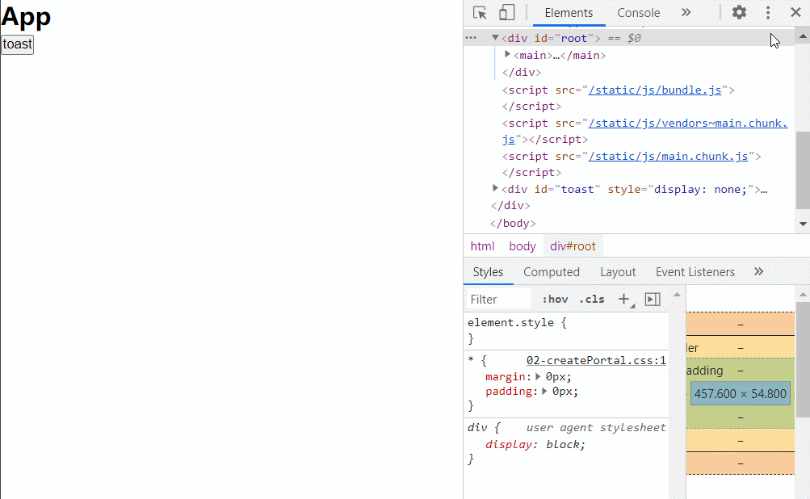
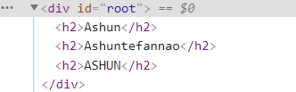
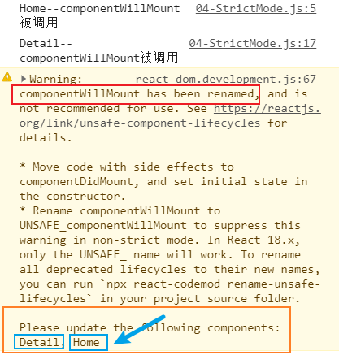
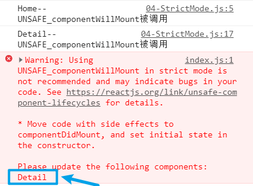
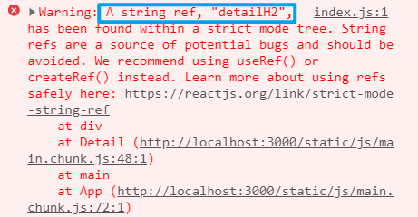

## Ref的转发

​	之前我们已经学习过了`ref`的使用，它被应用于在**class组件**中获取某个`DOM元素`或`组件对象`。

​	我们知道，**函数组件**默认情况下是不能够使用`ref`的：

* 因为函数组件没有实例，也就没有自身`this`所维护的状态，也就不能应用`ref`了（ref 的三种使用方式都要访问this）
* 因此在默认情况下，函数组件**标签**上不能绑定ref属性，React会报错。

​	但在实际开发中，我们可能需要在外部(父组件中)访问函数组件(子组件)中的某个DOM元素、组件对象。此时我们就可使用React内部提供的**高阶组件**`forwardRef`进行 Ref 的转发。

### forwardRef

```
let newComponent = forwardRef(Component);
```

之前学习函数组件时，我们知道：函数组件接受一个参数来访问外部传入的props。

而经过`forwardRef`处理所产生的新**函数组件**，能够通过第二个参数，去访问外部传入的`ref`变量。

使用步骤：

1. 函数组件经过`forwardRef`处理，生成新组件
2. 函数组件中通过第二个参数，在目标`DOM元素`、`组件标签`，上绑定`ref`属性
3. 在新组件标签中，绑定`ref`属性，从而转发到函数组件中。

**案例体验**

```
import React, { createRef, forwardRef, PureComponent } from "react";

//Child函数组件,经过forwardRef处理，能够接收第二个参数
function Child(props, ref) {
  return (
    <div id="child">
      <h2 ref={ref}>我是Child组件</h2>	{/* 在对应标签上绑定ref属性 */}
    </div>
  );
}
let ForwardRefChild = forwardRef(Child);

export default class App extends PureComponent {
  constructor() {
    super();
    this.h2RefApp = createRef();
    this.h2RefChild = createRef();	//用于函数组件的ref转发
  }
  render() {
    return (
      <main>
        <h2 ref={this.h2RefApp}>App</h2>
        {/* 经过forwardRef处理,能够在函数组件标签上绑定ref属性 */}
        <ForwardRefChild ref={this.h2RefChild} />
        <button onClick={this.getH2.bind(this)}>获取h2</button>
      </main>
    );
  }
  getH2() {
    console.log(this.h2RefApp.current);
    console.log(this.h2RefChild.current);
  }
}
```

## createPortal

我们知道，在进行组件化开发时，组件的内容会被渲染到其父组件当中，以此类推，逐步构成组件树。

但在一些情况下，我们希望某组件不被渲染在其父组件当中，而是独立的渲染到外部，此时我们就可以使用`ReactDOM`内部提供的`createPortal`功能函数完成。

- 第一个参数（`child`）是任何[可渲染的 React 子元素](https://link.juejin.cn/?target=https%3A%2F%2Fzh-hans.reactjs.org%2Fdocs%2Freact-component.html%23render)，例如一个元素，字符串或 fragment；
- 第二个参数（`container`）是一个 DOM 元素。
- 传入两个参数后，内部会将`child`转移到`container`中。

```
ReactDOM.createPortal(child, container)
```

>之前在学习Vue3时，接触到了`teleport`组件，通过`to`属性能将其包裹的内容传送到指定的元素下，属性值为css选择器，很是方便。
>
>* `ReactDOM`中的`createPortal`与Vue3中的`teleport`组件所完成的功能是一样的。

### 案例体验

我们封装一个简单的`toast`组件，来体验`ReactDOM.createPortal`的使用。

* `toast`组件是要弹出到页面的最顶层的，因此我们需要添加到`body`中。

**编写组件**

* `this.props.children`能够访问到组件中的各个子元素

```
import { PureComponent } from "react";
import { createPortal } from "react-dom";

export default class App extends PureComponent {
  constructor() {
    super();
    this.state = {
      isShow: false,
    };
  }
  toast() {
    return (
      <ToastAlert>
        <strong>Ashuntefannao</strong>
        <button
          onClick={() => {
            this.changeShow();
          }}
        >
          关闭
        </button>
      </ToastAlert>
    );
  }
  render() {
    return (
      <main>
        <h2>App</h2>
        <button
          onClick={() => {
            this.changeShow();
          }}
        >
          toast
        </button>
        {this.toast()}
      </main>
    );
  }

  changeShow() {
    let newShow = !this.state.isShow;
    this.setState({
      isShow: newShow,
    });
    document.querySelector("#toast").style.display = newShow ? `flex` : `none`;
  }
}

class ToastAlert extends PureComponent {
  constructor() {
    super();
    this.createToast();	//创建容器,并追加到body中
  }
  createToast() {
    this.toast = document.createElement("div");
    this.toast.id = "toast";
    this.toast.style.display = `none`;
    document.body.append(this.toast);
  }
  render() {
    return createPortal(this.props.children, this.toast);	//将ToastAlert各个子元素，转移到目标容器中
  }
}
```

**编写样式**

```
* {
  margin: 0px;
  padding: 0px;
}
#toast {
  width: 100vw;
  height: 100vh;
  position: fixed;
  top: 0;
  display: flex;
  justify-content: center;
  align-items: center;
  background-color: rgba(0, 0, 0, 0.5);
  backdrop-filter: blur(5px);
  color: white;
  font-size: 30px;
}
```

**最后效果**

* 最终`toast`组件被渲染到了`body`中。



## Fragment

​	我们知道，在组件所返回的`JSX`中，必须满足：**有且仅有一个根元素**。但有时最外层的根元素对于开发来说是没有实际意义的，反而不利于后期阅读、调试。

​	我们可以通过React内部提供的`Fragment`组件进行包裹，该组件是**虚拟的**，最终不会渲染到实际DOM上。

>Vue3中也有`Fragment`组件，且使用更加方便，如果开发者没有编写根元素，则会自动添加`Fragment`组件

**实际体验**



```
import { Fragment, PureComponent } from "react";

export default class App extends PureComponent {
  render() {
    return (
      <Fragment>
        <h2>Ashun</h2>
        <h2>Ashuntefannao</h2>
        <h2>ASHUN</h2>
      </Fragment>
    );
  }
}
```

## StrictMode

`StrictMode` (严格模式) 是一个React内置组件，**用来检测代码中是否存在潜在问题**。

* 使用`StrictMode`组件包裹的代码部分，如果存在这些潜在问题，React会抛出错误。
* 与 `Fragment` 一样，`StrictMode` 不会渲染任何可见的 UI；
* 严格模式检查仅在开发模式下运行，*它们不会影响生产构建*；

能够检测的潜在问题，主要包含：

* 使用不安全的、后期可能被废除的生命周期
* 使用过时的ref API（字符串形式）
* ……

**实际体验**

下例代码中，将用两个组件进行对比，Home是默认的组件，Detail是被`StrictMode`包裹的组件。通过不同的操作，观察`StrictMode`的作用。

### 使用不安全的生命周期

调用`componentWillMount`：

​	之前学习过程中我们知道，`componentWillMount`生命周期已经被重命名为`UNSAFE_componentWillMount`，不论某组件是否被`StrictMode`包裹，React都会发出警告，即使旧的生命周期钩子依旧能够被正常调用：



```
import { PureComponent, StrictMode } from "react";

class Home extends PureComponent {
  componentWillMount() {
    console.log(`${Home.name}--componentWillMount被调用`);
  }
  render() {
    return (
      <div id="home">
        <h2>我是Home组件</h2>
      </div>
    );
  }
}
class Detail extends PureComponent {
  componentWillMount() {
    console.log(`${Detail.name}--componentWillMount被调用`);
  }
  render() {
    return (
      <div id="detail">
        <h2>我是Detail组件</h2>
      </div>
    );
  }
}

export default class App extends PureComponent {
  render() {
    return (
      <main>
        <Home />
        <StrictMode>
          <Detail />
        </StrictMode>
      </main>
    );
  }
}
```

调用`UNSAFE_componentWillMount`：

* 普通组件在调用更名后的钩子函数`UNSAFE_componentWillMount`，不会发出警告
* 但使用`StrictMode`包裹的组件，使用`UNSAFE_componentWillMount`会直接报错
* 因为`UNSAFE_componentWillMount`React也已经不推荐使用了，即便它能被正常的调用



```
class Home extends PureComponent {
  UNSAFE_componentWillMount() {
    console.log(`${Home.name}--UNSAFE_componentWillMount被调用`);
  }
  render() {……}
}
class Detail extends PureComponent {
  UNSAFE_componentWillMount() {
    console.log(`${Detail.name}--UNSAFE_componentWillMount被调用`);
  }
  render() {……}
}
```

### 使用过时的ref API

之前学习`ref`的使用时，针对`ref`属性值的不同，我们介绍了三种方式：String形式、Object形式、Callback形式。

但String形式比较古老了，已经不推荐使用了，在严格模式`StrictMode`下，使用该形式会报错：



```
class Detail extends PureComponent {
  render() {
    return (
      <div id="detail">
        <h2 ref="detailH2">我是Detail组件</h2>
      </div>
    );
  }
}
```

