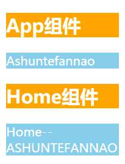
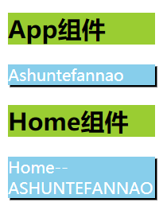
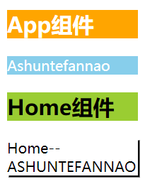
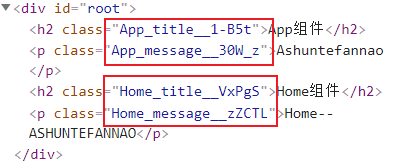

## 内联样式

内联样式是官方推荐的一种css样式的写法：

- `style` 接受一个采用**驼峰命名属性**的 JavaScript 对象，在其中编写各个样式属性
- 并且可以引用state中的状态与样式进行联动

### 优点

- 内联样式独立的绑定在标签上, 各元素样式之间不会有冲突
- 可以与state进行联动

### 缺点

虽然内联样式在编写上没有什么难度，但存在的缺点也很明显，所以官方依然建议内联样式和普通的CSS文件来结合编写。

- 大量的样式代码冗余在组件内部，比较臃肿、混乱。
- 某些样式无法编写 (比如伪类/伪元素)
- 某些样式属性没有提示

### 案例体验


```
import { Fragment, PureComponent } from "react";

export default class App extends PureComponent {
  constructor() {
    super();
    this.state = {
      pStyle: {
        color: "white",
        backgroundColor: "skyblue",
        textDecoration: `line-through`,
      },
    };
  }
  render() {
    const { pStyle } = this.state;
    return (
      <Fragment>
        <h2
          style={{
            color: "white",
            backgroundColor: "orange",
            borderRadius: "10px",
          }}
        >
          App组件
        </h2>
        <p style={pStyle}>Ashuntefannao</p>
        <button onClick={this.changeStyle.bind(this)}>改变颜色</button>
      </Fragment>
    );
  }
  changeStyle() {
    let pStyle = Object.assign(
      { ...this.state.pStyle },
      {
        color: "#e74c3c",
      }
    );
    this.setState({
      pStyle,
    });
  }
}
```

## 引入CSS文件

最普通的网站开发形式，就是编写独立的css文件再进行引入，当然，在React中也可以。

### 优点

* 与传统网页开发形式一致，容易编写、理解。
* CSS样式在独立的文件中，不会让组件代码过于臃肿

### 缺点

由于涉及到了组件化开发，所以缺点也显而易见：

**样式层叠**

* 在组件化开发中我们总是希望组件是一个独立的模块，样式也只是在组件内部生效，不会影响其它组件
* 但是普通的css都属于全局的css，样式之间会相互影响、层叠；
* 为了保证某组件的样式是唯一的，我们可能需要设置大量特殊的id、class来进行锁定，但即便如此，实际开发中也不一定能保证样式的唯一性，因为在团队开发中，大家设置的id、class名称也可能会重复。

**不能与state联动**

* 涉及到一些样式的动态转变，有时需要与组件中的 state 进行绑定，但这种引入CSS文件的形式将不能做到。

### 案例体验

**App.js**

```
import { Fragment, PureComponent } from "react";
import "./App.css";
import Home from "./Home/Home.js";

export default class App extends PureComponent {
  render() {
    return (
      <Fragment>
        <h2>App组件</h2>
        <p>Ashuntefannao</p>
        <Home />
      </Fragment>
    );
  }
}
```

**Home.js**

```
import { Fragment, PureComponent } from "react";

import "./Home.css";
export default class Home extends PureComponent {
  render() {
    return (
      <Fragment>
        <h2>Home组件</h2>
        <p>Home--ASHUNTEFANNAO</p>
      </Fragment>
    );
  }
}
```

**App.css**

若只是单独引入App.css，则只有该样式表生效



```
h2 {
  color: white;
  background-color: orange;
}
p {
  color: white;
  background-color: skyblue;
}
```

**Home.css**

引入Home.css后，样式之间相互层叠：



```
h2 {
  color: black;
  background-color: yellowgreen;
}
p {
  color: white;
  box-shadow: 2px 2px black;
}
```

## CSSModules

`CSS Modules`并不是React特有的解决方案，这种技术早已被应用于CSS模块化，所有应用了类似于webpack配置环境下都可以使用。

但是，如果在其他项目中使用`CSS Modules`，我们需要自己来进行配置，比如配置webpack.config.js中的`modules: true`等。

**而React脚手架已经内置了CSS Modules的配置**，我们直接使用即可。

### 使用步骤

1. `.css`、`.less`、`.scss` 等样式文件后缀名，都修改成 `.module.css`、`.module.less`、`.module.scss` 等
2. **CSS样式，统一应用class类名来进行编写和使用。**

### 案例体验

我们继续应用使用[上文](##引入CSS文件)的案例，不同的是：我们要应用`CSS Modules`解决样式污染的问题。

#### 1.更改后缀名

将`xxx.css`更改为`xxx.module.css`，再重新引入即可。

但是我们发现，目前没什么作用：


这也是值得我们注意的一点，之所以没有效果，是因为我们没有**统一的使用class类名进行样式的编写**，而`CSS Modules`就是生成一个独一无二的`class`的名字，不会与其他选择器重名，从而达到不污染其它元素样式的目的。

#### 2.编写.module.css

我们必须统一的使用class类名进行样式的编写，后期也要将其动态的绑定。

**App.module.css**

```
.title {
  color: white;
  background-color: orange;
}
.message {
  color: white;
  background-color: skyblue;
}
```

**Home.module.css**

```
.title {
  color: black;
  background-color: yellowgreen;
}
.message {
  color: black;
  box-shadow: 2px 2px black;
}
```

#### 3.绑定className

* 引入对应的`.module.css`文件

  ```
  import Styles from "xxx.module.css";	//引入对应
  ```

* 动态绑定`className`

  ```
  <tag className={Styles.className} />
  ```

**App.js**

```
import { Fragment, PureComponent } from "react";

import AppStyle from "./App.module.css";	//引入对应的.module.css文件
import Home from "./Home/Home.js";

export default class App extends PureComponent {
  render() {
    return (
      <Fragment>
      	{/* 通过AppStyle.className绑定对应的样式类	*/}
        <h2 className={AppStyle.title}>App组件</h2>
        <p className={AppStyle.message}>Ashuntefannao</p>
        <Home />
      </Fragment>
    );
  }
}
```

**Home.js**

```
import { Fragment, PureComponent } from "react";

import HomeStyle from "./Home.module.css";
export default class Home extends PureComponent {
  render() {
    return (
      <Fragment>
        <h2 className={HomeStyle.title}>Home组件</h2>
        <p className={HomeStyle.message}>Home--ASHUNTEFANNAO</p>
      </Fragment>
    );
  }
}
```

#### 效果

虽然在两个文件中，编写了相同的类名样式，但并没有产生冲突：



让我们打开控制台观察：



发现`CSS Modules`自动化生成了**唯一的class类名**，因此也就不会造成样式污染。

### 优缺点

`CSS Modules`在保证css被抽离到单独文件的同时，还解决了样式污染的问题，是很多人喜欢在React中应用的方案。

但是这种方案也有自己的缺陷：

- 所有样式，必须统一的使用class类名进行样式的编写
- 使用的class样式类名，不能使用`-`连接符(.home-title)，在JavaScript中是不识别的
- 不方便动态来修改某些样式，此时依然需要使用内联样式的方式；

---

综合来看，我们可以使用`CSS Modules`+内联样式，联合编写。

当然，我们还有其他的解决方案，之后文章会进行介绍(`CSS in JS`)。

