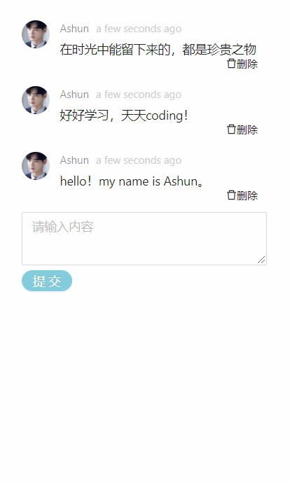
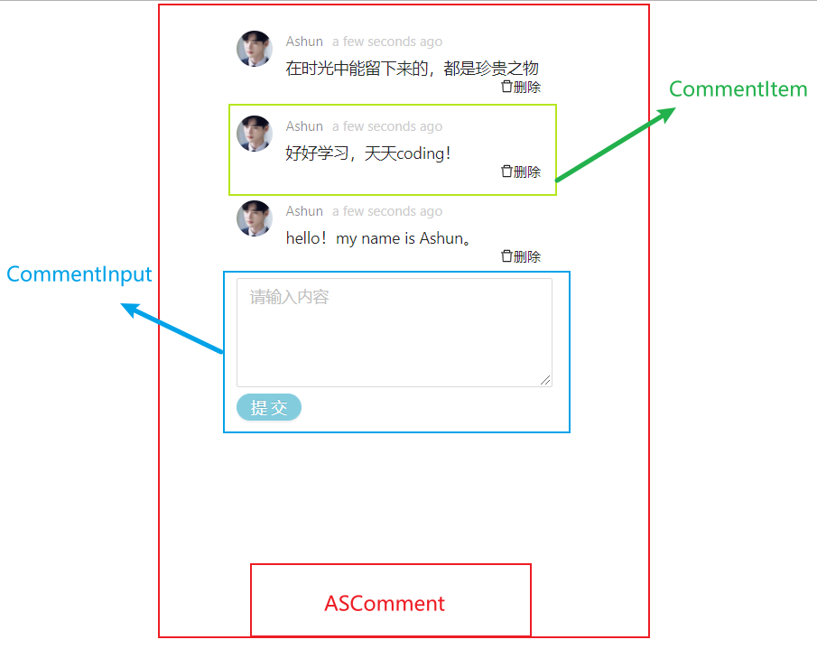
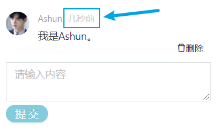
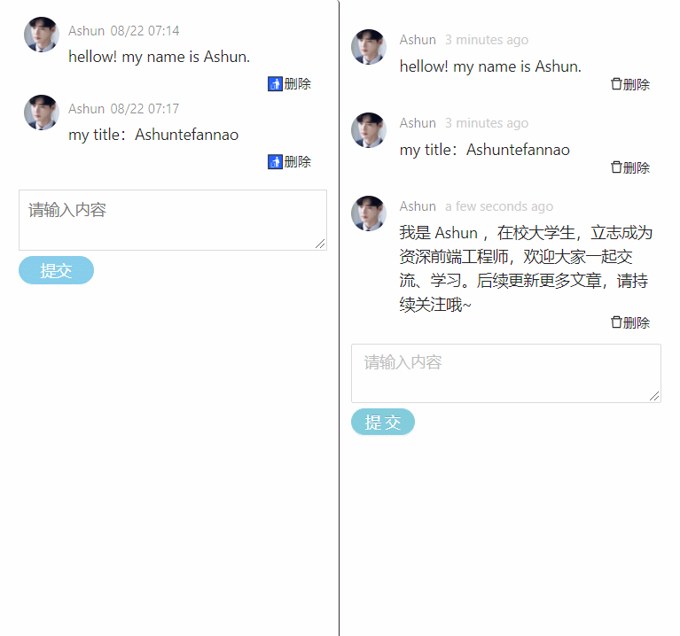

利用`antd`中的组件，完成一个评论区demo，如图所示：



## 组件结构

在写代码之前，我们先要理清各个组件之间的关系，然后根据不同的功能模块，封装成不同的组件。

* ASCommpent
  * CommentInput
  * CommentItem



## 编写代码

### ASCommpent

* 挂载两个子组件
* 维护`comments`状态

```
import { PureComponent } from "react";
import styled from "styled-components";
import CommentItem from "./CommentItem";
import CommentInput from "./CommentInput";

//简单样式编写
const StyleWrapper = styled.div`
  width: 300px;
  padding: 10px;
  border-radius: 3px;
`;

export default class ASComment extends PureComponent {
  constructor(props) {
    super(props);
    this.state = {
      comments: [],
    };
  }
  render() {
    const { comments } = this.state;
    return (
      <StyleWrapper id="ASComment">
        <CommentItem
          comments={comments}
          deleteComment={this.deleteComment.bind(this)}
        />
        <CommentInput submitComment={this.submitComment.bind(this)} />
      </StyleWrapper>
    );
  }
  //提交评论
  submitComment(content) {
    let newComments = [...this.state.comments];
    let time = Date.now();
    newComments.push({
      id: time,
      avatar:"imagePath",
      author: "Ashun",
      content,
      datetime: time,
    });
    this.setState({
      comments: newComments,
    });
  }
  //删除评论
  deleteComment(index) {
    let newComments = [...this.state.comments];
    newComments.splice(index, 1);
    this.setState({
      comments: newComments,
    });
  }
}
```

### CommentInput

使用的`antd`组件：`Input.TextArea`、`Button`

* 将`Input.TextArea`设置为受控组件
* 点击按钮，执行父组件的提交逻辑。

```
import { PureComponent } from "react";
import { Button, Input } from "antd";
import styled from "styled-components";

const StyleWrapper = styled.div`
  margin-top: 10px;
  position: relative;
  button {
    margin: 5px;
    position: relative;
    bottom: 0px;
    right: 5px;
  }
`;
export default class CommentInput extends PureComponent {
  constructor(props) {
    super(props);
    this.state = {
      content: "",
      placeholder: "请输入内容",
    };
  }
  render() {
    const { content, placeholder } = this.state;
    return (
      <StyleWrapper id="CommentInput">
        <Input.TextArea
          value={content}
          onChange={(e) => this.handleChange(e)}
          placeholder={placeholder}
          rows={2}
        />
        <Button
          onClick={() => this.submitComment()}
          type="primary"
          size="small"
          shape="round"
        >
          提交
        </Button>
      </StyleWrapper>
    );
  }
  handleChange(event) {
    this.setState({
      content: event.target.value,
    });
    console.log(this.state.content);
  }
  submitComment() {
    this.props.submitComment(this.state.content);
    this.setState({
      content: "",
    });
  }
}
```

### CommentItem

使用的`antd`组件：`Comment`、`Tooltip`、图标库

* 点击删除按钮，执行父组件的删除逻辑。
* `Comment`组件常用属性
  * author：用户名
  * avatar：用户头像
  * content：评论内容
  * datetime：时间
* 关于datetime属性，这里又在其中插入了`Tooltip`组件，默认展示距离当前的时间，当鼠标 hover 时，会有提示气泡显示具体的时间。
* 时间的显示，使用了`moment`库，便于使用。

```
import { PureComponent } from "react";
import { Comment, Tooltip } from "antd";
import { DeleteOutlined } from "@ant-design/icons";
import styled from "styled-components";
import moment from "moment";

const StyleWrapper = styled.div`
  position: relative;
  span.delete {
    font-size: 12px;
    position: absolute;
    bottom: 0px;
    right: 10px;
  }
`;
export default class CommentItem extends PureComponent {
  render() {
    const { comments } = this.props;
    return (
      <StyleWrapper id="CommentItem">
        {comments.map((item, key) => (
          <Comment
            key={item.id}
            author={item.author}
            avatar={item.avatar}
            content={item.content}
            datetime={
              <Tooltip
                title={moment(item.datetime).format("YYYY-MM-DD HH:mm:ss")}
              >
                {/* 评论距离当前的时间 */}
                <span>{moment(item.datetime).fromNow()}</span>
              </Tooltip>
            }
          >
            <span
              className="delete"
              onClick={() => {
                this.deleteComment(key);
              }}
            >
              <DeleteOutlined />
              删除
            </span>
          </Comment>
        ))}
      </StyleWrapper>
    );
  }
  deleteComment(index) {
    this.props.deleteComment(index);
  }
}
```

`moment`时间库默认显示为英文，如果想显示中文，在入口文件全局设置`moment`时区即可。



```
//index.js
import "moment/locale/zh-cn";//中国时区
```

## 原生React实现

后面我又使用原生React实现了一下，其实过程和上文一样，只不过组件需要自己封装、样式需要我们自己调，真正的逻辑代码是没有区别的。

最终实现效果对比（左侧原生React实现）：



### ASCommpent

`ASCommpent`是评论功能的根组件，实现过程与上文一模一样，因为该组件只是用于：

* 挂载两个子组件
* 维护`comments`状态

### CommentInput

**样式代码**

```
import styled from "styled-components";
const StyleWrapper = styled.div`
  margin-top: 10px;
  textarea {
    width: 100%;
    outline: none;
    border-color: #ddd;
    padding: 5px 8px;
    &:focus {
      border: 1px solid skyblue;
    }
  }
  button {
    padding: 2px 20px;
    color: white;
    border-radius: 25px;
    border: none;
    background-color: skyblue;
  }
`; 
export default StyleWrapper ;
```

**逻辑代码**

```
import { PureComponent } from "react";
import StyleWrapper from "./CommentInputStyled.js";

export default class CommentInput extends PureComponent {
  constructor(props) {
    super(props);
    this.state = {
      content: "",
      placeholder: "请输入内容",
    };
  }
  render() {
    const { content, placeholder } = this.state;
    return (
      <StyleWrapper id="CommentInput">
        <div className="inputBox">
          <textarea
            value={content}
            onChange={(e) => this.handleChange(e)}
            placeholder={placeholder}
            rows={2}
          />
        </div>
        <button onClick={() => this.submitComment()}>提交</button>
      </StyleWrapper>
    );
  }
  handleChange(event) {
    this.setState({
      content: event.target.value,
    });
    console.log(this.state.content);
  }
  submitComment() {
    this.props.submitComment(this.state.content);
    this.setState({
      content: "",
    });
  }
}
```

### CommentItem

**样式代码**

```
import styled from "styled-components";
const StyleWrapper = styled.div`
  padding: 5px 5px;
  header {
    width: 100%;
    display: flex;
    flex-direction: row;
    overflow: hidden;
    .avatar {
      height: 32px;
      width: 32px;
      margin-right: 8px;
      border-radius: 50%;
      overflow: hidden;
      img {
        width: 100%;
      }
    }
    .info {
      flex: 1;
      color: rgba(0, 0, 0, 0.45);
      .author {
        font-size: 12px;
        margin-right: 5px;
      }
      .datetime {
        font-size: 12px;
      }
    }
  }
  main {
    margin-top: -8px;
    padding: 0px 0px 5px 40px;
    width: 100%;
    p {
      margin: 0px;
    }
  }
  footer {
    width: 100%;
    height: 20px;
    position: relative;
    font-size: 12px;
    .delete {
      line-height: 20px;
      width: 50px;
      height: 100%;
      position: absolute;
      right: 5px;
      text-align: center;
    }
  }
`;
export default StyleWrapper ;
```

**逻辑代码**

```
import moment from "moment";
import { PureComponent } from "react";
import StyleWrapper from "./CommentItemStyled.js";

export default class CommentItem extends PureComponent {
  render() {
    const { comments } = this.props;
    return (
      <StyleWrapper id="CommentItemWrapper">
        {comments.map((item, key) => {
          return (
            <div className="CommentItems" key={item.id}>
              <header>
                <div className="avatar">
                  
                </div>
                <div className="info">
                  <span className="author">{item.author}</span>
                  <span className="datetime">
                    {moment(item.datetime).format("MM/DD hh:mm")}
                  </span>
                </div>
              </header>
              <main>
                <p className="content">{item.content}</p>
              </main>
              <footer>
                <div className="delete" onClick={() => this.deleteComment(key)}>
                  🚮删除
                </div>
              </footer>
            </div>
          );
        })}
      </StyleWrapper>
    );
  }
  deleteComment(index) {
    this.props.deleteComment(index);
  }
}
```

