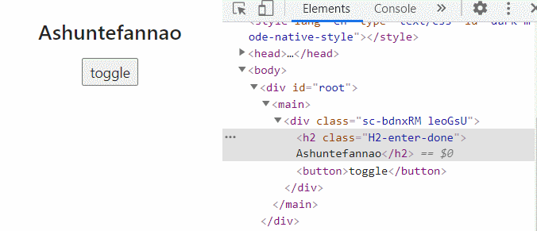
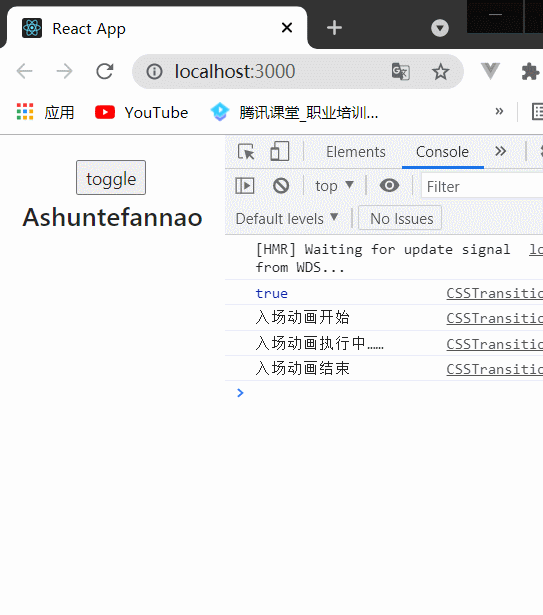
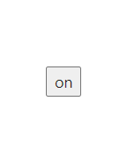
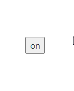
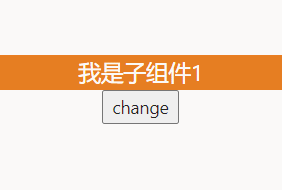
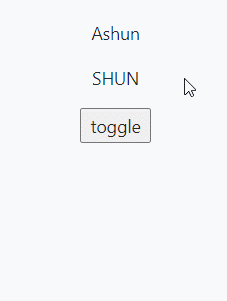
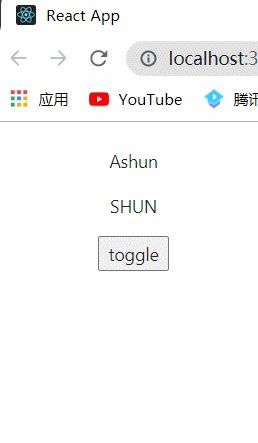
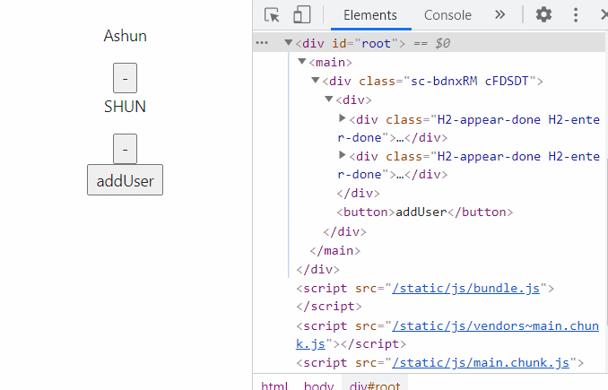
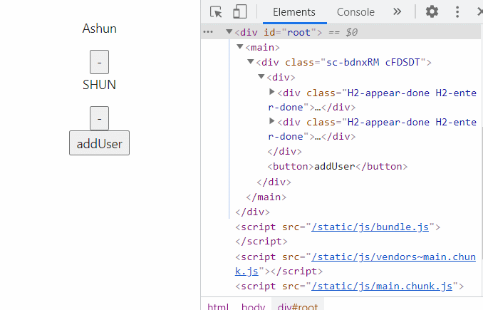

## 了解react-transition-group

React曾为开发者提供过动画插件 `react-addons-css-transition-group`，后由社区维护，形成了现在的 `react-transition-group`。

**该库可以让我们很方便的实现组件的** `入场` 和 `离场` **动画**，使用之前需要进行安装，且该库本身非常小，不会为我们应用程序增加过多的负担。：

```
# npm
npm install react-transition-group --save
# yarn
yarn add react-transition-group
```

在开发时，实际上就是应用该库中的组件，主要包含四个组件：

- **Transition**
  - 该组件是一个和平台无关的组件（不一定要结合CSS）；
  - 在前端开发中，我们一般是结合CSS来完成样式，所以比较常用的是CSSTransition👇；
- **CSSTransition**
  - 在前端开发中，通常使用CSSTransition,结合CSS来完成过渡动画效果
- **SwitchTransition**
  - 两个组件显示和隐藏切换时，使用该组件
- **TransitionGroup**
  - 将多个动画组件包裹在其中，一般用于列表中元素的动画；

## CSSTransition

CSSTransition执行过程中，有三个状态：**appear**、**enter**、**exit**，需要在对应的**类名**下，定义对应的CSS样式：

- `appear`初始状态动画：对应的类是 -appear、-appear-active、appear-done；
- `enter`入场动画：对应的类是 -enter、-enter-active、-enter-done；
- `exit`离场动画：对应的类是 -exit、-exit-active、-exit-done；

**动画时机**：

* `-appear`、`-enter`、`-exit`这三种类名，分别对应在初始状态、入场、离场，在那一刻的样式，**是三种状态的初始样式**
* 同理，`-xxx-done`，是三种状态的结束样式。
* 而`-xxx-active`,是过渡过程中的目标样式。

**基本使用步骤梳理**：

1. 引入CSSTransition组件
2. 使用该组件，将需要执行动画的**一个**`HTML元素/组件`进行包裹
3. 配置需要的`属性`和`钩子`
4. 编写对应的CSS

### 常用属性

#### in

`<CSSTransition in={Boolean}>…`

该属性值为Boolean，CSSTransition 就是根据该属性判断是否进入/离开组件，从而执行对应的动画。

* 当`in=true`时，代表进入该组件，会为该组件添加对应的**类名**，执行入场动画，反之代表离开组件，执行离场动画。

为了能够锁定对应的类名，我们会通过classNames属性定义👇

#### classNames

`<CSSTransition classNames={"className"}>…`

该属性决定了在编写css时，对应的class前缀名称

例如将该属性定义为`"card"`：

```
<CSSTransition classNames={"card"} …>
	……
</CSSTransition>
```

则在css中对应入场动画过程的类名为：card-enter、card-enter-active、card-enter-done；

其他状态对应的class类名同理，只需加上对应的前缀即可。

#### timeout

过渡动画的时间(`ms`)，**若想有过渡的效果，必须设置该属性**。如果你只在css中设置了过渡的时间，但没有为`CSSTransition`设置`timeout`属性，也是没有过渡效果的。

**原因**：

​	前面已经说过，`CSSTransition`会在不同的状态下，为该组件添加对应的类名，而`timeout`属性，直接决定某状态动画在**过渡过程**中对应类名(`-xxx-active`)的持续时间。

例如设置 timeout 为 600：

```
<CSSTransition timeout ={600} …>
	……
</CSSTransition>
```

则在执行exit状态动画时，类名操作过程如下(其他状态动画同理)：

1. 添加`-exit`、`-exit-active`
2. 等待 600ms 后，移除`-exit`、`-exit-active`两个类名
3. 立即添加`-exit-done`

#### unmountOnExit

`<CSSTransition unmountOnExit={Boolean}>…`

该属性值为Boolean，CSSTransition 会根据该属性判断离开组件时**是否卸载被包裹的DOM元素**，默认状态下为`false`不会卸载。

🕳**对动画的影响**：

* 如果`in`的初始值为`false`,则代表一开始为离场状态。
* 若不设置`unmountOnExit`为`true`，则默认不会卸载被包裹的DOM元素，这些元素依然会显示。

#### appear

`<CSSTransition appear={Boolean}>…`

该属性值为Boolean，若设置为`true`，则可以在css样式中，配置类名为：`-appear`、`-appear-active`、`-appear-done`对应的动画，并且这些动画在组件**初始状态**执行。

- 当`in`、`appear`属性值都为`true`，并且编写了对应的样式，则组件在**初始状态**或**页面刷新**时能够执行对应的动画

### 常用钩子

这些钩子函数，将在对应时机回调执行，且回调函数接收`el`参数，能够访问被包裹(执行动画)的元素。

| name       | description        |
| ---------- | ------------------ |
| onEnter    | 入场动画开始时回调 |
| onEntering | 入场动画执行中回调 |
| onEntered  | 入场动画结束时回调 |
| onExit     | 离场动画开始时回调 |
| onExiting  | 离场动画执行中回调 |
| onExited   | 离场动画结束时回调 |

### 案例体验






App.js

```
import { Fragment,PureComponent } from "react";

import { CSSTransition } from "react-transition-group";
import "./CSS/App.css";

import styled from "styled-components";
const StyledWrapper = styled.div`
  padding: 20px;
  text-align: center;
`;

export default class App extends PureComponent {
  constructor() {
    super();
    this.state = { isShow: true };
  }
  render() {
    let { isShow } = this.state;
    console.log(isShow);
    return (
      <StyledWrapper>
        <button onClick={() => this.changeShow()}>toggle</button>
        <CSSTransition
          in={isShow}
          classNames="H2"
          timeout={800}
          unmountOnExit	//这些属性值为Boolean的属性，直接绑定即为true
          appear
          onEnter={(el) => {
            console.log("入场动画开始");
          }}
          onEntering={(el) => {
            console.log("入场动画执行中……");
          }}
          onEntered={(el) => {
            console.log("入场动画结束");
          }}
          onExit={(el) => {
            console.log("离场动画开始");
          }}
          onExiting={(el) => {
            console.log("离场动画执行中……");
          }}
          onExited={(el) => {
            console.log("离场动画结束");
          }}
        >
          <h2>Ashuntefannao</h2>
        </CSSTransition>
      </StyledWrapper>
    );
  }
  changeShow() {
    this.setState({ isShow: !this.state.isShow });
  }
}
```

App.css

```
.H2-enter,
.H2-appear {
  opacity: 0;
  transform: scale(0) rotate(0deg);
}
.H2-enter-active,
.H2-appear-active {
  opacity: 1;
  transform: scale(1) rotate(360deg);
  transition: 800ms;
}
.H2-enter-done,
.H2-appear-done {
  opacity: 1;
  transform: scale(1);
}
.H2-exit {
  opacity: 1;
  transform: scale(1) rotate(360deg);
}
.H2-exit-active {
  opacity: 0;
  transform: scale(0) rotate(0deg);
  transition: 800ms;
}
.H2-exit-done {
  opacity: 0;
  transform: scale(0) rotate(0deg);
}
```

## SwitchTransition

### 使用过程

`SwitchTransition`可以完成两个组件之间进行切换的动画：

- 比如我们有一个按钮需要在on和off之间切换，我们希望看到on先从左侧退出，off再从右侧进入；
- 这个动画在 vue 中被称之为 vue transition modes；
- react-transition-group中使用SwitchTransition来实现该动画；

`SwitchTransition`中主要有一个属性：mode，有两个值

- in-out：表示新组件先进入，旧组件再移除；
- out-in：表示旧组件先移除，新组件再进入；

**如何使用SwitchTransition呢？**

- SwitchTransition组件里面要有CSSTransition或者Transition组件，不能直接包裹你想要切换的组件；
- SwitchTransition里面的CSSTransition或Transition组件不再像以前那样接受in属性来判断元素是何种状态，取而代之的是key属性
  - 关于key属性，其值只要能够在组件切换时，有不同的值进行标识即可。若key一直不变，则没有动画过渡效果

### 案例体验

#### 切换按钮内容

由该案例可以得知：`SwitchTransition`不只是能够实现组件之间的切换，也能够对单独的组件实现来回切换的动画效果。

mode默认值为：`"out-in"`



```
import { PureComponent } from "react";

import { CSSTransition, SwitchTransition } from "react-transition-group";
import "./CSS/SwitchTransition.css";

export default class App extends PureComponent {
  constructor() {
    super();
    this.state = {
      isChange: true,
    };
  }
  render() {
    const { isChange } = this.state;
    return (
      <div>
        <SwitchTransition mode="in-out">
          <CSSTransition
            key={isChange ? "in" : "out"}
            timeout={500}
            classNames="btn"
          >
            <button onClick={() => this.setState({ isChange: !isChange })}>
              {isChange ? "on" : "off"}
            </button>
          </CSSTransition>
        </SwitchTransition>
      </div>
    );
  }
}
```

若设置`mode:"in-out"`,同样的CSS样式会产生不同的效果：



#### 切换组件



```
export default class App extends PureComponent {
  constructor() {
    super();
    this.state = {
      isChange: true,
    };
  }
  render() {
    const { isChange } = this.state;
    return (
      <div>
        <SwitchTransition mode="in-out">
          <CSSTransition
            key={isChange ? "in" : "out"}
            timeout={500}
            classNames="btn"
          >
            {this.currentChild()}
          </CSSTransition>
        </SwitchTransition>
        <button onClick={() => this.setState({ isChange: !isChange })}>
          change
        </button>
      </div>
    );
  }
  currentChild() {
    return this.state.isChange ? <Child1/> : <Child2/>;
  }
}
```

## TransitionGroup

### 问题的产生

当我们循环遍历动态的渲染动画组件时，这时你会发现，动画失效了：



```
import { PureComponent } from "react";
import { CSSTransition, TransitionGroup } from "react-transition-group";

import "./CSS/CSSTransition.css";
import styled from "styled-components";
const StyledWrapper = styled.div`
  padding: 20px;
  text-align: center;
`;

export default class TransitionGroupAnimate extends PureComponent {
  constructor() {
    super();
    this.state = { users: ["Ashun", "SHUN"] };
  }
  render() {
    return (
      <StyledWrapper>
        {this.state.users.map((item, index) => {
          return (
            <CSSTransition key={index} classNames="H2" timeout={800} appear>
              <p>{item}</p>
            </CSSTransition>
          );
        })}
        <button onClick={() => this.addUser()}>toggle</button>
      </StyledWrapper>
    );
  }
  addUser() {
    let newUsers = [...this.state.users];
    newUsers.push("ASHUN");
    this.setState({ users: newUsers });
    console.log(this.state.users);
  }
}
```

这时就可使用**TransitionGroup**

- 将多个动画组件包裹在其中，一般用于列表中元素的动画；

### 使用过程

1. 将多个`CSSTransition`动画组件，包裹在`TransitionGroup`中
2. 并且此时在应用`CSSTransition`时，有一些注意点：
   * **不需要配置**`in`、`unmountOnExit`**属性**，**当列表元素被移除时，会自动执行离场动画**

**示例**



```
import { CSSTransition, TransitionGroup } from "react-transition-group";
……
render() {
  return (
    <StyledWrapper>
      <TransitionGroup>
      {this.state.users.map((item, index) => {
        return (
          <CSSTransition key={index} classNames="H2" timeout={800} appear>
            <p>{item}</p>
          </CSSTransition>
        );
      })}
      </TransitionGroup>
      <button onClick={() => this.addUser()}>toggle</button>
    </StyledWrapper>
  );
}
……
```

### 关于key的绑定

#### 正确操作

上述案例只涉及到了列表元素的添加，现在我们来体验一下列表元素移除时动画展示的情况。

* 添加`removeItem`方法，并为每个元素添加按钮，绑定该方法。
* 保持`key`的一致性
  * 上文中是直接使用`index`绑定 key 的，由于没有涉及元素的移除，所以目前是没有问题的，但我们知道，使用`index`绑定key是一个错误的做法，这样不能保持key的一致性。
  * 基于上文案例，即使使用`item`绑定key，也不能保持key的一致性，因为每次添加的元素内容都一样。所以本案列修改了`addUser`方法，使每次追加的内容不同，从而保持key的一致性。

做了以上操作，动画展示无误：



```
……
export default class TransitionGroupAnimate extends PureComponent {
  constructor() {
    super();
    this.state = { users: ["Ashun", "SHUN"] };
  }
  render() {
    return (
      <StyledWrapper>
        <TransitionGroup>
          {this.state.users.map((item, index) => {
            return (
              <CSSTransition key={item} classNames="H2" timeout={800} appear>
                <div>
                  <p>{item}</p>{" "}
                  <button onClick={() => this.removeItem(index)}>-</button>{" "}
                </div>
              </CSSTransition>
            );
          })}
        </TransitionGroup>
        <button onClick={() => this.addUser()}>addUser</button>
      </StyledWrapper>
    );
  }
  addUser() {
    let newUsers = [...this.state.users];
    let id = Date.now().toString().substr(-5, 5);
    newUsers.push(`ASHUN${id}`);
    this.setState({ users: newUsers });
    console.log(this.state.users);
  }
  removeItem(index) {
    let newUsers = [...this.state.users];
    newUsers.splice(index, 1);
    this.setState({ users: newUsers });
  }
}
```

#### BUG出现

但如果，我们没有保持 key 的一致性，使用`index`绑定 key，会不会影响动画呢？

* 虽然移除的元素是正确的，但目标元素并没有执行离场动画，每次都是最后一个元素执行离场动画



```
……
<CSSTransition key={index} classNames="H2" timeout={800} appear>
……
```

#### 原因分析

从代码层面上看来，原因很简单，就是key值没有保持唯一性，但从结果来看，为什么每次都是最后一个元素执行离场动画？

​	其实这就涉及到React内部 virtual DOM tree 的比较了，当状态发生变更时，会触发更新机制，此时会产生一个新的虚拟DOM树，并与旧的虚拟DOM树进行比较，React采用的比较方式是从左到右依次比较，而Vue是从两端到中间进行比较。比较的过程的核心就是 diff 算法。

​	我们来模拟一下 React 内部的比较过程，由于我们绑定了 key ，所以会直接比较 key 值：

* 若前后key值不变，则继续应用旧的元素，反之进行销毁，重新创建。
* 这也是保持key唯一性的原因，如果key没有唯一性，则触发更新机制时，并没有起到性能优化的效果。

```
/* 删除item1的过程 */
item1(key==0)	->	item2(key==0)
item2(key==1)	->	item3(key==1)
item3(key==2)	->  null	
```

* 新旧DOM树进行比较时，由于key绑定的是index，删除item1后，后续元素的index都会依次减一，顶替上来。
* 因此最后一个元素的位置会产生空缺，在新DOM树中：React会认为删除的是最后一个元素
* 所以才会出现上面的动画BUG

