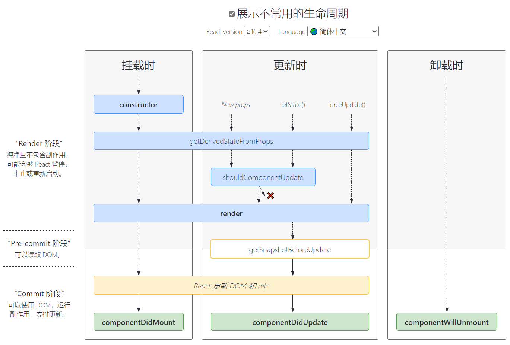

前面学习了如何进行基本的组件化开发(类组件、函数组件)，现在来介绍一下**最基本、最常用**的生命周期钩子函数。因为生命周期钩子函数其实有很多。

值得注意的是：

​	下文所讲解的生命周期钩子函数，都是在`类组件`中定义的，前面我们已经了解过了，`函数组件`虽然一开始也会被更新、挂载，但这些都是初始化展示的工作，但是由于没有内部维护的状态`state`，所以后期也就不会涉及状态变更和组件更新。

​	当然，后期学习`hooks`以后，可以利用hooks来模拟一些生命周期的回调，解决函数组件中的痛点。

----

# 图解

这里先贴上官方文档给予的生命周期钩子图谱：


## 第一个区域解析

* 组件初始化：

​	在挂载一个组件前，会先执行`constructor`构造函数来**创建组件实例**，这个constructor是ES6的class类自带的方法，是用于构造实例的，当实例被创建时，就会调用constructor，进行实例对象的初始化。

* 渲染DOM结构：

​	组件创建完毕后，会调用`render`函数，获取要渲染的DOM结构（jsx），并**渲染DOM**。

* 挂载后(渲染完毕后)：

​	当**组件挂载成功**（DOM渲染完成），会执行`componentDidMount`生命周期函数。


## **第二个区域解析**

* 触发更新：

​	当我们修改`props`，或者调用`setState`修改内部状态，或者直接调用`forceUpdate`时，就会重新调用render函数，**进行更新**操作；

* 更新完毕：

​	当**更新完成**时，会回调`componentDidUpdate`生命周期函数；

## **第三个区域解析**

* 卸载组件前：

​	当我们的组件不再使用时，即组件元素从DOM Tree中移除（卸载）时，这个时候会回调`componentWillUnmount`生命周期函数，进行**卸载前**的操作；


# 生命周期函数

## constructor

```
constructor(...props){
	super(...props);
}
```

如果不初始化 state 或不进行方法绑定，则不需要为 React 组件定义构造函数。

constructor中通常只做两件事情：

- 通过给 `this.state` 赋值对象来初始化内部的state；
- 为事件绑定实例（this）；

## componentDidMount

```
componentDidMount()
```

`componentDidMount()` 会在组件挂载后（渲染到页面后）立即调用。

componentDidMount中通常进行哪里操作呢？

- 依赖于DOM的操作可以在这里进行；
- 可以在此处添加一些订阅（会在componentWillUnmount取消订阅）
- 在此处发送网络请求就最好的地方；（官方建议）

> 这里对比Vue来说有一些不同，Vue一般在组件created时发送请求，并将response的数据赋予给datat中的状态。
>
> 但在React中不是这样的。而且React官方推荐在组件挂载后进行网络的请求，为什么呢？

1. 我们之前也提到了React的设计原则：不直接更改`state`，要通过`setState`告知状态变更。

2. 因为发送网络请求，就是要获取新数据的，也就意味着页面的更新，在React中**只有组件被挂载后**，调用`setState`才会触发重渲染。

## componentDidUpdate

```
componentDidUpdate(prevProps, prevState, snapshot)
//prevProps :更新前的props
//prevState :更新前的state
//snapshot	:getSnapshotBeforeUpdate()生命周期函数返回值（不常用钩子）
```

`componentDidUpdate()` 会在之后的触发更新**完毕后**被调用，首次渲染不会执行此方法。

- 当组件更新后，可以在此处对 DOM 进行操作；
- 如果你对更新前后的 props 进行了比较，也可以选择在此处进行网络请求；（例如，当 props 未发生变化时，则不会执行网络请求）。

```
componentDidUpdate(prevProps) {
  // 典型用法（不要忘记比较 props）
  if (this.props.userID !== prevProps.userID) {
    this.fetchData(this.props.userID);
  }
}
```

## componentWillUnmount

```
componentWillUnmount()
```

`componentWillUnmount()` 会在组件卸载及**销毁之前**调用。

- 在此方法中执行必要的清理操作；
- 例如，清除 timer，取消网络请求，或清除在 `componentDidMount()` 中创建的订阅等；

## 测试

下面通过一个App(父组件)，和ChildCpn(子组件)，来展示常用的钩子函数执行过程。

```
export default class App extends Component {
  constructor() {
    super();
    this.state = {
      isDestroy: false,
    };
    console.log("constructor执行，初始化组件");
  }
  render() {
    console.log("render执行，渲染组件");
    return (
      <main>
        <h1>Ashuntefannao</h1>
        {!this.state.isDestroy && <ChildCpn />}
        <button onClick={this.destroy.bind(this)}>点击卸载子组件</button>
      </main>
    );
  }
  /*
    钩子函数
  */
  componentDidMount() {
    console.log("componentDidMount执行，组件挂载(渲染)完毕");
  }
  componentDidUpdate(prevProps, prevState, snapshot) {
    console.log("componentDidUpdate执行，触发更新，组件重新渲染完毕");
  }

  /* 操作*/
  destroy() {
    this.setState({
      isDestroy: !this.state.isDestroy,
    });
  }
}

//子组件
class ChildCpn extends Component {
  constructor() {
    super();
    this.state = {
      style: { backgroundColor: "#3498db", color: "white", padding: "5px 0px" },
    };
  }
  render() {
    return (
      <div id="child">
        <h3 style={this.state.style}>我是子组件</h3>
      </div>
    );
  }
  /* 子组件被移除 */
  componentWillUnmount() {
    console.log("componentWillUnmount执行，子组件ChildCpn移除(卸载)前执行");
  }
}
```


## 不常用钩子

当然，还有一些不常用的钩子函数，官方文档也有相关图解：



### static getDerivedStateFromProps()

```
static getDerivedStateFromProps(props, state)
```

`getDerivedStateFromProps` 会在调用 render 方法之前调用，并且在初始挂载及后续更新时都会被调用。

适用场景：

​	从这个钩子函数名称上我们就可以得知一些信息：(获取来源于props的state)

​	如果当前组件中的某些`state`，强依赖于其他组件最新传入的props，则可以通过这个钩子函数，进行`state`的更新。因为当外部传入的props发生改变时，会回调这个钩子。

官方也说明了：`getDerivedStateFromProps` 的存在只有一个目的：让组件在 **props 变化**时更新 state。

详细用法可参照[getDerivedStateFromProps](https://zh-hans.reactjs.org/docs/react-component.html#static-getderivedstatefromprops)

---

### shouldComponentUpdate

该生命周期函数虽然被官方文档中归为了不常用钩子，但在实际开发中，**`这个钩子函数是很常用的`**，常常被用来做**性能优化**

根据 `shouldComponentUpdate(nextProps, nextState)` 的返回值，判断 React 组件的输出是否受当前 state 或 props 更改的影响。默认行为是 state 每次发生变化组件都会重新渲染。大部分情况下，你应该遵循默认行为。

返回false时，可以阻止更新过程。

---

### getSnapshotBeforeUpdate

```
getSnapshotBeforeUpdate(prevProps, prevState)
```

`getSnapshotBeforeUpdate()` 在最近一次渲染更新（提交到 DOM 节点）之前调用。它使得组件能在发生更改之前从 DOM 中捕获一些信息（例如，滚动位置）。此生命周期方法的任何返回值将作为参数传递给 `componentDidUpdate()`。

此用法并不常见，但它可能出现在 UI 处理中，如需要以特殊方式处理滚动位置的聊天线程等。

详细用法可参照[getSnapshotBeforeUpdate](https://zh-hans.reactjs.org/docs/react-component.html#getsnapshotbeforeupdate)
