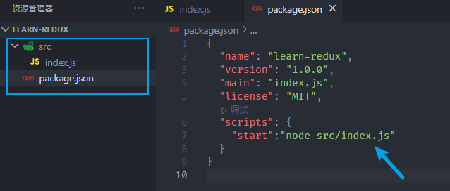
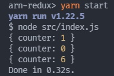
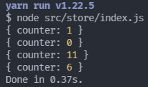
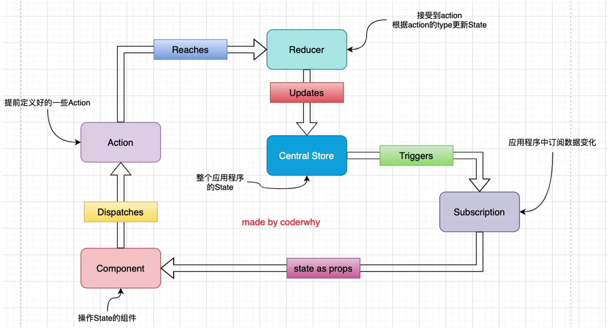

# 认识Redux

## 为什么需要Redux？

**现在使用JavaScript开发的应用程序，已经变得越来越复杂了**：

- JavaScript需要管理的状态越来越多，越来越复杂；
- 这些状态包括服务器返回的数据、缓存数据、用户操作产生的数据等等，也包括一些UI的状态，比如某些元素是否被选中，是否显示加载动效，当前分页……

**维护不断变化的state是非常困难的**：

- 在实际开发中，状态之间可能会依赖，一个状态的变化会引起另一个状态的变化，视图的操作也有可能会引起状态的变化；
- 当应用程序复杂时，state在什么时候变化，因为什么原因产生变化，发生了怎样的变化，会变得非常难以控制和追踪；

**React在视图层帮我们解决了繁琐的DOM操作和更新过程，但是State依然交由开发者来管理：**

- React主要负责帮助我们管理视图，state如何维护最终还是我们自己来决定
  - 无论是组件自身的state，还是组件之间的通信的props；或者通过Context进行数据之间的共享；
- 但实际开发中，维护不断变化的state是非常困难的，所以我们需要借助一个工具，来统一的帮我们管理state。

> 而`Redux`就是一个帮助我们管理State的容器，并且提供了`可预测`的状态管理；

## Redux的核心理念

上文一直在说：**实际开发中，维护不断变化的state是非常困难的**，我们举一个简单的例子：

比如我们要管理一个通讯录：

```
const initialState = {
  friends: [
    { name: "Ashun", tell: 15283659006 },
    { name: "houzi", tell: 14273690445 },
    { name: "lilei", tell: 18252529763 },
  ],
  family:[
    { name: "father", tell: 13274609325 },
    { name: "mother", tell: 13037629486 },
    { name: "brother", tell: 15372986201 },
  ]
};
```

* 这些数据可能会被多个页面所维护
* 比如page1允许添加好友，page2允许修改电话号码，page3允许删除好友信息……
* 整个应用程序的状态管理错综复杂，当出现bug时，很难追踪到是哪里的状态变更导致bug的出现。

很显然，如果我们没有定义统一的规范来管理这些数据，那么整个数据的变化就是无法跟踪的。

​	而`Redux`有一套自身的规定，我们通过这套规定去合理、有序的管理各个状态，让状态管理变的`可预测`，这主要涉及到几个核心理念：

### action

* Redux要求我们通过action来更新数据：
  - 所有数据的变化，必须通过派发（dispatch）action来更新；
  - action是一个object，用来描述这次更新的type和content；

- 强制使用action的好处是：可以清晰的知道数据到底发生了什么样的变化，所有的数据变化都是可跟追、可预测的；
- 下面例子中的action对象是写死的，真实应用中，我们会通过工厂函数来定义，返回一个action对象

```
//新增好友
const action1 = { type: "ADD_FRIEND", info: { name: "lucy", tell: 15372935201 } }
//改变号码
const action2 = { type: "CHANGE_TELL", payload: { category: "friends",index: 0,newTell:13024365476 } }
//改变名称
const action3 = { type: "CHANGE_NAME", payload: { category: "family",index: 2, newName: "jackson" } }
```

### reducer

action是用来描述变更状态的类型与内容的，那么怎么让action与状态的改变联系起来呢？答案就是reducer

- reducer是一个**纯函数**；
- reducer的功能就是：将管理的state通过派发的action进行操作，最后返回一个新的state

>值得注意的是 reducer 是一个**纯函数**，所以在action的处理中，不要直接更改所管理的state，我们可以创建一个新的引用，然后合并之前的state 和 操作后的数据。

```
function reducer(state = initialState, action) {
  switch (action.type) {
    case "ADD_FRIEND":
      return { ...state, friends: [...state.friends, action.info] }
    case "CHANGE_TELL":
      let {category}=action.payload;
      return {
        ...state, [category]: state[category].map((item, index) => {
          if (index === action.index) {
            return { ...item, tell: action.payload.newTell }
          }
          return item;
        })
      }
    case "CHANGE_NAME":
      let {category}=action.payload;
      return {
        ...state, [category]: state[category].map((item, index) => {
          if (index === action.index) {
            return { ...item, name: action.newName }
          }
          return item;
        })
      }
    default:
      return state;
  }
}
```

## redux的三大原则

### 单一数据源

整个应用程序的状态，被存储在一颗对象结构的state tree中，并且这个state tree只存储在一个 store 中：

- Redux并没有强制让我们不能创建多个Store，但是那样做并不利于数据的维护；
- 单一的数据源可以让整个应用程序的state变得方便维护、追踪、修改；

### State是只读的

唯一修改State的方法一定是触发action，不要试图在其他地方通过任何的方式来修改State：

- 这样就确保了View或网络请求都不能直接修改state，它们只能通过action来描述自己想要如何修改state；
- 这样可以保证所有的修改都被集中化处理，并且按照严格的顺序来执行，所以不需要担心race condition（竟态）的问题；

### 使用纯函数来执行修改

通过reducer将 `旧state`和 `actions`联系在一起，并且返回一个新的State：

- 随着应用程序的复杂度增加，我们可以将reducer拆分成多个小的reducers，将单一的数据源视为由各个子集state tree构成的树，而被拆分的各个reducers分别操作不同的部分；
- 但是所有的reducer都应该是纯函数，不能产生任何的副作用；


# Redux的基本使用

​	Redux是一个状态管理工具，它不强行依赖于某些框架，我们既可以单独使用，也可以集成到Vue、React等框架中。

​	为了更好的理解 Redux ，我们将在node环境下，通过一个简单的js文件，梳理 Redux 的使用流程。

在使用之前，我们需要：

1. 初始化项目：`npm init`/`yarn init`

2. 安装 redux：`npm i redux --save`/`yarn add redux`

3. 创建src目录，并在其中创建 index.js 入口文件

4. 修改 package.json 的指令，从而可以执行index.js

   --就可以使用 yarn start 执行了

   ```
   "scripts": {
     "start": "node src/index.js"
   }
   ```



## 基本使用过程

1.初始化一个对象，作为后期管理的状态：

```
const redux = require('redux');

const defaultState = {
  counter: 0
}
```

2.通过`createStore(reducer)`创建Store，来存储 defaultState

* 接收一个参数`reducer`，因此在创建store时必须提前定义好，并传入reducer 纯函数
* 关于 reducer
  * reducer接收两个参数：`state`、`action`
  * 需要为`state`赋予默认值 defaultState 
  * 因为在后期：旧的state通过reducer的处理，结合action返回新的state ，但在一开始state为undefined，所以需要赋予默认的初始值。

```
// 创建reducer
const reducer = (state = defaultState, action) => {
  return state;
}
// 根据reducer创建store
const store = redux.createStore(reducer);
```

3.通过派发action来修改state

- 通过`dispatch`来派发action，然后自动交由 reducer 处理
- 通常action中都会有type属性，也可以携带其他的数据；

```
store.dispatch({
  type: "INCREMENT"
})

store.dispath({
  type: "DECREMENT"
})

store.dispatch({
  type: "ADD_NUMBER",
  number: 6
})
```

4.编写reducer中的处理逻辑代码

- 这里一定要记住，reducer是一个纯函数，不需要直接修改state；
- 后面我会讲到直接修改state带来的问题；

```
const reducer = (state = initialState, action) => {
  switch (action.type) {
    case "INCREMENT":
      return {...state, counter: state.counter + 1};
    case "DECREMENT":
      return {...state, counter: state.counter - 1};
    case "ADD_NUMBER":
      return {...state, counter: state.counter + action.number}
    default: 
      return state;
  }
}
```

5.可以在派发action之前，通过`subscribe(callback)`订阅store的变化：

* 还可通过`getState()`获取当前的状态

```
store.subscribe(() => {
  console.log(store.getState());
})
```

整个案例代码：

```
//引入redux
const redux=require("redux")

//初始化state
const defaultState={
  counter:0
}

//创建reducer，用于处理状态变更
function reducer(state=defaultState,action){
  const {type}=action;
  switch(type){
    case "INCREMENT":{
      let newState={...state,counter:state.counter+1};
      return newState;
    }
    case "DECREMENT":{
      let newState={...state,counter:state.counter-1};
      return newState;
    } 
    case "ADD_NUMBER":
    { 
      let newState={...state,counter:state.counter + action.number};
      return newState;
    }
    default: 
      return state;
    }
}

//创建Store存储state
const store=redux.createStore(reducer);
//dispatch action之前可通过subscribe订阅状态变化
store.subscribe(()=>{
  console.log(store.getState())
})

//派发action，交由reducer处理状态变更
store.dispatch({
  type:"INCREMENT"
})
store.dispatch({
  type:"DECREMENT"
})
store.dispatch({
  type:"ADD_NUMBER",
  number:6
})
```

执行`yarn start`运行结果：



## 使用过程梳理

总结上文Redux的使用过程，笼统来说主要包含以下几步：

**前期准备**：

1. 初始化将要管理的state
2. 创建Store，并传入reducer
   * store 用于状态的存储
   * reducer 用于状态变更处理

**后期使用**：

1. 通过派发action，将状态变更交由reducer处理
2. reducer 结合旧的state、action进行处理，最终返回一个新的state

# 结构划分

​	上文[基本使用过程](##基本使用过程)中所演示的代码，所有使用redux管理state的代码全都写在了一个文件中。而在实际开发过程中，我们所管理的state是繁多且复杂的，如果依旧都在一个文件中编写，将不利于阅读、维护。

​	我们要将redux的使用过程，划分为几个模块，这样代码结构清晰，利于维护和管理。我会进行以下拆分：

* index.js ->reducer.js、actionCreators.js、constants.js


**注意：node中对ES Module的支持**

从node v13.2.0开始，node才对ES6模块化提供了支持：

- node v13.2.0之前，需要进行如下操作：
  - 在package.json中添加属性： `"type": "module"`；
  - 在执行命令中添加如下选项：`node --experimental-modules src/index.js`;
- node v13.2.0之后，只需要进行如下操作：
  - 在package.json中添加属性： `"type": "module"`；

### index.js

​	入口文件，只存放最基本的业务流程，其它部分都抽离为独立的module，再引入即可。

* store的创建、订阅dispatch

```
import redux from "redux";
import reducer from "./reducer.js";

const store = redux.createStore(reducer);

store.subscribe(() => {
  console.log(store.getState());
});

export default store;
```

### reducer.js

reducer 是真正处理 state 的地方，在实际开发中，如果reducer中的代码非常复杂，还可继续抽离，这里由于示例简单，所以都抽离在 reducer.js 文件内。

```
import { INCREMENT, DECREMENT, ADD_NUMBER, SUB_NUMBER } from "./constants.js";

const defaultState = {
  counter: 0,
};

function reducer(state = defaultState, action) {
  const { type } = action;
  switch (type) {
    case INCREMENT: {
      let newState = { ...state, counter: state.counter + 1 };
      return newState;
    }
    case DECREMENT: {
      let newState = { ...state, counter: state.counter - 1 };
      return newState;
    }
    case ADD_NUMBER: {
      let newState = { ...state, counter: state.counter + action.num };
      return newState;
    }
    case SUB_NUMBER: {
      let newState = { ...state, counter: state.counter - action.num };
      return newState;
    }
    default: {
      return state;
    }
  }
}

export default reducer;

```

### actionCreators.js

actionCreators.js 用于创建各个action对象。

**注意要点**：

* 在实际开发中，我们**不会**像上文[基本使用过程](##基本使用过程)中所演示的代码一样，直接将 action 对象写死在 dispatch 中。
* 而是通过一个个**工厂函数**，去生成 action 对象，这样操作的优点是：
  * 格式统一，方便阅读与维护
  * 更加灵活的操作state：可以通过函数进行传参，动态的改变state。

```
import { INCREMENT, DECREMENT, ADD_NUMBER, SUB_NUMBER } from "./constants.js";

const incrementAction = () => ({
  type: INCREMENT,
});
const decrementAction = () => ({
  type: DECREMENT,
});
const addAction = (num) => ({
  type: ADD_NUMBER,
  num,
});
const subAction = (num) => ({
  type: SUB_NUMBER,
  num,
});

export { incrementAction, decrementAction, addAction, subAction };
```

### constants.js

​	该文件将`action.type`抽离为各个常量进行存储，外部的`reducer.js`、`actionCreator.js`在依次引入进行使用，这样的好处是：

* **避免重名或写错 type 信息**
  * 随着state变得繁多、复杂。这些 type 信息在后期可能会重名或写错。而我们将其单独的抽离，外部文件再引入就会避免这些情况。
* **方便更改 type 信息**
  * 如果我们要更改type信息，却没有将其单独抽离，我们需要在各个使用`action.type`的文件中依次更改，及其不适。

```
const INCREMENT = "INCREMENT";
const DECREMENT = "DECREMENT";
const ADD_NUMBER = "ADD_NUMBER";
const SUB_NUMBER = "SUB_NUMBER";

export { INCREMENT, DECREMENT, ADD_NUMBER, SUB_NUMBER };

```

### 测试执行

之后我们就可以在外部需要更改state的**组件中**进行 dispatch action 了。

* 由于该案例注重过程梳理，所以派遣action的操作就放在index.js中进行测试了：



```
import redux from "redux";
import reducer from "./reducer.js";
import {
  incrementAction,
  decrementAction,
  addAction,
  subAction,
} from "./actionCreators.js";

const store = redux.createStore(reducer);
store.subscribe(() => {
  console.log(store.getState());
});

export default store;

store.dispatch(incrementAction());
store.dispatch(decrementAction());
store.dispatch(addAction(11));
store.dispatch(subAction(5));
```

#  Redux流程图

我们已经知道了redux的基本使用过程，现在来认识一下redux在实际开发中的流程：

- 全局通常只有一个Store，存储我们的State；
- Component中在某些情况下会派发Action（这些Action是我们提前定义好的）；
- Reducer会接收到这些Action，并且在Reducer中会返回一个新的State，作为Store的State；
- State发生更新之后会触发通知，告知订阅者(subscribe)状态发生了变更；
- 订阅者拿到最新的数据（在props中），通过 setState 让组件的状态进行更新，从而触发界面更新机制，重新执行render。



