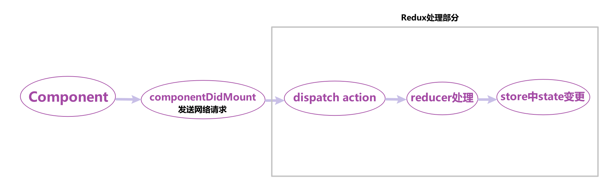
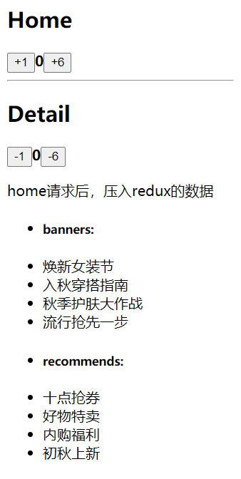
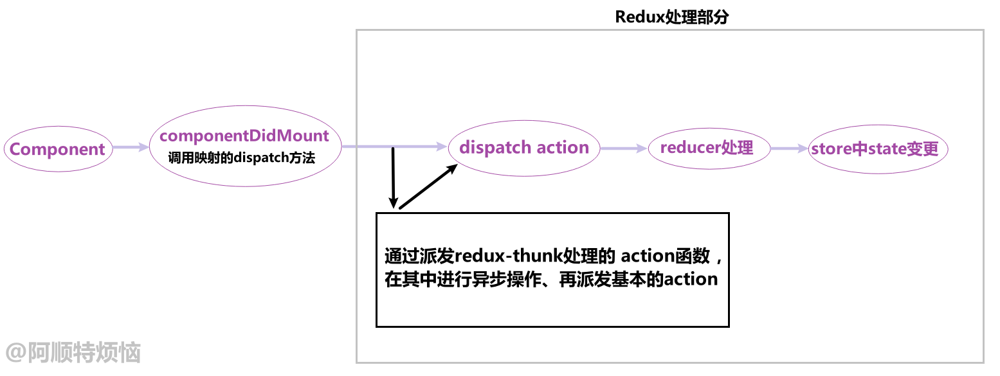
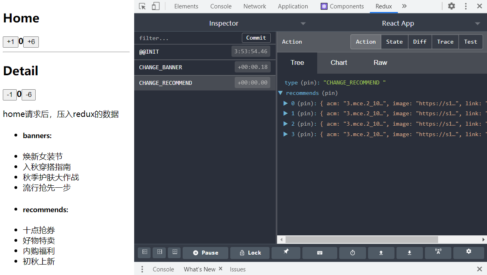
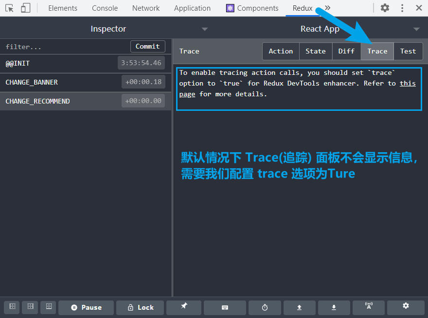
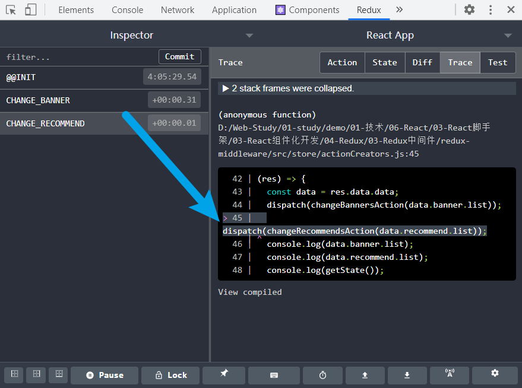
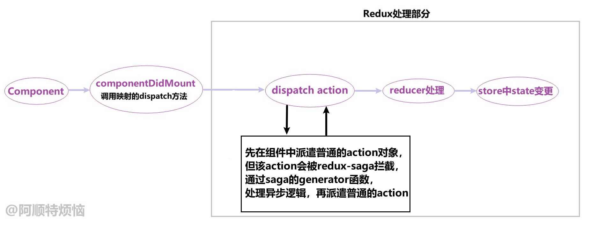

# 常用中间件

## redux-thunk

在真正了解`redux-thunk`之前，我们先来思考一个问题：

​	之前的文章案例中，我们在Redux中操作的都是一开始初始化好的数据，并且这些数据没有与服务器交互。

​	但在实际开发中，大部分数据都来源于服务器，这就涉及到了网络请求的发送和接收，而这些操作都是异步的。如果这些数据需要使用Redux进行管理，一开始你可能会写出下面示例代码，在[组件中进行异步请求](###组件中异步请求)。

### 组件中异步请求

​	在之前学习 react中使用axios 时我们讲过，网络请求可以在class组件的`componentDidMount`中发送，所以我们的案例过程为：当Home组件挂载完毕后，发送网络请求，并将接收的数据通过dispatch action交由reducer进行状态变更处理。



#### redux文件操作

**constants.js 中新增常量：**

```
……
const CHANGE_BANNER = "CHANGE_BANNER ";
const CHANGE_RECOMMEND = "CHANGE_RECOMMEND ";

export { ……, CHANGE_BANNER, CHANGE_RECOMMEND};
```

**actionCreators.js 中新增对应 action：**

```
……
const changeBannersAction = (banners) => ({
  type: CHANGE_BANNER,
  banners,
});
const changeRecommendsAction = (recommends) => ({
  type: CHANGE_RECOMMEND,
  recommends,
});

export { ……, changeBannersAction, changeRecommendsAction};
```

**在 reducer.js 中：初始化对应state数据、新增对应action处理代码：**

```
import { ……, CHANGE_BANNER, CHANGE_RECOMMEND} from "./constants.js";

const defaultState = {
  counter: 0,
  //初始化对应state数据
  banners: [],
  recommends: [],
};

function reducer(state = defaultState, action) {
  const { type } = action;
  switch (type) {
   ……
    case CHANGE_BANNER: {
      let newState = { ...state, banners: action.banners };
      return newState;
    }
    case CHANGE_RECOMMEND: {
      let newState = { ...state, recommends: action.recommends };
      return newState;
    }
    default: {
      return state;
    }
  }
}

export default reducer;
```

#### 组件内容操作

**Home.js**

* `mapDispatchToProps`中新增对应的 dispatch 行为
* 组件挂载后：
  * 发送网络请求
  * 将接收到的数据，通过 dispatch action 交由 reducer 进行状态变更处理。

```
import { PureComponent } from "react";
import { connect } from "react-redux";
import {
  incrementAction,
  addAction,
  changeBannersAction,
  changeRecommendsAction,
} from "../../store/actionCreators.js";
import axios from "axios";

class Home extends PureComponent {
  componentDidMount() {
    axios({
      url: "http://123.207.32.32:8000/home/multidata",
    }).then(
      (res) => {
        const data = res.data.data;
        this.props.changeBanners(data.banner.list);
        this.props.changeRecommends(data.recommend.list);
      },
      (err) => {
        console.log(err);
      }
    );
  }
  render() { ……}
}

const mapStateToProps = (stateInStore) => ({
  counter: stateInStore.counter,
});

const mapDispatchToProps = (dispatch) => ({
  ……
  changeBanners: (banners) => {
    dispatch(changeBannersAction(banners));
  },
  changeRecommends: (recommends) => {
    dispatch(changeRecommendsAction(recommends));
  },
});

const connectStore_Home = connect(mapStateToProps, mapDispatchToProps)(Home);
export default connectStore_Home;

```

**Detail.js**

* 在该组件中展示：Home组件请求后，压入redux的数据，验证是否成功。
* `mapStateToProps`新增将要展示的数据。

```
import { PureComponent } from "react";
import { connect } from "react-redux";
import { decrementAction, subAction } from "../../store/actionCreators.js";

class Detail extends PureComponent {
  render() {
    return (
      <div id="detail">
        ……
        <p>home请求后，压入redux的数据</p>
        <ul>
          <li>
            <h5>banners:</h5>
          </li>
          {this.props.banners.map((item) => (
            <li key={item.acm}>{item.title}</li>
          ))}
          <li>
            <h5>recommends:</h5>
          </li>
          {this.props.recommends.map((item) => (
            <li key={item.acm}>{item.title}</li>
          ))}
        </ul>
      </div>
    );
  }
}

const mapStateToProps = (stateInStore) => ({
  ……
  banners: stateInStore.banners,
  recommends: stateInStore.recommends,
});

const mapDispatchToProps = (dispatch) => ({……});

const connectStore_Detail = connect(mapStateToProps, mapDispatchToProps)(Detail);
export default connectStore_Detail;
```

**结果**：



#### 缺陷分析

上述代码虽然能够完成业务要求，但缺陷很明显：

* 我们必须将网络请求的异步处理代码，放到组件的生命周期中来完成
* 如果有大量的数据要与服务器交互，且这些数据都要交由Redux管理，那么这些处理过程却都要**在组件中完成**
* 如果组件业务代码本身就复杂，这些关于Redux的处理代码还要在组件中完成，后期则不利于维护。

我们希望这些关于【 需要由Redux管理，并且是通过网络请求异步接收到的数据 】的操作，也放在redux中进行处理。

但这些操作：

* 不能放在action中：action最终是只一个对象，即便我们在actionCreator函数中，发送网络请求并拿到数据，最后再将action对象返回，依然不会成功，因为网络请求是异步代码，return语句早已同步执行。
* 不能放在reducer中：若在reducer中发送网络请求，则违背了纯函数的定义。

我们可以使用**Redux的中间件**`redux-thunk`完成👇

### redux中异步请求

#### 基本了解

官网推荐的、包括演示的网络请求案例的中间件，就是用 `redux-thunk`完成的。

**那 redux-thunk 是如何做到：让我们可以在Redux中发送异步请求的呢？**

- 我们知道，默认情况下的 action 需要是一个JavaScript 对象，而 dispatch 也只能接受一个Objetc（action对象）作为参数。
- `redux-thunk`**可以让 action 是一个函数**，从而让 dispatch 也可接受一个函数（action函数）作为参数。
- 使用dispatch派发后，该`action函数`会被回调，并且会给 action函数 传入两个参数：
  - `dispatch`函数：用于我们之后再次派发 action；
  - `getState`函数：让我们可以获取之前的状态；
- 我们可以在**action函数**中进行网络请求或其他的异步操作，然后再派发基础的action，完成状态变更。



#### 使用过程

**1.安装redux-thunk**

```
yarn add redux-thunk
```

**2.在创建store时传入第二个参数 storeEnhancer**

* 通过调用**redux中的功能函数**`applyMiddleware`，传入使用的各个中间件，最后返回`storeEnhancer`函数。
* 将`storeEnhancer`作为第二个参数传入createStore中

```
import { createStore, applyMiddleware } from "redux";
import ThunkMiddleware from "redux-thunk";

import reducer from "./reducer.js";

const storeEnhancer = applyMiddleware(ThunkMiddleware);
export default createStore(reducer, storeEnhancer);
```

**3.在 actionCreators.js 中定义：返回一个函数的action**

- 注意：这里不是返回一个对象，而是一个函数；
- 返回的函数会在dispatch之后会被自动调用；
- 在 action 函数中发送网络请求，然后dispatch之前所定义的基本的action。

```
const getHomeMultidataAction = () => {
  return (dispatch) => {
    axios.get("http://123.207.32.32:8000/home/multidata").then(res => {
      const data = res.data.data;
      dispatch(changeBannersAction(data.banner.list));
      dispatch(changeRecommendsAction(data.recommend.list));
    })
  }
}
```

**4.修改home.js中的代码**

* 新增`mapDispatchToProps`将`getHomeMultidataAction`映射到props中。
* 在组件挂载后，只需派发 action函数 ：将后期异步处理交由`getHomeMultidataAction`

```
import { PureComponent } from "react";
import { connect } from "react-redux";

import {
  incrementAction,
  addAction,
  getHomeMultidataAction,
} from "../../store/actionCreators.js";

class Home extends PureComponent {
  componentDidMount() {
    this.props.getHomeMultidata();
  }
  render() {……}
}

const mapStateToProps = (stateInStore) => ({……});
const mapDispatchToProps = (dispatch) => ({
  ……
  getHomeMultidata() {
    dispatch(getHomeMultidataAction());
  },
});

const connectStore_Home = connect(mapStateToProps, mapDispatchToProps)(Home);
export default connectStore_Home;
```

结果依旧正常如初：


## redux-devtools

我们之前一直在说，redux可以方便的让我们对状态进行跟踪和调试，这不仅仅体现在代码层面，redux官网为我们提供了 redux-devtools 工具。

利用这个工具，我们就能在控制台可视化的观察：每次状态是如何被修改的，修改前后的状态变化等等。

使用该工具需要两步：

1. 在浏览器中安装相关的插件（比如Chrome浏览器扩展商店中搜索Redux DevTools即可，其他方法可以参考GitHub）
2. 在redux中集成devtools

### 集成devtools

1. 从`redux`中导出`compose`
2. 通过window判断调试工具，返回`composeEnhancers` 
   * 之前说过使用`applyMiddleware`能够合并多个中间件，最后返回一个enhancer函数进行使用
   * 而`composeEnhancers`能够合并多个enhancer
3. 将`composeEnhancers`作为第二个参数，传入createStore中

```
import { createStore, applyMiddleware, compose } from "redux";
import ThunkMiddleware from "redux-thunk";
import reducer from "./reducer.js";

const composeEnhancers = window.__REDUX_DEVTOOLS_EXTENSION_COMPOSE__ || compose;
/* 通过applyMiddleware结合多个Middleware, 并返回一个enhancer, 再通过composeEnhancers合并多个enhancer */
const storeEnhancer = composeEnhancers(applyMiddleware(ThunkMiddleware));
const store = createStore(reducer, storeEnhancer);

export default store;
```

此时我们就可在控制台中使用redux-devtools了，可以点击不同选项(Action、State、Diff、Trace、Test)，查看对应的变化信息。



### 开启Trace

当我们点击Trace后，发现没有显示对应的**状态追踪信息**，而是提示我们要进行配置，才能奏效。



**配置trace选项**

```
const composeEnhancers =
  window.__REDUX_DEVTOOLS_EXTENSION_COMPOSE__({ trace: true }) || compose;
```

此时就可利用Trace面板观察：状态变更是由于那些具体代码造成的。



## redux-saga

​	saga中间件使用了ES6的generator(生成器)语法，所以我们先简单学习一下generator的基础用法。以便更好的使用redux-saga。

### generator

#### 基本使用

在JavaScript中编写一个普通的函数，进行调用会立即拿到这个函数的返回结果：

```
function test() {
  return "Ashuntefannao";
}

foo() // Ashuntefannao
```

如果我们将这个函数编写成一个生成器函数：

* 使用`function* funcName(){…}`语法，定义generator函数
* generator函数执行后，返回结果为迭代器对象 iterator
* 函数内部通过`yield`来定义：不断迭代时所返回的结果

```
function* test() {
  yield "Ashun";
  yield "tefannao";
}

const iterator = test();
console.log(iterator.next()); // {value: "Ashun", done: false}
console.log(iterator.next().value); // tefannao
console.log(iterator.next()); // {value: undefined, done: true}
```

我们再测试一下generator函数内部的代码是如何执行的。

* 每次被迭代时，代码就会从上一个`yield`语句后面执行到下一个`yield`位置处，从而返回对应结果

```
function* test() {
  console.log("--111111--");
  yield "Ashun";
  console.log("--222222--");
  yield "tefannao";
  console.log("--333333--");
}

let iterator = test();	//此时generator函数被调用，但内部代码不会执行，只是返回一个iterator
iterator.next()	// --111111--
iterator.next()	// --222222--
iterator.next()	// --333333--
```

* 若后续迭代时，没有定义下一个`yield`，则上一个`yield`后面的代码依旧执行

```
function* test() {
  console.log("--111111--");
  yield "Ashun";
  console.log("--222222--");
  console.log("--333333--");
}

let iterator = test();
iterator.next(); // --111111--
console.log(iterator.next());
/*
	--222222--
  --333333--
  {value: undefined, done: true}
*/
```

#### generator 结合 promise

其实如果理解了上文部分，下面案例也可理解。

```
function* test() {
  console.log("--11111---");
  let result = yield new Promise((res, rej) => {
    setTimeout(() => {
      res("Ashuntefannao");
      return "Ashun";
    }, 2000);
  });
  console.log(result);
}

let iterator = test();
```

* 显而易见，后续迭代时，获取到的是Promise，在then中打印res，控制台等待2s后，即可看到结果

```
iterator.next().value.then((res) => {
  console.log(res);	//Ashuntefannao
});
```

但如果我希望通过 test 生成器函数的最后一条语句，打印出promise的结果，该如何实现？

我们先来看看以下代码：

* 第二次迭代，会执行`console.log(result)`，但result是由上一个`yield`所定义的。
* 默认情况下，本次的迭代，是不能打印出上次迭代中`yield`所返回的结果的。
* 所以：控制台等待2s后，打印 undefined

```
iterator.next().value.then((res) => {
  iterator.next();	//undefined
});
```

我们可以在`next`方法中传入参数，作为上一次迭代的结果。

```
iterator.next().value.then((res) => {
  iterator.next(res);	//Ashuntefannao
});
```

### redux-saga的使用

#### 基本了解

​	上文中我们介绍了如何在[redux中处理异步请求](####redux中异步请求)，在该过程中使用了redux-thunk中间件，很方便的将异步状态变更抽离到了redux中。

​	在实际开发中，还有一个很常用的中间件，也用于在redux中处理异步请求，那就是redux-saga，且该中间件被广泛应用于大型项目的开发。



#### 使用过程

**1.安装redux-saga**

```
yarn add redux-saga
```

**2.在store中集成redux-saga中间件**

* 从`redux-saga`引入`createSagaMiddleware`方法
* 调用`createSagaMiddleware`，创建saga中间件
* 将saga中间件，通过applyMiddleware合并使用
* 调用saga中间件的run方法，并传入抽离出去的generator函数，该generator函数中包含了我们后期需要拦截的action业务。

```
import { createStore, applyMiddleware, compose } from "redux";
import reducer from "./reducer.js";
import ThunkMiddleware from "redux-thunk";
import createSagaMiddleware from "redux-saga";
import mySaga from "./saga.js";	/* 将saga业务单独抽离出去 */

const composeEnhancers =
  window.__REDUX_DEVTOOLS_EXTENSION_COMPOSE__({ trace: true }) || compose;
  
//使用createSagaMiddleware创建saga中间件
const SagaMiddleware = createSagaMiddleware();

//也要应用applyMiddleware合并saga中间件
const storeEnhancer = composeEnhancers(
  applyMiddleware(ThunkMiddleware, SagaMiddleware)
);

//调用saga中间件的run方法，并传入抽离出去的generator函数
SagaMiddleware.run(mySaga);
const store = createStore(reducer, storeEnhancer);

export default store;

```

**3.在 actionCreators.js 中定义：需要拦截的action对象**

```
import {……, FETCH_HOME_MULTIDATA} from "./constants.js";
……
const fetchHomeMultidataAction = () => ({
  type: FETCH_HOME_MULTIDATA,
});

export {……, fetchHomeMultidataAction};
```

**4.编写 saga.js 拦截目标action进行异步操作**

* 定义一个generator函数，用于处理saga的总逻辑。并默认导出，在外部作为saga中间件的`run`方法的参数。
* 内部通过调用`takeEvery`/`takeLatest`方法，并传入两个参数，拦截对应的 action：
  * 参数1：`action.type`，通过type锁定将要拦截的action
  * 参数2：处理拦截业务的generator函数
* 在处理拦截业务的generator函数内部，我们通过`redux-saga/effects`提供的`put`方法派遣action

```
import { takeEvery, put } from "redux-saga/effects";

import axios from "axios";
import { FETCH_HOME_MULTIDATA } from "./constants.js";
import {
  changeBannersAction,
  changeRecommendsAction,
} from "./actionCreators.js";

/* 拦截action的generator函数 */
function* fetchHomeMultidata() {
  const result = yield axios.get("http://123.207.32.32:8000/home/multidata");
  const data = result.data.data;
  //通过put派遣acttion
  yield put(changeBannersAction(data.banner.list));
  yield put(changeRecommendsAction(data.recommend.list));
}

/* 总的saga逻辑 */
function* mySaga() {
	//传入需要拦截的action.type,以及对应的generator函数(用于拦截)
  yield takeEvery(FETCH_HOME_MULTIDATA, fetchHomeMultidata);
}

export default mySaga;
```

当要派遣多个action时，我们可以利用`redux-saga/effects`提供的`all`方法统一处理。

```
function* fetchHomeMultidata() {
  const result = yield axios.get("http://123.207.32.32:8000/home/multidata");
  const data = result.data.data;
  //all方法统一处理多个put
  yield all([
    put(changeBannersAction(data.banner.list)),
    put(changeRecommendsAction(data.recommend.list)),
  ]);
}
```

同理，用于处理saga总逻辑的generator函数中，如果要拦截多个action，我们也可使用all

```
function* mySaga() {
  yield all([
    takeEvery(FETCH_HOME_MULTIDATA, fetchHomeMultidata),
    takeEvery(FETCH_DETAIL_MULTIDATA, fetchDetailMultidata),
    takeEvery(FETCH_CATEGORY_MULTIDATA, fetchCategoryMultidata),
    ……
  ]);
}
```

### 对比redux-thunk

* saga的逻辑处理，抽离的很干净，不会耦合在 actionCreators.js 中
* 并且 saga 不会破坏 redux 中原生的 dispatch 方法，而 redux-thunk 对其做了更改，让dispatch能够派遣action函数。

