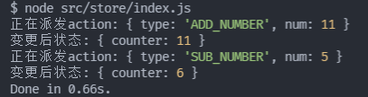

上篇文章中，我们已经学习了一些中间件的使用，我们可以发现：

**中间件的目的是在redux中插入一些自己的操作，从而实现对变更状态过程的拦截**

我们是否可以实现类似的功能呢？

下面我们就来通过几个需求案例，了解中间件的实现过程。

核心步骤：

* 定义新变量，保存`store.dispatch`的引用
* 将拦截的业务(实现的功能)封装成一个函数
  * 在拦截过程中，通过新变量(也就是原来的dispatch方法)派遣action
* 之后再将功能函数赋值给`store.dispatch`，将原来的方法覆盖。
* 后期就可通过与原来相同的形式(`store.dispatch`)派遣action，并完成需求的功能

## 打印日志

* 在dispatch之前，打印本次派遣的action对象
* dispatch完成之后，打印最新的store state

```
let dispatch = store.dispatch;
function dispatchAndLog(action) {
  console.log(`正在派发action:`, action);
  dispatch(action);
  console.log(`变更后状态:`, store.getState());
}
store.dispatch = dispatchAndLog;

//测试
store.dispatch(addAction(11));
store.dispatch(subAction(5));
```

测试结果：



## 实现thunk

* 如果传入的action为function，则调用
* 若action为对象，则直接派发

```
let dispatch = store.dispatch;
function thunkDispatch(action) {
  if (typeof action === "function") {
    action(store.dispatch, store.getState);
  } else {
    dispatch(action);
  }
}
store.dispatch = thunkDispatch;

//测试
function dispatchActions() {
  return (dispatch, getState) => {
    dispatch(addAction(11));
    dispatch(subAction(5));
  };
}
store.dispatch(dispatchActions());
```

## 代码优化

上面我们只是简单的实现了功能，但在使用时需要将整个代码片段copy过去，为了更方便的使用，我们可以将整个实现过程抽离为各个功能函数。

* 传入store，然后内部在改变原有的store.dispatch

**打印日志**

```
function dispatchAndLogMiddleware(store) {
  let dispatch = store.dispatch;
  function newDispatch(action) {
    console.log(`正在派发action:`, action);
    dispatch(action);
    console.log(`变更后状态:`, store.getState());
  }
  store.dispatch = newDispatch;
}
```

**实现thunk**

```
function thunkDispatchMiddleware(store) {
  let dispatch = store.dispatch;
  function newDispatch(action) {
    if (typeof action === "function") {
      action(store.dispatch, store.getState);
    } else {
      dispatch(action);
    }
  }
  store.dispatch = newDispatch;
}
```

这样在外部使用时，我们只需要调用这两个功能函数，即可改变原有的store.dispatch，不断增加新的功能。

```
dispatchAndLogMiddleware(store);	//增加打印日志功能
thunkDispatchMiddleware(store);		//增加thunk功能
//测试代码
function dispatchActions() {
  return (dispatch, getState) => {
    dispatch(addAction(11));
    dispatch(subAction(5));
  };
}
store.dispatch(dispatchActions());
```

## 合并中间件

依次调用某个功能函数来不断增添新的功能，也不是特别的方便。

基于上文代码，我们可以自己封装一个`applyMiddleware`函数来实现中间件合并：

* 先把上文中各个功能函数做一些调整：**不直接在函数内部更改**`store.dispatch`
* 而是把`newDispatch`return出去，供后期封装的`applyMiddleware`依次合并。

```
function dispatchAndLogMiddleware(store) {
 	let dispatch = store.dispatch;
  function newDispatch(action) {……}
  return newDispatch;
}
function thunkDispatchMiddleware(store) {
  let dispatch = store.dispatch;
  function newDispatch(action) {……}
  return newDispatch;
}
```

实现applyMiddleware

```
function applyMiddleware(...middlewares) {
  middlewares.forEach((middleware) => {
    store.dispatch = middleware(store);
  });
}
```

测试代码

```
applyMiddleware(dispatchAndLogMiddleware, thunkDispatchMiddleware);

function dispatchActions() {
  return (dispatch, getState) => {
    dispatch(addAction(11));
    dispatch(subAction(5));
  };
}
store.dispatch(dispatchActions());
```

​	本文实现的middleware都是简单的封装，真实的中间件开发起来会更加的灵活，复杂，也更加健壮。

