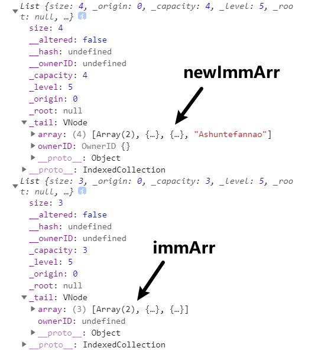
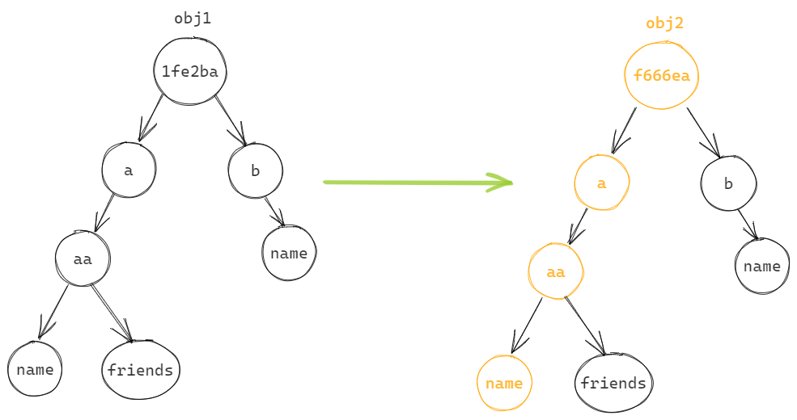

## 数据可变性的问题

在React开发中，我们总是会强调数据的不可变性：

- 无论是组件中的state，还是redux中管理的state；
- 事实上在整个JavaScript编码过程中，数据的不可变性都是非常重要的；

数据可变性引发的问题（引用类型）：

- 我们明明没有修改obj，只是修改了obj2，但结果obj也被一并修改了。
- 原因非常简单，引用类型数据，它们共同指向同一块内存空间，两个引用都可以任意修改该内存空间中的数据
- 这种性质就会导致：后期的数据维护变得不可预测

```
const obj = {
  name: "SHUN",
  age: 18
}

console.log(obj); // {name: "SHUN", age: 18}
const obj2 = obj;
obj2.name = "Ashun";
console.log(obj); // {name: "Ashun", age: 18}
```

有没有办法解决上面的问题呢？

- 进行对象的拷贝即可：Object.assign、扩展运算符、遍历赋值
- 如果存在深层级嵌套，需要进行深拷贝，这里不再赘述

```
console.log(obj); // {name: "SHUN", age: 18}
const obj2 = {...obj};
obj2.name = "Ashun";
console.log(obj); // {name: "SHUN", age: 18}
```

这种对象的浅拷贝有没有问题呢？

- 从代码的角度来说，没有问题，也解决了数据可变性引发的问题；
- 从性能的角度来说，有问题，如果对象过于庞大，这种拷贝的方式会带来性能问题以及内存浪费；

为了解决**性能**问题，我们可以使用**ImmutableJS**👇。

## 认识ImmutableJS

`Immutable`对象的特点是：只要修改了对象，就会返回一个新的对象，旧的对象不会发生改变；

虽然听上去和对象的copy没什么区别，但为了解决**性能**问题，`Immutable`内部做了复杂的操作：

- 为了节约内存，又出现了一个新的算法：Persistent Data Structure（持久化数据结构或一致性数据结构）；

当然，我们一听到持久化第一反应可能是数据被保存到本地或者数据库，但是这里并不是这个含义：

- 用一种数据结构来保存数据；
- 当数据被修改时，会返回一个新对象，但是**新对象会尽可能利用之前的旧数据**，从而解决浪费内存的问题。

如何做到这一点呢？那就是**结构共享**：


## Immutable常见API

我们来学习一下ImmutableJS常用的API，更多详情参照[官网](https://immutable-js.com/)

在 Immutable.js 的世界里有一套属于它自己的规则，如果我们想要拥有它所提供的便利性，就**必须先把我们熟知的原生数据结构转换成它内部提供的数据结构**来做更进一步的操作。 由于 Immutable.js 有提供各式各样不同的结构，下文将只介绍较基本且常用到的 `List`，`Map`。

* List：对应原生JS的Array。
  * 当我们希望Array具有数据不变性时，就可将其通过ImmutableJS转化为List
* Map：对应原生JS的Object。
  * 当我们希望Object具有数据不变性时，就可将其通过ImmutableJS转化为Object
* 如果涉及到引用类型的深层级嵌套，可以使用`fromJS()`进行深转换 ，会将深层级的 Array/Object 自动转化为 List/Map


### List

在使用List之前，我们先来对比一下原生代码：

* 很显然，在更改newArr后，arr也会被一并更改。

```
let arr = [1, 2, 3];
let newArr = arr;
newArr.push(4);
console.log(arr, newArr);
```

`immjs.List(arr)`，将目标数组转化为List

值得注意的是：ImmutableJS为我们提供了熟悉的API操作数组，但这些**API的返回值**与原生的API是不一样的。

* 当使用ImmutableJS提供的API更改原数据时，会返回一个新的数据，且该数据不会影响原数据。这也是我们之前一直提到的特性。
* 例如：原生Array的push方法，返回值为length，但在List中，会返回一个新的List

```
import immjs from "immutable";

let immArr = immjs.List([1, 2, 3]);
let newimmArr = immArr.push(4);
console.log(immArr, newimmArr);
```

控制台结果：


#### 常用方法

* `push(arg)`、`pop()`、`unshift(arg)`、`shift()`
* `delete(index)`、`set(index,arg)`、`get(index)`

```
let immArr1 = immjs.List([1, 2, 3]);

// 3.1.添加数据
console.log(immArr1.push("aaa"));
console.log(immArr1.set(2, "aaa"));

// 3.2.修改数据
console.log(immArr1.set(1, "aaaa"));

// 3.3.删除数据
console.log(immArr1.delete(0).get(0)); // 2

// 3.4.查询数据
console.log(immArr1.get(1));

//这些操作数据的方法都会返回一个新的immutable对象，原来的数据是不变的
console.log(immArr1);
```

#### 多层级嵌套List

当 List 内部又有包其他 List 时，则需要使用 和 ：`setIn()`、`getIn()`

`setIn(arr)` 和 `getIn(arr)` 的用法也很简单，arr中的数字其实就是每个层级的 Index。 我们只要指向对应的 Index 就可以了。 

* 下例在` setIn` 里的 [1，1] 其实就是要取得 [1，[2，3]，4] 里的 [2，3] 里的 3 并将它修改成 100。
*  `getIn()`也同理，可应用于取值。

```
var list1 = Immutable.fromJS([1,[2,3],4]);
var list2 = list1.setIn([1,1],100);
// 此时 list2 相当于 Immutable.fromJS([1,[2,100],4])
console.log(list2.getIn([1,0])); // 2
console.log(list2.getIn([1,1])); // 100
```

前面我们也说到过：如果涉及到引用类型的深层级嵌套，可以使用`fromJS()`进行深转换 ，会将深层级的 Array/Object 自动转化为 List/Map：

```
let arr = [[1, 2], { name: "ASHUN" }, { name: "lisi" }];
let immArr = immjs.fromJS(arr);
console.log(immArr);
```


当然，如果我们**没有**深层级转化为immutable数据结构，依然**不会影响**数据的不可变性：

```
let arr = [[1, 2], { name: "ASHUN" }, { name: "lisi" }];
let immArr = immjs.List(arr);
let newImmArr = immjs.List(arr).push("Ashuntefannao");
console.log(newImmArr, immArr);
```



### Map

ImmutableJS中的`Map`与原生JS中的`Object`相对应。

```
let obj = { name: "Ashun", age: 18 };
let immObj = immjs.Map(obj);
console.log(immObj);
```


常用方法：

* `get("propName")`，获取对应属性值
* `set("propName",value)`，增加/修改属性
* `delete("propName")`，删除某属性

```
let obj = { name: "Ashun", age: 18 };
let immObj = immjs.Map(obj);
console.log(immObj.set("name", "ASHUN"));
console.log(immObj.set("title", "Ashuntefannao"));
console.log(immObj.get("age"));
console.log(immObj.delete("title"));
```

同理，深层级嵌套，也可使用`fromJS()`进行深转换。

* 此时操作深层级的数据，也可使用`getIn(arr)`、`setIn(arr)`逐级锁定对应的属性。

```
let obj = {
  name: "Ashun",
  age: 18,
  info: {
    type: "Controller",
    like: "coding",
  },
};
let immObj = immjs.fromJS(obj);
console.log(immObj.setIn(["info", "type"], "VIP"));
console.log(immObj.getIn(["info", "type"]));	//Controller
```

### immutable 转为 JS对象

前面我们一直将JS对象转化为immutable数据结构，但如果我们想获取原来的JS对象，可以使用`toJS()`

```
let obj = {
  name: "Ashun",
  age: 18,
};
let arr = [1, 2, 3];

let immObj = immjs.Map(obj);
let immArr = immjs.List(arr);

let rawObj = immObj.toJS();
let rawArr = immArr.toJS();
console.log(rawObj, rawArr);
// {name: "Ashun", age: 18}  [1, 2, 3]
```

## immutable过程

文章开头讲到：

- 在 JS 中，引用数据类型共享同一内存空间，这通常造成不可预测的更改操作。immutableJS 能够帮助我们解决这个问题。
- 当数据被修改时，会返回一个新对象，但是**新对象会尽可能利用之前的旧数据**，从而解决浪费内存的问题。

* 在尽力复用旧数据的同时，又返回了新的引用，让后期的数据变更变得可预测。

但这里要着重讲解一下 immutableJS 产生新引用的过程：

因为刚开始接触 immutableJS 时，你可能会产生以下**错误的理解**：

* immutableJS 只是单纯的改变 `被更新的数据部分` ，其它所有的数据都进行复用。

我们再来看下这张图：


* 只是 `黄色` 节点的数据产生了更新
* 但是它的父节点、祖先节点，都依次产生了新的引用。
* 因此，immutableJS 的具体行为是：沿着 `更新数据的节点` 路径，依次回溯到根节点，并产生新的引用（绿色部分）

你可能会觉得这些 `回溯更新` 操作是多余的，因为我们只希望 `黄色` 节点产生更新。

但是，`回溯更新` 操作是非常重要的，这也正是 **让数据变更变得可预测** 的必要操作。

举个例子🌰

```
let obj = {
  a: {
    aa: {
      name: "Ashun",
      friends: ["yuankai", "tianyi", "shaojia"],
    },
  },
  b: {
    name: "Ashun",
  },
};
```

如果我们只是想变更 `obj.a.aa.name` ,又想返回一个新的引用，但保证其它所有的数据都是原来的引用

* 浅拷贝 obj，生成 obj1
* 通过 obj1 去改变 name

```
let obj1 = { ...obj };
obj1.a.aa.name = "Ashuntefannao";
console.log(obj == obj1); //false
console.log(obj1.a.aa.name === obj.a.aa.name);	//true
```

但严重的问题也随之暴露，通过新的引用 `obj1` 更改 name ,依然会影响 `obj` 中的 name。

因为 name 包含在 aa 中，而 aa 又是引用数据类型，因此造成这种不可预测的窘况。

此时你可能会想：直接进行深 copy 不就行了？

但每次操作数据，都要进行一次深度 copy，很显然会损失大量性能和内存。

而 immutableJS 就很好的解决了这个问题，在保证数据变更可预测的同时，又尽力复用旧引用。**这离不开** `回溯更新` **操作**。

如果使用 immutableJS 进行同样的操作，内部将执行以下步骤：

* 变更 name，更新 aa 的引用，再更新 a 的引用，再更新 obj1，返回一个新的引用
* 并且，只是对数据的最外层更新引用（更新 aa 不会影响 friends）



```
let obj1 = Immutable.Map(obj);
let obj2 = obj1.setIn(["a", "aa", "name"], "ASHUN");
```

```
console.log(obj2.getIn(["a", "aa", "name"]));	//"ASHUN"

//根据变更数据的路径，回溯依次更新引用
console.log(obj2.getIn(["a", "aa"]) == obj1.getIn(["a", "aa"])); //false
console.log(obj2.getIn(["a"]) == obj1.getIn(["a"]));	//false
console.log(obj == obj1);	//false

//尽力复用旧数据
console.log(obj2.getIn(["b"]) == obj1.getIn(["b"]));	//true
console.log(obj2.getIn(["a", "aa", "friends"]) == obj1.getIn(["a", "aa", "friends"]));	//true
```

