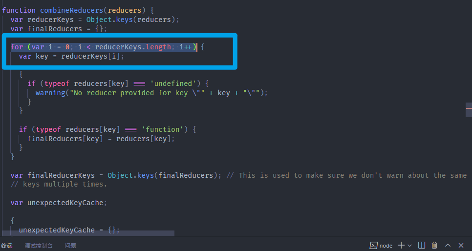

前面我们已经了解过了immutableJS的基本使用，现我们主要讲解：

1. 为何重构项目中的redux
2. 如何重构项目中的redux

## 为何重构

之前我们已经了解了**ImmutableJS**出现的原因，也就是数据可变性引发的问题：

1. 数据会被间接篡改
2. 数据拷贝引发的性能为题

在我们使用 redux 管理项目中的各个 state 时，结合**ImmutableJS**是非常有必要的，因为这些 state 庞大且复杂。

让我们看看之前所写的reducer代码：

```
import { CHANGE_TOP_BANNERS } from "./constants.js";

const defaultState = {
  topBanners: [],
};

export default function reducer(state = defaultState, action) {
  const { type } = action;
  switch (type) {
    case CHANGE_TOP_BANNERS: {
      return { ...state, topBanners: action.topBanners };
    }
    default: {
      return state;
    }
  }
}
```

* 改变数据时虽然进行了copy再合并，保证了数据不可变性
* 但 reducer 频繁的执行，就意味着要不断的重复：数据的copy、合并
* 这对内存、性能来说都是很大的消耗

而**ImmutableJS**在保证数据不可变性的同时，又能最大程度的复用原有数据，非常适合与 redux 结合使用。

## 如何重构

首先我们要先将**ImmutableJS**进行下载：

```
yarn add immutable
```

重构过程可总结为两个步骤：

**1.在哪些地方使用 immutableJS**：

* 各个子级 reducer 
* 总的 reducer

因为我们就是在 reducer 中，完成state的管理，和state的变更。

**2.更改访问 state 的方式**

​	由于使用了 immutableJS 将 redux 中的 state 变为了immutableJS中的数据结构，因此在组件中访问 state 时，也需要使用 immutableJS 对应的 API

### 各个子级reducer

```
import { Map } from "immutable";
import { CHANGE_TOP_BANNERS } from "./constants.js";

//将所管理的state转化为immutableJS中的Map
const defaultState = Map({
  topBanners: [],
});

export default function reducer(state = defaultState, action) {
  const { type } = action;
  switch (type) {
    case CHANGE_TOP_BANNERS: {
			//通过immutableJS中的API操作数据
      return state.set("topBanners", action.topBanners);
    }
    default: {
      return state;
    }
  }
}
```

### 总的reducer

​	之前我们都会使用`combineReducers`将各个子级别 reducer 进行合并，但整体依旧会作为一个 Object 进行 return。每次状态变更都会导致各个子级 reducer 、combineReducers 重新执行。

```
import { combineReducers } from "redux";

import recommendReducer from "@/pages/discover/child-pages/recommend/store";
……

const reducer = combineReducers({ 
	recommend: recommendReducer,
	……
});

export default reducer;
```

​	而 combineReducers 的执行，又会返回新的Object ，所以我们也要将这个Object转化为 immutableJS 中的 Map 类型。

#### 注意点

​	**不能直接将 Map 传入redux提供的 combineReducers**

原因解析：

 之前我们阅读过 redux 中 combineReducers 的源码：

* 先使用 Object.keys 获取各个 key
* 再使用`for`循环进行了遍历

但 immutableJS 中的 Map 不再是普通用的JS对象，因此在进行后续的操作时会报错。



#### 解决方法

我们可以使用另外一个库`redux-immutable`中，所提供的`combineReducers`。

```
yarn add redux-immutable
```

直接使用即可：不用手动转化为Map，其内部会自动完成转化过程。

```
import { combineReducers } from "redux-immutable";

import recommendReducer from "@/pages/discover/child-pages/recommend/store";
……

const reducer = combineReducers({ 
	recommend: recommendReducer,
	……
});

export default reducer;
```

### 更改访问state的方式

我们可以使用`get(key)`、`getIn(keyArr)`，完成 redux 状态的访问。

例如：在组件中访问recommend中的topBanners。

```
import { memo, useEffect } from "react";
import { useDispatch, useSelector } from "react-redux";
import { getTopBannersAction } from "./store/actionCreators.js";

function ASRecommend(props) {
  const { topBanners } = useSelector((state) => ({
    topBanners: state.getIn(["recommend", "topBanners"]),
  }));
  const dispatch = useDispatch();
  useEffect(() => {
    dispatch(getTopBannersAction());
  }, [dispatch]);

  return (
    <header id="recommend">
      <h3>recommend</h3>
      {topBanners.map((item) => (
        
      ))}
    </header>
  );
}

export default memo(ASRecommend);
```

