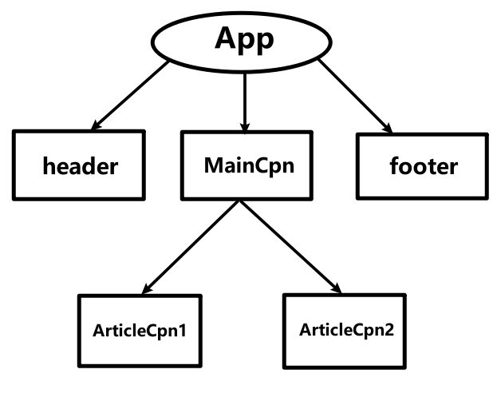

​	前面我们其实已经接触到了组件之间的嵌套，让组件之间形成父子关系，本文再详细说明一下。

​	在学习Vue时，我们已经接触到了组件化的开发，并且已经学会将组件进行抽离、复用，并且在一个组件中也能够使用其它的组件，这就是组件的嵌套。

​	我们可以将一个应用看成一个大组件，在这个组件中又包含了其它组件板块，而这些组件板块又可能包含其它的子组件，以此类推，形成一棵组件树。

Vue官方有一张图片，能够清晰的表达，在应用中组件之间的关系👇


---

在React中，我们依然可以这样组织各个组件之间的关系。

例如，下面代码所展示的组件，将会形成如图所示关系：



```
import React, { Component } from "react";

export default class App extends Component {
  render() {
    return (
      <div id="max">
        <Header />
        <MainCpn />
        <Footer />
      </div>
    );
  }
}

function Header() {
  return (
    <header>
      <h1>Header</h1>
    </header>
  );
}
function MainCpn() {
  return (
    <main>
      <ArticleCpn1 />
      <ArticleCpn2 />
    </main>
  );
}
function ArticleCpn1() {
  return <article>这是内容片段1</article>;
}
function ArticleCpn2() {
  return (
    <article>
      这是内容片段2:
      <ul>
        <li>item1</li>
        <li>item2</li>
        <li>item3</li>
      </ul>
    </article>
  );
}
function Footer() {
  return (
    <footer>
      <h1>footer</h1>
    </footer>
  );
}
```

页面效果：


