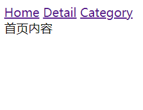
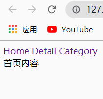

## location与histoy

之前在讲解web开发的发展历史时，了解到了SPA（Single Page Application ）单页面富应用。

​    通过不同的交互事件，来抽离对应的(html+css+js)资源进行展示，不会从后台请求资源刷新整个界面，而是替换掉部分展示内容。

**要实现URL的改变，但不刷新整个界面**，就需要用到：

* location.hash
* history

### location

1、location.herf=””   （该方法是直接指向某地址，会刷新界面）

2、⭐**location.hash**=””  （该方法是改变URL的hash值，不会刷新界面）    

* URL的hash也就是锚点(`#`), 本质上是改变window.location的href属性
* 我们可以通过直接赋值`location.hash`来改变href, 同时**保证页面不发生刷新**

### history

H5 的`history`是一个栈结构，常用方法：

* `history.pushState({data…},”title”,”URL”)`：入栈新的URL
* ` history.replaceState({data…},”title”, ”URL”)`：替换栈顶的URL
* `history.go(number)`：基于URL栈，前进后退
  * 参数Number为正，前进n步 
  * 参数Number为负，后退n步
* `history.forward()`：基于URL栈，前进一步
* `history.back()`：基于URL栈，后退一步

## 前端路由原理

前端路由是如何实现URL与内容(组件)之间映射关系的呢？那就是**监听URL的改变**。

我们分别利用上文讲到的两种模式（location.hash、history）实现。

### location.hash

* 侦听window的`hashchange`事件，通过`location.hash`访问当前的hashPath，然后个性化展示内容



```
<body>
  <a href="#/home">Home</a>
  <a href="#/detail">Detail</a>
  <a href="#/category">Category</a>
  <div class="router_view">首页内容</div>
  
  <script>
    let routerView = document.querySelector(".router_view");
    window.addEventListener("hashchange", () => {
      let hash = location.hash;
      switch (hash) {
        case "#/home": {
          routerView.innerHTML = "首页内容";
          break;
        }
        case "#/detail": {
          routerView.innerHTML = "详情内容";
          break;
        }
        case "#/category": {
          routerView.innerHTML = "分类内容";
          break;
        }
        default: {
          routerView.innerHTML = "首页内容";
        }
      }
    });
  </script>
</body>
```

### history

* 若不使用hash进行跳转，默认情况下会导致页面的刷新，所以要禁止`a`标签的默认行为
* 每次pushState时，都执行封装好的函数，根据`location.pathname`个性化展示内容
* 侦听window的`popstate`事件，当点击浏览器的（←）回退按钮时，会执行对应callback



```
<body>
  <a href="/home">Home</a>
  <a href="/detail">Detail</a>
  <a href="/category">Category</a>

  <div class="router_view">首页内容</div>
  <script>
    const routerView = document.querySelector(".router_view");
    const links = document.querySelectorAll("a");
    links.forEach((a) => {
      a.addEventListener("click", (ele) => {
        ele.preventDefault();
        let href = ele.target.getAttribute("href");
        history.pushState({}, "", href);
        changeHistory();
      });
    });

    //监听popstate操作，当点击浏览器的（←）回退按钮时，会执行对应callback
    window.addEventListener("popstate", changeHistory);

    function changeHistory() {
      let path = location.pathname;
      switch (path) {
        case "/home": {
          routerView.innerHTML = "首页内容";
          break;
        }
        case "/detail": {
          routerView.innerHTML = "详情内容";
          break;
        }
        case "/category": {
          routerView.innerHTML = "分类内容";
          break;
        }
        default: {
          routerView.innerHTML = "首页内容";
        }
      }
    }
  </script>
</body>
```

