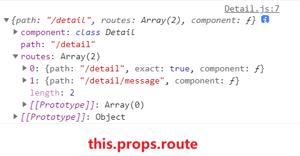
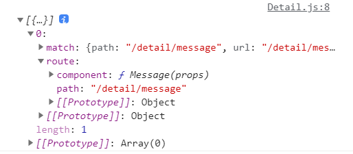

	前面我们已经学习了 react-router 的使用。但有关路由映射关系的配置我们都是直接在react-router提供的**Route组件**中完成的，如果路由的配置很复杂，就会导致组件内部代码过于繁多，不易维护。

​	之前学习Vue时，其路由配置是在单独的 JS 文件中处理的，我们也希望将react-router路由映射关系单独抽离出去。

此时，我们可以使用**react-router-config**包，完成抽离。

## 使用过程

### 抽离路由配置

安装`react-router-config`：

```shell
yarn add react-router-config
```

将路由映射关系，抽离到`src/router/index.js`

* 通过一个对象数组，完成各个路由映射关系的配置。
* 可在某个对象中，继续嵌套**routes**选项，配置该路由对应的各个子路由

```
import Home from "../pages/Home.js";
import Detail from "../pages/Detail/Detail.js";
import Message from "../pages/Detail/Message.js";
import Product from "../pages/Detail/Product.js";
import NoMatch from "../pages/NoMatch.js";

const routes = [
  {
    path: "/",
    exact: true,
    component: Home,
  },
  {
    path: "/detail",
    component: Detail,
    routes: [
      {
        path: "/detail",
        exact: true,
        component: Product,
      },
      {
        path: "/detail/message",
        component: Message,
      },
    ],
  },
  {
    component: NoMatch,
  },
];

export default routes;
```

### renderRoutes

**App.js**

​	将之前 Switch 包裹的各个 Route 配置，换成react-router-config提供的**renderRoutes功能函数，并传入抽离的routes**，即可自动完成路由配置：

* renderRoutes内部其实也是使用 Switch 将各个Route进行包裹，只不过它自动帮我们完成了此过程（后文会有[源码分析](##源码分析)）
* 由于内部使用的是Switch，所以在一些具有重复部分的patch路由配置时，要设置exact，例如上文对根路径、嵌套路由都配置了exact。避免一旦path与前面重复部分的路径相匹配：Switch就停止判断，导致后续组件不能渲染。

```
{renderRoutes(routes)}

{/* 
		<Switch>
    	<Route exact path="/" component={Home} />
      <Route path="/detail" component={Detail}/>
      <Route component={NoMatch} />
 		</Switch>
*/}
```

**Detail.js**

​	该案例在子组件中，也需要路由跳转，我们也可以在子组件中使用renderRoutes。但值得注意的是：**必须传入对应子路由部分的配置**

你可能会写出以下代码，很显然，虽然可以使用，但有点不合适（直接通过索引访问）。

```
import routes from "../../router";
……
<div id="detail">
  <h2>Detail组件内容</h2>
  <NavLink exact to="/detail">商品</NavLink>
  <NavLink to="/detail/message">消息</NavLink>
  {renderRoutes(routes[1].routes)}
</div>
……
```

当然，我们可以将子路由配置单独抽离再引入

```
/* router/index.js */
……
import detailChildRouter from "./detailChild.js";

const routes = [
  ……
  {
    path: "/detail",
    component: Detail,
    routes: detailChildRouter,
  },
	……
];

export default routes;
```

```
/* Detail.js */
import routes from "../../router/detailChild.js";
……
{renderRoutes(routes)}
……
```

#### this.props.route

​	但实际上，如果使用 react-router-config 管理的路由跳转组件，我们可以在路由跳转组件中通过`this.props.route`访问**当前活跃的路由对象**，因此我们可以访问到之前配置的`routes`属性，也就是该路由的子路由配置。

```
{renderRoutes(this.props.route.routes)}
```



### matchRoutes

实际上react-router-config还提供了一个`matchRoutes`功能函数，用于获取某个路由对象：

`matchRoutes(routes, pathname)`

* routes：路由对象数组
* pathname：将要匹配的路径
* 通过pathname，在routes中查找匹配的路由对象信息，并返回。

例如在 Detail.js 中：

```
const routes = matchRoutes(this.props.route.routes, "/detail/message");
console.log(routes);
```



## 源码分析

`node_modules/react-router-config/cjs/react-router-config.js`

#### **matchRoutes**

* 初始化branch变量存储结果
* 如果与传入的pathname匹配，则向branch中push

```
function matchRoutes(routes, pathname,branch) {
  if (branch === void 0) {
    branch = [];
  }

  routes.some(function (route) {
    var match = route.path ? reactRouter.matchPath(pathname, route) : branch.length ? branch[branch.length - 1].match // use parent match
    : reactRouter.Router.computeRootMatch(pathname); // use default "root" match

    if (match) {
      branch.push({
        route: route,
        match: match
      });

      if (route.routes) {
        matchRoutes(route.routes, pathname, branch);
      }
    }

    return match;
  });
  return branch;
}
```

#### **renderRoutes**

**核心部分梳理**

判断routes是否存在

* 若不存在则返回null，在JSX中使用renderRoutes时则什么都不渲染。
* 若存在，则先创建一个`reactRouter.Switch`用于包裹各个Route组件
* 然后使用map方法遍历routes，依次创建Route组件，并根据各个route对象的配置设置各个属性，然后返回。
* 并且扩充了映射组件的props，传入了当前route对象，因此才能够使用`this.props.route`

>在源码中可以发现，render选项是优先于component的，如果配置了render选项，则会按照render的返回值渲染。
>
>* render选项需要配置为function，且需要return所渲染的JSX（可以用来做路由重定向）
>
>```
>render: ()=>( <Redirect to="path"/> );
>```

**参数**

可以发现，还提供了extraProps，switchProps参数

* extraProps：供我们为各个映射组件传入额外的props，在扩充props时，一起合并。
* switchProps：供我们为Switch组件传入额外props

```
function renderRoutes(routes, extraProps, switchProps) {
  if (extraProps === void 0) {
    extraProps = {};
  }

  if (switchProps === void 0) {
    switchProps = {};
  }

  return routes ? React.createElement(reactRouter.Switch, switchProps, routes.map(function (route, i) {
    return React.createElement(reactRouter.Route, {
      key: route.key || i,
      path: route.path,
      exact: route.exact,
      strict: route.strict,
      render: function render(props) {
        return route.render ? route.render(_extends({}, props, {}, extraProps, {
          route: route
        })) : React.createElement(route.component, _extends({}, props, extraProps, {
          route: route
        }));
      }
    });
  })) : null;
}
```

可以发现renderRoutes最后的返回结果，在结构上与我们使用react-router-config之前是一样的：

```
<Switch>
	<Route path="xxx" component="xxx" ……/>
	<Route path="xxx" component="xxx" ……/>
	……
</Switch>
```

