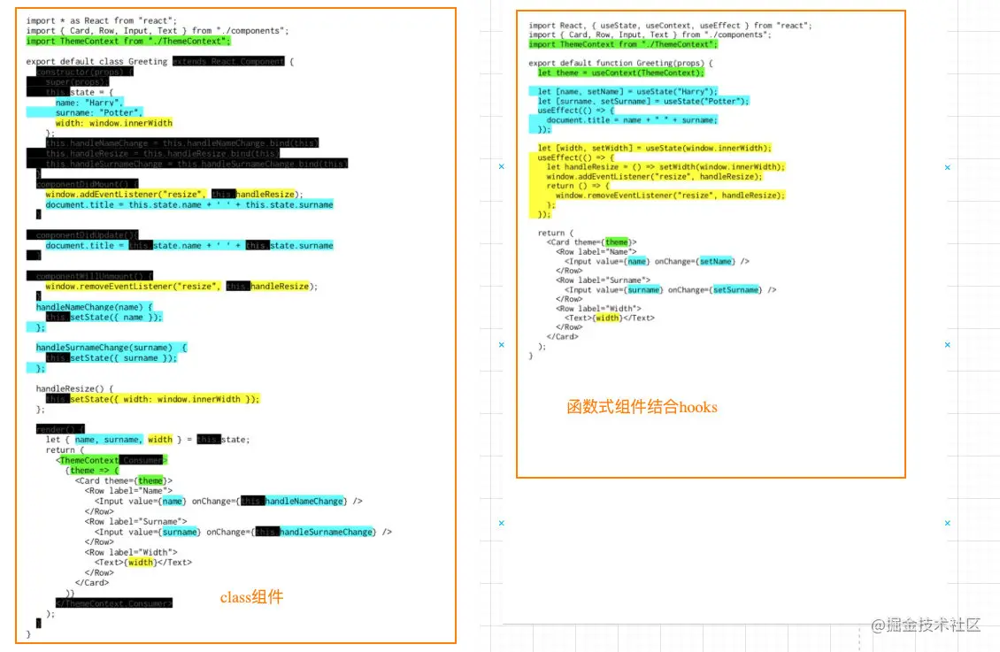

## 为何使用Hook？

`Hook` 是 React 16.8 的新增特性，它可以让我们在不编写class组件的情况下维护自身的state，以及具有其他的class组件特性（比如生命周期）。让函数组件有了新的生命力。

### class组件优缺点

#### 优点

我们先来思考一下`class组件`相对于`函数组件`有什么优势？其实这些问题，我们在之前的学习过程中一直都有提及：

**1. class组件可以维护自身的state**

​	为什么`函数组件`不可以呢？原因很简单：因为函数每次调用都会产生新的临时变量。

​	试想一下，在`函数组件`中定义局部变量，并与 JSX 绑定，但每次视图更新时，又会重新执行函数体，这些局部变量又会被初始化，因此这些state不能够被持续维护。

​	而在class组件中，每次视图更新时，只是重新执行render函数，内部的state并不会初始化，可以通过`this.state.propName`访问自身的状态；`this.setState()`管理自身状态。

**2. class组件有自己的生命周期**

​	class组件具有自己的生命周期函数，但是`函数组件`没有，也正是如此，有一些功能，`函数组件`并不能很好的实现。

- 比如在`componentDidMount`中发送网络请求，该生命周期函数只会执行一次；
- 如果在`函数组件`中发送网络请求，意味着每次重新渲染都会重新发送一次网络请求。

所以，在Hook出现之前，对于上面这些情况我们通常都会编写class组件。

#### 缺点

**复杂组件变得难以理解：**

- 随着业务的增多，我们的class组件会变得越来越复杂；
- 比如componentDidMount中，可能就会包含大量的逻辑代码：
  - 包括网络请求
  - 一些事件的侦听（为性能考虑，还需要在componentWillUnmount中移除侦听）；
- 并且这些代码实际上非常难以拆分：因为它们的逻辑往往混在一起，强行拆分反而会造成过度设计，增加代码的复杂度；

**this的绑定：**

* 在 JSX 中通过绑定事件，调用组件内部的方法，如果方法中需要访问组件的this，就需要考虑this的绑定，这个过程重复且繁琐

**组件复用状态很难**：

在之前为了实现状态的复用，我们学习了很多内容：

传统方式：

* `props`的传递：深层级传递，很难维护。
* `Context.Provider/Consumer`共享状态：多次使用Consumer时，代码就会存在很多嵌套；
* 依赖`events`实现事件总线。

高阶组件：

- 自定义高阶组件，完成props的拦截，以及将Context共享状态映射到props中
- 像我们之前学习的redux中connect或者react-router中的withRouter，这些高阶组件设计的目的就是为了状态的复用；

而这些实现过程不管是从编写和设计上来说，都变得比较困难、繁琐。

### Hooks的特点

Hook的出现，可以解决上面提到的这些问题：

- **它可以让我们在不编写class组件的情况下维护自身的state，以及具有其他的class组件特性**（比如生命周期）。让函数组件有了新的生命力。

- 但是我们可以由此延伸出非常多的用法，来让我们前面所提到的问题得到解决；

- 并且它还可以让我们的代码更加简洁、可读。

  

  

Hook的使用场景：

- Hook的出现基本可以代替我们之前所有使用class组件的地方（除了一些非常不常用的场景）；
- 但是如果是一个旧的项目，你并不需要直接将所有的代码重构为Hooks，因为它`完全向下兼容`，你可以`渐进式`的来使用它；
- **Hook只能在函数组件中使用**，不能在类组件，或者函数组件之外的地方使用；

## 体验hooks

我们通过一个计数器案例，来对比一下class组件和函数式组件结合hooks的代码：

class组件实现：

```
import { PureComponent } from "react";

export default class Counter extends PureComponent {
  constructor(props) {
    super(props);
    this.state = {
      count: 0,
    };
  }
  render() {
    const { count } = this.state;
    return (
      <div>
        <h2>当前数字：{count}</h2>
        <button onClick={this.decrement.bind(this)}>-1</button>
        <button onClick={this.increment.bind(this)}>+1</button>
      </div>
    );
  }
  increment() {
    this.setState({ count: this.state.count + 1 });
  }
  decrement() {
    this.setState({ count: this.state.count - 1 });
  }
}
```

函数组件结合hooks：

```
import { useState } from "react";

export default function Counter(props) {
  const countArr = useState(0);
  const count = countArr[0];
  const setCount = countArr[1];

  return (
    <div>
      <h2>当前数字：{count}</h2>
      <button onClick={() => setCount(count - 1)}>-1</button>
      <button onClick={() => setCount(count + 1)}>+1</button>
    </div>
  );
}
```

代码优化：直接解构赋值

```
export default function Counter(props) {
  let [count, setCount] = useState(0);
  return (
    <div>
      <h2>当前数字：{count}</h2>
      <button onClick={() => setCount(count - 1)}>-1</button>
      <button onClick={() => setCount(count + 1)}>+1</button>
    </div>
  );
}
```

## 案例分析：

​	通过上述案例可知：函数组件结合hooks让整个代码变得非常简洁，并且再也不用考虑this指向的问题。

- 点击button按钮后，会完成两件事情：
  - 调用setCount，更新对应state
  - 组件重新渲染
- React在重新渲染时，会保留这个state状态，并不会每次都使用初始化值，因此能够持续维护state。

## 注意点

Hook 就是 JavaScript 函数，这个函数可以帮助你 `钩入（hook into）` React State以及生命周期等特性；

但是使用它们会有两个额外的规则：

- 只能在**函数最外层**调用 Hook。
  - 不要在循环、条件判断或者子函数中调用。
- 只能在 **React 的函数组件**或**自定义Hook**中调用 Hook
  - 不要在其他 JavaScript 函数中调用

