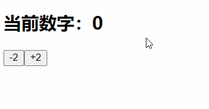
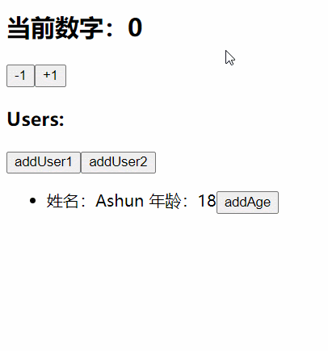
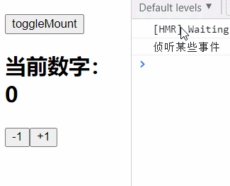
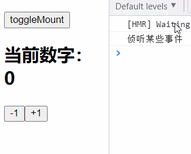

# State Hook

State Hook的API就是 `useState`，我们在前面已经进行了简单体验。

## 语法补充

`useState(initValue/()=>initValue)`，让函数组件能够持续管理state：

* useState是一个函数，通过第一个参数，设置该state的初始值，若不设置则为undefined。
  * 可以直接传入初始值
  * 也可传入一个function最后将初始值return
* useState调用后，返回一个Array，只包含两个元素
  1. `state`：访问其状态值
  2. `setState(newState/(prevState)=>newState)`：是一个函数，通过该函数更新对应的state。
     * 可直接传入新的state
     * 也可传入一个callback，该callback接收参数prevState用于访问之前的state，最后需将新的state返回。（**该方式可避免setState操作的合并**，在之前学习class组件的setState时，也有这样的特性）

**案例体验**

* setCount如果传入function的形式更新state，则多次操作不会合并。
* 若直接传入newState更新，则多次操作会进行合并，只会执行最后一次的setCount



```
import { useState } from "react";

export default function Counter(props) {
  let [count, setCount] = useState(() => 0);
  function addTwo() {
    setCount((prevCount) => prevCount + 1);
    setCount((prevCount) => prevCount + 1);
  }
  function subTwo() {
    setCount(count - 1);
    setCount(count - 1);
  }
  return (
    <div>
      <h2>当前数字：{count}</h2>
      <button onClick={() => subTwo()}>-2</button>
      <button onClick={() => addTwo()}>+2</button>
    </div>
  );
}
```

## 注意点

当然，我们也可以在一个组件中多次使用`useState`，来维护多个状态。

* 如果维护的state比较复杂（数组、对象），则要注意**state 的不可变性**，因为useState内部也帮我们做了SCU优化，会将新旧数据进行**浅比较**

**案例体验**

* `addUser1`能够正常触发更新机制：因为在更新state时，产生了新的引用，而不是与原来的users共享内存空间。
* `addUser2`该方式虽然能改变users，但在更新state时传入了与旧数据相同的引用。此时就会认为前后数据没有改变，因此不会触发更新。

```
import { useState } from "react";

export default function TestStateHook(props) {
  const [count, setCount] = useState(0);
  const [users, setUsers] = useState([{ name: "Ashun", age: 18 }]);

  function addUser1() {
    const name = `Ashun${Date.now().toString().substr(-3, 3)}`;
    const user = { name, age: 18 };
    setUsers([...users, user]);
  }
  function addUser2() {
    /*  注意state的不可变性，该方式虽然能改变users，但不会触发更新*/
    const name = `Ashun${Date.now().toString().substr(-3, 3)}`;
    const user = { name, age: 18 };
    let newUsers = users;
    newUsers.push(user);
    setUsers(newUsers);
  }
  function addAge(item) {
    let newUsers = [...users];
    newUsers.find((v) => v === item).age++;
    setUsers(newUsers);
  }
  return (
    <div>
      <div className="counter">
        <h2>当前数字：{count}</h2>
        <button onClick={() => setCount(count - 1)}>-1</button>
        <button onClick={() => setCount(count + 1)}>+1</button>
      </div>
      <div className="users">
        <h3>Users:</h3>
        <button onClick={(e) => addUser1()}>addUser1</button>
        <button onClick={(e) => addUser2()}>addUser2</button>
        <ul>
          {users.map((item, index) => (
            <li key={item.name}>
              <span>
                姓名：{item.name} 年龄：{item.age}
              </span>
              <button onClick={(e) => addAge(item)}>addAge</button>
            </li>
          ))}
        </ul>
      </div>
    </div>
  );
}
```



# Effect Hook

## Effect基本使用

通过`useEffect(callback,[...dep])`，可以告知React在`DOM渲染后`或`依赖变更后`执行哪些操作；

参数1：

- 该callback，在React完成DOM渲染操作之后，就会自动回调；
- 也就是说：默认情况下，无论是第一次挂载，还是每次更新之后，都会执行这个callback；
- 并且该callback还可以继续返回一个callback（后文讲解）

参数2：（后文讲解）

**案例体验**

假如我们现在有一个需求：网页的title总是显示最新的counter数字，对比class组件、函数组件结合effect hook。

class组件实现：

* 为了保证counter的实时性，我们需要在两个生命周期函数（`componentDidMount`、`componentDidUpdate`）中做相同的操作

```
import { PureComponent } from "react";

export default class Test extends PureComponent {
  constructor(props) {
    super(props);
    this.state = {
      count: 0,
    };
  }
  componentDidMount() {
    document.title = this.state.count;
  }
  componentDidUpdate() {
    document.title = this.state.count;
  }
  render() {
    const { count } = this.state;
    return (
      <div>
        <h2>当前数字：{count}</h2>
        <button onClick={() => this.setState({ count: count - 1 })}>-1</button>
        <button onClick={() => this.setState({ count: count + 1 })}>+1</button>
      </div>
    );
  }
}
```

函数组件结合effect hook：

* useEffect中的callback在每次完成DOM渲染操作后，都会回调执行，包括第一次组件挂载后的渲染。

```
import { useEffect, useState } from "react";

export default function TestEffectHook(props) {
  let [count, setCount] = useState(() => 0);
  useEffect(() => {
    document.title = count;
  });
  return (
    <div>
      <h2>当前数字：{count}</h2>
      <button onClick={() => setCount(count - 1)}>-1</button>
      <button onClick={() => setCount(count + 1)}>+1</button>
    </div>
  );
}
```

## 清除Effect

​	通过上文可知，我们可以使用 useEffect 模拟class组件中的两个生命周期函数：`componentDidMount`、`componentDidUpdate`。

​	通常我们会在组件挂载后`componentDidMount`去侦听一些事件，并且为了性能考虑，需要在**组件卸载后取消事件的侦听**。

实际上 useEffect 还可模拟class组件中的`componentWillUnmount`：

useEffect 接收一个callbackA，我们可以在callbackA中继续返回一个回调函数callbackB，并且callbackB会在某些时机自动执行：

* 组件更新后
* 组件卸载后

**案例体验**

App,js

```
import { useState } from "react";
import TestEffectHook from "./pages/TestEffectHook.js";

export default function App() {
  const [isShow, setShow] = useState(true);

  return (
    <main id="app">
      <h2>App</h2>
      <button onClick={() => setShow(!isShow)}>toggleMount</button>
      {isShow && <TestEffectHook />}
    </main>
  );
}
```

TestEffectHook.js

```
import { useEffect, useState } from "react";

export default function TestEffectHook(props) {
  let [count, setCount] = useState(() => 0);
  useEffect(() => {
    console.log("侦听某些事件");
    return () => {
      console.log("取消事件侦听");
    };
  });
  return (
    <div>
      <h2>当前数字：{count}</h2>
      <button onClick={() => setCount(count - 1)}>-1</button>
      <button onClick={() => setCount(count + 1)}>+1</button>
    </div>
  );
}
```



* 虽然我们能够通过callbackA再次返回callbackB的方式，去模拟`componentWillUnmount`，但callbackB还会在组件更新时优先执行。
* 而我们只希望这些取消事件侦听的操作，只在组件卸载后执行。因为频繁的更新操作，就会导致callbackB的不断回调。

我们可以对Effect的性能进行优化👇（useEffect的第二个参数）

## Effect性能优化

上文讲到的性能优化，是通过useEffect的第二个参数完成的：

* `[...dep]`：整体为一个Array，各个元素代表useEffect所侦听的依赖项。

若传入了第二个参数，则useEffect的执行时机会有一些改变：

* callbackA 执行时机：组件初次挂载后、依赖项变更后。
* callbackB 执行时机：组件卸载后。

因此，如果我们想要实现上文的性能优化，完全可以在第二个参数传入空数组`[]`。

因为事件的侦听，我们只希望在组件挂载后执行。取消侦听只希望在组件卸载后执行。

* 而此时useEffect的第二个参数为`[]`,代表没有依赖项，因此 callbackA 只会在组件初次挂载后执行。
* 由于传入了第二个参数，callbackB 只会在组件卸载后执行



```
useEffect(() => {
  console.log("侦听某些事件");
  return () => {
    console.log("取消事件侦听");
  };
},[]);
```

## 使用多个Effect

前面我们学习了useEffect第二个参数的作用。第二个参数的传递，可以让useEffect的执行目的更加明确，在使用多个Effect时，性能也会更好。

* 因为某些业务的处理，只和部分state有关，我们可以使用多个Effect针对不同依赖项的变更，做对应的操作。
* 而不是在某个state变更时，所有的Effect都一并执行。

**案例体验**

* 发送网络请求、事件侦听，这些业务只需要在组件初次挂载时执行。因此useEffect第二个参数可传入`[]`。
* 一些state的变更操作，可以单独的抽离，并且这些操作只在相关state变更时才会执行。
  * 例如下例的count

```
import { useEffect, useState } from "react";

export default function TestEffectHook(props) {
  let [count, setCount] = useState(() => 0);
  
  /* count 改变时的业务处理 */
  useEffect(() => {
    console.log("count变更");
  }, [count]);
  
  /* 发送网络请求 */
  useEffect(() => {
    console.log("发送网络请求");
  }, []);
  
  /* 事件侦听业务 */
  useEffect(() => {
    console.log("侦听某些事件");
    return () => {
      console.log("取消事件侦听");
    };
  }, []);

  return (
    <div>
      <h2>当前数字：{count}</h2>
      <button onClick={() => setCount(count - 1)}>-1</button>
      <button onClick={() => setCount(count + 1)}>+1</button>
    </div>
  );
}
```

## 总结

### 用法总结

通过`useEffect(callback,[...dep])`，可以告知React在`DOM渲染后`或`依赖变更后`执行哪些操作；

**参数1：callback**

- 在React完成DOM渲染操作之后，就会自动回调；
- 默认情况下，无论是第一次挂载，还是每次更新之后，都会执行这个callback；
- callback还可以返回一个callbackB。
  - 默认情况下：callbackB执行时机为 组件更新、卸载后。

**参数2：[...dep]**

* 整体为一个Array，各个元素代表useEffect所侦听的依赖项。
* 如果传入了第二个参数，callback的执行时机会发生改变
  * callbackA 执行时机：组件初次挂载后、依赖项变更后。
  * callbackB 执行时机：组件卸载后。

### 优点

对比class组件中生命周期函数，useEffect显然有很多优点：

* `componentDidMount`中的业务不能很好的抽离，一些网络请求、事件侦听，等等业务都耦合在一起。
  * 而useEffect可以很好的实现抽离，可以使用多个useEffect处理不同的业务。
* `componentDidUpdate`只要触发更新，内部所有业务都会执行，但有些业务只希望在对应state变更时才执行。
  * 而useEffect可以通过侦听依赖项的改变，独立的执行某部分业务

# Context Hook

在之前的学习过程中，我们要在组件中使用Context共享状态有两种方式：

- class组件可以通过设置`contextType` 静态属性的方式，在类中获取Context共享的状态；
- 若使用多个Context或者在函数组件中，通过 `MyContext.Consumer` 方式获取Context共享的状态；

但使用多个Context会让我们的JSX代码存在大量的嵌套。而我们现在要学习的 Context Hook 可以解决这个问题

- **Context Hook允许我们通过**`useContext(myContext)`**直接获取某个Context的值**

```
const value = useContext(MyContext);
```

* 当组件上层最近的 `<MyContext.Provider>` 更新时，该 Hook 会触发更新机制重新渲染，并使用最新的Context数据。

**案例体验**

App.js

* 创建Context，并导出
* 使用Context.Provider包裹需要共享状态的组件

```
import { createContext } from "react";
import TestContextHook from "./pages/TestContextHook.js";

export const UserContext = createContext();
export const ThemeContext = createContext();

export default function App() {
  return (
    <main id="app">
      <h2>App</h2>
      <UserContext.Provider value={{ name: "Ashun", age: 18 }}>
        <ThemeContext.Provider value={{ color: "#00cec9", fontWeight: "bold" }}>
          <TestContextHook />
        </ThemeContext.Provider>
      </UserContext.Provider>
    </main>
  );
}
```

TestContextHook.js

* 从App.js中导入需要使用的Context
* 利用`useContext`hook直接访问目标Context所共享的数据。

```
import { useContext } from "react";
import { UserContext, ThemeContext } from "../App";

export default function TestContextHook(props) {
  const UserContextValues = useContext(UserContext);
  const ThemeContextValues = useContext(ThemeContext);

  console.log(UserContextValues);
  console.log(ThemeContextValues);

  return (
    <div>
      <h2>TestContextHook</h2>
    </div>
  );
}
```

