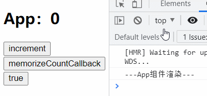
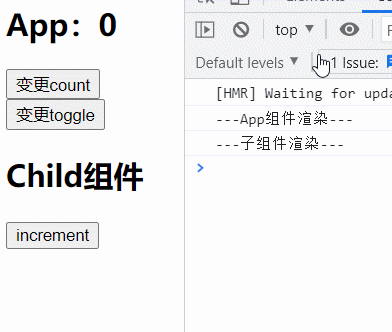
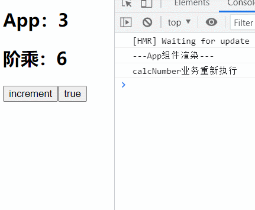
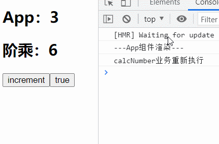
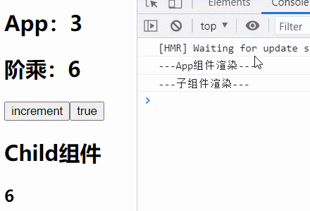
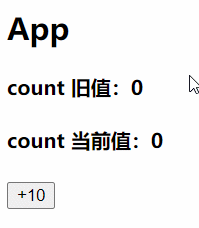

前面我们已经学习了一些基础的 hook API，用来简便的完成class组件中的一些特性：

* useState：让函数组件能够维护自身的state
* useEffect：能够模拟一些生命周期函数
* useContext：访问Context共享的数据

但 hook 的功能不仅仅只有这些，本文来学习一些 高级hook API ：

* [useReducer](##useReducer)
* [useCallback](##useCallback)
* [useMemo](##useMemo)
* [useRef](##useRef)
* [useImperativeHandle](##useImperativeHandle)
* [useLayoutEffect](##useLayoutEffect)

## useReducer

### 基本介绍

你在接触 useReducer 后，可能感觉是 redux 的某个替代品，但其实并不是。

虽然 useReducer 的使用过程与redux非常相似，但 **useReducer 仅仅是useState 的一种替代方案**：

- 在某些场景下，如果state的处理逻辑比较复杂，我们可以通过useReducer来对其进行拆分；
- 或者这次修改的state需要依赖之前的state时，也可以使用

### 使用过程

useReducer 是一个函数，我们一般传入两个参数：

1. reducer：用于变更state的reducer函数
2. initState：所管理的state初始值

useState调用后，返回一个Array，只包含两个元素:

1. `state`：访问所管理state
2. `dispatch`：是一个函数，通过该函数派遣 action ，最终交给reducer函数处理状态变更

**案例体验**

reducer/counter.js

```
export function counterReducer(state, action) {
  const { type } = action;
  switch (type) {
    case "increment": {
      return { ...state, count: state.count + 1 };
    }
    case "decrement": {
      return { ...state, count: state.count - 1 };
    }
    default: {
      return state;
    }
  }
}
```

Home,js

```
import { useReducer } from "react";
import { counterReducer } from "../reducer/counter.js";

export default function Home() {
  const [CounterState, dispatch] = useReducer(counterReducer, { count: 0 });

  return (
    <div id="home">
      <h2>Home计数器：{CounterState.count}</h2>
      <button onClick={e => dispatch({type: "decrement"})}>-1</button>
      <button onClick={e => dispatch({type: "increment"})}>+1</button>
    </div>
  );
}
```

Profile.js

​	在其他组件中也使用相同的 reducer 管理对应组件的 state，数据是不会共享的，它们只是使用了相同的 counterReducer 的函数而已。

​	每次使用 useReducer 时，第二个参数（也就是所管理的state）都需要重新传入，因此useReducer可以共享reducer函数，但并不能够共享数据。

**所以，useReducer只是useState的一种替代方案，并不能替代Redux。**

```
import { useReducer } from "react";
import { counterReducer } from "../reducer/counter.js";

export default function Profile(props) {
  const [CounterState, dispatch] = useReducer(counterReducer, {
    count: 6,
    title: "Ashuntefannao",
  });

  return (
    <div id="profile">
      <h2>Profile计数器：{CounterState.count}</h2>
      <h2>{CounterState.title}</h2>
      <button onClick={e => dispatch({type: "decrement"})}>-1</button>
      <button onClick={e => dispatch({type: "increment"})}>+1</button>
    </div>
  );
}
```

## useCallback

### 基本介绍

`useCallback(callback,[...dep])`的实际应用是为了进行性能优化。

如何进行性能的优化呢？

- useCallback 会返回一个函数的 memorized（记忆） 值；
- 在依赖项不变的情况下，多次执行，返回的函数是相同的；

```
const memorizeCallback = useCallback(callback, [...dep]);
```

但并不代表无脑使用 useCallback 都能够实现性能优化，某些情况下并没有性能优化效果👇

### 错误使用

若使用 useCallback 产生的方法，**只是在本组件中使用**，并不会传递给子组件，此时**没有性能优化效果**。

**原因分析**：

​	对于本组件来说，只要状态更新，就会触发组件更新机制重新渲染，整个函数组件中的所有逻辑都会重新执行，包括 useCallback ，即便我们改变的不是useCallback 所侦听的依赖项，但组件依旧会因为状态变更而导致更新。

**案例体验**：



```
export default function App() {
  console.log("---App组件渲染---");

  const [toggle, setToggle] = useState(true);
  const [count, setCount] = useState(0);

  const increment = () => {
    setCount(count + 1);
  };
  const memorizeCountCallback = useCallback(() => {
    setCount(count + 1);
  }, [count]);

  return (
    <main id="app">
      <h2>App：{count}</h2>
      <button onClick={increment}>increment</button>
      <button onClick={memorizeCountCallback}>memorizeCountCallback</button>
      <button onClick={setToggle.bind(this, !toggle)}>
        {toggle.toString()}
      </button>
    </main>
  );
}
```

### 正确使用

​	反之，若使用 useCallback 产生的方法，**传递给子组件**，**且子组件使用了memo**，此时才具有性能优化的效果。

**原因分析**：

​	我们知道：默认情况下，当父组件更新时，子组件也会强行更新，因此我们之前学习了SCU优化。当子级函数组件使用了`memo`时，内部会将新旧`state`、`props`进行浅层比较，从而判断是否需要进行更新。

​	由于 useCallback 返回的一直是同一个函数的引用，因此作为props传入子组件时、且子组件结合memo时，由于新旧props是相同的，所以并不会造成子组件的更新，从而达到性能优化的效果：避免子组件的无用更新。

**案例体验**：

App.js

```
import { useCallback, useState } from "react";
import Child from "./pages/Child.js";

export default function App() {
  console.log("---App组件渲染---");

  const [toggle, setToggle] = useState(true);
  const [count, setCount] = useState(0);

  const memorizeCountCallback = useCallback(() => {
    setCount(count + 1);
  }, [count]);

  return (
    <main id="app">
      <h2>App</h2>
      <button onClick={memorizeCountCallback}>
        变更count
      </button>
      <button onClick={(e) => {setToggle(!toggle)}}>
        变更toggle
      </button>
      <Child increment={memorizeCountCallback} />
    </main>
  );
}
```

Child.js

```
import { memo } from "react";

function Child(props) {
  console.log("---子组件渲染---");
  return (
    <div id="child">
      <h2>Child组件</h2>
      <button onClick={props.increment}>increment</button>
    </div>
  );
}
export default memo(Child);
```



`memorizeCountCallback`只有在依赖项`count`发生变更时，才会创建新的函数，因此：

* 点击父组件中的(变更count)按钮、子组件中的(increment)按钮，都会改变count，所以父子组件都会重新渲染。
* 点击父组件中的(变更toggle)按钮，由于不是`memorizeCountCallback`所侦听的依赖项，所以toggle的改变，不会让其产生新的引用，因此只有父组件重新渲染

## useMemo

### 基本介绍

`useMemo(callback,[...dep])`也是为了性能优化，但由于其特性与 useCallback 不同，所以优化场景也不同。

如何进行性能的优化呢？

- useMemo返回的也是一个 memorized（记忆） 值
  - 但与 useCallback 不同，useCallback 返回的是所传入**callback函数**的记忆值
  - 而 useMemo 返回的是所传入**callback执行结果**的记忆值
- 在依赖项不变的情况下，所传入的callback中的业务不会重新执行（返回的值是相同的）

```
const memoizedValue = useMemo(callback, [...dep]);
```

### 优化场景1

由于状态变更会触发更新机制，函数组件中的所有逻辑都会重新执行，我们就会遇到下述问题：

* 组件中有两个状态(或更多状态)：state1、state2。两种状态变更时都有对应的业务要执行。
* 若只是state1发生变更，由于触发更新机制，组件中的所有逻辑都会重新执行，则与state2相关的业务也会重新执行，但state2并没有发生改变，却造成了业务的重新执行，并且state2的业务可能是最复杂的。

所以，**我们希望一些复杂的操作，只在对应state发生变更时重新执行，而不受其它state的影响**。

我们就可以使用useMemo来完成：在依赖项不变的情况下，所传入的callback中的业务不会重新执行。

**案例体验**：

优化前：



* toggle的改变，也会导致count相关业务重新执行。

```
import { useState } from "react";

function calcNumber(count) {
  console.log("calcNumber业务重新执行");
  let sum = 1;
  for (let i = 1; i <= count; i++) {
    sum *= i;
  }
  return sum;
}

export default function App() {
  console.log("---App组件渲染---");

  const [toggle, setToggle] = useState(true);
  const [count, setCount] = useState(3);

  const increment = () => {
    setCount(count + 1);
  };
  const getFactorial = calcNumber(count);

  return (
    <main id="app">
      <h2>App：{count}</h2>
      <h2>阶乘：{getFactorial}</h2>
      <button onClick={increment}>increment</button>
      <button onClick={setToggle.bind(this, !toggle)}>
        {toggle.toString()}
      </button>
    </main>
  );
}
```

优化后：



* toggle的改变，不会导致count相关业务重新执行。
* 只有count变更时，相关业务才会重新执行。

```
const getFactorial = useMemo(() => calcNumber(count), [count]);
```

### 优化场景2

**避免子组件无用渲染**：

​	该优化场景我们在useCallback已经接触过了，在这里使用useMemo实现，原理是一样的，都是为了避免：在父组件中其它无关的state发生变更时，导致传入子组件的props更新，即便子组件使用了memo，也会导致子组件重新渲染。

* 只不过使用useMemo，向子组件传递的是callback执行结果所返回的memorized值
* 使用useCallback，向子组件传递的是callback函数的memorized值。

**案例体验：**

App.js

```
import { useMemo, useState } from "react";
import Child from "./pages/Child";

function calcNumber(count) {……}

export default function App() {
  ……
  return (
    <main id="app">
      ……
      <Child factorial={getFactorial} />
    </main>
  );
}
```

Child.js

```
import { memo } from "react";

function Child(props) {
  console.log("---子组件渲染---");
  return (
    <div id="child">
      <h2>Child组件</h2>
      <h3>{props.factorial}</h3>
    </div>
  );
}
export default memo(Child);
```



* 无关state的变更，不会导致useMemo重新执行
* useMemo返回值作为props传入子组件，再结合memo，解决子组件无用的重新渲染。

### 实现useCallback

经过之前的学习我们已经熟知：

- useCallback 返回的是所传入**callback函数**的记忆值
- useMemo 返回的是所传入**callback执行结果**的记忆值

那么使用 useMemo 实现 useCallback 也非常简单，只需要让useMemo所传入的callback返回值为目标函数即可。

```
const memorizeCallback = useMemo(()=>callback, [...dep]);
```

## useRef

### 知识回顾

​	在之前的我们学习过`refs`的使用，通过为某个`DOM元素`或`class组件标签`绑定 **ref **属性，来获取对应的`DOM节点`或`组件对象`。ref 的属性值可以有三种绑定类型：

1. String：后期通过`this.refs["propName"]`访问
2. createRef：后期通过对应 state的current属性访问
3. callback：该函数会在`目标DOM元素`或`组件`**挂载后**自动回调执行，可在其中将`ele`赋值给某个state，后期通过该state访问。

值得注意的是：

* **不能在函数组件标签**上使用 ref 属性，因为它们没有实例。
* 如果希望获取`函数组件`中的某个DOM元素，或其中嵌套的class组件，可通过**forwardRef **高阶组件完成 ref 的转发。

### 基本使用

在函数组件中，我们可以通过`useRef`实现 refs 的使用，其特性与原来相同：

* 只能为某个`DOM元素`或`class组件标签`绑定 **ref **属性
* 函数组件没有实例，因此不能再函数组件标签上使用 ref 属性

使用步骤：

1. 调用`useRef`并初始化变量进行接收
2. 为某个`DOM元素`或`class组件标签`绑定 **ref **属性
3. 后期即可通过对应变量进行访问

案例体验：

App.js

* h2Ref：访问DOM节点
* childRef：访问class组件对象
* child1Ref：通过 forwardRef 完成 ref 的转发，访问函数组件中的某个DOM元素。

```
import { useEffect, useRef } from "react";
import Child from "./pages/Child";
import Child1 from "./pages/Child1";

export default function App() {
  const h2Ref = useRef();
  const childRef = useRef();
  const child1Ref = useRef();
	//组件挂载后访问
  useEffect(() => {
    console.log("App->h2", h2Ref.current);
    console.log("child", childRef);
  }, []);
  return (
    <main id="app">
      <h2 ref={h2Ref}>App</h2>
      <Child ref={childRef} />
      <Child1 ref={child1Ref} />
    </main>
  );
}
```

Child.js

```
import { PureComponent } from "react";

export default class Child extends PureComponent {
  render() {
    return (
      <div id="child">
        <h2>Child</h2>
      </div>
    );
  }
}
```

Child1.js

```
import { forwardRef, useEffect } from "react";

function Child(props, ref) {
  //组件挂载后访问转发的ref
  useEffect(() => {
    console.log("child1", ref);
  }, [ref]);
  return (
    <div id="child1" ref={ref}>
      <h2>Child1</h2>
    </div>
  );
}
export default forwardRef(Child);
```

### 保留旧值

​	useRef 除了能够完成某个`DOM元素`或`class组件`的访问，我们还可使用useRef不断保留某个state的旧值，该功能的实现，依赖于useRef 的一个特性：

**useRef 返回的 ref 对象在组件的整个生命周期中保持不变**。

* 也就说：useRef 在组件重新渲染时，返回的依然是之前的 ref 对象。
* 但是其中的current属性是可以更改的，我们可以通过current不断保留某个state的旧值

案例体验：

* 为`useRef(arg)`传入一个参数，作为`myRef.current`的初始值
* 在组件更新、重新渲染后，改变`myRef.current`为某个state的当前值。
  * 因为每次都是在组件更新**完毕后**改变`myRef.current`，因此`myRef.current`保留的一直是下次更新前的值，也就是旧值

```
import { useEffect, useRef, useState } from "react";

export default function App() {
  const [count, setCount] = useState(0);
  const countRef = useRef(count);

  useEffect(() => {
    countRef.current = count;
  }, [count]);
  
  return (
    <main id="app">
      <h2>App</h2>
      <h4>count 旧值：{countRef.current}</h4>
      <h4>count 当前值：{count}</h4>
      <button onClick={(e) => setCount(count + 10)}>+10</button>
    </main>
  );
}
```



## useImperativeHandle

### 基本介绍

为何使用？

​	`	useImperativeHandle`**应当与**`forwardRef`**一起使用**，**能够让 ref 的转发更加安全**。

* 我们知道，通过 forwardRef 能够实现 ref 的转发，让`父组件`能够访问`子级函数组件`中的某个`DOM元素`或`class组件`。
* 如果我们转发的是某个DOM元素，就代表能够在父组件中**直接访问**子组件中的DOM元素，从而可以进行任何操作
* 很显然：这种直接将DOM元素暴露出去的形式，很不安全。

此时我们就可以利用 `useImperativeHandle` 对 ref 进行拦截，暴露给外部有限的接口，让父组件**间接的操作**子组件中的DOM元素。

用法介绍：

```
useImperativeHandle(ref, createHandle, [...dep])
```

* **`ref`**：需要拦截的 ref 对象
* **`createHandle`**：是一个callback，会自动执行，并将其返回值赋予给`ref.current`
  * 通常返回一个Object，在其中配置各个属性、方法。这样外部就能通过`ref.current.propName`间接操作DOM元素。
* **`[...dep]`**：侦听的依赖项，当依赖项变更时，useImperativeHandle 才会重新执行。

### 案例体验

App.js

```
import { useRef } from "react";
import Child from "./pages/Child";

export default function App() {
  const childRef = useRef();

  return (
    <main id="app">
      <h2>App</h2>
      <button
        onClick={(e) => {
          console.log(childRef.current);
          childRef.current.focus();
        }}
      >
        focus
      </button>
      <Child ref={childRef} />
    </main>
  );
}
```

Child.js

```
import { forwardRef, useImperativeHandle, useRef, useState } from "react";

function Child(props, ref) {
  const [text, setText] = useState("");
  const textareaRef = useRef();
  
  useImperativeHandle(ref, () => ({
    text,
    focus: () => {
      textareaRef.current.focus();
      setText("通过自定义的接口，让外部间接操作本组件DOM");
    },
  }));
  
  return (
    <div id="child">
      <h2>Child</h2>
      <textarea
        type="text"
        ref={textareaRef}
        value={text}
        onChange={(e) => {
          setText(e.target.value);
        }}
      />
    </div>
  );
}
export default forwardRef(Child);
```

### 注意点

* 在子组件中需要重新创建一个Ref：`childRef`。
* 将`childRef`绑定在目标DOM的 ref 属性上。
* `useImperativeHandle`拦截的是 forwardRef 转发的 ref ，通过第二个参数设置接口时，通过`childRef`操作目标DOM。

## useLayoutEffect

`useLayoutEffect`看起来和`useEffect`非常的相似，事实上它们也只有一点区别而已：

- useEffect会在渲染更新操作完毕**之后执行**，不会阻塞DOM的更新；
- useLayoutEffect会在渲染更新操作**之前执行**，会阻塞DOM的更新；

如果我们希望在**某些操作发生之后再更新DOM**，那么应该将这个操作放到 useLayoutEffect 中。

### 案例体验

以下代码，会导致页面上的数字发生闪烁；

- 点击按扭，先将count变更为0，那么DOM会被更新到页面，**更新渲染完毕后**，才会执行useEffect中的回调函数；
- 在useEffect中我们发现count为0，又立即执行一次setCount操作，那么DOM会被再次更新。
- 更新渲染完毕后，useEffect又会被执行一次，只不过此时count不为0，不会再次触发更新；
- 由于之前两次的页面更新 时间间隔非常短，就会产生闪烁现象。

```
import { useEffect, useState } from "react";

export default function App() {
  const [count, setCount] = useState(6);

  useEffect(() => {
    if (count === 0) {
      setCount(Math.random());
    }
  }, [count]);

  return (
    <main id="app">
      <h2>App:{count}</h2>
      <button
        onClick={(e) => {
          setCount(0);
        }}
      >
        random
      </button>
    </main>
  );
}
```

若使用`useLayoutEffect`，则能解决闪烁现象。

* 此时点击按扭，先将count变更为0，那么DOM会被更新到页面，但在**更新渲染之前**，就会执行`useLayoutEffect`中的回调函数，在其中又将count变更，然后再执行更新渲染操作。
* 只执行了一次更新渲染的操作，因此不会造成数字闪烁。

```
useLayoutEffect(() => {
  if (count === 0) {
    setCount(Math.random());
  }
}, [count]);
```

