在真正分析React Hook原理之前，我们有必要了解一下**Fiber**的基础知识。

## 认识Fiber

### 用户卡顿问题

​	我们知道，在浏览器中JavaScript是单线程的，但其实`GUI`(用户图形界面)的渲染也在这个线程之中，这就意味着：

​	**JavaScript 的执行过程与 GUI 的渲染是互斥的**，如果在某段时间内JavaScript 执行时间过长，就会导致页面不能够重新渲染，一直停留在旧的状态中，用户就会感觉到卡顿。

并且，还有很多任务处理都是在这个线程中完成的，例如：

* 用户事件、键盘事件的响应
* `raf`：window.requestAnimationFrame(callback)
* 布局、绘制……

而这些任务，我们希望都在一帧`1000/60(ms)`中完成，因为只有这样，用户才不容易感觉到卡顿。

>之所以是1000ms/60，是因为大部分浏览器的刷新率为60hz，也就是一秒刷新60次。

而 React 为了解决上述问题，就产生了 React Fiber👇

### React Fiber

​	在React中有一个概念： `reconciliation`(协调)，在这个协调过程中的主要操作为：DIFF 算法比较新旧虚拟DOM树、元素的渲染过程。

​	React把协调过程中的各种复杂操作，拆分成了一个个Fiber(纤维)，最终构成一个 FiberTree ，而 FiberTree  与 React.createElement 形成的虚拟DOM树是一一对应的。

之所以 React Fiber 能够优化页面卡顿的问题，原因如下：

​	当浏览器中的JavaScript单线程处于空闲状态时，React 就会通过`window.requestIdleCallback(callback[, options])`去处理已经拆分好的各个Fiber。

>* `window.requestIdleCallback()`方法将在浏览器的空闲时段内调用.
>* 由于上述这个API存在兼容性问题，React其实内部还编写了一个 polyfill 来实现这个功能

## Hooks源码

​	前面之所以介绍Fiber，是为了能够更好的理解Hooks。因为React Hooks 中所保存的状态就是挂载到Fiber上进行存储的。

### useState代码位置

useState是从React中导入的，所以我们可以先查看：

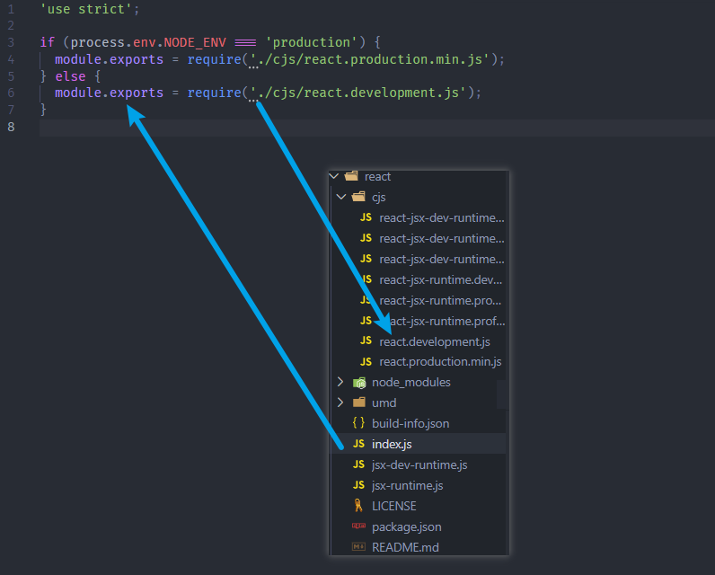

useState本质上，使用的是dispatcher的useState（其它hook API同理）

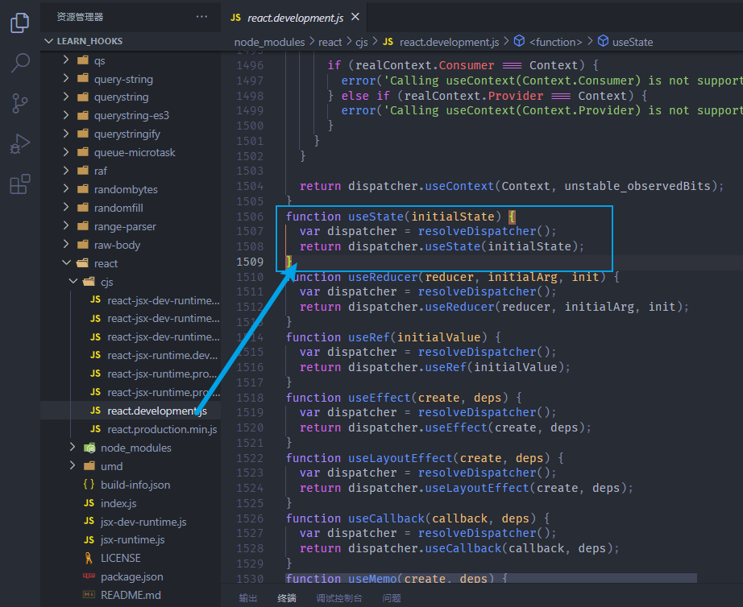

而dispatcher来自另外的一个函数`resolveDispatcher`：

* 可以得知，dispatcher 最终来自于 ReactCurrentDispatcher.current

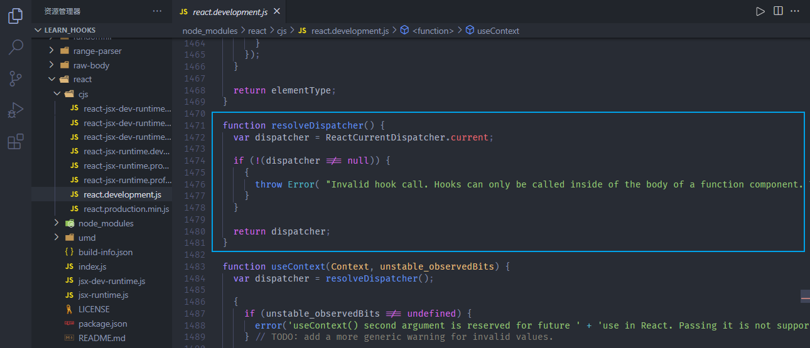

运行的过程中，会给current赋值一个Dispatcher类型：

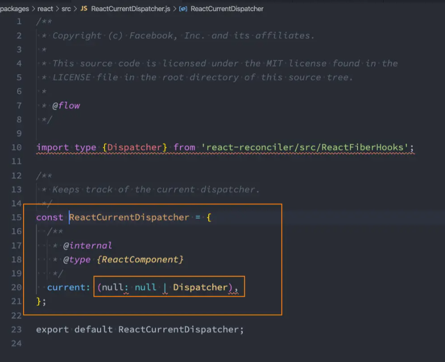

这里的Dispatch仅仅是一个类型而已，所赋予的具体值，在不同的阶段是不同的：

- 挂载阶段：HooksDispatcherOnMount
- 更新阶段：HooksDispatcherOnUpdate

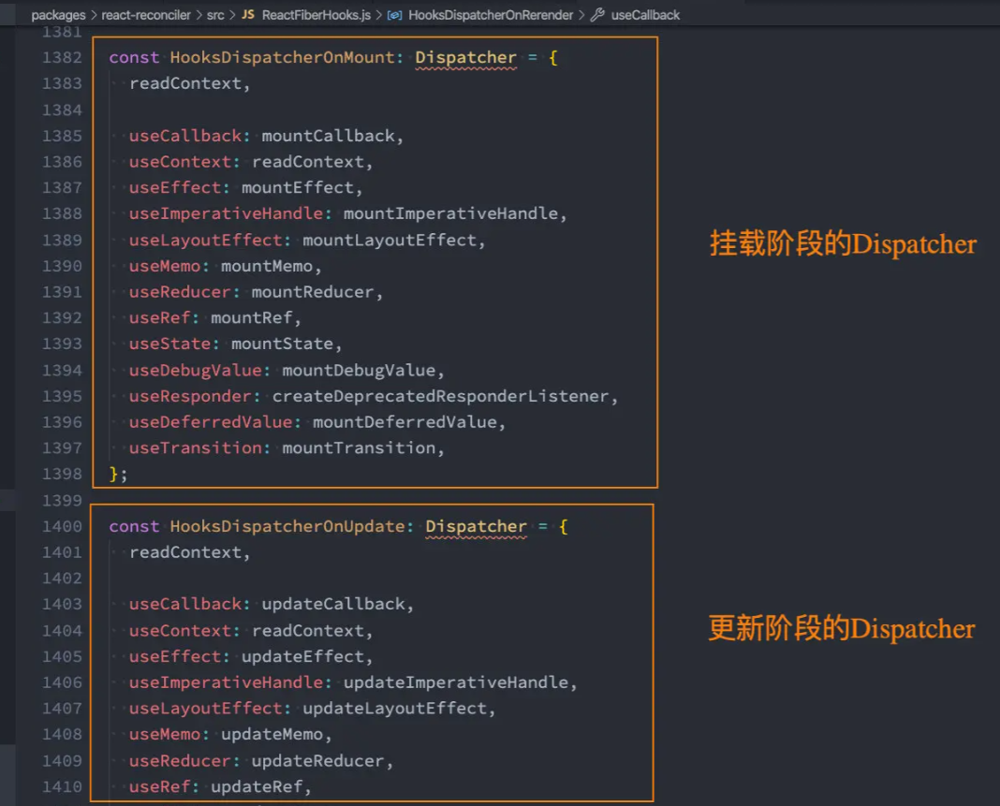

挂载哪一个取决于renderWithHook函数：

* 如果第一次进入页面，`current`为`null`，就会返回挂载阶段的Hooks，反之返回的是更新阶段的Hooks

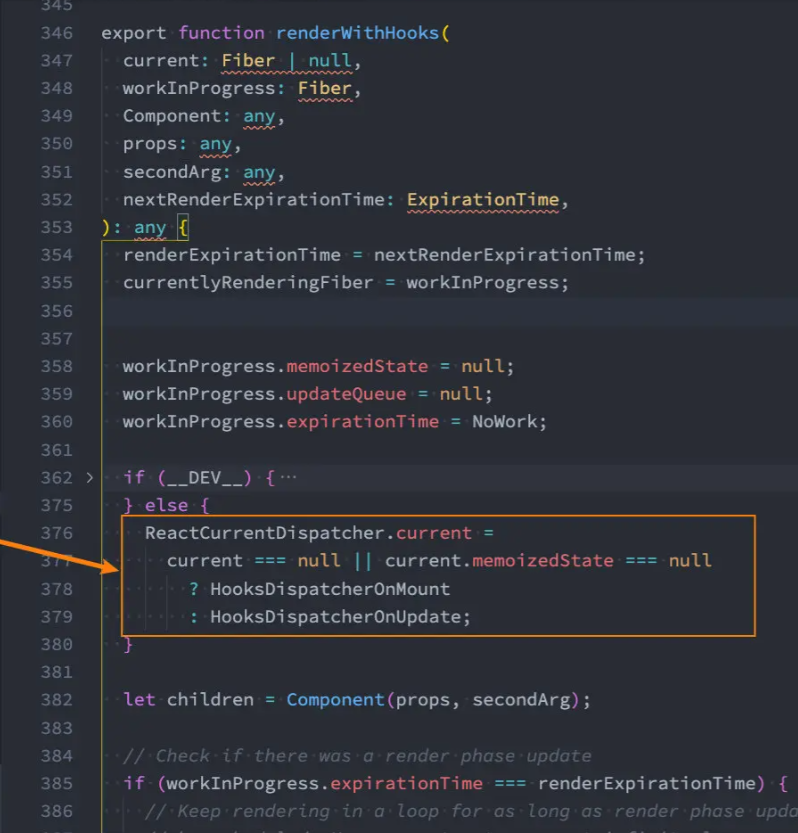

### HooksDispatcherOnMount

HooksDispatcherOnMount对应的useState是 mountState

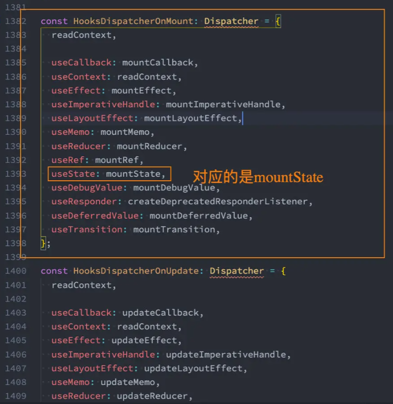

mountState的源码：

* 如果传入的初始值为function，则会进行调用。也就是我们向`useState(callback)`传入callback的用法。
* 创建更新队列，放入dispatch中
* 最终将state的记忆值、dispatch方法，进行return

绑定的dispatchAction函数，事实上是将所有的action放到了queue队列中：

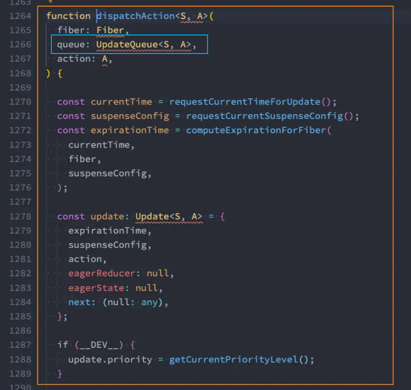

​	由于这些hook中的action，都是放在一个队列中进行维护的，所以**hook不能进行异步的判断**

​	这也就是我们为什么之前一直在说：只能在**函数最外层**调用 Hook。不要在循环、条件判断或者子函数中调用。

​	如果因为条件判断或其他原因，没有执行到对应的`useState`，后期派遣action进行更新时，也就不会处理对应的state，因为该state并没有被放入维护的队列中。

### HooksDispatcherOnUpdate

HooksDispatcherOnUpdate对应的useState是 updateState

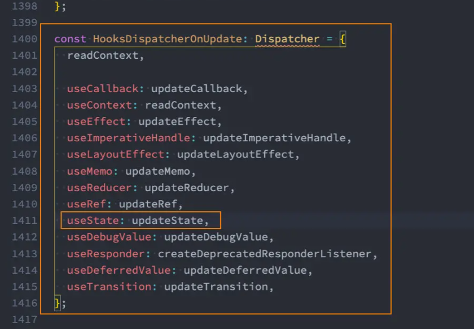

就更新阶段而言，useState本质上用的是updateReducer

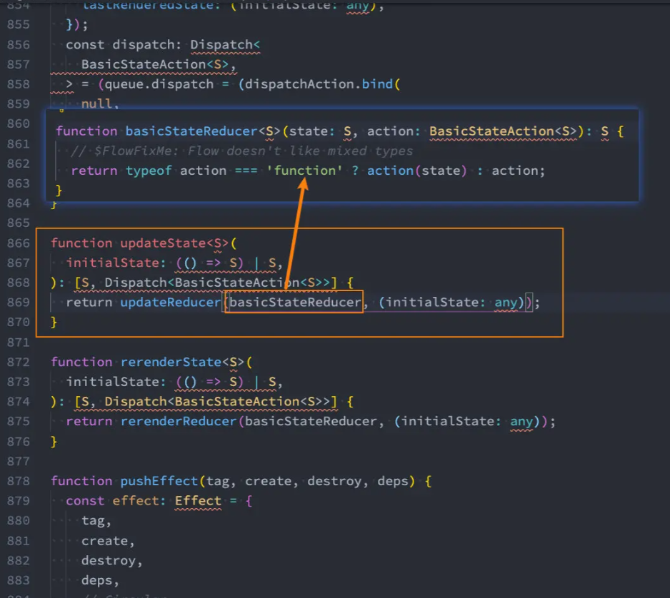

updateReducer的源码如下：
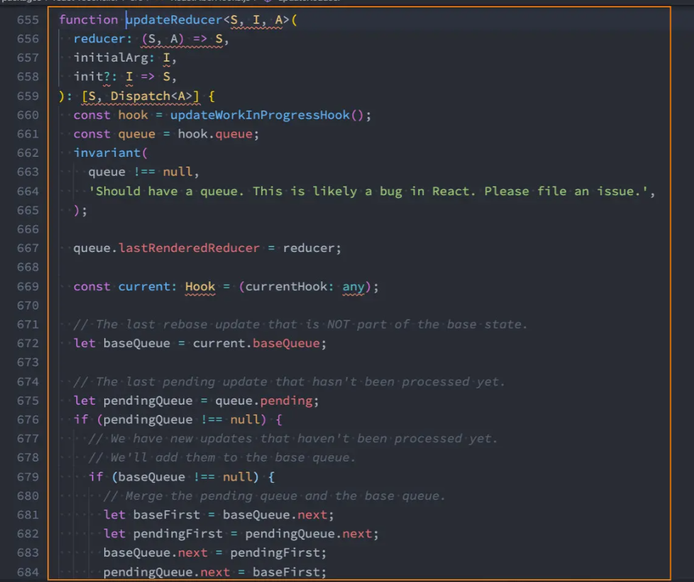

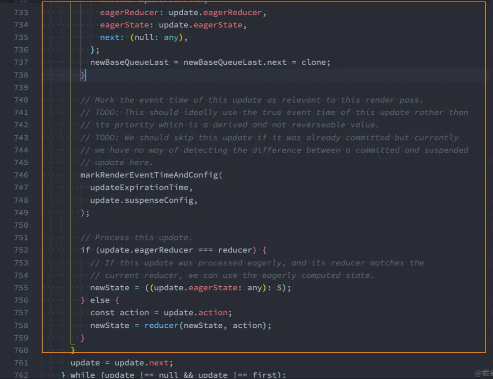