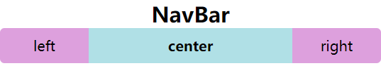

在Vue中有slot的概念，能够让组件的内容更加灵活的展示，而在React中有没有slot呢？

答案是没有的，但是并不代表React不能够实现插槽，由于JSX的灵活性，所以在React中根本不需要插槽这个概念，因为JSX本身就是一个JavaScript表达式，我们可以在`{}`中进行插入。当然，如果插入展示的JSX结构比较复杂，我们可以将其封装为函数或者组件，并将JSX结构return或render即可。

---

实现插槽，有两种方式：

1. 在子组件**闭合双标签**中，插入元素节点，在子组件内部通过`props.children[index]`进行获取。
2. 直接将插入的JSX作为变量，传递给子组件，子组件通过`props.propName`进行获取。

---

* 当插槽数目较多时，用第一种方法显然有些吃力，因为需要和`index`依次对应进行获取，所以一般常使用第二种方法。

* 下面通过封装NavBar组件的案例，来体会两种方式的不同。

* 这里只插入简单的文本结构，方便学习理解，在实际开发中，可以插入其它组件（按钮、input等等）

* 以下两种方式实现的效果都是一样的，只不过实现方式不同。



引入的index.css

```
* {
  margin: 0px;
  padding: 0px;
  box-sizing: border-box;
}
body {
  width: 100vw;
  height: 100vh;
}
#root,
#max {
  width: 100%;
  height: 100%;
}
#max {
  display: flex;
  flex-direction: column;
  text-align: center;
}
.NavBar {
  width: 100%;
  display: flex;
  flex-direction: row;
  align-items: center;
  height: 40px;
  border-radius: 5px;
  overflow: hidden;
}
.nav-left,
.nav-right,
.nav-center {
  display: flex;
  justify-content: center;
  align-items: center;
}
.nav-left,
.nav-right {
  width: 100px;
  height: 100%;
  background-color: plum;
}
.nav-center {
  flex: 1;
  height: 100%;
  background-color: powderblue;
}
```


# props.children

### App.js

注意：要在子组件**闭合双标签**中，插入元素节点，

```
import React, { Component } from "react";
import NavBar from "./NavBar.js";
require("./index.css");

export default class App extends Component {
  constructor() {
    super();
    this.state = {
      title: "NavBar",
    };
  }
  render() {
    return (
      <div id="max">
        <h2>{this.state.title}</h2>
        //组件闭合标签中，插入各个元素
        <NavBar>
          <div>left</div>
          <div>
            <h4>center</h4>
          </div>
          <div>right</div>
        </NavBar>
      </div>
    );
  }
}
```

### NavBar.js

该方式要在子组件内部通过`props.children[index]`进行获取。

```
import React, { Component } from "react";

export default class NavBar extends Component {
  render() {
    console.log(this.props.children);		{/* 能够打印出children：[ {…},{…},{…} ] */}
    return (
      <div className="NavBar">	{/* 通过props.children[index]进行访问 */}
        <div className="nav-left">{this.props.children[0]}</div>
        <div className="nav-center">{this.props.children[1]}</div>
        <div className="nav-right">{this.props.children[2]}</div>
      </div>
    );
  }
}

```

# props

### App.js

直接将JSX部分以属性值的形式，传入到子组件标签中。

```
import React, { Component } from "react";
import NavBar from "./NavBar.js";
require("./index.css");

export default class App extends Component {
  constructor() {
    super();
    this.state = {
      title: "NavBar",
    };
  }
  render() {
    return (
      <div id="max">
        <h2>{this.state.title}</h2>
        <NavBar
          nav_left={this.nav_left()}
          nav_center={this.nav_center()}
          nav_right={this.nav_right()}
        />
      </div>
    );
  }
  nav_left() {
    return <div>left</div>;
  }
  nav_center() {
    return (
      <div>
        <h4>center</h4>
      </div>
    );
  }
  nav_right() {
    return <div>right</div>;
  }
}

```

### NavBar.js

像往常接收props一样，通过`props.propName`进行访问

```
import React, { Component } from "react";

export default class NavBar extends Component {
  render() {
    let { nav_left, nav_center, nav_right } = this.props;		
    console.log(this.props.children);
    return (
      <div className="NavBar">
        <div className="nav-left">{nav_left}</div>	
        <div className="nav-center">{nav_center}</div>
        <div className="nav-right">{nav_right}</div>
      </div>
    );
  }
}
```

