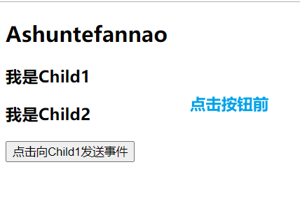
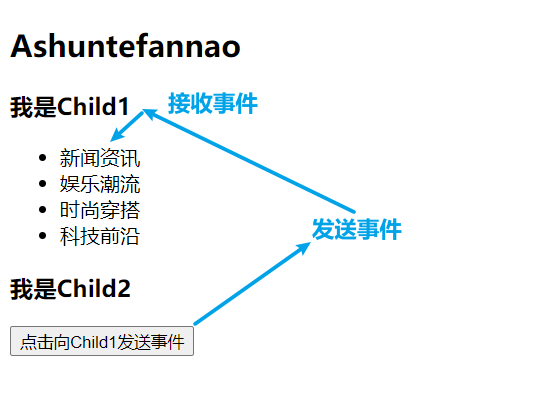

前面我们已经学习了父子组件的通讯，是通过props实现的，但是在实际开发中，可能组件嵌套的关系非常深，那么这种跨组件的通讯怎么实现呢？

本文将详细讲解跨组件通讯的几种方法。

1. props（层级较深时不推荐使用）
2. Context
3. 事件总线

下面以Profile组件的实现过程为例，对比三种实现跨组件通讯方式的不同之处。

# props

​	前面实现父子组件通讯使用的就是props，那么深层次嵌套的组件通讯当然也可使用props逐层传递，只不过这样的操作缺点很多：

1. 产生很多重复代码
2. 为了能让数据传递到目标组件，一些不需要props的中间组件也将被迫进行props的接收和传递。

## 版本一

```
export default class App extends Component {
  constructor() {
    super();
    this.title = "Ashuntefannao";
    this.state = {
      nickName: "Ashun",
      level: 99,
    };
  }
  render() {
    let { nickName, level } = this.state;
    return (
      <div id="main">
        <h2>{this.title}</h2>
        <Profile nickName={nickName} level={level} />
      </div>
    );
  }
}

function Profile(props) {
  let { nickName, level } = props;	{/* 为了能让数据传至ProfileContent,也要接收、传递props */}
  return (
    <div id="profile">
      <header>profile</header>
      <ProfileContent nickName={nickName} level={level} />	
    </div>
  );
}
function ProfileContent(props) {
  return (
    <div className="ProfileContent">
      <ul>
        <li>{props.nickName}</li>
        <li>{props.level}</li>
      </ul>
    </div>
  );
}
```

## 优化:展开语法

上面只是传入了两条数据，就产生了大量冗余代码，有没有办法让传递的过程给更加简洁呢？答案是：有的。

React支持：将传递的各个属性进行**解构赋值**。

```
export default class App extends Component {
  constructor() {
    super();
    this.title = "Ashuntefannao";
    this.state = {
      nickName: "Ashun",
      level: 99,
    };
  }
  render() {
    return (
      <div id="main">
        <h2>{this.title}</h2>
        <Profile {...this.state} />		{/* 将state解构传入 */}
      </div>
    );
  }
}

function Profile(props) {
  return (
    <div id="profile">
      <header>profile</header>
      <ProfileContent {...props} />		{/* 将接收到的props解构传入 */}
    </div>
  );
}
function ProfileContent(props) {
  return (
    <div className="ProfileContent">
      <ul>
        <li>{props.nickName}</li>
        <li>{props.level}</li>
      </ul>
    </div>
  );
}
```

# Context

​	前面使用props是最传统，也是比较笨的办法。而且，虽然上面已经使用`展开语法`进行了代码数量的优化，但中间组件被迫进行数据传递的问题还是没有解决，如果嵌套层级很深，代码冗余还是很多。

​	这时，我们就可以使用Context相关API进行实现。

## 过程梳理：

### 创建Context对象

首先，我们要创建一个需要共享的Context对象：

```
const MyContext = React.createContext(defaultValue);
```

* 如果一个组件订阅了某个Context，那么这个组件会从离自身最近的那个父级 `Provider` 组件中读取到当前的对应的context值；（`Provider` 组件，后文会讲解）

* defaultValue是组件在攀层级查找的过程中，如果直至最顶级都没有找到对应的`Provider`，那么将使用默认值

---

### Context.Provider组件

Context共享对象创建完毕后，我们要使用Context.Provider组件，通过配置value属性，定义所要共享的数据，并将那些需要共享数据的组件进行包裹。

```
<MyContext.Provider value={……}>
	<SubscribeCpn1 />
	<SubscribeCpn2 />
	……
</MyContext.Provider>
```

每个 `Context` 对象都会返回一个 `Provider` React 组件，它允许消费组件订阅 context 的变化，当 Provider 的 `value` 值发生变化时，它内部的所有消费组件都会重新渲染；

- Provider 接收一个 `value` 属性，传递给消费组件；

- 一个 Provider 可以和多个消费组件有对应关系；

- 多个 Provider 也可以嵌套使用，里层的Provider 会覆盖外层的数据

  >因为上文（创建Context对象）中，已经说明了组件订阅的规则：组件会从离自身最近的那个父级 `Provider` 组件中读取到当前的对应的context值

**⭐注意点：订阅Context的组件，要放在Context.Provider组件标签的内部**

​	如果订阅Context的组件，没有放在Context.Provider组件标签对中，则在攀层过程中，将不能够寻找到Context.Provider组件所共享的数据。

---

### Class.contextType

经过上面的操作：Context共享对象创建完毕，Context.Provider组件配置完毕。

现在只需要最后一步：让订阅组件，订阅目标Context对象。

我们需要为订阅组件定义`contextType`静态属性，值为：所订阅的Context对象

```
SubscribeCpn.contextType = MyContext
```

当然，我们还可通过`static`关键字，在class内部进行配置

```
class SubscribeCpn extends Component {
  static contextType = MyContext;
  render(){…}
}
```

成功订阅后，在组件内部就可通过`this.context["propName"]`进行数据访问了。

**⭐注意点：若使用该形式，则订阅Context的组件必须是class类组件**

当然，`函数组件`也是可以使用Context的，只不过使用的是`Context.Consumer`，具体看下文👇

---

### Context.Consumer组件

`Context.Consumer`有两个功能：

1. 用于处理`使用多个Context`时的情况。--下文（使用多个Context）部分进行详解
2. 让函数订阅组件，进行订阅


`函数订阅组件`使用ContexAPI的步骤，相对于`class订阅组件`使用过程来说，只有在**订阅**时的操作不同。步骤如下：

1. JSX 外部需要嵌套一层函数，该函数接收一个context参数（内部的JSX就可使用该参数访问共享的数据），再将JSX返回出去即可。

   > 由于，JSX 外部嵌套了函数，所以要将整体部分作为JavaScript变量，插入到`{}`中

2. 将第一步中的代码块 使用**`Context.Consumer`**组件进行包裹，并将这个整体作为函数组件的返回值return出去。

---

### 案列操作

下面还以Profile组件案例，展示Context语法实现的跨组件通讯。

使用ContextAPI实现跨组件通讯，成功解决了多层组件嵌套时：中间组件被迫传递数据的问题。

**class订阅组件**

```
//定义Context对象，并赋予默认值
const UserContext = React.createContext({
  nickName: "默认名称",
  level: "默认等级",
});

export default class App extends Component {
  constructor() {
    super();
    this.title = "Ashuntefannao";
    this.state = {
      nickName: "Ashun",
      level: 99,
    };
  }
  render() {
    return (
      <div id="main">
        <h2 onClick={this.change.bind(this)}>{this.title}</h2>
        {/* 使用Context.Provider组件，配置传递的数据，并将订阅组件包裹*/}
        <UserContext.Provider
          value={{ nickName: this.state.nickName, level: this.state.level }}
        >
          <Profile />
        </UserContext.Provider>
      </div>
    );
  }
  change() {
    let newState = { nickName: "更换名称：SHUN", level: "98" };
    this.setState(newState);
  }
}

function Profile() {
  return (
    <div id="profile">
      <header>profile</header>
      <ProfileContent/>
    </div>
  );
}

class ProfileContent extends Component {
  static contextType = UserContext;		//订阅组件配置contextType,订阅目标Context对象
  render() {
    return (
      <div className="ProfileContent">
        <ul>
          <li>{this.context.nickName}</li>	{/*	通过this.context获取数据*/}
          <li>{this.context.level}</li>
        </ul>
      </div>
    );
  }
}
```

值得注意的是：

​	如果将`Profile`订阅组件放在`UserContext.Provider`组件外部，则在攀层寻找context时，将不能找到`UserContext`共享的变量，此时将会应用Context对象创建时传入的默认值。

> 该问题在上文（创建Context对象）中已经提及过了：组件在攀层级查找的过程中，如果直至最顶级都没有找到对应的`Provider`，那么将使用默认值。

**函数订阅组件**

```
/* 函数订阅组件 */
function ProfileContent(props) {
  return (
    <UserContext.Consumer>
      {
        (context)=>{
          return (
            <div className="ProfileContent">
              <ul>
                <li>{context.nickName}</li>
                <li>{context.level}</li>
              </ul>
            </div>
          )
        }
      }
    </UserContext.Consumer>
  );
}
```

## 使用多个Context

上文（过程梳理）中所讲的内容，只是：使用一个Context时的情况。不论是class组件，还是函数组件，前两步都是一样的：

1. `Ctx=React.createContext()`
2. `<Ctx.Provider value={obj}></…>`

* 对于class组件，在订阅时，只需要设置静态属性`contextType`订阅目标Context即可，**但只能订阅一个Context**。

* 而对于函数组件，不能够像class组件一样设置静态属性进行订阅，只能使用`Ctx.Consumer`组件的形式，进行订阅。

而之前我们已经说过了，`Ctx.Consumer`本身的作用就是处理**使用多个Context**情况的。也是我们下文要讲的。

其实`Ctx.Consumer`的使用方式，我们已经在函数订阅组件中讲过了，那么对于使用多个Context的情况，解决过程很简单：**就是进行 Ctx.Consumer 的嵌套**。

下面继续以上文中的案例进行扩充，现在我不仅仅要使用`UserContext`，还要使用`TestColorContext`。

```
//创建Context对象
const UserContext = React.createContext({
  nickName: "默认名称",
  level: "默认等级",
});
//嵌套的Context对象
const TestColorContext=React.createContext({
  color:"red"
})

export default class App extends Component {
  constructor() {
    super();
    this.title = "Ashuntefannao";
    this.state = {
      nickName: "Ashun",
      level: 99,
    };
  }
  render() {
    return (
      <div id="main">
        <h2 onClick={this.change.bind(this)}>{this.title}</h2>
        {/* 使用Context.Provider组件，将订阅组件包裹*/}
        <UserContext.Provider
          value={{ nickName: this.state.nickName, level: this.state.level }}
        >
          <TestColorContext.Provider value={{color:"red"}}>
            <Profile />
          </TestColorContext.Provider>
        </UserContext.Provider>
      </div>
    );
  }
  change() {
    let newState = { nickName: "更换名称：SHUN", level: "98" };
    this.setState(newState);
  }
}

function Profile() {
  return (
    <div id="profile">
      <header>profile</header>
      <ProfileContent />
    </div>
  );
}

/* 函数订阅组件 */
function ProfileContent(props) {
  return (
    <UserContext.Consumer>		{/* 最外层，使用UserContext.Consumer */}
    {
      (user)=>(
        <TestColorContext.Consumer>		{/* 内层，TestColorContext.Consumer */}
          {
            (theme)=>
             (
              <div className="ProfileContent">
                <ul style={{color:theme.color}}>	{/* 分别使用对应的函数参数进行数据访问 */}
                  <li>{user.nickName}</li>    
                  <li>{user.level}</li>
                </ul>
              </div>
             )

          }
        </TestColorContext.Consumer>
      )
    }
    </UserContext.Consumer>
  );
}
```

对于类组件来说，也是一样的，只不过此时：也就不需要使用`contextType`订阅单一Context了。

```
/*  class订阅组件 */
class ProfileContent extends Component {
  render() {
    return (
      <UserContext.Consumer>			
      {(user)=>(
        <TestColorContext.Consumer>		
          {
            (theme)=>
             (
              <div className="ProfileContent">
                <ul style={{color:theme.color}}>	
                  <li>{user.nickName}</li>    
                  <li>{user.level}</li>
                </ul>
              </div>
             )

          }
        </TestColorContext.Consumer>
      )
      }
      </UserContext.Consumer>
    );
  }
}
```

## 总结

**含义及用处：**

上下文信息：用于信息共享，实现跨层级传递值

**Context API**

1. `Ctx=React.createContext()`
2. `Ctx.Provider`
3. `Class.contextType` 
4. `Ctx.Consumer`

**Context 的使用：**

1. 只有**类组件**可以使用`contextType`订阅**一个Context**
2. 函数组件不可使用contextType，只能使用`Ctx.Consumer`
3. Consumer可以应用于类组件 **和** 函数组件， Consumer可以使用 **多个** context，但是contextType不行

更多Context的使用规则请参考📑[官方文档](https://zh-hans.reactjs.org/docs/context.html#legacy-api)。

---

# 事件总线

前面一直在讲解多层级组件嵌套时，组件之间的沟通应该怎么解决，但是如果兄弟组件之间进行沟通，一般我们会使用`事件总线`

在Vue中我们可以通过`事件总线`，让全局组件之间进行通讯。在React中我们也可以实现，这里要依赖一个常用的插件`events`。

使用步骤：

1. 下载：

   ```
   yarn add events
   ```

2. 引入`EventEmitter`,并实例化为对象

   ```
   import { EventEmitter } from "events"
   const EventBus = new EventEmitter();
   ```

3. 使用具体的API进行组件之间的通讯，下面通过两个案例讲解

## 深层组件嵌套

下例代码中，组件层级关系为：App->Content->Article，现在，要让Article利用事件总线发射事件，并在App组件中进行接收。

```
import React, { Component } from "react";
import { EventEmitter } from "events";

const EventBus = new EventEmitter();
export default class App extends Component {
  constructor() {
    super();
    this.state = {};
  }
  componentDidMount() {
    EventBus.addListener("emitEvent", this.emitEvent);
  }
  componentWillUnmount() {
    EventBus.removeListener("emitEvent", this.emitEvent);
  }
  emitEvent(...args) {
    console.log(args);
  }
  render() {
    return (
      <div id="max">
        <h2>Application</h2>
        <Content />
      </div>
    );
  }
}

class Content extends Component {
  render() {
    return (
      <div id="main">
        <h3>Main</h3>
        <Article />
      </div>
    );
  }
}
class Article extends Component {
  constructor() {
    super();
    this.state = {
      list: ["新闻资讯", "娱乐潮流", "时尚穿搭", "科技前沿"],
    };
  }
  render() {
    return (
      <div className="article">
        <ul>
          {this.state.list.map((v) => {
            return <li key={v}>{v}</li>;
          })}
        </ul>
        <button onClick={this.emitEvent.bind(this)}>emitEvent</button>
      </div>
    );
  }
  emitEvent() {
    EventBus.emit("emitEvent", "Hello App Component", "my name is Article");
  }
}
```

### 事件的发射

通过`EventEmitter`实例对象的`emit`方法进行事件的发射，用法与Vue中相同，其接收**两类**参数

* 参数1：事件名称
* 参数2~n：传递的变量

```
emitEvent() {
    EventBus.emit("emitEvent", "Hello App Component", "my name is Article");
}
```

### 事件的监听/移除

#### 事件监听

通过`EventEmitter`实例对象的`addListener`方法进行事件的监听，用法与Vue中的`$on`相同，其接收**两个**参数

* 参数1：事件名称
* 参数2：事件处理函数

#### 事件移除

通过`EventEmitter`实例对象的`addListener`方法进行事件的监听，用法与Vue中的`$off`相同，其也接收**两个**参数

* 参数1：事件名称
* 参数2：**对应的事件处理函数**

```
componentDidMount() {
  EventBus.addListener("emitEvent", this.emitEvent);
}
componentWillUnmount() {
  EventBus.removeListener("emitEvent", this.emitEvent);
}
emitEvent(...args) {
  console.log(args);
}
```

### 注意点：

通过上述代码，我们也观察到了一些细节：

1. 事件监听工作在`componentDidMount`中完成
2. 事件移除工作在`componentWillUnmount`中完成
3. 将事件处理函数单独定义出来。

**原因**：

​	之所以在`componentDidMount`中完成事件监听，是因为组件挂载完毕，我们才能够访问DOM的结构，在其中可以通过事件处理函数，对DOM结构进行一些操作。

​	在`componentWillUnmount`中完成事件的移除，这个也很好理解，是为了**性能优化**，在组件卸载前，将所有监听的事件都要依次移除，避免这些无用的事件监听。

​	将事件处理函数单独定义出来：与原生`removeEventListener`的使用相同。由于要完成事件的移除，我们要传入相同的`函数引址`，才能够移除对应的事件处理程序。

## 兄弟组件通讯

兄弟组件之间的通讯，同样可以使用事件总线完成组件通讯。

例如下面案例：

App包含两个子组件：`Child1`、`Child2`，现在让这两个兄弟组件之间实现通讯，点击按钮：将Child2中的数据传递到Child1,并进行展示。





```
export default class App extends Component {
  constructor() {
    super();
    this.state = {
      title: "Ashuntefannao",
    };
  }
  render() {
    return (
      <div id="max">
        <h2>{this.state.title}</h2>
        <Child1 />
        <Child2 />
      </div>
    );
  }
}
class Child1 extends Component {
  constructor() {
    super();
    this.state = {
      title: "我是Child1",
      list: null,
    };
  }
  componentDidMount() {
    EventBus.addListener("emitEvent", this.emitEvent.bind(this));
  }
  componentWillUnmount() {
    EventBus.removeListener("emitEvent", this.emitEvent);
  }
  emitEvent(list) {
    console.log(list);
    this.setState({ list });
  }
  render() {
    return (
      <div id="child1">
        <h3>{this.state.title}</h3>
        <ul>
          {this.state.list &&
            this.state.list.map((item) => {
              return <li key={item}>{item}</li>;
            })}
        </ul>
      </div>
    );
  }
}
class Child2 extends Component {
  constructor() {
    super();
    this.state = {
      title: "我是Child2",
      list: ["新闻资讯", "娱乐潮流", "时尚穿搭", "科技前沿"],
    };
  }
  render() {
    return (
      <div id="child2">
        <h3>{this.state.title}</h3>
        <button onClick={this.emitEvent.bind(this)}>
          点击向Child1发送事件
        </button>
      </div>
    );
  }
  emitEvent() {
    EventBus.emit("emitEvent", [...this.state.list]);
  }
}
```

