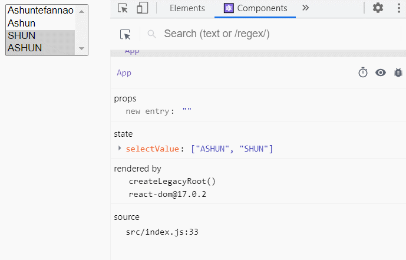
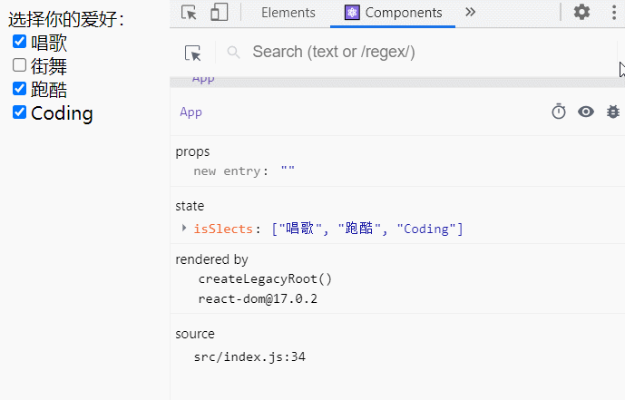

# refs的使用

​	之前在学习Vue2.x的过程中，我们知道：Vue2.x也有`refs`这个概念，并且是用来获取`原生DOM`或`组件`的，React也不例外。

​	在React开发模式中，通常情况下不需要、也不建议直接操作原生DOM，但是在某些特殊的情况下，确实需要获取原生DOM进行某些操作

* 此时我们就可以使用`refs`来获取，并且`refs`也可获取目标`class`组件信息
* 当然，我们可以在`componentDidMount`钩子中，使用原生JS的API获取元素，但通常在React开发中不会这样做，因为使用原生JS的API是在全局范围内进行获取，容易影响其他组件中的元素。

## 配置ref

1. 首先我们要在对应的`HTML标签`或`class组件标签`中，绑定`ref`属性
2. `ref`属性值可分别配置为`String`、`Object`、`Callback`，并且这三种形式的用法各不相同，下面就让我们来了解一下。

>​	值得注意的是：你**不能在函数组件标签**上使用 ref 属性，因为它们没有实例，没有自身this所维护的状态。
>
>但某些时候，我们可能有获取**函数组件**的需求，怎么办呢？
>
>* 我们可以使用`forwardRef`功能函数（后期高阶组件会讲解）
>* 当我们后期学习了hooks，也可在函数组件中使用 ref

### String

定义形式

* `<tag ref="propName">…</tag>`

后期访问

* `this.refs["propName"]`

>该方式比较古老，现在不推荐使用，并且后续React可能会删除该方式。

### Object

定义形式

* 通过`createRef`功能函数，创建`ref`对象，并定义一个变量进行接收

* 在对应标签中绑定`ref`属性值为：上步骤创建的ref对象

  `<tag ref={this.refState}>…</tag>`

后期访问

* 通过定义的变量进行访问
  * `createRef`创建的ref对象，包裹一个`current`属性，该属性标记`目标DOM`、`组件`
  * `this.refState.current`

### Callback

定义形式

`<tag ref={(ele)=>{…}}>…</tag>`

* 在对应标签中绑定`ref`属性值为一个回调函数
  * 该函数接收一个参数，能够访问`目标DOM元素`或`组件`
  * 且该函数会在`目标DOM元素`或`组件`**挂载后**自动回调执行

后期访问

* 我们可以提前定义一个变量为null
* 在绑定的callback中，将该变量进行赋值
* 后期可通过该变量进行访问

### 实际体验

这里我们通过实际代码来体验一下三种形式在使用上的差异：

> 代码注释的序号分别对应三种不同形式的操作

```
//引入 createRef
import React,{PureComponent,createRef} from "react";

export default class App extends PureComponent{
  constructor(){
    super();
    this.state={
    	//2.通过 createRef 创建 ref 对象
      titleRef:createRef(),
      childRef:createRef(),
    }
    //3.提前定义变量，用于callback赋值
    this.titleCallbackRef=this.childCallbackRef=null;
  }
  render(){
    return(
      <main>
        {/* 1.属性值为String */}
        <h2 ref="h2">ref值为：String</h2>
        <Child ref="Child"/>
        <hr/>
        {/* 2.属性值为Object */}
        <h2 ref={this.state.titleRef}>ref值为：Object</h2>
        <Child ref={this.state.childRef}/>
        <hr/>
        {/* 3.属性值为Callback */}
        <h2 ref={(ele)=>{this.titleCallbackRef=ele}}>ref值为：Function</h2>
        <Child ref={(ele)=>{this.childCallbackRef=ele;console.log("childCallbackRef")}}/>
       <hr/>
       <button onClick={this.getH2.bind(this)}>获取h2</button>
       <button onClick={this.getChild.bind(this)}>获取Child</button>
      </main>
    )
  }
  getH2(){
    console.log(this.refs["h2"]);	// 1.属性值为String (后期访问)
    console.log(this.state.titleRef.current);//2.属性值为Object (后期访问)
    console.log(this.titleCallbackRef)//3.属性值为Callback (后期访问)
  }
  getChild(){
    console.log(this.refs["Child"]);
    console.log(this.state.childRef.current);
    console.log(this.childCallbackRef)

  }
}

class Child extends PureComponent{
  constructor(){
    super();
    this.state={
      title:"Child"
    }
  }
  render(){
    return(
      <div>
        <h3>{this.state.title}</h3>
      </div>
    )
  }
  componentDidMount(){
    console.log("Child挂载完毕")
  }
}
```

# 受控组件

## 认识受控组件

#### 默认表单提交

在React中，HTML表单的处理方式和普通的DOM元素不太一样：**表单元素的内容通常会保存在组件内部的**`state`**中**。

比如下面的HTML表单元素：

- 这个处理方式是原生HTML默认处理表单提交的方式，在用户点击按钮时会提交到某个服务器中，并且刷新页面；
- 在React中，并没有禁止这个行为，它依然是有效的；
- 但是在React中，通常会使用JavaScript函数来方便的处理表单提交，同时还可以访问用户填写的表单数据；
- 实现这种效果的标准方式是使用“受控组件”；

```
<form action="originPath">
  <label>
    名字:
    <input type="text" name="name" />
  </label>
  <input type="submit" value="提交" />
</form>
```

#### 受控组件提交表单

在原生 HTML 中，表单元素（如`<input>`、 `<textarea>` 和 `<select>`）之类的表单元素通常自己维护 state，并根据用户输入进行更新。

而在 React 中，这些可变状态，通常保存在组件的 state 属性中，并且只能通过使用 `setState()`来更新，这样在后期能够更加方便、高效的获取、管理表单数据。

- 我们将两者结合起来，使React的state成为“唯一数据源”；
- 渲染表单的 React 组件还控制着用户输入过程中表单发生的操作；
- 被 React 以这种方式控制取值的表单输入元素就叫做“受控组件”；

>简单来说，受控组件就是：表单的提交，以及value的展示、改变，都通过React内部的 state 进行管理。
>
>* 学过Vue的小伙伴很快就能理解，类似于实现v-model双向绑定，并且控制表单的提交

例如，如果我们想让前一个示例在提交时打印出名称，我们可以将表单写为受控组件：

```
import React, { PureComponent } from "react";
export default class App extends PureComponent {
  constructor() {
    super();
    this.state = {
      userName: "Ashun",
    };
  }
  render() {
    const { userName } = this.state;
    return (
      <form
        onSubmit={(e) => {
          this.handleSubmit(e);
        }}
      >
        <label>
          用户名:
          <input
            type="text"
            value={userName}
            onChange={(e) => {
              this.changeName(e);
            }}
          />
        </label>
        <button>提交</button>
      </form>
    );
  }
  changeName(e) {
    this.setState({
      userName: e.target.value,
    });
  }
  handleSubmit(e) {
    e.preventDefault();
    console.log(this.state.userName);
  }
}
```

## 处理多个输入项

上文案例中，只是简单的处理了一个输入项，在实际开发中一个表单中可能会有很多输入项，如果让这些输入项所对应的表单元素`受控`，你可能会写出下例一样的代码：

​	这样的代码冗余度太高了，如果有100个输入的表单元素，我们就要写100个对应方法，更新对应的 state。

```
import React, { PureComponent } from "react";
export default class App extends PureComponent {
  constructor() {
    super();
    this.state = {
      userName: "Ashun",
      password: "",
      testCode: "",
    };
  }
  render() {
    const { userName, password, testCode } = this.state;
    return (
      <form
        onSubmit={(e) => {
          this.handleSubmit(e);
        }}
      >
        <label>
          用户名:
          <input
            type="text"
            value={userName}
            onChange={(e) => {
              this.changeName(e);
            }}
          />
        </label>
        <br />
        <label>
          密码:
          <input
            type="password"
            value={password}
            onChange={(e) => {
              this.changePassword(e);
            }}
          />
        </label>
        <br />
        <label>
          验证码:
          <input
            type="text"
            value={testCode}
            onChange={(e) => {
              this.changeTestCode(e);
            }}
          />
        </label>
        <br />
        <button>提交</button>
      </form>
    );
  }
  changeName(e) {
    this.setState({
      userName: e.target.value,
    });
  }
  changePassword(e) {
    this.setState({
      password: e.target.value,
    });
  }
  changeTestCode(e) {
    this.setState({
      testCode: e.target.value,
    });
  }
  handleSubmit(e) {
    e.preventDefault();
    const { userName, password, testCode } = this.state;
    console.log(userName, password, testCode);
  }
}
```

​	我们可以发现，这些方法中所作的事情是一样的，只是更新对应的 state ，因此我们可以将业务进行抽离。

抽离步骤：

1. 给每个输入框表单元素定义name属性，且属性值与state名称对应起来

2. 为每个输入框表单元素绑定同一个方法

   在更新 state 时，通过`event.target.name`动态地获取名称，进行更新。

```
import React, { PureComponent } from "react";
export default class App extends PureComponent {
  constructor() {
    super();
    this.state = {
      userName: "Ashun",
      password: "",
      testCode: "",
    };
  }
  render() {
    const { userName, password, testCode } = this.state;
    return (
      <form
        onSubmit={(e) => {
          this.handleSubmit(e);
        }}
      >
        <label>
          用户名:
          <input
            type="text"
            name="userName"
            value={userName}
            onChange={(e) => {
              this.handleChange(e);
            }}
          />
        </label>
        <br />
        <label>
          密码:
          <input
            type="password"
            name="password"
            value={password}
            onChange={(e) => {
              this.handleChange(e);
            }}
          />
        </label>
        <br />
        <label>
          验证码:
          <input
            type="text"
            name="testCode"
            value={testCode}
            onChange={(e) => {
              this.handleChange(e);
            }}
          />
        </label>
        <br />
        <button>提交</button>
      </form>
    );
  }
  handleChange(e) {
    this.setState({
      [e.target.name]: e.target.value //通过name属性，动态锁定对应的state
    });
  }
  handleSubmit(e) {
    e.preventDefault();
    const { userName, password, testCode } = this.state;
    console.log(userName, password, testCode);
  }
}
```

## 其他表单元素的处理

之前我们展示的案例都是基于`输入类表单`的处理，这里我们再演示一下其他的情况。

| 表单元素                               | 属性绑定                     | 访问其值             |
| -------------------------------------- | ---------------------------- | -------------------- |
| `<input type="text"/>`password等等同理 | `value="String"`             | event.target.value   |
| `<textarea />`                         | `value="String"`             | event.target.value   |
| `<select>…</select>`                   | `value="option value"/Array` | event.target.value   |
| `<input type="checkbox">`              | `checked={boolean/Array}`    | event.target.checked |
| `<input type="radio">`                 | `checked={boolean}`          | event.target.checked |

* 输入框类型的表单元素，通过value属性，管理其状态
* select下拉框，也是通过value属性进行管理
* 单选、复选按钮通过checked属性进行管理

#### select标签

##### 单选下拉框

* 对应 state 值为String，可设置默认值为预选项的 value。

```
import React, { PureComponent } from "react";
export default class App extends PureComponent {
  constructor() {
    super();
    this.state = {
      selectValue: "Ashun",
    };
  }
  render() {
    return (
      <form>
        <select
          value={this.state.selectValue}
          onChange={(e) => this.handleChange(e)}
        >
          <option value="Ashuntefannao">Ashuntefannao</option>
          <option value="Ashun">Ashun</option>
          <option value="SHUN">SHUN</option>
          <option value="ASHUN">ASHUN</option>
        </select>
      </form>
    );
  }
  handleChange(e) {
    this.setState({
      selectValue: e.target.value,
    });
    console.log(e.target.value);
  }
}
```

##### 多选下拉框

* 绑定multiple属性，即可变为多选
* 此时对应的 state 值**必须为Array** ，存储`已选项`或`预选项`的各个`value`值。
* `handleChange`的操作
  * 判断是否存在原数组中
  * 若存在，则移除
  * 不存在，则追加



```
import React, { PureComponent } from "react";

export default class App extends PureComponent {
  constructor() {
    super();
    this.state = {
      selectValue: ["ASHUN", "SHUN"], //默认选中2项
    };
  }
  render() {
    return (
      <form>
        <select
          multiple="multiple"
          value={this.state.selectValue}
          onInput={(e) => this.handleChange(e)}
        >
          <option value="Ashuntefannao">Ashuntefannao</option>
          <option value="Ashun">Ashun</option>
          <option value="SHUN">SHUN</option>
          <option value="ASHUN">ASHUN</option>
        </select>
      </form>
    );
  }
  handleChange(e) {
    let selectValue = [...this.state.selectValue];
    let newValue = e.target.value;
    let isSelect = selectValue.indexOf(newValue);
    if (isSelect === -1) {
      selectValue.push(newValue);
    } else {
      selectValue.splice(isSelect, 1);
    }
    this.setState({
      selectValue: selectValue,
    });
    console.log(selectValue);
  }
}
```

#### checkbox

关于按钮，这里以`checkbox`示例，因为`checkbox`包含两种情况，一种是**单选**，一种是**多选**，而单选时与`radio`实现过程相同，所以这里不再赘述`radio`的实现过程。

##### 单选情况

* 对应 state 值为`boolean`，标记按钮是否被选中

```
import React, { PureComponent } from "react";
export default class App extends PureComponent {
  constructor() {
    super();
    this.state = {
      isSlect: false,
    };
  }
  render() {
    return (
      <form>
        <label>
          <input
            type="checkbox"
            checked={this.state.isSlect}
            onChange={(e) => this.handleChange(e)}
          ></input>
          同意该协议
        </label>
      </form>
    );
  }
  handleChange(e) {
    this.setState({
      isSlect: e.target.checked,
    });
    console.log(e.target.checked);
  }
}
```

##### 多选情况

* 此时对应的 state 值**必须为Array** ，存储`已选项`或`预选项`的各个`value`值。
* 判断对应的 state 中是否存在某一项，决定是否被选中（checked属性）
* 为每一个`checkbox`按钮都要绑定相同的事件进行处理
  * `handleChange`的操作
    * 判断是否存在原数组中
    * 若存在，则移除
    * 不存在，则追加



```
import React, { PureComponent } from "react";

export default class App extends PureComponent {
  constructor() {
    super();
    this.state = {
      isSlects: ["唱歌", "跑酷", "Coding"],
    };
    this.likes = ["唱歌", "街舞", "跑酷", "Coding"];
  }
  render() {
    return (
      <form>
        选择你的爱好：
        {this.likes.map((item) => {
          return (
            <div key={item}>
              <label>
                <input
                  type="checkbox"
                  value={item}
                  checked={this.state.isSlects.includes(item)}
                  onChange={(e) => this.handleChange(e)}
                ></input>
                {item}
              </label>
              <br />
            </div>
          );
        })}
      </form>
    );
  }
  handleChange(e) {
    const isSelects = [...this.state.isSlects];
    let newValue = e.target.value;
    let index = isSelects.indexOf(newValue);
    if (index === -1) {
      isSelects.push(newValue);
    } else {
      isSelects.splice(index, 1);
    }
    this.setState({
      isSlects: isSelects,
    });
    console.log(isSelects);
  }
}
```

# 非受控组件

React推荐大多数情况下使用 `受控组件` 来处理表单数据：

- 一个受控组件中，表单数据是由 React 组件来管理的；
- 另一种替代方案是使用**非受控组件**，此时表单数据将交由 DOM 节点自身来处理；

如果在非受控组件中获取对应的数据，那么我们需要使用[上文](#refs的使用)所讲的 `ref` 来从DOM节点中获取表单数据。

我们来进行一个简单的演练：

- 使用ref来获取input元素；
- 在非受控组件中通常使用`defaultValue`来设置默认值

```
import React, { PureComponent, createRef } from "react";

export default class App extends PureComponent {
  constructor(props) {
    super(props);
    this.defaultUserName = "Ashun";
    this.userNameRef = createRef();
  }

  render() {
    return (
      <div>
        <form onSubmit={(e) => this.handleSubmit(e)}>
          <label htmlFor="">
            用户名：
            <input
              defaultValue={this.defaultUserName}		{/* defaultValue设置默认值 */}
              type="text"
              name="userName"
              ref={this.userNameRef}
            />
          </label>
          <input type="submit" value="提交" />
        </form>
      </div>
    );
  }

  handleSubmit(event) {
    event.preventDefault();
    console.log(this.userNameRef.current.value);
  }
}
```

同样，`<input type="checkbox">` 和 `<input type="radio">` 支持 `defaultChecked`，`<select>` 和 `<textarea>` 支持 `defaultValue`。
