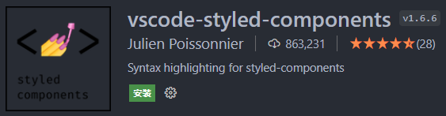
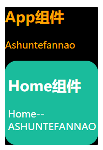
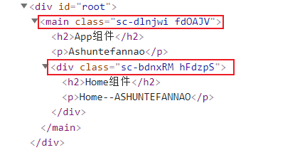
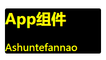
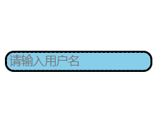
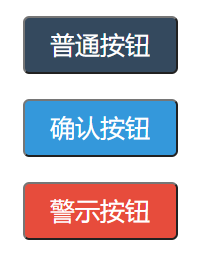

# 认识CSS in JS

`CSS in JS`顾名思义，就是在JavaScript中编写CSS。

* 在传统的前端开发中，我们通常会将结构（HTML）、样式（CSS）、逻辑（JavaScript）进行分离。
* 但是在学习过程中，我们得知：React的思想中认为`逻辑`和`UI`是无法分离的，所以才会有了JSX的语法。
* 而如果在React中，我们把同属于`UI`的CSS样式，也写入到JavaScript中（CSS in JS），那么实际上前端开发的所有东西就全权交给JavaScript了

> 所以React被一些人称之为 `All in JS`😀，对于这种开发模式，大家也各有看法，当然，所有技术都不是完美的。

目前比较流行的CSS-in-JS库：

- ⭐styled-components
- emotion
- glamorous

下面我们主要学习`styled-components`。

# styled-components

## 前提知识

* 既然要使用这个库，首先要进行下载`yarn add styled-components`
* 之后在项目中引入，然后编写相应代码即可
* 为了能够更好的使用该库，我们需要了解以下知识

### 标签模板

`标签模板`属于JavaScript基础，你也可以看我之前写过的文章，里面有所介绍。

这里我再简单的说一下：

* `标签模板`能够调用函数，并将`模板字符串`中的`常量`、`变量`部分，作为参数传入。
* 参数接收：
  * 参数(1)：Array，各个元素为模板字符串中的常量
  * 参数(2~n)：模板字符串中的变量

```
function test(constants, ...args) {
  console.log(constants);	//["A--", "--A"]
  console.log(args);	//["Ashuntefannao"]
}
let message = "Ashuntefannao";

test`A--${message}--A`;	//标签模板调用函数
```

之所以要介绍`标签模板`，是因为`styled-components`的编写就是应用`标签模板`完成的。

### VScode插件

`vscode-styled-components`，该插件能够识别`styled-components`相关代码的语法（标签模板），提供`代码提示`、`样式高亮`功能。



## 基本使用

`styled-components`的本质是通过函数的调用，最终创建出一个`组件`：

- 这个组件会被自动添加上一个不重复的class类名
- 并将开发者编写的样式赋予给该class

### 基本使用过程

1. 引入 styled-component
2. 使用相关语法，编写样式
   * 使用`标签模板`调用方法：`styled.tagName`生成对应的元素，并在`模板字面量`中编写样式，生成组件
3. 使用生成的组件包裹目标元素区域

```
//引入styled-component
import styled from "styled-components";

//调用其中的方法styled.tagName生成对应的元素，并在其中编写样式，生成组件
let WrapperComponent = styled.div`
  color: orange;
  background: black;
`;
export default function App() {
  return (
    <WrapperComponent>	{/* 使用生成的组件包裹目标元素区域 */}
      <h2>App组件</h2>
      <p>Ashuntefannao</p>
    </WrapperComponent>
  );
}
```

### 案例体验

**App.js**

```
import { PureComponent } from "react";
import styled from "styled-components";
import Home from "./Home/Home.js";

let WrapperComponent = styled.main`
  color: orange;
  background: black;
  border-radius: 3px;
`;

export default class App extends PureComponent {
  render() {
    return (
      <WrapperComponent>
        <h2>App组件</h2>
        <p>Ashuntefannao</p>
        <Home />
      </WrapperComponent>
    );
  }
}
```

**Home.js**

```
import { PureComponent } from "react";
import styled from "styled-components";

let WrapperComponent = styled.div`
  color: white;
  background-color: #1abc9c;
  border-radius: 20px;
  padding: 5px;
`;

export default class Home extends PureComponent {
  render() {
    return (
      <WrapperComponent>
        <h2>Home组件</h2>
        <p>Home--ASHUNTEFANNAO</p>
      </WrapperComponent>
    );
  }
}
```

**效果**

组件之间的样式并没有产生冲突。



让我们打开控制台观察：



`styled-components`为我们使用`styled.tagName`创建的组件，自动添加上了**唯一**的class类名。

### 使用注意点

（样式权重问题导致的样式覆盖）

解决：

## 语法详解

### 样式嵌套

`styled-components`支持类似于CSS预处理器（less、sass）一样的样式嵌套语法：

- 支持直接子代选择器、后代选择器，并且直接编写样式；
- 可以通过`&`符号获取当前元素；
- 直接伪类选择器、伪元素等；

例如：

```
const HomeWrapper = styled.div`
  color: purple;	//styled.div的样式
  //styled.div h2的样式
  h2 {
    font-size: 50px;
  }
	//styled.div ul>li的样式
  ul > li {
    color: orange;
		//&获取当前元素,相当于ul > li.active
    &.active {
      color: red;
    }
		//支持伪类选择器
    &:hover {
      background: #aaa;
    }
		//支持伪元素
    &::after {
      content: "abc"
    }
  }
`
```

### props

由于`styled-components`方法的执行，最终会产生一个组件，因此我们可以向该组件传递`props`，并且可以在编写样式时进行访问，可以达到联动 state 的效果。

访问方式：

* 通过回调函数返回结果

```
${(props)=>props.propName}
```

**案例体验**



```
import { PureComponent } from "react";
import styled from "styled-components";

let WrapperComponent = styled.main`
	/* 访问props传递的变量 */
  color: ${(props) => props.color};	
  background: black;
`;

export default class App extends PureComponent {
  constructor() {
    super();
    this.state = {
      myColor: "yellow",
    };
  }
  render() {
    return (
      <WrapperComponent color={this.state.myColor}>
        <h2>App组件</h2>
        <p>Ashuntefannao</p>
      </WrapperComponent>
    );
  }
}
```

### attrs

`attrs`**的作用**：

* 针对某些元素，绑定一些特殊的HTML属性
* 自定义一些公共的样式属性

`attrs`**的用法**：

* 通过`styled.tagName.attrs({……})`来定义各个属性
* 在`attrs`中定义的属性，其属性值在定义时也可通过`回调函数`形式访问传入的`props`
* 并且在之后的`标签模板`中还可以通过`回调函数`形式访问在`attrs`中定义的属性。

举个例子🌰：

* 使用`styled-components`生成一个`input`元素
* 可以在`attrs`中赋予`type`、`placeholder`等类似的特殊属性
  * 但是**普通的样式属性，即便通过**`attrs`**赋予，也不起作用**。
  * 如果你想编写普通样式属性，应该在`标签模板`中编写。
* 还可以在`attrs`中自定义一些公共样式属性，后期就可以通过 props 进行绑定



```
import { PureComponent } from "react";
import styled from "styled-components";

let InputStyled = styled.input.attrs({
	// type、placeholder，这些特殊属性，可在标签中直接传入，也可在此定义
  type: "password", 
  // 自定义公共样式属性
  bg_color: "skyblue", 
  // attrs属性值在定义时，也可访问props
  b_radius: (props) => props.radius || "0px", 
  color: `yellow`, //普通样式不起作用
})`
  border: 3px dotted;
  //也可通过props访问attrs中的属性
  background-color: ${(props) => props.bg_color};
  border-radius: ${(props) => props.b_radius};
`;
export default class App extends PureComponent {
  constructor() {
    super();
    this.state = {
      myColor: "yellow",
    };
  }
  render() {
    return <InputStyled type="text" placeholder="请输入用户名" radius="10px" />;
  }
}
```

##  高级特性

### 元素类型和样式的继承

我们知道，通过使用`styled-components`中的方法，可以创建指定元素，并编写对应的样式，最后生成一个新的组件。

而这个新组件的`元素类型`、`样式表`都是**可以被继承**的。

**语法**

```
import styled from "styled-components";
//旧组件
const OldComponent = styled.tagName`
  padding: 8px 30px;
  border-radius: 5px;
`;
//新组件可继承旧组件的元素类型、样式表
const NewComponent = styled(OldComponent)`
	/* 保留继承的样式，还可编写新的样式*/
  color: red;
`
```

**案例体验**



```
import { Fragment, PureComponent } from "react";
import styled from "styled-components";

//普通按钮
const BaseBtn = styled.button`
  padding: 8px 20px;
  border-radius: 5px;
  font-size: 20px;
  color: white;
  background-color: #34495e;
`;
//确认按钮
const ConfirmBtn = styled(BaseBtn)`
  background-color: #3498db;
`;
//警示按钮
const WarningBtn = styled(BaseBtn)`
  background-color: #e74c3c;
`;

export default class App extends PureComponent {
  constructor() {
    super();
    this.state = {
      myColor: "yellow",
    };
  }
  render() {
    return (
      <Fragment>
        <BaseBtn>普通按钮</BaseBtn>
        <ConfirmBtn>确认按钮</ConfirmBtn>
        <WarningBtn>警示按钮</WarningBtn>
      </Fragment>
    );
  }
}
```

### ThemeProvider设置主题

* 可以使用`styled-components`内置的`ThemeProvider`组件，在全局定制自己的主题。
* 之后在其他使用`styled-components`创建的组件中，就可以使用`回调函数`的形式，通过`props.theme.propName`访问主题中的各个样式属性

```
import styled,{ ThemeProvider } from 'styled-components';

<ThemeProvider theme={{color: "red", fontSize: "30px"}}>
  <Home />
  <Detail />
</ThemeProvider>
```

在styled组件中可以获取到主题的内容：

```
const DetailWrapper = styled.div`
  color: ${props => props.theme.color};
  font-size: ${props => props.theme.fontSize};
`
```

