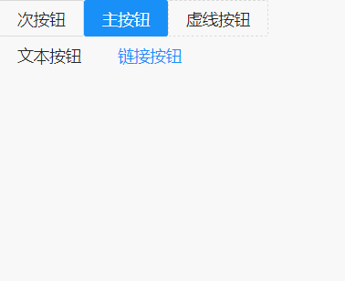
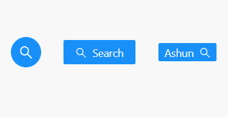
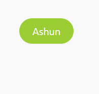

# AntDesign介绍

`AntDesign` 简称 `antd`， 是一个由蚂蚁金服开发的 React UI 组件库，主要用于研发企业级中后台产品。

AntDesign的特点：

- 🌈 提炼自企业级中后台产品的交互语言和视觉风格。
- 📦 开箱即用的高质量 React 组件。
- 🛡 使用 TypeScript 开发，提供完整的类型定义文件。
- ⚙️ 全链路开发和设计工具体系。
- 🌍 数十个国际化语言支持。
- 🎨 深入每个细节的主题定制能力。

该文章只学习主要的使用步骤，更多详情请参考[官方文档](https://ant.design/docs/react/introduce-cn)。

# 基本使用

1. 安装`antd`

   ```
   yarn add antd
   ```

2. 在项目的入口文件`index.js`中引入全局的`antd`样式

   ```
   import "antd/dist/antd.css";
   ```

3. 参照官网，使用库中的组件

## 案例体验

在安装`antd`,并引入全局样式后，我们就可以使用该库中的组件了，下面我们以使用`antd`中的按钮示例。

* 引入按钮组件，并使用

  ```
  import { Button } from "antd";
  ```

### 按钮类型

* 通过绑定type属性，指定按钮组件的类型
* 不绑定type属性时：为次按钮

| type    | description |
| ------- | ----------- |
| primary | 主按钮      |
| dashed  | 虚线按钮    |
| text    | 文本按钮    |
| link    | 链接按钮    |

**实际体验**



```
import { Fragment, PureComponent } from "react";
import { Button } from "antd";
export default class App extends PureComponent {
  render() {
    return (
      <Fragment>
        <Button>次按钮</Button>
        <Button type="primary">主按钮</Button>
        <Button type="dashed">虚线按钮</Button>
        <br />
        <Button type="text">文本按钮</Button>
        <Button type="link" href="https://github.com/astfn">
          链接按钮
        </Button>
      </Fragment>
    );
  }
}
```

### 图标按钮

**使用前提**

当用到图标时，需要单独下载`@ant-design/icons`库，再从该库中引入对应的图标组件即可。

```
yarn add @ant-design/icons
```

**用法**

当需要在 `Button` 内嵌入 `Icon` 时：

* 可以设置 `icon` 属性，或者直接在 `Button` 内使用 `Icon` 组件。
* 如果想控制 `Icon` 具体的位置，只能直接使用 `Icon` 组件，而非 `icon` 属性。

**实际体验**



```
import { Fragment, PureComponent } from "react";
import { Button, Tooltip } from "antd";
import { SearchOutlined } from "@ant-design/icons";

export default class App extends PureComponent {
  render() {
    return (
      <Fragment>
      	//提示组件
        <Tooltip title="message内容">
            <Button
              type="primary"
              shape="circle"
              icon={<SearchOutlined />}
              size="large"
            />
          </Tooltip>
          //定义icon属性，使用图标组件
          <Button type="primary" icon={<SearchOutlined />}>
            Search
          </Button>
          //直接在按钮内部，独立使用图标组件
          <Button type="primary" size="small">
            Ashun <SearchOutlined />
          </Button>
      </Fragment>
    );
  }
}
```

该案例还应用到了其他组件和属性：

* `Tooltip`组件，悬停后会出现`title`属性定义的文字信息
* `Button`组件其他属性
  * 通过设置 `size` 为 `large`、 `small` 分别把按钮设为大、小尺寸。若不设置 `size`，则尺寸为中。
  * 通过设置 `shape` 为 `circle`、 `round` 分别把按钮设为圆、椭圆形状。若不设置 `shape`，则默认为矩形。

> 关于按钮还有很多其他的属性和用法，这里不再依次列举，请翻阅[官方文档-按钮部分](https://ant.design/components/button-cn/)。

## tree shaking

我们可能会提出一个问题：

在一个项目中，我们不可能使用完`antd`所提供的所有组件，那`antd`是否会将一些程序中没有使用的`组件`或者`逻辑代码`引入，造成项目体积臃肿的问题？

`antd` 官网有提到：`antd` 的 JS 代码默认支持基于 ES modules 的 tree shaking，对于 js 部分，直接引入 `import { Button } from 'antd'` 就会有**按需加载**的效果。

>tree shaking（摇树），这个词语很形象，会在打包时，像摇晃树一样，将那些无用的东西删除掉。

# 高级配置

在之前的示例中可以观察到，`antd`提供的组件，默认情况下都是蓝色主题，但如果我们要**个性化配置主题**，该怎么办呢？

## 认识craco

对主题等相关的高级特性进行配置，需要修改 create-react-app 脚手架的默认配置。

如何修改create-react-app 的默认配置呢？

- 之前我们了解过，可以通过`yarn run eject`来暴露出来对应的配置信息进行修改，并且这个操作是**不可逆的**
- 对于webpack并不熟练的人来说，若直接修改 CRA 的配置，可能会给你的项目带来负担，甚至会增加项目的隐患和不稳定性。

那么如何更简便的修改默认配置呢？社区目前有两个比较常见的方案：

- react-app-rewired + customize-cra（这个是antd早期推荐的方案）
- ⭐craco（目前antd推荐的方案）

### 使用过程

第一步：安装craco：

```shell
yarn add @craco/craco
```

第二步：修改package.json文件

- 原来在进行启动、打包等操作时，我们是通过react-scripts来管理的；
- **现在我们通过craco来管理，这样才能够读取我们后期配置的**`craco.config.js`**文件**

```
"scripts": {
-   "start": "react-scripts start",
-   "build": "react-scripts build",
-   "test": "react-scripts test",
+   "start": "craco start",
+   "build": "craco build",
+   "test": "craco test",
}
```

第三步：在根目录下创建`craco.config.js`配置文件，用于修改默认的配置

```
module.exports = {
  // 配置项……
}
```

##  配置主题

按照 [配置主题](https://link.juejin.cn?target=https%3A%2F%2Fant.design%2Fdocs%2Freact%2Fcustomize-theme-cn) 的要求，自定义主题需要用到类似 [less-loader](https://link.juejin.cn?target=https%3A%2F%2Fgithub.com%2Fwebpack-contrib%2Fless-loader%2F) 提供的 less 变量覆盖功能：

- 我们可以引入 [craco-less](https://link.juejin.cn?target=https%3A%2F%2Fgithub.com%2FDocSpring%2Fcraco-less) 来帮助加载 less 样式和修改变量；

>这里之所以用到类似 `less-loader` 的工具，是因为`antd`库中的默认样式都是应用`less`编写的，我们需要这些工具覆盖掉默认的样式。

安装 `craco-less`：

```shell
yarn add craco-less
```

在`craco.config.js`中进行相关配置(plugins)：

- 使用`modifyVars`可以在运行时修改LESS变量，覆盖掉原来的默认样式

```
const CracoLessPlugin = require("craco-less");

module.exports = {
  plugins: [
    {
      plugin: CracoLessPlugin,
      options: {
        lessLoaderOptions: {
          lessOptions: {
            modifyVars: { "@primary-color": "yellowgreen" },
            javascriptEnabled: true,
          },
        },
      },
    },
  ],
};
```

引入antd的样式时，引入`antd.less`文件：

```
// import "antd/dist/antd.css";
import 'antd/dist/antd.less';
```

**实际体验**

此时可以观察到，颜色已经变为了我们自定义的`yellowgreen`



```
import { PureComponent } from "react";
import { Button, Tooltip } from "antd";
export default class App extends PureComponent {
  render() {
    return (
      <Tooltip title="Ashun按钮">
        <Button
          type="primary"
          shape="round"
          size="large"
        >
          Ashun
        </Button>
      </Tooltip>
    );
  }
}
```

## 配置别名

在项目开发中，某些组件或者文件的层级会较深，

- 如果我们逐层目录去引入就会出现这样的情况：`../../../../components/button`；
- 我们可以通过配置别名，让文件引入的过程，变的简洁美观

配置别名也需要修改webpack的配置，当然我们也可以**借助于 craco 来完成**：

* 在`craco.config.js`中配置`webpack`
  * 设置`webpack`属性，并在其中进行配置
  * 通过 nodeJS 的`__dirname`全局变量，结合`path`，将目录路径进行拼接

```
...

const _path = require("path");
const resolve = (dirPath) => _path.resolve(__dirname, dirPath);

module.exports = {
  ...
  ,
  webpack: {
    alias: {
      '@': resolve("src"),
      'components': resolve("src/components"),
    }
  }
}
```

在导入时就可以按照下面的方式来使用了：

```
import CommentInput from '@/components/comment-input';
import CommentItem from 'components/comment-item';
```


