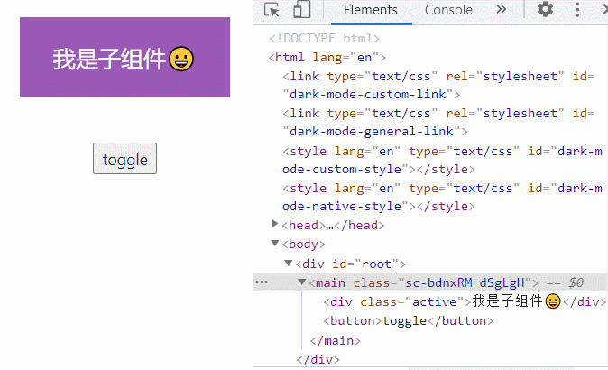

在实际开发中，我们可能需要给组件添加`出入场动画`，这就需要联动`state`判断该组件的出入场状态，来添加不同的样式类。

并且，若要求组件出场动画结束后，需要将组件进行卸载，还要额外的处理这部分的逻辑

## 案例体验

我们以一个简单的例子，来体验原生React实现过渡动画的过程：

* 组件旋转、缩放出入场
* 组件出场动画结束后，需要将组件进行卸载



```
import { createRef, PureComponent } from "react";
import StyledWrapper from "./App.css"

export default class App extends PureComponent {
  constructor() {
    super();
    this.state = { 
    	isActive: true, 	//控制出入场className
    	isunMount: false	//控制组件的卸载
    };
    this.childRef = createRef();
  }

  render() {
    const { isActive, isunMount } = this.state;
    return (
      <StyledWrapper>
        {!isunMount && (
          <div className={isActive ? "active" : ""} ref={this.childRef}>
            我是子组件😀
          </div>
        )}
        <button onClick={() => this.changeShow()}>toggle</button>
      </StyledWrapper>
    );
  }
  changeShow() {
    const { isActive, isunMount } = this.state;
    if (isunMount) {
      this.setState({ isunMount: !isunMount });
    }
    this.setState(
      {
        isActive: !isActive,
      },
      () => {
        console.log(this.state.isActive);
        if (!this.state.isActive) {
          this.childRef.current.addEventListener("animationend", () => {
            this.setState({ isunMount: !isunMount });
          });
        }
      }
    );
  }
}
```

App.css

```
import styled from "styled-components";
const StyledWrapper = styled.main`
  margin: 20px;
  text-align: center;
  div {
    padding: 20px;
    color: white;
    font-size: 20px;
    background-color: #9b59b6;
    /* 动画 */
    animation: divDefault 1s forwards;
  }
  @keyframes divActive {
    from {
      transform: scale(0) rotate(0deg);
    }
    to {
      transform: scale(1) rotate(360deg);
    }
  }
  @keyframes divDefault {
    from {
      transform: scale(1) rotate(360deg);
    }
    to {
      transform: scale(0) rotate(0deg);
    }
  }
  .active {
    animation: divActive 1s forwards;
  }

  button {
    margin: 20px;
  }
`;
export default StyledWrapper
```

## 缺点与解决

* 与动画联动的`state`，维护过程繁琐，在组件中需要不少代码片段进行管理。
* 而且上述案例只是对一个组件和一个出入场动画的维护，若有多个组件都需要出入场动画的维护，并且这些组件需要管理多个出入场动画，很显然，将会是一个比较头痛的过程。
* 并且，若要求组件在出场动画结束后，需要将组件进行卸载，还要额外的处理这部分的逻辑

实际上，我们可以使用一些库，来帮助我们简便的完成出入场动画，下一篇文章将会介绍**react-transition-group**库的使用。