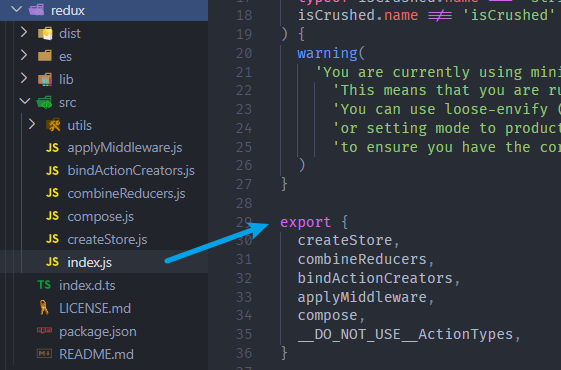
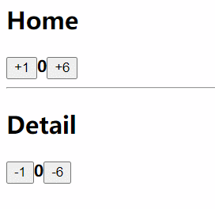
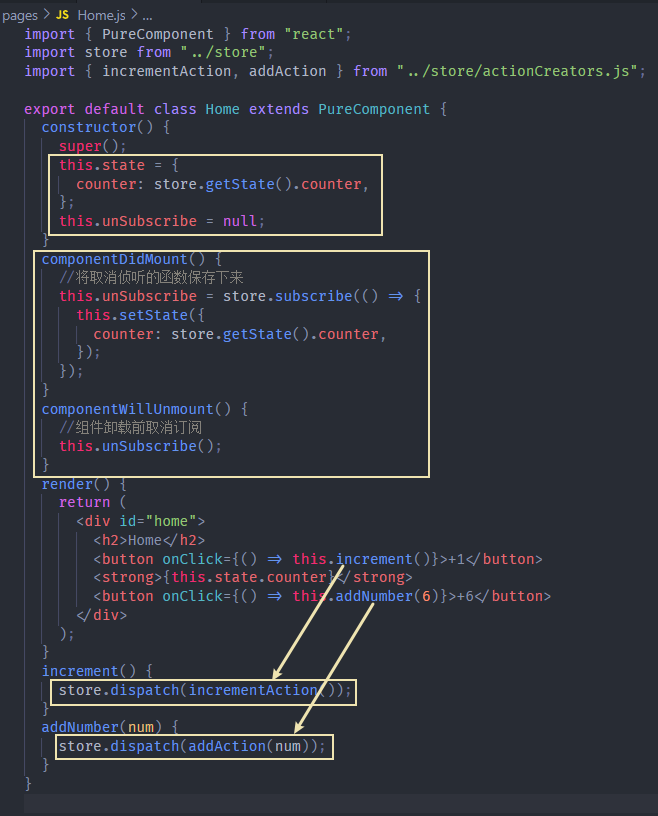

## 前提概要

​	在上篇文章中，我们在node环境下，通过一个简单的JS文件，已经学习了Redux的基本使用过程，并且将Redux管理state的代码规范的进行了结构划分，现在我们要让React与Redux结合使用，帮助我们管理React项目中的状态。

​	其实很简单，首先安装Redux，然后直接将上篇文章中的store文件夹复制过来，即可使用，但也有些小注意点：

**redux的引入方式要进行改变**：

before

```
import redux from "redux";
import reducer from "./reducer.js";
const store = redux.createStore(reducer);
```

after

```
import { createStore } from "redux";
import reducer from "./reducer.js";
const store = createStore(reducer);
```

原因解析：

​	我们首先查看Redux的源码`node_modules/redux.src/utils/index.js`



* 发现并没有`export default`默认导出项，而是使用`export`依次导出。
* 之前之所以能够以`默认项`的形式进行导入，是因为我们对package.json进行了配置，node帮我们处理了这个过程。
* 实际开发中，也都会拆解导入。
* 当然，如果你想保持之前的风格，可以统一导入：`import * as redux from "redux"`

## 案例体验

这里我们编写两个组件`Home`、`Detail`，二者都展示并操作store中的state。

* Home组件：触发`incrementAction`、`addAction`
* Detail组件：触发`decrementAction`、`subAction`



### 代码编写

Home.js

```
import { PureComponent } from "react";
import store from "../store";
import { incrementAction, addAction } from "../store/actionCreators.js";

export default class Home extends PureComponent {
  constructor() {
    super();
    this.state = {
      counter: store.getState().counter,
    };
    this.unSubscribe = null;
  }
  componentDidMount() {
  	//将取消侦听的函数保存下来
    this.unSubscribe = store.subscribe(() => {
      this.setState({
        counter: store.getState().counter,
      });
    });
  }
  componentWillUnmount() {
    //组件卸载前取消订阅
    this.unSubscribe();
  }
  render() {
    return (
      <div id="home">
        <h2>Home</h2>
        <button onClick={() => this.increment()}>+1</button>
        <strong>{this.state.counter}</strong>
        <button onClick={() => this.addNumber(6)}>+6</button>
      </div>
    );
  }
  increment() {
    store.dispatch(incrementAction());
  }
  addNumber(num) {
    store.dispatch(addAction(num));
  }
}
```

Detail.js

```
import { PureComponent } from "react";
import store from "../store";
import { decrementAction, subAction } from "../store/actionCreators.js";

export default class Detail extends PureComponent {
  constructor() {
    super();
    this.state = {
      counter: store.getState().counter,
    };
    this.unSubscribe = null;
  }
  componentDidMount() {
  	//将取消侦听的函数保存下来
    this.unSubscribe = store.subscribe(() => {
      this.setState({
        counter: store.getState().counter,
      });
    });
  }
  componentWillUnmount() {
    //组件卸载前取消订阅
    this.unSubscribe();
  }
  render() {
    return (
      <div id="detail">
        <h2>Detail</h2>
        <button onClick={() => this.decrement()}>-1</button>
        <strong>{this.state.counter}</strong>
        <button onClick={() => this.subNumber(6)}>-6</button>
      </div>
    );
  }
  decrement() {
    store.dispatch(decrementAction());
  }
  subNumber(num) {
    store.dispatch(subAction(num));
  }
}
```

### 注意点

**为了性能考虑，组件在卸载前要取消订阅状态变更**

​	上文代码中，在`componentDidMount`与`componentWillUnmount`两个钩子中有一些操作：

`componentDidMount`中的代码过程很简单，在组件挂载后，订阅状态变更，当store中的state改变时，进行过setState，从而触发更新机制，重新执行render函数，更新页面。

* 但在其中将`store.subscribe(callback)`的执行结果赋予给了`this.unSubscribe`
* `store.subscribe(callback)`的执行结果，是一个函数，调用这个函数时，就能够取消订阅状态变更
* 因此为了性能考虑，所以在组件在卸载前要取消订阅状态变更

```
componentDidMount() {
	//将取消侦听的函数保存下来
  this.unSubscribe = store.subscribe(() => {
    this.setState({
      counter: store.getState().counter,
    });
  });
}
componentWillUnmount() {
  //组件卸载前取消订阅
  this.unSubscribe();
}
```

### 过程总结

该案例的代码其实很简单，因为我们大部分操作都已经学习过了，只不过在实际使用中有一些注意点。

* 在组件中通过`store.getState()`获取store中的状态，然后初始化组件自身的state。
* 组件挂载后`componentDidMount`，订阅状态变更，然后setState，从而触发更新机制，重新执行render函数，更新页面。
* 组件卸载前`componentWillUnmount`，取消订阅状态变更
* 在组件中通过事件的触发 dispatch action，交给reducer进行状态变更处理

## 封装connect

### 为什么封装？

上文我们已经让React结合Redux进行使用了，但可发现，代码看起来并不优雅，有非常多的重复逻辑：

* 将store中的状态初始化到组件自身的state
* 订阅状态变更、取消订阅
* 组件在触发事件时 dispatch action 的过程



这些重复的代码逻辑，在各个组件中都要编写，是没有意义的，我们可以自己封装一个`connect`工具函数，自动完成上述重复逻辑部分。

实现难点（个性化处理）：

* 各个组件所依赖的store中的状态，在通常情况下是不一样的。
* 各个组件所派遣的action也不一样。

既然我们封装的是工具函数，所以可以将这些不确定项作为参数进行传入。

### 封装过程

由于`connect`是一个工具函数，所以我们封装在`src/utils/connect.js`中。

connect 函数接受两个参数：`mapStateToProps`、`mapDispatchToProps`，二者都是**工厂函数**，所生成的对象包含组件需要的数据：

* `mapStateToProps(store.getState())`：将组件所需要的store中的state，映射到props中
* `mapDispatchToProps(store.dispatch)`：将组件所需要派遣的action，映射到props中

connect 的执行结果会返回一个**高阶组件**。

* 利用高阶组件能够拦截Props的特性：将`mapStateToProps`、`mapDispatchToProps`，作为props扩充到目标组件中。
* 利用高阶组件能够拦截生命周期的特性：将目标组件的`constructor`、`componentDidMount`、`componentWillUnmount`生命周期钩子中重复的业务逻辑统一抽离。这些业务分别是之前所提到的：
  * 将组件所需的store状态初始化到自身的state中，只不过这里是抽离到外部包裹的组件中。
  * 订阅状态变更
  * 取消订阅

```
import { PureComponent } from "react";
import store from "../store";

export default function connect(mapStateToProps, mapDispatchToProps) {
  //高阶组件
  return function enhanceHOC(WrapperComponent) {
    let newCPN = class extends PureComponent {
      constructor(props) {
        super(props);
        this.state = {
          storeStates: mapStateToProps(store.getState()),
        };
        this.unSubscribe = null;
      }
      componentDidMount() {
        this.unSubscribe = store.subscribe(() => {
          this.setState({ storeStates: mapStateToProps(store.getState()) });
        });
      }
      componentWillUnmount() {
        this.unSubscribe();
      }
      render() {
        return (
          <WrapperComponent
            {...this.props}
            {...mapStateToProps(store.getState())}
            {...mapDispatchToProps(store.dispatch)}
          />
        );
      }
    };
    //名称设置
    newCPN.displayName = `connectRedux_${WrapperComponent.name}`;
    return newCPN;
  };
}
```

### 使用体验

对比原来的Home组件：

* 完成功能相同，代码量却减少了十几行
* 组件本身不会掺杂关于store的使用过程代码，关于store的信息都映射到了props中。代码结构更清晰，也利于后期维护。

```
import { PureComponent } from "react";
import connect from "../utils/connect.js";
import { incrementAction, addAction } from "../store/actionCreators.js";

//组件本身
class Home extends PureComponent {
  render() {
    return (
      <div id="home">
        <h2>Home</h2>
        <button onClick={() => this.props.increment()}>+1</button>
        <strong>{this.props.counter}</strong>
        <button onClick={() => this.props.addNumber(6)}>+6</button>
      </div>
    );
  }
}

/* 关于所需store信息的配置	*/
//所需要的store中的state
const mapStateToProps = (stateInStore) => ({
  counter: stateInStore.counter,
});
//所需派遣的action
const mapDispatchToProps = (dispatch) => ({
  increment: () => {
    dispatch(incrementAction());
  },
  addNumber: (num) => {
    dispatch(addAction(num));
  },
});

const connectStore_Home = connect(mapStateToProps, mapDispatchToProps)(Home);
export default connectStore_Home;
```

## 优化connect

通过上文，我们已经封装了connect，它帮助我们完成了store与组件之间的链接，并且完成了重复业务的抽离，使用很方便。

但如果把它视为一个真正的工具库，目前有一个很大的缺陷：**依赖导入的store**

* 因为如果将该库进行发布，要交给用户使用。但在源码中需要依赖用户创建的store。
* 因此只能让用户通过修改源码来进行使用，这样很是难堪，也不现实。

解决方法：**利用 Context 全局共享 store**

* 我们在该库中创建一个新的文件`context.js`，用于创建Context
* 然后让用户在外部引入库中的`context.js`，并使用创建的context提供的Provider组件，将根组件(App)进行包裹，并将store配置到value属性中即可
* 这样我们就实现了全局共享store
* 之后我们要在封装的 connect 中进行访问，只需要在高阶组件生成的新`class组件`中设置静态属性`contextType`值为创建的Context，即可通过this.context去访问store

### 代码实现

在`utils`目录中创建`context.js`文件：

```
import { createContext } from "react";
const StoreContext = createContext();
export { StoreContext };
```

在入口文件`index.js`中，使用Provider包裹App(根组件)，并且绑定value的值为store。从而能全局共享store

```
import React from "react";
import ReactDOM from "react-dom";
import App from "./App";

import store from "./store";
import { StoreContext } from "./utils/context.js";

ReactDOM.render(
  <StoreContext.Provider value={store}>
    <App />
  </StoreContext.Provider>,
  document.getElementById("root")
);

```

修改connect函数中class组件部分的代码，通过context访问store：

- 在组件内部用到store的地方，统一使用this.context代替
- 注意：**在 constructor 中直接使用第二个参数即可**，绑定了contextType后，context 会自动作为第二个参数在 constructor 中传入

```
import { PureComponent } from "react";
import { StoreContext } from "./context.js";
export default function connect(mapStateToProps, mapDispatchToProps) {
  return function enhanceHOC(WrapperComponent) {
    let newCPN = class extends PureComponent {
      static contextType = StoreContext;
      constructor(props, context) {
        super(props, context);
        this.state = {
          storeStates: mapStateToProps(context.getState()),
        };
        this.unSubscribe = null;
      }
      componentDidMount() {
        this.unSubscribe = this.context.subscribe(() => {
          this.setState({
            storeStates: mapStateToProps(this.context.getState()),
          });
        });
      }
      componentWillUnmount() {
        this.unSubscribe();
      }
      render() {
        return (
          <WrapperComponent
            {...this.props}
            {...mapStateToProps(this.context.getState())}
            {...mapDispatchToProps(this.context.dispatch)}
          />
        );
      }
    };
    newCPN.displayName = `connectRedux_${WrapperComponent.name}`;
    return newCPN;
  };
}
```

测试代码后，依然可以正常运行，解决了该工具对用户内容(store的引入)的强行依赖。

