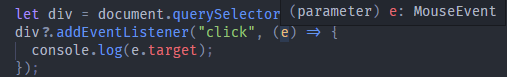

## 类型反推

#### 变量类型反推

如果将某个变量，隐式声明为 any 类型，此时不论你是否在 `tsconfig.json` 中配置了 `noImplicitAny: true`。 TS 都不会报错，因为此时 tsc 会根据赋予的值，反推该变量的类型。

```
let num = 666;
let title = "Ashuntefannao";

num = "astfn"; //Error: 不能将类型“string”分配给类型“number”。
title = 888  //Error: 不能将类型“number”分配给类型“string”。
```

若配置了 `noImplicitAny: true` ，则不能将 **函数参数** 隐式声明为 `any`。此时会报错。

* 因为函数参数在真正的接受实参之前，其类型是不可确定的。
* ts 为了保证函数正确执行，就会报错。

#### 函数返回值类型反推

TS 也可以根据函数的返回结果，推断函数返回值的类型。

* 当然，为了代码更加易读，推荐手动指定返回值类型。

**案例体验**

代码执行时，为 ts 严格模式

*案例一*

```
function test() {
  console.log("Ashuntefannao");
}
let backValue = test();
backValue = null; //不能将类型“null”分配给类型“void”。
```

解析：

* test 返回值类型为 `void`
* 严格模式下，`void` 最多能被赋值为 undefined。

*案例二*

```
// 推断的返回值类型为never
function fail() {
  return error("Something failed");
}
let testNever: never = fail();
```


## 最佳通用类型

最佳通用类型推断，用于应对一些特殊状况： 

* 当需要从**几个表达式**中推断类型时，会根据这些表达式的类型，推断出一个最合适的通用类型。


***案例一***

```
let nums = [6, 6, 6];
```

由于 nums 中的各个元素都为 number，则 `nums` 最终被推断类型为数字类型的数组 `number[]`

```
let x = [0, 1, null];
```

为了推断`x`的类型，我们必须考虑所有元素的类型。 这里有两种选择： `number`和`null`。

因此 `x` 最终被推断为联合类型数组 `(number | null)[]`

***案例二***

在案例一中，Array 中的各元素都属于内置类型。

但如果一个数组包含各种手动定义的类型时，tsc 将如何进行推断呢？

* `Animal` 分别为 `Rhino`、`Elephant`、`Snake` 的父类
* zoo 为：包含各个子类实例化对象的数组。

```
class Animal {
  name: string;
  constructor(name: string) {
    this.name = name;
  }
}
class Rhino extends Animal {}
class Elephant extends Animal {}
class Snake extends Animal {}

let zoo = [new Rhino("犀牛"), new Elephant("大象"), new Snake("张伟")];
```

* 此时我们更希望推断 `zoo` 的类别为 `Animal[]`。
* 但由于这些都不是 JS 的内置类，最终只能被判定为联合类型数组 `(Rhino | Elephant | Snake)[]`

当然，此时我们可以手动指定 `zoo` 的类型

```
let zoo: Animal[] = [new Rhino("犀牛"), new Elephant("大象"), new Snake("张伟")];
```

## 上下文类型

TypeScript 还能够自动依据 **上下文环境** 判断一些变量的类型。

上下文归类会在很多情况下使用到，通常包含：函数的参数、赋值表达式的右边、类型断言、对象成员、数组字面量、返回值语句，等等。

***案例一***

在调用 `Array` 的 `forEach` 方法时，需要为 `callback` 分配参数，此时可以不明确指定 `callback` 参数的类型，也不会报错。

* TS 会根据 **上下文** 推断出参数的类型。
* 由于 Array 中的各个元素为 string，因此可以通过 value 调用字符串相关方法


* 同理，index 将会被推断为 `number` 类型，arr 为 `string[]`

```
let names = ["Ashun", "zhangsan", "lisi"];

names.forEach((value, index, arr) => {
  console.log(value.match(/Ashun/));
});
```

***案例二***

当 dom 元素调用 `addEventListener` 时，需要传入事件处理函数，处理函数接收 `事件对象` 参数，此时也不必明确指定该参数类型。

* TS 会根据上下文判断出，此处参数应该为什么类型。



```
let div = document.querySelector("div");
div?.addEventListener("click", (e) => {
  console.log(e.target);
});
```

