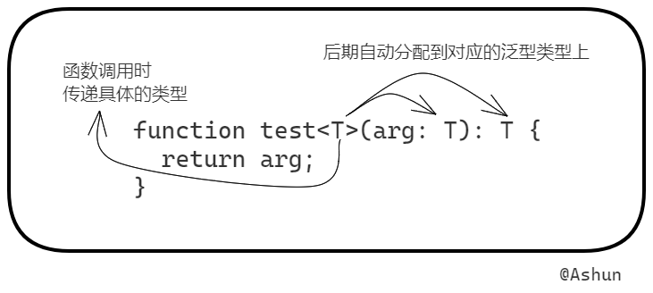
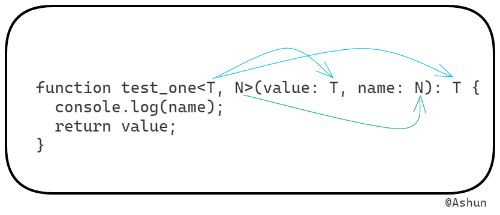

## 泛型的作用

泛型可以提高 `函数/方法` 的灵活性。

* 有时，我们封装的  `函数/方法` ，在被调用时，不确定传入的变量类型。而不同的变量类型，又对应不同的业务，也对应不同的返回值。

此时就可使用 **泛型** 解决。

你可能会有以下疑问：

  针对上述情况，我完全可以使用 `any` 解决。那为什么不使用 `any` 呢？

* `any` 会跳过 TS 的类型检查机制。大量使用 `any` 也不符合规范。
* **而 泛型 可以保留参数的类型**。

下文将详细讲解 **泛型** 在 TS 中的应用。

## 泛型函数

`泛型函数` 是 TS 泛型相关知识中：最基础、应用最广的部分。

若掌握了 `泛型函数` ，则泛型其它的相关知识，也将迎刃而解。

下文将讲解泛型函数的使用方法：

——————————————————————————————————————

泛型函数在语法上最大的特点就是：函数名称后面的 `<T>`

* T 代表类型，用法与普通的参数一样，由后期调用函数时确定（也可自动推理）
* T 被确定后，将自动分配到对应名称的泛型类型上

并且， `T` 是一个占位符，可以随意填写。除了 `T` 之外，以下是常见的语义化泛型变量名称：

- K（Key）：表示对象中的键类型；
- V（Value）：表示对象中的值类型；
- E（Element）：表示元素类型。

可以定义多个泛型参数

——————————————————————————————————————

下例 `test` 函数，就是一个泛型函数



```
function test<T>(arg: T): T {
  return arg;
}
```

由于泛型可以保留参数的类型，`test` 就可以做到：传入何类型参数，就返回何类型结果

```
test<number>(666);
test<string>("Ashun");
```

函数在调用时，`<T>` 可以不手动传入，tsc 会根据实参的类型，自动推理

* 因此，下例调用形式与上例代码无异

```
test(666);
test("Ashun");
```

——————————————————————————————————————

当然，我们还可以定义多个泛型参数



```
function test_one<T, N>(value: T, name: N): T {
  console.log(name);
  return value;
}

test_one<number, string>(666, "Ashun");
test_one(666, "Ashun");
```

**案例体验**

封装 `createArray`，创建一个指定长度的数组，同时将每一项都填充一个默认值：

```
function createArray<T>(len: number, defaultVal: T): Array<T> {
  let res: Array<T> = [];
  for (let i = 0; i < len; i++) {
    res[i] = defaultVal;
  }
  return res;
}
```

## 泛型约束

### 基本使用

在 `泛型函数`内部使用 `泛型变量` 时，由于事先不确定它是哪种类型，所以不能随意访问它的属性或方法：

```
function loggingIdentity<T>(arg: T): T {
    console.log(arg.length);	
    // Error: 类型“T”上不存在属性“length”。.
    return arg;
}
```

泛型 `T` 不一定包含属性 `length`，因此会报错。

此时，我们可以对泛型进行约束，只允许这个函数传入那些包含 `length` 属性的变量。

**完成泛型约束的步骤：**

1. 定义接口，并在其中配置目标属性
2. 让泛型类继承该接口

这样就可保证：泛型类中一定包含该接口中的各个属性，从而可以在泛型函数中进行操作。

```
interface HaveLength {
  length: number;
}

function loggingIdentity<T extends HaveLength>(arg: T): T {
  console.log(arg.length);
  return arg;
}
```

此后在调用该函数时，传入的参数必须包含 `length` 属性，否则将不符合泛型 `T` 

```
loggingIdentity({ title: "Ashuntefannao", length: 13 });	//OK
loggingIdentity(1);  //Error：类型“number”的参数不能赋给类型“HaveLength”的参数。
```

### 多个泛型参数之间的约束

多个泛型参数之间，可以相互约束

**案例体验**

将 `source` 中的元素，覆盖到 `target` 对应的元素中，此时需要使用 **类型断言** ，否则会报错（Error:：不能将 U 赋值给 T 类型）

```
function cover<T extends U, U>(target: T, source: U): T {
  for (let key in source) {
    target[key] = (source as T)[key];
  }
  return target;
}

let t = { a: 1, b: 2, c: 3, d: 4, e: 5 };
let s = { c: 6, d: 6, e: 6 };
console.log(cover(t, s));
```


## 泛型接口

之前在学习接口时，我们了解到，可以使用接口描述函数：

```
interface FindItem {
  (arr: Array<any>, item: any): boolean | any;
}

let find: FindItem = (arr: Array<any>, item: any): boolean | any => {
  let res = arr.find((v) => v === item);
  return res || false;
};

console.log(find([1, 2, 3], 3));	// 3
console.log(find([1, 2, 3], 5));	// false
```

当然了，我们也可 **使用接口描述泛型函数** （即泛型接口）

```
interface FindItem {
  <T>(arr: Array<T>, item: T): boolean | T;
}

let find: FindItem = <T>(arr: Array<T>, item: T): boolean | T => {
  let res = arr.find((v) => v === item);
  return res || false;
};

let arr = [1, 2, 3, "Ashun"];
console.log(find(arr, "Ashun")); // Ashun
console.log(find(arr, 5));			 //	false
```

进一步，我们可以把泛型类型提前到接口名上：

* 声明函数的语法，也要进行调整

```
interface FindItem<T> {
  (arr: Array<T>, item: T): boolean | T;
}

let find: FindItem<any> = ……
```

## 泛型类

我们还可以定义 `泛型类`，其使用方式与 `泛型接口` 类似：

* 将 `泛型类型` 前置到类名后

* 定义 `泛型属性/方法`

**案例体验**

定义一个泛型类 `SimilarArr` ，用于操作同类数组。

```
class SimilarArr<T> {
  mergeArr(arr1: T[], arr2: T[]): Array<T> {
    return [...arr1, ...arr2];
  }
}
```

实例化一个只能操作 `Array<number>` 的 `SimilarArr` 类。

```
let numberArr: SimilarArr<number> = new SimilarArr();

numberArr.mergeArr([1, 2], [3]);	 //OK
numberArr.mergeArr([1, 2], ["3"]); //Error
```

实例化一个只能操作 `Array<string>` 的 `SimilarArr` 类。

```
let stringArr: SimilarArr<string> = new SimilarArr();

stringArr.mergeArr(["Ashun"], ["tefannao"]);	//OK
stringArr.mergeArr(["Ashun"], [666]); 				//Error
```

## 默认泛型种类

我们可以像传递默认参数一样，为泛型类型指定默认种类

**案例体验**

* `<T = defaultType>`

```
function createArray<T = string>(len: number, defaultVal: T): Array<T> {
  let res: Array<T> = [];
  for (let i = 0; i < len; i++) {
    res[i] = defaultVal;
  }
  return res;
}
```

