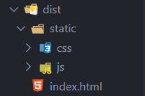
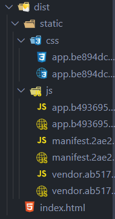
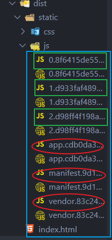

## 前提知识：

### 打包后的 dist 目录

在使用 vue-cli2 创建的项目中，运行 npm run build 指令，会对项目进行打包，产生新的目录 dist ，用于存放打包后的项目。

dist目录结构:

* static
  * css
    * app.xxx.css ：项目中的css代码
  * js
    * **app.xxx.js** ：项目业务逻辑代码
    * **manifest.xxx.js** ：webpack 打包的底层支撑文件
    * **vendor.xxx.js** ：第三方依赖的框架：vue 等
* index.html ：项目入口文件

如图：

> 			

当初在自己配置 webpack 时候，项目都是打包在一个 bundle.js 文件中的，而 vue-cli 创建的项目打包后会把 css、js 进行抽离

其 js 目录中包含三个 js 文件，分别对应着三种不同的代码。

  							

### 认识懒加载

**什么是懒加载？**

​	懒加载，即需要的时候再加载。

**为什么使用懒加载？**

​		上文已经讲解到：使用 Vue-cli 打包后的 dist 目录结构，其中 js 子目录中抽离出了三个不同业务的 JavaScript 文件，上面的三个基本 js 文件，在用户打开界面的时候，都会请求下来。

​		app.js 中包含了项目中的业务逻辑代码，但是当一个项目很大的时候,所有的业务逻辑代码都包含在app.js中, 那么当用户进入应用首界面时,就会请求全部的业务逻辑代码, 可能会导致短暂的首页白屏, 用户体验下降。

**解决问题**

​	对于一些“暂时”用不到的组件，我们可以不进行加载，等到用到某组件时再加载。这样可以优化 spa 应用首次加载白屏情况，也给用户更好的体验。这就是 vue 路由懒加载的作用。

​	默认情况下，会请求所有的业务代码，我们只需要 **按需动态的加载路由组件**, 即可解决一次性请求所有业务代码的弊端.


## 具体实现：

可以使用 **ES6 的 import 方法** 动态加载，也可以使用 **vue的异步组件**

	**常用ES6 的 import 方法动态引入依赖(组件)**，简便易读。
	
	import("modulePath")	import("modulePath").then(api=>{})

在配置全局路由时，改变 component 的引入方式即可（按需引入）

```
import VueRouter from "vue-router";
import Vue from "vue";

Vue.use(VueRouter);

export default new VueRouter({
  // linkActiveClass:"active",
  mode: "history",
  routes: [
    {
     path: "/",
     redirect: "/home"
    },
    {
     path: "/user/:UserID",
     component: () => import("../components/User.vue")
    },
    {
     path: "/user",
     component: () => import("../components/User.vue")
    },
    {
     path: "/home",
     component: () => import("../components/Home.vue")
    },
    {
     path: "/about",
     component: () => import("../components/About.vue")
    }
  ]
});
```

直接配置 `component: () => import("modulePath")` 代码看着不够简便，也不容易管理，

优化形式:

* 可以把动态引入的函数定义成一个变量，再进行配置

```
import VueRouter from "vue-router";
import Vue from "vue";

//将ES6的动态引入函数，定义成一个变量，再配置给component选项即可

let UserCpn = () => import("../components/User.vue");
let HomeCpn = () => import("../components/Home.vue");
let AboutCpn = () => import("../components/About.vue");

Vue.use(VueRouter);

export default new VueRouter({
  // linkActiveClass:"active",
  mode: "history",
  routes: [
    {path: "/",redirect: "/home"},
    { path: "/user/:UserID", component: UserCpn, },
    {path: "/user",component: UserCpn,},
    {path: "/home",component: HomeCpn,},
    {path: "/about",component: AboutCpn,}
  ]
});
```

打包结果：




除了原来的三个基本 js 文件，又多出来了三个 js 文件，这三个 js 文件，就是配置全局路由时，懒加载引入的模块

>​	由于该demo配置了3个组件模块，所以打包会多出来3个js文件，如果项目有 n 个组件，打包后会多出来对应的 n个 js 文件

多出来的 3 个 js 文件，是从原来的 app.js 中抽离出来的，这样就不需要一次性请求所有的业务逻辑代码，而是当某个路由活跃时，请求加载对应的组件