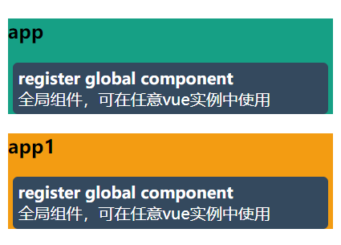
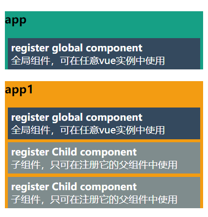

# 组件的注册和使用

​	组件化管理，可以让项目的代码结构、逻辑，更加的清晰，更容易维护，且可以进行组件的复用。

## 基础知识

使用vue组件的步骤，可以概括为两步：

1. 创建组件
2. 注册组件

### 创建组件

使用 **组件构造器：`Vue.extend(param)`** 创建vue组件，我们需要传入与组件相关的参数，才可创建对应的组件。

可以传递两种形式的参数：

* 具有vue选项的Object
  * 适合在demo中使用
* 引入`.vue`文件的变量
  * 实际开发中最普遍的使用方式

#### 挂载创建的组件

我们需要调用 <font color="#27ae60">组件**实例**的方法</font>：`cpn.$mount("cssSelector"/elem)`,挂载到对应的dom元素上（组件template会替换目标dom）。

**参数**

* 可以是css选择器
* 可以是具体的dom元素

**步骤：**

1. 创建组件实例
2. 调用`$mount`方法

```
let constructor = Vue.extend({
        template: "……",
        data(){return{……}}
		});
		
let cpn=new constructor();
cpn.$mount(document.querySelector("#app"));
//cpn.$mount("#app");
```


**示例测试**

```
<body>
    <div id="app">
      <div class="my-cpn" style="background-color: yellow"></div>
    </div>
</body>
<script src="https://unpkg.com/vue/dist/vue.js"></script>
<script>
      let constructor = Vue.extend({
        template: "<h2>{{message}}</h2>",
        data() {
          return {
            message: "我是由组件构造器create的组件",
          };
        },
      });
      new constructor().$mount(".my-cpn");
</script>

```


### 注册组件

​	我们可以注册组件，并给组件命名，后续就可以在html中使用对应名称的标签，进行组件的使用、复用。

#### 全局组件

> 全局组件，即作用范围是全局，只需要在全局注册一次，就可以在任意vue实例内使用。

注册全局组件，需要使用`Vue.component(cpnName,cpnController/{option})`将对应的组件进行全局注册。

参数：

1. 组件名称

2. 可以是 组件构造器变量

   * 将构造器对应的组件进行注册

   可以是 包含vue组件options的对象

   * 内部会自动执行`Vue.extend()`,然后再注册对应的组件

**示例测试**

以下demo注册了全局组件，并分别在`#app1、#app2`实例中使用。



```
<style>
      #app {
        background-color: #16a085;
      }
      #app1 {
        background-color: #f39c12;
      }
      .myCPN {
        background-color: #34495e;
        color: #fff;
        padding: 5px;
        border-radius: 5px;
        margin: 5px;
      }
</style>
<body>
    <div id="app">
      <h3>{{message}}</h3>
      <my-global-cpn></my-global-cpn>
    </div>
    <div id="app1">
      <h3>{{message}}</h3>
      <my-global-cpn></my-global-cpn>
    </div>
</body>
<script src="https://unpkg.com/vue/dist/vue.js"></script>
<script>
      let cpn = {
        name: "myCPN",
        template: `
          <div class="myCPN">
            <strong>{{message}}</strong><br>
            <span>{{desc}}</span>
          </div>
        `,
        data() {
          return {
            message: "register global component",
            desc: "全局组件，可在任意vue实例中使用",
          };
        },
      };
      let construct = Vue.extend(cpn);
			
			//第二参数，可传入 组件构造器/包含vue选项的Object
      // Vue.component("my-global-cpn", construct);
      Vue.component("my-global-cpn", cpn);

      //#app
      new Vue({
        el: "#app",
        data: {
          message: "app",
        },
      });

      //#app1
      new Vue({
        el: "#app1",
        data: {
          message: "app1",
        },
      });
</script>

```


----

#### 子组件

>子组件，即作用范围是相对于父组件的，只能在注册它的组件中使用。

​	在注册子组件时，我们不需要像注册全局组件一样，在外部使用`Vue.component()`进行注册，我们只要在 需要使用子组件的组件中(父组件)，添加`components`选项，在父组件内部注册子组件。

**语法示例：**

可以在components选项中注册多个组件，属性名意为组件名，属性值意为对应的组件。

```
new Vue({
	el:"#parent",
	components:{
		"cpnName": 包含vue选项的Obj / 组件构造器 / 外部引入的.vue文件变量
		 ……
	}
})
```

**实例测试**



```
<style>
      #app {
        background-color: #16a085;
      }
      #app1 {
        background-color: #f39c12;
      }
      .childCPN {
        background-color: #7f8c8d;
        color: #fff;
        padding: 5px;
        margin: 5px;
      }
      .globalCPN {
        background-color: #34495e;
        color: #fff;
        padding: 5px;
        margin: 5px;
      }
</style>
<body>
    <div id="app">
      <h3>{{message}}</h3>
      <my-global-cpn></my-global-cpn>
      <!-- </child-cpn></child-cpn> 该组件未在app对应的vue实例中注册，使用无效-->
    </div>
    <div id="app1">
      <h3>{{message}}</h3>
      <my-global-cpn></my-global-cpn>
      <child-cpn></child-cpn>
      <child-cpn></child-cpn>
    </div>
    
    <template id="childCPNtmp">
      <div class="childCPN">
        <strong>{{message}}</strong><br />
        <span>{{desc}}</span>
      </div>
    </template>
    
</body>
<script src="https://unpkg.com/vue/dist/vue.js"></script>
 <script>
      //全局组件的registe

      let globalCpn = {
        name: "myGlobalCPN",
        template: `
          <div class="globalCPN">
            <strong>{{message}}</strong><br>
            <span>{{desc}}</span>
          </div>
        `,
        data() {
          return {
            message: "register global component",
            desc: "全局组件，可在任意vue实例中使用",
          };
        },
      };
      let constructG = Vue.extend(globalCpn);

      // Vue.component("my-global-cpn", constructG);
      Vue.component("my-global-cpn", globalCpn);

      //子组件的注册

      let Childcpn = {
        name: "myChildCPN",
        //使用id锁定对应的模板。
        template: `#childCPNtmp`,
        data() {
          return {
            message: "register Child component",
            desc: "子组件，只可在注册它的父组件中使用",
          };
        },
      };
      let constructorC = Vue.extend(Childcpn);

      //#app
      new Vue({
        el: "#app",
        data: {
          message: "app",
        },
      });

      //#app1
      new Vue({
        el: "#app1",
        data: {
          message: "app1",
        },
        components: {
          // "cpnName": 组件构造器/包含组件option的对象/引入的.vue文件变量 ,
          "child-cpn": constructorC,
        },
      });
</script>

```

