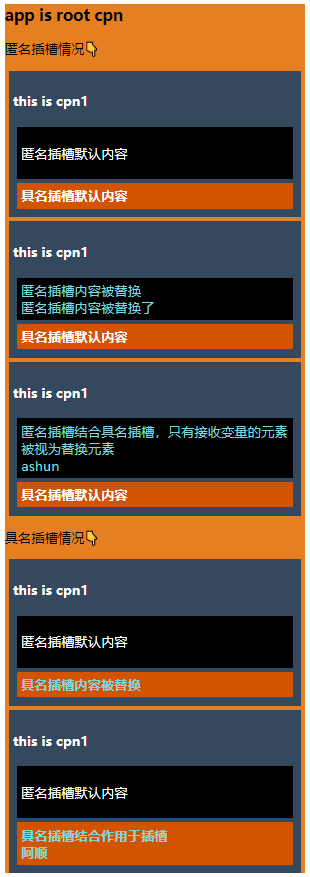

# 插槽的使用

什么是插槽？有什么作用？

* 插槽，按现实世界的理解，就像USB插槽一样，可以插拔，提高了设备的可扩展性（想使用什么就插什么）
*  同理放在Vue中，一些元素可以当作插槽，提高组件的可扩展性、灵活性。

> vue中的插槽一般应用在子组件中，让组件的部分内容可由外部(父组件)设置，让组件内容更加的灵活。

## 插槽特点

* 如果slot有默认值，当子组件在外部使用时，组件标签内没有任何元素，则渲染插槽默认值
* 无论插槽有无默认值，当子组件在外部使用时，都可以在组件标签内写入元素，替换匿名插槽的内容，也可使用一些语法替换具名插槽的内容。
* 作用域插槽在被外部替换时，可以传入子组件的变量

## 插槽种类

### 匿名插槽

`<slot>…<slot>`

**外部替换**

由于是匿名插槽，当在该子组件被外部使用时，在组件标签内插入任何内容，都会替换匿名插槽内容。

```
  <div id="app">
      <h3>app is root cpn</h3>
      <cpn1>
        <!-- 这些内容都会替换匿名插槽 -->
        <span class="show">匿名插槽内容被替换</span><br />
        <span class="show">匿名插槽内容被替换了</span>
      </cpn1>
    </div>

   <template id="tmpCPN1">
      <div class="tmpCPN1">
        <h4>{{desc}}</h4>
        
        <div class="anonymousSlot">
          <slot msg="ashun">
            <p>匿名插槽默认内容</p>
          </slot>
        </div>

     	</div>
   </template>
 </body>
<script>
      let cpn1 = {
        template: "#tmpCPN1",
        data: () => {
          return {
            desc: "this is cpn1 ",
          };
        },
      };
      new Vue({
        el: "#app",
        components: {
          cpn1,
        },
      });
</script>
```

若匿名插槽结合了作用域插槽，则外部替换元素：若具有`slot-scope="params"`属性的替换标签 与 普通替换标签 **同时存在** 则具有`slot-scope="params"`属性的标签 ，才会被认为是要替换元素标签。

* 也就是说，上述情况，二者同时存在，只有接受插槽变量的元素 被视为替换元素。

```
 <body>
 <div id="app">
      <h3>app is root cpn</h3>
      <cpn1>
        <!-- 由于结合了作用域插槽，只有 具有slot-scope属性的替换标签，才会替换匿名插槽 -->
        <span class="show" slot-scope="params">
          匿名插槽结合具名插槽，只有接收变量的元素被视为替换元素<br />
          {{params.msg}}
        </span>
        <!-- 下面的span不会替换匿名插槽内容(不会展示)-->
        <span class="show">匿名插槽内容被替换</span>
      </cpn1>
  </div>

  <template id="tmpCPN1">
     <div class="tmpCPN1">
        <h4>{{desc}}</h4>
        
        <div class="anonymousSlot">
          <slot msg="ashun">
            <p>匿名插槽默认内容</p>
          </slot>
        </div> 
        
     </div>
  </template>
</body>
<script>
   ……
</script>
```


### 具名插槽

`<slot name="slotName">…<slot>`

**外部替换**

需要指定slot的名称，即具名插槽的name属性，通过给替换元素绑定`slot="slotName"`属性，确定要替换的具名插槽

```
 <body>
 <div id="app">
      <h3>app is root cpn</h3>
      <cpn1>
        <strong slot="slotAlias" class="show">具名插槽内容被替换</strong>
      </cpn1>
  </div>

  <template id="tmpCPN1">
     <div class="tmpCPN1">
        <h4>{{desc}}</h4>
        
        <div class="anonymousSlot">
          <slot msg="ashun">
            <p>匿名插槽默认内容</p>
          </slot>
        </div>
         <div class="slotAlias">
          <slot name="slotAlias">
            <strong>具名插槽默认内容</strong>
          </slot>
        </div>
        
     </div>
  </template>
</body>
<script>
   ……
</script>
```


### 作用域插槽

`<slot prop="…">…</slot>`

**外部替换**

需要给替换元素添加`slot-scope="params"`属性，在替换元素标签内部就可使用`params.prop`访问传递的变量

```
 <body>
 <div id="app">
      <h3>app is root cpn</h3>
      <cpn1>
        <strong slot="slotAlias" class="show" slot-scope="params">
        	具名插槽内容被替换<br/>
        	{{params.msg}}
        </strong>
      </cpn1>
  </div>

  <template id="tmpCPN1">
     <div class="tmpCPN1">
        <h4>{{desc}}</h4>
       
         <div class="slotAlias">
          <slot name="slotAlias" msg="Ashun">
            <strong>具名插槽默认内容</strong>
          </slot>
        </div>
        
     </div>
  </template>
</body>
<script>
   ……
</script>
```


### 综合用例

现在把以上讲述的用例情况综合起来：



```
 <style>
       #app {
        background-color: #e67e22;
      }
      .tmpCPN1 {
        background-color: #34495e;
        color: white;
        padding: 5px;
        margin: 5px;
      }
      .anonymousSlot,
      .slotAlias {
        margin: 5px;
        padding: 5px;
      }
      .anonymousSlot {
        background-color: black;
      }
      .slotAlias {
        background-color: #d35400;
      }
      .show {
        color: #7ed6df;
      }
 </style>
 <body>
    <div id="app">
      <h3>app is root cpn</h3>
      <p>匿名插槽情况👇</p>
      <cpn1></cpn1>

      <cpn1>
        <!-- 这些内容都会替换匿名插槽 -->
        <span class="show">匿名插槽内容被替换</span><br />
        <span class="show">匿名插槽内容被替换了</span>
      </cpn1>

      <cpn1>
        <!-- 由于结合了作用域插槽，只有 具有slot-scope属性的替换标签，才会替换匿名插槽 -->
        <span class="show" slot-scope="params">
          匿名插槽结合具名插槽，只有接收变量的元素被视为替换元素<br />
          {{params.msg}}
        </span>
        <!-- 下面的span不会替换匿名插槽内容(不会展示)-->
        <span class="show">匿名插槽内容被替换</span>
      </cpn1>

      <p>具名插槽情况👇</p>
      <cpn1>
        <strong slot="slotAlias" class="show">具名插槽内容被替换</strong>
      </cpn1>
      <cpn1>
        <strong slot="slotAlias" class="show" slot-scope="params">
          具名插槽结合作用于插槽<br />
          {{params.msg}}
        </strong>
      </cpn1>
    </div>

    <template id="tmpCPN1">
      <div class="tmpCPN1">
        <h4>{{desc}}</h4>
        <div class="anonymousSlot">
          <slot msg="ashun">
            <p>匿名插槽默认内容</p>
          </slot>
        </div>
        <div class="slotAlias">
          <slot name="slotAlias" msg="阿顺">
            <strong>具名插槽默认内容</strong>
          </slot>
        </div>
      </div>
    </template>
</body>
<script>
   		let cpn1 = {
        template: "#tmpCPN1",
        data: () => {
          return {
            desc: "this is cpn1 ",
          };
        },
      };
      new Vue({
        el: "#app",
        components: {
          cpn1,
        },
    	});
</script>
```


## 最新用法

​	上面讲述的插槽指令官方已经不再维护(废弃)，虽然依旧能够使用，但是我们最好使用官方目前支持的语法。

`slot`标签属性语法不变，改变的是替换插槽时的属性语法，之前如果我们使用**匿名插槽并结合作用于插槽传递变量**,需要在替换元素标签上设置两个属性

* `slot="slotName"`
* `slot-scope="params"`

>现在vue提供了新的语法，使得这种情况更加简便。

### v-slot

`v-slot:slotName="params"`，**该属性只能绑定在template标签上**，此时template标签为替换元素标签。

**使用场景**

以下以实际开发使用.vue文件情况示例。

1. 当我们只需要替换具名插槽时，只要给替换元素标签`template`绑定`v-slot:slotName`属性即可

   父组件

   ```
   <template>
     <div id="main">
       <h1>{{ message }}</h1>
       <!-- 传统方式的slot用法 可绑定在普通标签、template标签 -->
       <test-cpn>
         <!-- 替换具名插槽内容 -->
         <div slot="testSlot" slot-scope="params">
           {{ params.prop }}\{{ params.Name }}
         </div>
         <!-- 匿名插槽会被插入的内容替换 -->
         shun
       </test-cpn>
       <!-- 最新slot用法 v-slot:SlotName="parmas" 只能绑定在template标签上 -->
       <test-cpn>
         <template v-slot:testSlot>
           <strong>阿顺特烦恼</strong>
         </template>
         SHUN
       </test-cpn>
     </div>
   </template>
   <script>
     import testCpn from "./test.vue";
     export default {
       name: "MainCPN",
       data() {
         return {
           message: "Ashuntefannao",
         };
       },
       components: {
         testCpn,
       },
     };
   </script>
   <style scoped>
   </style>
   ```

   子组件test.vue

   ```
   <template>
     <div class="test">
       <h2>ASHUN</h2>
       <slot><h2>ashun</h2></slot>
       <slot name="testSlot" prop="testProp" Name="shunzi">
         <input type="radio" />
       </slot>
     </div>
   </template>
   <script>
     export default {
       data() {
         return {};
       },
     };
   </script>
   ```

   

2. 既要替换具名插槽，又要接收作用于插槽的变量，绑定`v-slot:slotName="params"`属性即可

   ```
   <template>
     <div id="main">
       <h1>{{ message }}</h1>
       <test-cpn>
         <template v-slot:testSlot="params">
           {{ params.prop }}\\\\{{ params.Name }}
         </template>
         SHUN
       </test-cpn>
     </div>
   </template>
   <script>
   	……
   </script>
   <style scoped>
   </style>
   ```

   

