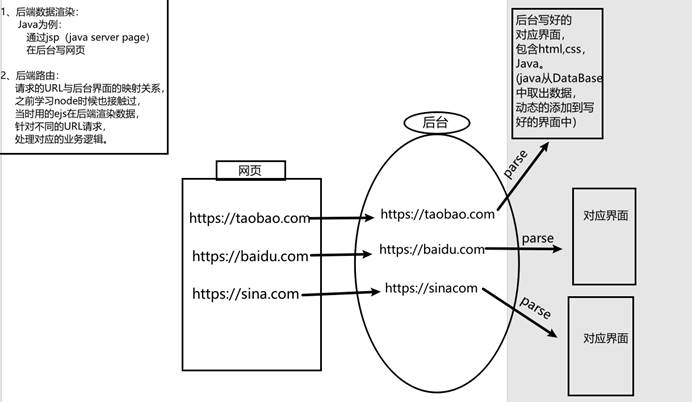
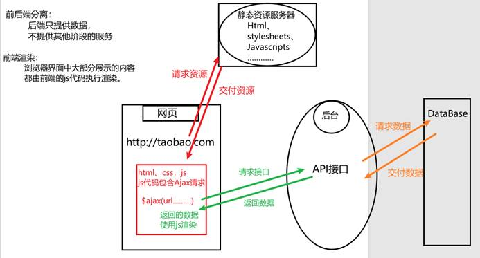
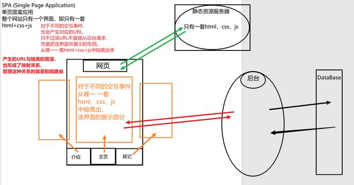

要认识前端路由，就一定要了解web开发的发展历史，因为前端路由概念是现阶段的新增产物。

主要经历三个阶段：

1. 服务端渲染(SSR)：后端路由的概念
2. 前端渲染：前后端分离概念
3. 单页富应用：前端路由概念

## 1.服务端渲染

### 基本概念

我们之前听到的SSR(`Server side rendering`)翻译过来就是服务端渲染。

​	早期的网页 都是由后端语言编写的（没有js） 后端接收到浏览器请求的 URL，对 URL 进行解析，再把该 URL 请求对应的界面渲染到前端。而这些界面都是提前在后端写好的界面，包含 html、css、后台语言。

​	后台语言的作用是从 DataBase 中读取数据，动态的添加到写好的界面中。例如 Java 中的 jsp（java server page）

* 由于 **界面在浏览器展示前就已经写好定型了**，也就说在后端已经有了 `HTML` 结构，因此叫做服务端渲染。 

* 由于这些界面与 URL 的映射关系是由后端管理的，因此后端管理页面的过程也叫做 **后端路由**。

### 优缺点

**优点**

1. 更快的响应时间：由于界面在后端已经写好，已经有了 html 页面的框架，直接交给浏览器渲染即可。
2. 更好的 SEO：我们可以将 SEO 的关键数据直接在后台就渲染成 html，从而保证搜索引擎的爬虫能爬取到关键数据

**缺点**

* 没有前后端的概念：整个页面和后台，都是由后端开发者完成的。
* 不利于维护：Html、css、后台语言，参杂在一起，后期维护艰难。

## 2.前后端分离

### 基本概念

​	出现新角色（静态资源服务器），有些静态资源服务器是和后台服务器结合在一起的，一般后台服务器只提供API接口，静态资源服务器用来存放网页渲染的资源，html、css、javascript等。

​	随着 Ajax 的出现，有了前后端分离的开发模式。后端只提供 API 来返回数据，前端通过 Ajax 获取数据，并且可以通过 js 将数据渲染到界面上。

* 当网页发送Url请求时，首先请求 `静态资源服务器`，得到 html、css、js 等资源
* html、css 能够直接渲染，但是 js 中包含 Ajax 请求，Ajax 向后台请求对应的接口
* 后台再向 DataBase 拿取数据，Ajax 得到请求的数据，再通过 js 进行渲染。

### 优缺点

**优点**

1. 前后端责任清晰：后端专注数据处理，前端负责界面展示和交互。
2. 后端逻辑复用：当移动端（Android/IOS）出现后，后端不需要进行任何处理，依然使用之前的 API 即可，前端只需要发送网络请求获取数据，展示即可。

**缺点**

​	同下文👇

## 3.单页面富应用SPA

### 基本概念

网页发展的第三个阶段：SPA(Single Page Application )单页面富应用。

SPA就是在前后端分离的基础上添加了一层**前端路由**，抽离的资源与URL形成的映射关系。

而前端路由就是：组件(资源)与URL的映射关系，是浏览器控制的。也就是由前端实现的，因此叫前端路由。

 

### 优缺点

**优点**

​	同上文：[前后端分离](##2.前后端分离)

**缺点**

1. 首屏打开很慢：用户首次打开应用，需要下载整个 SPA 的框架(一整套资源)，然后再渲染到页面
2. 不利于 SEO 搜索引擎优化：由于一开始加载的只是整个应用的框架，具体的数据需要请求服务器，而发送请求是需要耗时的，所以一开始搜索引擎可能只爬取到了应用的大框架，并没有爬取实际展示的数据。

