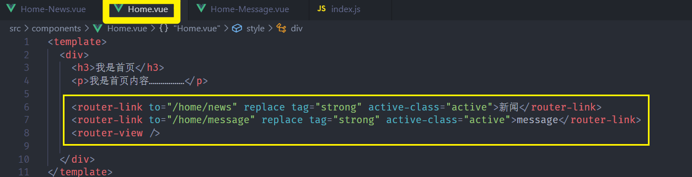
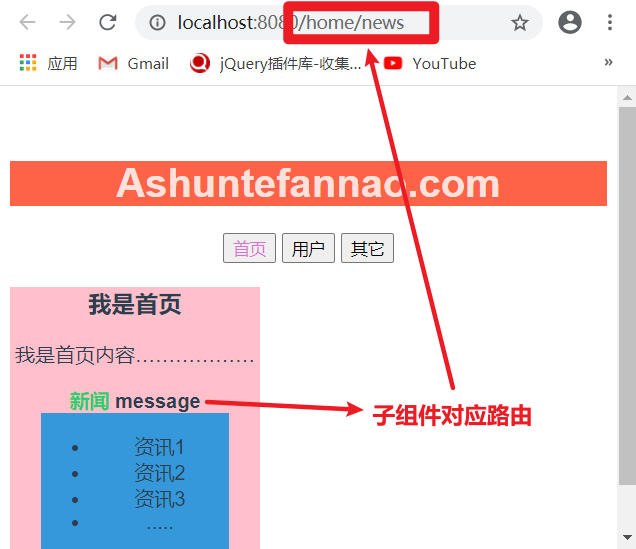
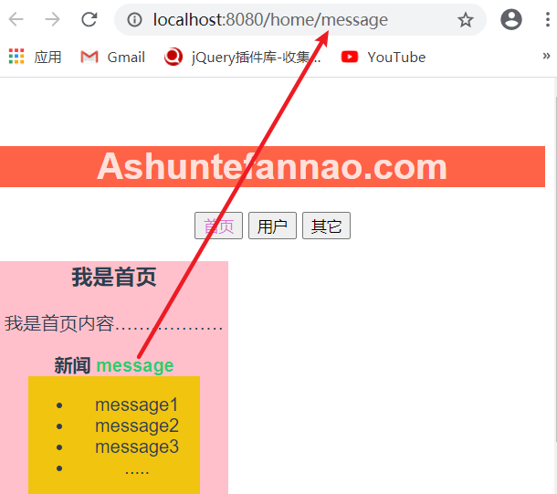

# 路由的嵌套

#### 一、介绍：

> 路由的嵌套，即多层级路由的请求，在学习nodeJS时已经接触过，在vue中配置多级路由，需要在路由映射对象中配置**children：[{}，{}…… ]**，在其中配置子路由的映射，其配置方式与父级路由只有一点不同，在**配置path时 开头不用加 “ / ”**。

#### 二、应用情况

> 在一个配置路由的界面中，又需要包含其它的 小界面或组件，这时候可以通过设置子路由，来配置对应子界面的映射关系

#### 三、配置使用：

##### 1、配置

在对应路由映射中 配置children选项，children是一个Array，元素为obj，在obj中配置子路由的映射关系，**配置子路由的path时 开头不用加“ / ”**。

也可以对子路由的映射关系配置redirect（重定位），展示默认组件

>
>
>

##### 2、使用

​	**在对应父组件中**配置`<router-link><……/> ；<router-view/>`

>
>
>

##### 效果：

>/home/news
>
>
>
>/home/message
>
>

