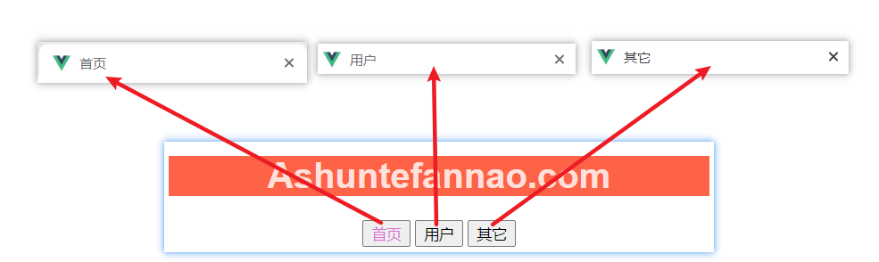
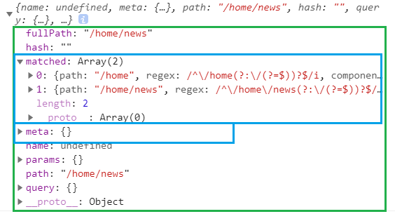

# 路由全局导航守卫-beforeEach（前置守卫guard）

>[导航守卫 | Vue Router (vuejs.org)](https://router.vuejs.org/zh/guide/advanced/navigation-guards.html#全局前置守卫)

#### 一、应用场景

​			在路由跳转的时候，可能会需要一些信息的传递（$route）,**还可能会做一些操作**，比如更改网页，下面会以更改网页的title为例。


#### 二、具体使用

>问题:
>
>​	当进行页面跳转的时候，网页的title信息总是保持默认的名称（index.html中的title），不会发生改变，现在需要根据路由的跳转更改不同的title名称。

##### 要解决上面问题有两种比较可行的方法

   1. 利用生命周期函数（比较麻烦）

      ---

      生命周期函数：

      ```
      * beforeCreate
      * created
      * beforeMount
      * mounted
      * beforeUpdate
      * updated
      * beforeDestroy
      * destroyed
      ```

      当跳转路由时候，更改对应的title信息，即当路由映射的组件创建完成后更改。

      所以应用 creted生命周期函数，进行title的更改

      **分别在对应组件中配置created选项**

      >```
      >//Home.vue
      >export default {
      >  data() {
      >    return {};
      >  },
      >  created: () => {
      >    document.title = "首页";
      >  }
      >};
      >
      >//About.vue
      >export default {
      >  data() {
      >    return {};
      >  },
      >  created: () => {
      >    document.title = "其它";
      >  }
      >};
      >
      >//User.vue
      >export default {
      >  data() {
      >    return {…………};
      >  },
      >  methods:{……}，
      >  created: () => {
      >    document.title = "用户";
      >  }
      >};
      >```
      >
      >效果：
      >
      >
      >
      >
      >
      >缺点:
      >
      >一个项目中，会包含很多的路由，如果title需求发生了变化，则**要找到每个vue组件一个个进行配置**，不容易管理和实现。
      >

   2. 利用全局导航首位（容易管理）

      ---

      **只需在管理路由的js文件中进行配置（route/index.js）**

      1. 提前配置好不同路由对应的title

         >**在rotes.obj.meta中存储title**

      >meta元数据
      >
      >(描述数据的数据，即本身就是一个数据，内部存放了其它的数据)

```

//下载使用的插件,内部会调用 PluginName.install()进行下载
Vue.use(VueRouter);

//将routes配置抽离出来
let routes = [
 {
   path: "/",
   redirect: "/home"
 },
 {
   path: "/user",
   component: UserCpn,
   meta: {
     title: "用户"
   }
 },
 {
   path: "/home",
   component: HomeCpn,
   meta: {
     title: "首页"
   },
   children: [
     { path: "", redirect: "news" },
     { path: "news", component: Home_NewsCpn },
     { path: "message", component: Home_MessageCpn }
   ]
 },
 {
   path: "/about",
   component: AboutCpn,
   meta: {
     title: "其它"
   }
 }
];

//实例化插件对象
let vuerouter = new VueRouter({
 // linkActiveClass:"active",
 mode: "history",
 routes
});
```


 2. 使用全局导航守卫

     >
     >
     >```
     >
     >//全局导航守卫
     >vuerouter.beforeEach((to, from, next) => {
     >  document.title = to.matched[0].meta.title;
     >  next();
     >});
     >export default router;
     >```
     >
     >使用详解:
     >
     >* VueRouter实例化类.beforeEach(callback)
     >
     >* callback回调函数的参数
     >
     >  1. to
     >
     >     >to,即到哪里，该变量能够监听活跃的路由，该变量就是当前活跃的路由对象
     >     >
     >     >
     >     >
     >     >to的打印结果:
     >     >
     >     >
     >     >
     >     >包含了当前活跃路由的信息。
     >     >
     >     >matched：包含当前活跃路由的父子路由的信息。
     >     >
     >     >meta：用于存放元数据，即上面配置的 routes.obj.meta
     >     >
     >     >meta 本身就存在，配置的 routes.obj.meta 只是在里面压入数据。
     >
     >  2. from
     >
     >     >from,即源自于哪里
     >     >
     >
     >  3. next
     >
     >     >next 即下一步，是 callback 中内置的回调函数，**必须调用next()**
     >     >
     >     >因为如果不配置 beforeEach(callback)，系统也会默认进行配置，并且自动执行 callback 中的回调函数 next()。
     >     >
     >     >现在，我们自己配置了beforeEach(callback)，如果不调用callback中next()则会出错
     >     >
     >     >
     >     >
     >     >- **`next()`**: 进行管道中的下一个钩子。如果全部钩子执行完了，则导航的状态就是 **confirmed** (确认的)。
     >     >- **`next(false)`**: 中断当前的导航。如果浏览器的 URL 改变了 (可能是用户手动或者浏览器后退按钮)，那么 URL 地址会重置到 `from` 路由对应的地址。
     >     >- **`next('/')` 或者 `next({ path: '/' })`**: 跳转到一个不同的地址。当前的导航被中断，然后进行一个新的导航。你可以向 `next` 传递任意位置对象，且允许设置诸如 `replace: true`、`name: 'home'` 之类的选项以及任何用在 [`router-link` 的 `to` prop](https://router.vuejs.org/zh/api/#to) 或 [`router.push`](https://router.vuejs.org/zh/api/#router-push) 中的选项。
     >     >- **`next(error)`**: (2.4.0+) 如果传入 `next` 的参数是一个 `Error` 实例，则导航会被终止且该错误会被传递给 [`router.onError()`](https://router.vuejs.org/zh/api/#router-onerror) 注册过的回调。
     >
     >​     
     >
     >#### 注意点：
     >
     > 1. 必须调用 callback 中的回调函数参数 next()
     >
     > 2. 更改 title 时候监听当前的根路由（to.matched[0]）
     >
     >    >
     >    >
     >    >由于本 demo 中，首页有嵌套路由，并且给嵌套路由设置了 redirect 重定位，即有默认访问的子路由
     >    >
     >    >当进入首页时，路由为 /home/news。但是要显示父级路由的title信息。
     >    >
     >    >而 to.matched 包含当前活跃路由的父子路由信息，且层级关系随着下标增加而增加。所以要访问当前的根路由，即 matched[0].
     >    >
     >    >**取 to.matched[0].meta.title**
     >

