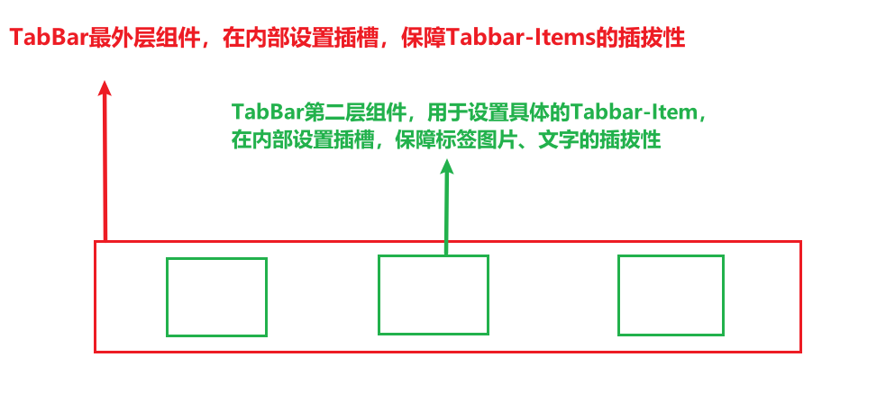
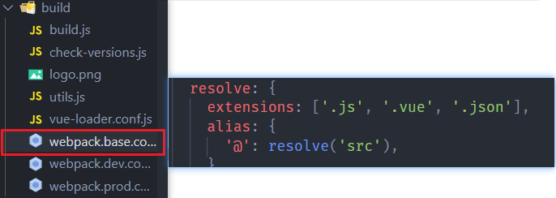
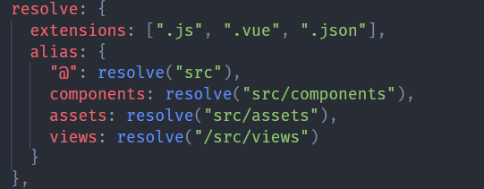

# TabBar封装思路与设计


## 需求

>封装一个标签栏组件，并且能够在其它项目中使用，标签栏内的标签支持增删改、标签内的图片、文字、支持增删改。


## 组件结构设计

1. TabBar整体组件

   > TabBar功能的最外层组件，支持插拔整个Tabar，在其中设置插槽，用来放置各个标签

3. TabBar-Item组件

   >TabBar的第二层组件，用于设置具体的标签内容，该组件支持插拔标签内的图片和文字


结构如图:




## 组件框架封装的过程


1. App.vue中实现具体效果

   >先在App.vue中实现组件的具体展示效果，因为项目入口文件挂载的唯一vue组件就是App.vue.
   >
   >在App.vue中@import引入基础样式base.css
   >
   >暂时在App.vue设置TabBar组件的样式

2. 创建TabBar组件

   >创建TabBar.vue文件，设置一个插槽（用于存放各个标签），并把刚刚在App.vue中实现的代码剪切过来（对应css也剪切）。
   >
   >实现了初步的封装。

3. 创建TabBarItem组件

   >由于标签栏中的标签需要满足可插拔性，所以需要创建TabBarItem组件，单独设置具体的标签。
   >
   >在Item组件中配置 活跃图片插槽、失活图片插槽、文字插槽。
   
4. 封装MainTabBar组件

   >在使用TabBar、TabBarItem组件进行封装后，最后代码存在于App.vue中，而对于入口展示文件来说，最好不要一个组件包含很多代码，这样在后期添加多个组件时，结构会不清晰。
   >
   >再创建一个组件，封装App.vue中的TabBar部分，这样App.vue关于TabBar的代码，就缩小到一行`<main-tab-bar></main-tab-bar>`


## 组件封装中注意的问题


#### 1、组件的命名问题。

>在vue基础中，组件的名称是不可以使用驼峰式命名的。
>
>但是vue-cli创建的项目中，组件名称是可以使用驼峰式命名的，在使用以驼峰形式命名的组件标签的时候，标签名称改为全部小写且原驼峰处使用  " - " 连接
>
>例子:
>
>```html
><tmplate>
>	<div>
>    	<tab-bar-items> </tab-bar-items>
>    </div>    
></template>
>```
>
>```javascript
>import TabBarItems from "/path..."
>
>export default{
>    components:{
>        TabBarItems
>    }
>}
>```
>
>
>
>即便vue-cli中可以使用驼峰式明明，但是也不可随便起名字，可能会导致vue找不到组件。
>
>例子:
>
>>组件命名时:不能够同时使用驼峰式命名并用  下划线“  _ ” 衔接
>>
>>因为在cli中，若给组件驼峰式命名，在使用组件标签的时候，会将驼峰衔接处转化为 “ - ” 连接。但是html标签名称中是不支持下划线的  " _ "


#### 2、替换的插槽外层最好包裹一层div

>```html
><!--App.vue-->
><tab-bar-item  path="/home" activecolor="#f6e58d" staticcolor="rgba(255,255,255,.8)">
>        
>        
>        <p slot="Items-txt">首页</p>
></tab-bar-item>
>```
>
>```html
><!--TabBarItem.vue-->
><template>
>  <div class="TabBar_Items" @click="routejump(path)">   	<!--包裹整个组件的div-->
>    
>     <!-- 活跃图片插槽 -->
>      <div v-if="isActive">									<!--包裹active图片插槽的div-->
>        <slot name="Items-img-active"> </slot>
>      </div>
>      <!-- 失活图片插槽 -->
>      <div v-else>											<!--包裹失活图片插槽的div-->
>        <slot name="Items-img"> </slot>
>      </div>
>      <!--文字插槽  -->
>      <div :style="activeStyle">							<!--包裹文字插槽的div-->
>        <slot name="Items-txt"></slot>
>      </div>
>     
>    </div>
>  </template>
>```
>
>
>
>> **为什么要在被替换的插槽外包裹div？**
>>
>> 在父组件中替换子组件插槽时，是给一个新的dom配置一个slot属性与替换插槽对应，最终渲染到界面上的没有slot，而是替换的dom，但是如果需要给slot动态的设置样式:(比如通过一个变量，来判断是否添加某样式👆)，由于slot标签会被替换掉，所以样式的设置也就会无效，所以为了预防替换slot后出现的错误，通常会在slot外包裹一层div（或其他dom），然后把样式的设置，转移到外层包裹的div上。
>>
>> 


#### 3、重复跳转相同路由，vue内置报错

>用户通过点击按钮，来操控路由，跳转到不同的组件，但是用户可能会多次点击按钮，而vue会对重复跳转相同路由报错。
>
>解决：
>
>​		**在使用$router.push/replace()路由跳转时候，手动配置catch，只返回错误（或者什么都不做），不把异常抛出**
>
>​		之所以出现红字报错，是因为vue对重复跳转路由状态下 抛出了异常 throw new Error(err)
>
>​		而我们只需要不抛出异常即可。
>
>```js
>this.$router.replace("/path……").catch(err=>err)			//或  .catch(err=>{})	
>```
>
>


#### 4、文件路径别名

>当应用一些资源时(component,css,image……)，可能目录的嵌套层级非常多，如果直接引入文件的path，会使得代码不清晰，目录嵌套关系过多，后期维护管理也不方便。
>
>这时候可以配置别名，**在webpack.config.js.resolve.alias中进行别名的配置**
>
>文件目录别名的配置，在webpack时已经学习过了，这里谈在项目中具体的配置和使用。
>
>
>
>#### 1、配置: 	/build/webpack.base.config.js
>
>
>
>
>
>可以发现，已经默认配置了一个别名， “@”：resolve("src")    **当后期使用import引入的时候就可以使用@替代src目录**
>
>**配置规则： “别名”：resolve("path")**
>
>
>
>下面分别配置了常用的目录别名👇
>
>
>
>
>
>#### 2、使用: 
>
>   1. **js语法 import 引入**
>
>      >直接使用别名即可
>      >
>      >```js
>      >()=>{ return import("别名/……")}	//动态加载模块
>      >import api from "别名/……"			//普通引入模块
>      >```
>      >
>      >
>
>   2. **非js引入**
>
>      >需要在使用别名前 加上 “ ~ ”
>      >
>      >```html
>      >		<!--Html标签中引入-->
>      >```
>      >
>      >```css
>      >@import  "~别名/……"			/*css使用@import引入*/
>      >```
>      >
>      >