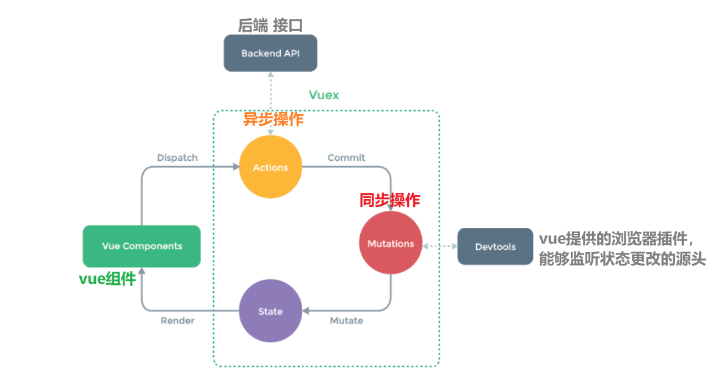
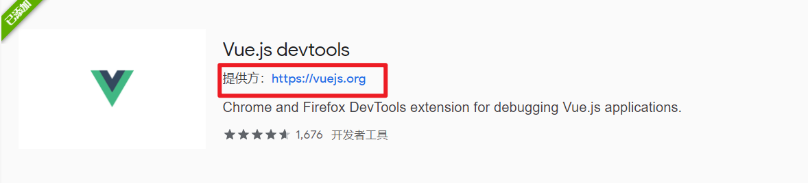
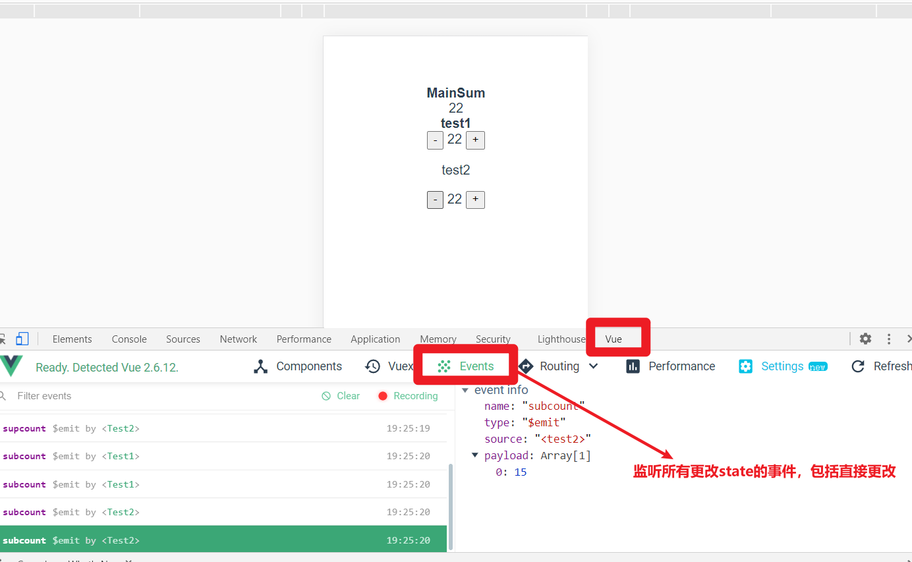
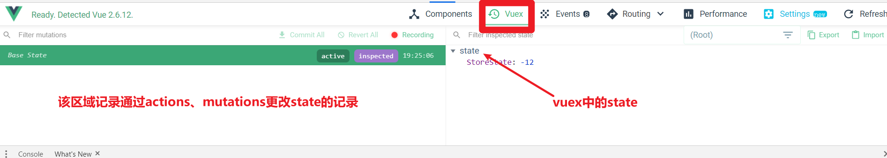

# 单界面状态管理

---

单界面状态管理，vue本身已经做到了。

状态管理:

	>状态，可以理解为某个变量，当某个变量通过一些行为发生改变时，view也会发生对应的改变，其实这就是vue的响应式。

 

# 多界面状态管理

---

​	实际开发中，肯定是由多个组件(界面)组成的，但是如果我们希望，某个状态(变量)，能够在多个组件中共享，并且实现响应式，这时候就用到vuex了

在上个笔记中，介绍了vuex的配置，和最简单的更改状态：`$store.state.变量`，但是**不推荐该方式**，因为该方式是直接更改vuex中的某个状态。

>vuex中的状态，是供所有组件访问的，实际开发中会有许多组件，如果多个组件对同一个state进行了操作，若有其中一个操作错误，会抛出错误，但是我们不知道是哪里的错误，所以**不推荐这种直接更改state的方式**

通过官方提供的图片可知，可以**通过actions、mutations对state进行更改，并依赖浏览器插件devtools**（在谷歌浏览器商城中下载），就能够在浏览器中通过Vue选项，查看state的更改源头。

actions、mutations都是在vuex实例化插件类的options中的

​		**通过actions更改的state，一般是处理异步操作的（向后端发送请求）**

​		**通过mutations更改的state，就是处理普通的同步操作的。**

### devtools的下载

​	默认是打不开谷歌的应用商店的（国内权限问题），可以下载谷歌访问助手。下载后进行访问

在谷歌商店中搜索devtools。

下载后，在谷歌右上角三个点中找到->更多工具->扩展程序->选择devtools插件的详细信息->勾选允许访问文件网址即可。

打开vue项目后，就可以在控制台发现Vue选项。通过这个选项记录状态的改变源头。

