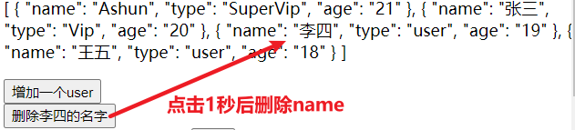
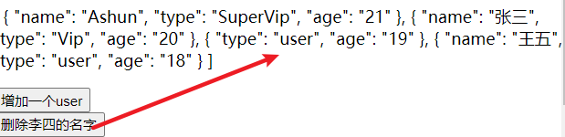
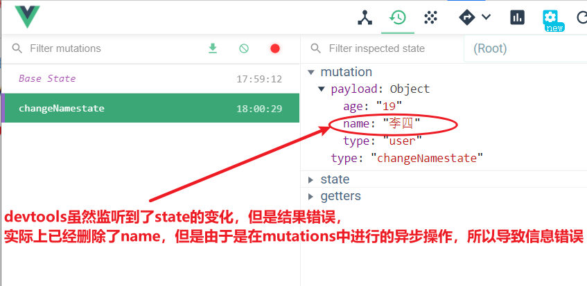
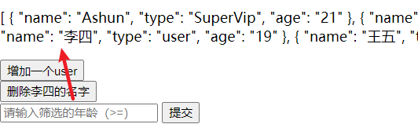
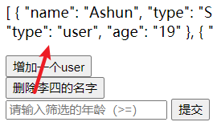
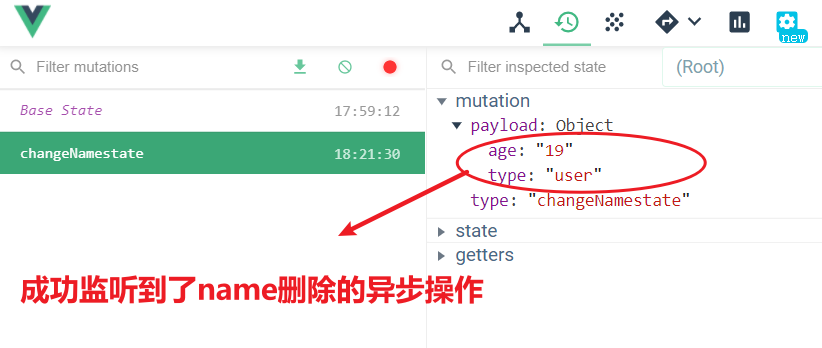
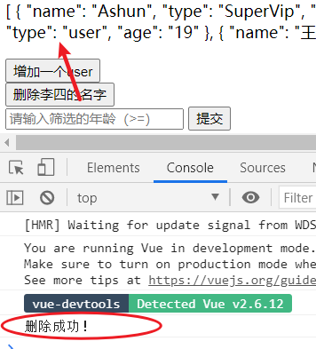

# Vuex.actions

---


## 介绍：

>安全更改state的方式有两种：mutations、actions
>
>**actions是处理异步更改操作的**。
>
>步骤:	经过actions处理异步操作，再通过mutations进行同步操作.


## 不使用actions的异常

以下做一个测试，如果异步操作不通过actions，而是在mutations中进行，会出现什么异常


```js
// src/store/index.js

mutations: {
    changeNamestate(state, payload) {
      setTimeout(() => {				
        Vue.delete(payload, "name");
      }, 1000);
    }
  }
//在mutations的方法中进行异步操作，删除目标对象的name属性
```

```js
//test2.vue
 methods: {
    changeName() {
      this.$store.state.users.forEach(v => {
        if (v.name == "李四") {
          this.$store.commit("changeNamestate", v);		//提交对应的mutations方法，传入payload
        }
      });
    }
  }

```

---

效果:



---






## actions的配置和使用


### 配置

---

actions为obj，元素也为function

>actions中固定method**只有两个默认参数**
>
>1. context
>
>   >**执行上下文，即store对象的this。**
>
>2. payload
>
>   >载荷，外部传入的参数
>
>
>
>注意事项：
>
>​	**通过actions处理的异步操作，也不要直接修改state，而是在actions中提交mutations中的method**


### 使用

---

>$store.dispatch("方法名"，payload)			//dispatch （派遣、发送）


例子：

---

```js
// src/store/index.js
mutations: {
    changeNamestate(state, payload) {			
        Vue.delete(payload, "name");		//通过mutations进行state的更改
    }
},
 actions(){
      ActionChangeName(context, payload) {
      //context参数为执行上下文，即store的this。
      setTimeout(() => {
        context.commit("changeNamestate", payload);
      }, 1000);
      //在actions的method中处理异步操作，commit提交mutations中的事件
    }
 }   
```

```js
//test2.vue
 methods: {
    changeName() {
      this.$store.state.users.forEach(v => {
        if (v.name == "李四") {
  	//该异步操作，需要通过actions进行处理，所以需要使用dispatch（派遣、发送）actions中的方法
          this.$store.dispatch("ActionChangeName", v);
        }
      });
    }
  }
```


效果：

---



---






### 结合Promise

---

> 结合Promise，优雅的处理异步操作，告知外界删除成功。也可以是在删除后进行其它的操作。

```js
// src/store/index.js
mutations: {
    changeNamestate(state, payload) {			
        Vue.delete(payload, "name");		
    }
},
 actions(){
      ActionChangeName(context, payload) {
          
      return new Promise((resolve,reject)=>{
          setTimeout(() => {
        	context.commit("changeNamestate", payload);
            resolve("删除成功！")
      	  }, 1000);  
      });
          
    }
 }   
```

```js
//test2.vue
 methods: {
    changeName() {
      this.$store.state.users.forEach(v => {
        if (v.name == "李四") {
          this.$store.dispatch("ActionChangeName", v).then(value=>{
              console.log(value)
          });
        }
      });
    }
  }
```

效果：

