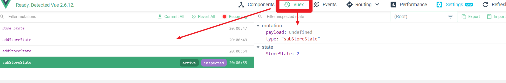

# vuex.mutations的使用

---

>前面已经了解过了mutations的使用场景，处理一般的同步操作，是比较常用更改state的方式。
>
>该方式要比直接更改state安全，可结合浏览器插件devtools，查看更改state的源头和记录。


### 一、配置mutations中的方法

---

>mutations和其它vuex中的options一样都为obj，其元素为各个mutations方法（Function）。
>
>mutations中方法的参数，**只接受2个参数**
>
>1. state
>
>   >该参数负责访问state对象，从而对其进行操作
>
>2. 外界传入的参数（payload载荷）
>
>   >有时在修改state时，需要外界的参数。可以传递第二个参数payload。
>   >
>   >如果该业务需要传递多个参数，则可以放在一个Object中存储。
>   >
>   >**因为muations中的方法只接受2个参数**

例:

```js
export default new Vuex.Store({
  state: {
    StoreState: 1
  },
  mutations: {
     subStoreState(state, step) {		//第二个参数是payload，从外部传入
      if (step) {
        state.StoreState -= step;
        return;
      }
      state.StoreState--;
    },
    addStoreState(state, step) {
      if (step) {
        state.StoreState += step;
        return;
      }
      state.StoreState++;
    }
  },
  actions: {},
  getters: {},
  modules: {}
});
```


### 二、使用mutations中的方法

---

>在组件中通过`this.$store.commit("mutations中的方法名")`来提交（执行）对应的mutations方法。
>
>在commit提交时，有2种提交风格：
>
>1. 普通提交风格
>
>   >$store.commit("方法名"，payload)
>
>2. obj提交风格
>
>   >$store.commit({ type:"方法名"，prpName: value })
>   >
>   >第一个属性type名称固定，接收提交的方法名
>   >
>   >第二个属性是传入的参数，名称不固定。
>   >
>   >**此种方式提交，参数接收时，值为整个commit提交的obj**

例:

1. 普通提交风格 

   ```js
   //某组件内
   methods: {
       //vuex状态管理（通过mutations更改state）
       sub1() {
         this.$store.commit("subStoreState",5);   //在提交时可以传入第二个参数payload
       },
       sup1() {
         this.$store.commit("addStoreState");
       }
   }
   ```

2. obj提交风格

   ```js
   //某组件内
   methods: {
       //vuex状态管理（通过mutations更改state）
       sub1() {
         this.$store.commit("subStoreState");   
         
       },
       sup1() {
         this.$store.commit({type:"addStoreState",step:5});
         //obj提交风格，第二个参数在接收时，是整个commit提交的obj
       }
   }
   ```

   obj提交风格，对应vuex.mutations

   ```js
    mutations: {
        
       addStoreState(state, payload) {
         if (payload) {
           console.log(payload);	
    //由于提交形式为obj，所以payload接收的是整个提交obj，打印结果为{type:"addStoreState",step:5}
    //使用时需要调用对应的属性
           state.StoreState += payload.step;
           return;
         }
         state.StoreState++;
       }
    }
   ```

   


可通过浏览器中的devtools查看mutations更改state的记录：

